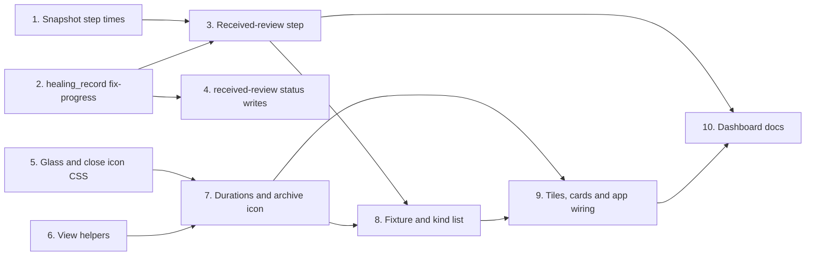

# Tasks

The order of the task groups. Groups with no path between them can run in parallel.

## 1. Snapshot step times

- [x] 1.1 Add `StartedAt` and `CompletedAt` to the snapshot step and copy valid times of ship steps and execute waves in internal/tools/dashboard_snapshot.go — verify: go test ./internal/tools/ -run 'TestDashboardStepTimes_' <!-- ref:1-1-add-startedat-and-completedat-to-the-980a15 -->

## 2. healing_record fix-progress

- [x] 2.1 Add kind `fix-progress` with upsert, keep-failed rule, cap 200, errors and `next` in internal/tools/ship_state.go — verify: go test ./internal/tools/ -run 'TestShipStateHealingRecord_FixProgress' <!-- ref:2-1-add-kind-fix-progress-with-upsert-ke-9a58b7 -->
- [x] 2.2 Add `healing.fixProgress` to plugins/sdlc/schemas/ship-state.schema.json and update the pinned hash in internal/tools/scaffold_payloads_test.go — verify: go test ./internal/tools/ -run 'TestPayloads_SchemaChecksums|TestShipStateHealingRecord_SchemaAcceptsWrittenRecords' <!-- ref:2-2-add-healing-fixprogress-to-plugins-s-4aba6a -->
- [x] 2.3 Add a `fix-progress` row to the read-only table in internal/tools/ship_state_fs_failures_test.go — verify: go test ./internal/tools/ -run 'TestShipState' <!-- ref:2-3-add-a-fix-progress-row-to-the-read-o-5ad3ef -->

## 3. Received-review step

- [x] 3.1 Add kind `fixes`, the fix row type and the step build and insert in internal/tools/dashboard_snapshot.go and internal/tools/dashboard_join.go — verify: go test ./internal/tools/ -run 'TestDashboardReceivedReview_' <!-- ref:3-1-add-kind-fixes-the-fix-row-type-and-edf064 -->

## 4. received-review status writes

- [x] 4.1 Add the `queued`, `fixing`, `fixed`, `failed` and `deferred` writes to Step 11 in plugins/sdlc/skills/received-review/SKILL.md — verify: go test ./internal/skillcheck/... <!-- ref:4-1-add-the-queued-fixing-fixed-failed-a-223b6f -->
- [x] 4.2 Pin `ship_state:healing_record` in internal/skillcheck/skillcheck_received_review_test.go — verify: go test ./internal/skillcheck/... <!-- ref:4-2-pin-ship-state-healing-record-in-int-e20b2f -->
- [x] 4.3 Document the fix statuses and the cap of 200 in docs/skills/received-review.md, docs/skills/ship.md and plugins/sdlc/skills/ship/state-format.md — verify: grep -n fixProgress plugins/sdlc/skills/ship/state-format.md <!-- ref:4-3-document-the-fix-statuses-and-the-ca-fd1c43 -->

## 5. Glass and close icon CSS

- [x] 5.1 Copy app.css and index.html from design/dashboard/static to internal/dashboard/web/static and percent-encode the icon URL — verify: go test ./internal/dashboard/web/ -run 'TestStatic' <!-- ref:5-1-copy-app-css-and-index-html-from-des-2accdc -->

## 6. View helpers

- [x] 6.1 Copy `severityOrder`, `fixCounts`, `columnCount`, `balanceColumns`, `isWideSection` and `sectionMeta` case `fixes` into internal/dashboard/web/static/view.js — verify: node --test internal/dashboard/web/testdata/view.test.cjs <!-- ref:6-1-copy-severityorder-fixcounts-columnc-b8bf4c -->

## 7. Durations and archive icon

- [x] 7.1 Port `pipelineDuration`, `stepDuration`, the `.dur-live` timer pass and the archive icon into internal/dashboard/web/static/render.js — verify: node --test internal/dashboard/web/testdata/view.test.cjs <!-- ref:7-1-port-pipelineduration-stepduration-t-c28b40 -->

## 8. Fixture and kind list

- [x] 8.1 Add step times and a `fixes` detail to internal/dashboard/web/testdata/snapshot.fixture.json and kind `fixes` to internal/tools/dashboard_contract_test.go — verify: go test ./internal/tools/ -run 'TestDashboard' <!-- ref:8-1-add-step-times-and-a-fixes-detail-to-0b149f -->

## 9. Tiles, cards and app wiring

- [x] 9.1 Port the issue order, the review cards, `packDimensionGrid` and `fixesBody` into internal/dashboard/web/static/render.js — verify: node --test internal/dashboard/web/testdata/view.test.cjs <!-- ref:9-1-port-the-issue-order-the-review-card-61df14 -->
- [x] 9.2 Add the grid observer to internal/dashboard/web/static/app.js and pin it in internal/dashboard/web/server_test.go — verify: go test ./internal/dashboard/web/ -run 'TestStaticAppJS' <!-- ref:9-2-add-the-grid-observer-to-internal-da-4e6503 -->

## 10. Dashboard docs

- [x] 10.1 Document durations, the archive icon, the close icon and the received-review step in docs/dashboard.md and docs/getting-started.md — verify: grep -rn "Archive button" docs README.md plugins/sdlc/skills returns nothing <!-- ref:10-1-document-durations-the-archive-icon-b4201d -->
