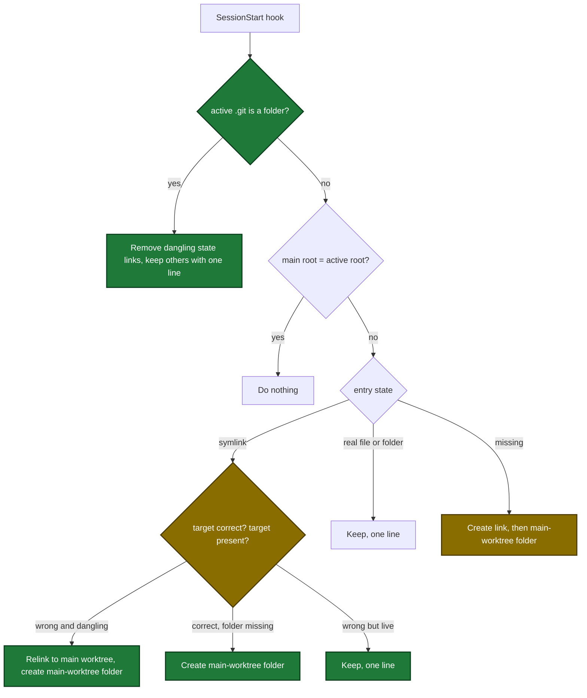

# Proposal: worktree-state-link-self-heal

## Why

- Problem: a `.sdlc-v2/` state link whose target does not exist (a dangling link) makes each folder write through it fail with `mkdir ...: file exists`. The SessionStart hook never repairs such a link.
- Evidence: on 2026-10-09 the dashboard archive dialog showed `Create archive folder .../.sdlc-v2/run-archive/<run>: mkdir .../.sdlc-v2/run-archive: file exists`. The main worktree held 3 dangling links (`preplan`, `run-archive`, `state`) to a deleted worktree. Code: `internal/hooks/session_start.go:942-979`, `internal/tools/dashboard_archive.go:301-303`.
- Why now: the archive button and `preplan_context` fail in the first session of each new linked worktree, and the error gives a wrong permission recovery.

## What Changes

| Area | Before | After |
|---|---|---|
| Main worktree at session start | the link phase does nothing | removes each dangling state link whose target ends with `/.sdlc-v2/<entry>`, keeps other links with one line |
| Linked worktree, existing link | kept with no check | a wrong dangling link is replaced, a correct link gets its main-worktree folder, a wrong live link is kept with one line |
| Linked worktree, new folder link | the main-worktree folder stays missing until the first write | the hook creates the main-worktree folder right after the link (not for `timings.json`) |
| Linked entry set | the spec table omits `preplan/` and `run-archive/` | the table lists both |
| Archive error on a dangling link | `mkdir ...: file exists` and a permission recovery | names the link, the target and `Start a new session ... or run: mkdir -p <target>` |
| `preplan_context` on a dangling link | folder link: InfraError with a permission recovery. Topic-file link: `preplanCreated: false` and no error | InfraError that names the link, the target and the recovery. Nothing is written. |

Session-start link phase after the change (new and changed steps marked):

## Capabilities

### New Capabilities

- none

### Modified Capabilities

- `worktree-state-links`: the link set adds `preplan/` and `run-archive/`. The main worktree removes dangling state links. A linked worktree repairs links and creates main-worktree folders. Fail-open lines cover remove, relink and create failures.
- `tool-plan-support`: the Preplan context requirement adds the dangling-link error for the preplan folder link and for the topic-file link.

## Impact

| Path | Kind | Change |
|---|---|---|
| `internal/fsx/dangling.go` | internal package | new dangling-link check and error type with a recovery text |
| `internal/tools/dashboard_archive.go` | MCP tool | archive writer uses the dangling-link check |
| `internal/tools/plan_support.go` | MCP tool | `preplan_context` uses the dangling-link check, description bullet changes |
| `internal/hooks/session_start.go` | hook | main-worktree cleanup, linked-worktree repair, main-worktree folder at link time |
| `internal/tools/validators.go` | internal package | `isCorrectStateLink` is exported for the hook |
| `docs/getting-started.md`, `docs/smoke-test.md`, `docs/dashboard.md` | doc | link repair behavior and the recovery text |
