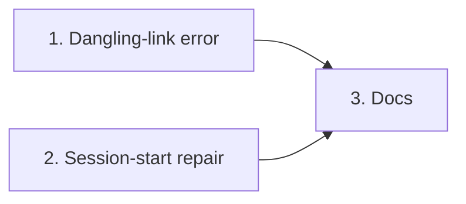

# Tasks

Group dependencies:

## 1. Dangling-link error

- [x] 1.1 Add the dangling-link check and error type in internal/fsx/dangling.go — verify: go test ./internal/fsx/ -run 'TestMkdirAll|TestFindDanglingLink|TestDanglingLinkError' <!-- ref:1-1-add-the-dangling-link-check-and-erro-c816b9 -->
- [x] 1.2 Use the dangling-link check in the archive writer in internal/tools/dashboard_archive.go — verify: go test ./internal/tools/ -run 'TestArchiveRun|TestArchiveError' <!-- ref:1-2-use-the-dangling-link-check-in-the-a-687f57 -->
- [x] 1.3 Use the dangling-link check in preplan_context in internal/tools/plan_support.go — verify: go test ./internal/tools/ -run 'TestPlanSupportPreplanContext|TestCreatePreplanFile' <!-- ref:1-3-use-the-dangling-link-check-in-prepl-9ae9da -->

## 2. Session-start repair

- [x] 2.1 Add the main-worktree guard and test seams in internal/hooks/session_start.go — verify: go test ./internal/hooks/ <!-- ref:2-1-add-the-main-worktree-guard-and-test-91629c -->
- [x] 2.2 Add linked-worktree repair and main-worktree folder creation in internal/hooks/session_start.go, export IsCorrectStateLink in internal/tools/validators.go — verify: env -u GIT_DIR -u GIT_PREFIX -u GIT_WORK_TREE -u GIT_INDEX_FILE -u GIT_COMMON_DIR go test ./internal/hooks/ ./internal/tools/ -run 'TestSessionStartWorktreeLinks|TestWorktreeLinksGitClean|TestStrayState' <!-- ref:2-2-add-linked-worktree-repair-and-main-3c26fc -->

## 3. Docs

- [x] 3.1 Document link repair and the recovery text in docs/getting-started.md, docs/smoke-test.md and docs/dashboard.md — verify: read the three changed sections <!-- ref:3-1-document-link-repair-and-the-recover-e4ab32 -->
