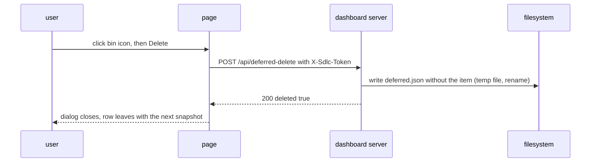

# Spec Delta

## ADDED Requirements

### Requirement: Preplan topic list
The snapshot SHALL give each repo `preplans`: the newest 100 `.md` files of `.sdlc-v2/preplan/`, newest first, ties by file name, each with `slug`, `topic`, `status`, `path`, and `updatedAt`. A missing folder SHALL give `preplans:[]`.

#### Scenario: Topic and status
- **WHEN** `.sdlc-v2/preplan/auth-flow.md` starts with `# Preplan: auth flow` and holds `**Status:** in progress`
- **THEN** `preplans` has `{"slug":"auth-flow","topic":"auth flow","status":"in progress","path":".sdlc-v2/preplan/auth-flow.md"}`

#### Scenario: No heading
- **WHEN** a topic file has no `# Preplan:` line
- **THEN** its `topic` is the file name without `.md`

#### Scenario: Over the cap
- **WHEN** the folder holds 101 `.md` files
- **THEN** `preplans` holds the newest 100
- **AND** `warnings` holds `1 older preplan topic files not shown`

### Requirement: Repo read warnings
The snapshot SHALL give each repo `warnings`: the read errors that do not block an archive. A read error of the preplan folder, a topic file, `runs.jsonl` or an execute state for plan times SHALL add one warning and SHALL leave `error` empty.

#### Scenario: Unreadable preplan folder
- **WHEN** `.sdlc-v2/preplan` cannot be read
- **THEN** `warnings` has one entry that starts with `preplan folder not read:`
- **AND** `error` is `""`
- **AND** a run of the same repo can still be archived

#### Scenario: No warnings
- **WHEN** every read succeeds
- **THEN** the repo has `"warnings":[]`

### Requirement: Total time of a ship run
A ship pipeline with a linked plan SHALL have `planStartedAt`. The page SHALL count its run duration from `planStartedAt`. A ship pipeline with no linked plan SHALL count from `startedAt`, and the duration tooltip SHALL say `(no linked plan)`.

#### Scenario: Linked plan
- **WHEN** a completed ship pipeline has `planStartedAt` 08:20 and ends 11:00
- **THEN** the duration chip shows `2h 40m`
- **AND** its tooltip is `Time from the plan start to the ship end`

#### Scenario: No linked plan
- **WHEN** a completed ship pipeline has no `planStartedAt`
- **THEN** its tooltip is `Total time of the ship run (no linked plan)`

### Requirement: History filter and sort
The History tab SHALL show outcome chips with counts (all and each outcome) and two sort buttons, finished and total. At page load no sort button SHALL be active and rows SHALL show newest first. A first click SHALL sort newest or longest first, and the next click SHALL turn the order. A row with no value SHALL sort last.

#### Scenario: Outcome chip
- **WHEN** the user clicks the `failure` chip
- **THEN** the table shows only rows with outcome `failure`

#### Scenario: Total sort
- **WHEN** the user clicks `total` once
- **THEN** the longest row is first and rows with `totalMs` 0 are last

#### Scenario: Data refresh
- **WHEN** a new snapshot arrives after a chip click
- **THEN** the same chip stays active

#### Scenario: Reload
- **WHEN** the user reloads the page
- **THEN** the chip is `all` and no sort button is active

### Requirement: Deferred priority filter
The Activity tab SHALL show priority chips (all, high, medium, low) with counts above `Open deferred (n)`. A chip SHALL show only the deferred items with that priority. With no deferred items, the chips SHALL be hidden.

#### Scenario: High chip
- **WHEN** the user clicks the `high` chip
- **THEN** only deferred items with priority `high` show

### Requirement: Preplans tab
The Preplans tab SHALL list `preplans` of the repos in scope, newest first, with status chips (all, in progress, ready for plan, paused, unknown) with counts. A status that is not in that list SHALL show as `unknown`.

#### Scenario: Status chip
- **WHEN** the user clicks the `paused` chip
- **THEN** only topic files with status `paused` show

#### Scenario: Chip with no rows
- **WHEN** the chosen status has no rows after a refresh
- **THEN** the chip stays active with count `0` and the tab shows `No preplans match this filter`

### Requirement: Delete routes
The server SHALL serve `POST /api/preplan-delete` `{repo, slug}`, `POST /api/deferred-delete` `{repo, id}`, and `POST /api/learning-delete` `{repo, date, heading}`. Each route SHALL pass the `Origin` and `X-Sdlc-Token` checks before it reads the body, and SHALL answer 200 `{deleted, alreadyGone, message}` on success.

#### Scenario: Deferred item deleted
- **WHEN** a valid request names a deferred id that exists twice
- **THEN** the response is 200 with `deleted:true`
- **AND** only the first item with the id is gone from `deferred.json`

#### Scenario: Learning deleted
- **WHEN** two learning entries have the same date and heading
- **THEN** only the newest one is gone from the learnings log

#### Scenario: Already gone
- **WHEN** the named item does not exist
- **THEN** the response is 200 with `alreadyGone:true`

#### Scenario: Bad slug
- **WHEN** a preplan delete has `slug` `../x`
- **THEN** the response is 400 with code `BAD_REQUEST`
- **AND** no file is removed

#### Scenario: Write failure
- **WHEN** the learnings folder is read-only
- **THEN** the response is 500 with code `DELETE_FAILED` and a suggestion
- **AND** the learnings log keeps its bytes

#### Scenario: Bad token
- **WHEN** the `X-Sdlc-Token` header is wrong
- **THEN** the response is 403 and no file changes

### Requirement: Delete confirm
Each preplan, deferred and learning row SHALL have a bin icon. A click SHALL open a confirm dialog that names the item and says the delete cannot be undone. A preplan with status `in progress` SHALL add the line `A preplan session can still use this topic file.` A failed delete SHALL keep the row and SHALL show the message and the suggestion.

#### Scenario: In-progress preplan
- **WHEN** the user clicks the bin icon of a topic file with status `in progress`
- **THEN** the dialog shows `A preplan session can still use this topic file.`

#### Scenario: Failed delete
- **WHEN** the delete answers 500
- **THEN** the dialog shows the message and the suggestion with a Close button
- **AND** the row stays

## MODIFIED Requirements

### Requirement: Loopback access
The server SHALL listen on `127.0.0.1` only, SHALL reject a request whose `Host` header is not `127.0.0.1:<port>` or `localhost:<port>`, and SHALL accept GET only, except `POST /api/stop`, `POST /api/run-archive`, `POST /api/cache-clear`, `POST /api/preplan-delete`, `POST /api/deferred-delete` and `POST /api/learning-delete`.

#### Scenario: Foreign host header
- **WHEN** a request has `Host: evil.example:7385`
- **THEN** the response status is 403

#### Scenario: Write method on a read endpoint
- **WHEN** a POST request reaches `/api/snapshot`
- **THEN** the response status is 405

#### Scenario: Unknown path
- **WHEN** a GET request reaches `/nothing`
- **THEN** the response status is 404

#### Scenario: Read method on a delete route
- **WHEN** a GET request reaches `/api/deferred-delete`
- **THEN** the response status is 405

### Requirement: Endpoints
The server SHALL serve these endpoints and no others.

| Method | Path | Success |
|---|---|---|
| GET | `/` | 200, the page with the token of this server start in `<meta name="sdlc-token">` |
| GET | `/static/*` | 200, an embedded page file |
| GET | `/api/snapshot` | 200, the snapshot JSON |
| GET | `/api/events` | 200, a `text/event-stream` of snapshots |
| GET | `/api/health` | 200, `{"pid":<n>,"version":"<v>","startedAt":"<RFC3339>"}` |
| GET | `/api/learning` | 200, `{"found":<bool>,"body":"<redacted text>","truncated":<bool>}` |
| POST | `/api/stop` | 202, `{"stopping":true}` |
| POST | `/api/run-archive` | 200, `{"runId","dir","moved","deleted"}` |
| POST | `/api/cache-clear` | 200, `{"freedBytes","classes","skipped"}` |
| POST | `/api/preplan-delete` | 200, `{"deleted","alreadyGone","message"}` |
| POST | `/api/deferred-delete` | 200, `{"deleted","alreadyGone","message"}` |
| POST | `/api/learning-delete` | 200, `{"deleted","alreadyGone","message"}` |

#### Scenario: Health answer
- **WHEN** a GET request reaches `/api/health`
- **THEN** the body has the server `pid`, `version`, and `startedAt`
- **AND** the body does not hold the token

### Requirement: Plan station on a ship run
A ship run whose state has `planExploreSummary` or `linkedPlan` SHALL get a first step `plan` with status `completed`. The step SHALL list the stored explorers and the stored `planReviewRounds` with `maxRounds` when those keys are not empty. The step SHALL take `startedAt` and `completedAt` from `linkedPlan`, else from the plan row of `runs.jsonl` that matches the execute state `planPath`. A ship run with none of these SHALL get no `plan` step.

#### Scenario: Stored summary
- **WHEN** a ship state has `planExploreSummary` with explorer `auth-flow`
- **THEN** the first ship step is `plan` and lists explorer `auth-flow`
- **AND** the progress total goes up by 1

#### Scenario: Stored review rounds
- **WHEN** a ship state also has `planReviewRounds` with 2 rounds
- **THEN** the `plan` step lists the 2 rounds and `maxRounds`

#### Scenario: Linked plan times
- **WHEN** a ship state has `planExploreSummary` and `linkedPlan` with `startedAt` and `completedAt`
- **THEN** the ship has exactly one `plan` step with the explorers and both times

#### Scenario: Old ship run
- **WHEN** a ship state has no `linkedPlan` and `runs.jsonl` holds a plan row for the execute state `planPath`
- **THEN** the `plan` step takes its times from that plan row

### Requirement: Run history
Each repo SHALL carry `history`: the 50 newest rows of `runs.jsonl`, newest first, each with kind, branch, outcome, start time, end time, duration, and `totalMs`. A ship row with plan fields SHALL also carry `planStartedAt` and `planDurationMs`, and its `totalMs` SHALL count from the plan start to `ts`. Every other row SHALL have `totalMs` equal to its duration. A missing file SHALL give `history:[]`.

#### Scenario: Failure row
- **WHEN** `runs.jsonl` holds a ship row with `outcome:"failure"`
- **THEN** `history` lists it with `outcome:"failure"`

#### Scenario: Corrupt line
- **WHEN** one line of `runs.jsonl` does not parse
- **THEN** the other rows still show

#### Scenario: Ship row with plan fields
- **WHEN** a ship row has `plan_started_at` 08:20, `plan_duration_ms` 4800000 and `ts` 11:00
- **THEN** the history row has `planDurationMs` 4800000 and `totalMs` 9600000

### Requirement: Page layout
The page SHALL have the title `sdlc signal room`, with a `(N) ` prefix when N pipelines in the repos in scope wait for a person, and a header with the tabs Pipelines, Activity, History, and Preplans, each with a count. Under the header a sticky repo filter SHALL serve all four tabs. The page SHALL have no left rail.

#### Scenario: Tabs by keyboard
- **WHEN** the Pipelines tab has focus and the user presses the right arrow key
- **THEN** the Activity tab opens

#### Scenario: End key
- **WHEN** a tab has focus and the user presses `End`
- **THEN** the Preplans tab opens

#### Scenario: Narrow page
- **WHEN** the page is narrower than 1000 px
- **THEN** the header counts are hidden

#### Scenario: Waiting title
- **WHEN** 1 pipeline in scope has `attention`
- **THEN** the title is `(1) sdlc signal room`

### Requirement: Page links
The page SHALL read the URL hash on load and on each hash change. `#<pipeline id>` SHALL scroll to that block. `#<pipeline id>/<n>` SHALL also select station n. `#activity`, `#history` and `#preplans` SHALL open that tab.

#### Scenario: Link to a station
- **WHEN** the page opens with `#ship-feat-x-20261007T072607Z/2`
- **THEN** the page scrolls to that ship block and selects station 2

#### Scenario: Link to a tab
- **WHEN** the page opens with `#history`
- **THEN** the History tab opens

#### Scenario: Unknown id
- **WHEN** the hash names no pipeline and no tab
- **THEN** the page ignores the hash

#### Scenario: Link to the Preplans tab
- **WHEN** the page opens with `#preplans`
- **THEN** the Preplans tab opens

### Requirement: Activity and history tabs
The Activity tab SHALL show `Open deferred (n)` and then `Learnings today (n)`, each row with its repo. The History tab SHALL show one table with outcome, kind, branch, repo, finished time, plan time, ship time, and total time. Each list SHALL have its own empty text.

#### Scenario: No history
- **WHEN** no repo in scope has history rows
- **THEN** the History tab shows `No finished runs for the selected repos.`

#### Scenario: No deferred items
- **WHEN** no repo in scope has open deferred items
- **THEN** the Activity tab shows `No open deferred items.`

#### Scenario: Ship row columns
- **WHEN** a ship row has `planDurationMs` 4800000, `durationMs` 3600000 and `totalMs` 9600000
- **THEN** the plan, ship and total cells show `1h 20m`, `1h 0m` and `2h 40m`

### Requirement: Durations on the page
The page SHALL show the run duration in a chip right after the branch name, and the duration of each step that has a valid `startedAt` under the step name. A running time SHALL increase each second. The `plan` step of a ship run SHALL show a duration when it has both `startedAt` and `completedAt`.

#### Scenario: Running pipeline chip
- **WHEN** a pipeline has status `running` and a valid `startedAt`
- **THEN** the chip has the class `live` and a lamp

#### Scenario: Completed pipeline chip
- **WHEN** a pipeline has status `completed`
- **THEN** the chip shows the time from start to end and has no lamp

#### Scenario: Pending step
- **WHEN** a step has status `pending`
- **THEN** the station shows no duration

#### Scenario: Plan step time
- **WHEN** the `plan` step of a ship run has `startedAt` 08:20 and `completedAt` 09:40
- **THEN** the station shows `1h 20m`
