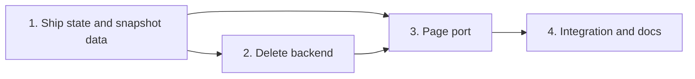

# Tasks

Task group order:

## 1. Ship state and snapshot data

- [ ] 1.1 Save `linkedPlan` at `complete-step` and `complete` of `execute` in internal/tools/ship_state.go, schema and state-format.md — verify: go test ./internal/tools/ -run 'TestShipState|TestPayloads_SchemaChecksums' <!-- ref:1-1-save-linkedplan-at-complete-step-and-3666b9 -->
- [ ] 1.2 Add `warnings`, `preplans`, plan and total fields in internal/tools/dashboard_snapshot.go and the fixture — verify: go test ./internal/tools/ -run 'TestDashboardFixture|TestDashboardContract' <!-- ref:1-2-add-warnings-preplans-plan-and-total-e316e9 -->
- [ ] 1.3 List preplan topic files in internal/tools/dashboard_preplans.go — verify: go test ./internal/tools/ -run 'TestDashboardPreplans|TestPlanSupportPreplanContext' <!-- ref:1-3-list-preplan-topic-files-in-internal-777a44 -->
- [ ] 1.4 Copy plan fields to the ship history row in internal/history/history.go and internal/tools/ship_state.go — verify: go test ./internal/history/ ./internal/tools/ -run 'TestRunRecord|TestShipState_HistoryRecord|TestShipState_Fail' <!-- ref:1-4-copy-plan-fields-to-the-ship-history-16cd68 -->
- [ ] 1.5 Attach plan times to ship pipelines in internal/tools/dashboard_plan_times.go — verify: go test ./internal/tools/ -run 'TestDashboardJoin|TestDashboardPlanTimes' <!-- ref:1-5-attach-plan-times-to-ship-pipelines-9c418d -->
- [ ] 1.6 Fill plan, ship and total times of History rows in internal/tools/dashboard_activity.go — verify: go test ./internal/tools/ -run TestDashboardActivity_History <!-- ref:1-6-fill-plan-ship-and-total-times-of-hi-46a2a2 -->

## 2. Delete backend

- [ ] 2.1 Delete preplan topic files and deferred items in internal/tools/dashboard_delete.go — verify: go test ./internal/tools/ -run 'TestDashboardDeletePreplan|TestDashboardDeleteDeferred' <!-- ref:2-1-delete-preplan-topic-files-and-defer-cb3384 -->
- [ ] 2.2 Delete learning entries in internal/tools/dashboard_delete_learning.go — verify: go test ./internal/tools/ -run 'TestDashboardDeleteLearning|TestLearnings' <!-- ref:2-2-delete-learning-entries-in-internal-74d1e0 -->
- [ ] 2.3 Add three token-guarded routes in internal/dashboard/web/server.go and cmd/sdlc/main.go — verify: go test ./internal/dashboard/web/ ./cmd/sdlc/ -run 'TestHandler_|TestDashboardOptions' <!-- ref:2-3-add-three-token-guarded-routes-in-in-a0632c -->

## 3. Page port

- [ ] 3.1 Port plan times, History controls and styles in internal/dashboard/web/static/ — verify: node --test internal/dashboard/web/testdata/view.test.cjs <!-- ref:3-1-port-plan-times-history-controls-and-c0251a -->
- [ ] 3.2 Port the Preplans tab and priority chips in internal/dashboard/web/static/ — verify: node --test internal/dashboard/web/testdata/view.test.cjs and go test ./internal/dashboard/web/ -run 'TestStatic|TestPreplanStatus' <!-- ref:3-2-port-the-preplans-tab-and-priority-c-03339f -->
- [ ] 3.3 Port the delete flows in internal/dashboard/web/static/ — verify: node --test internal/dashboard/web/testdata/view.test.cjs and the manual browser check <!-- ref:3-3-port-the-delete-flows-in-internal-da-31d6e5 -->

## 4. Integration and docs

- [ ] 4.1 Add the Go HTTP end-to-end delete test in internal/dashboard/web/e2e_test.go — verify: go test ./internal/dashboard/web/ -run TestE2E <!-- ref:4-1-add-the-go-http-end-to-end-delete-te-d4bcfc -->
- [ ] 4.2 Document tabs, routes and fields in docs/dashboard.md and docs/skills/dashboard.md — verify: grep -rni -e "three tabs" docs/ gives zero hits <!-- ref:4-2-document-tabs-routes-and-fields-in-d-b0b27e -->

## Workflow follow-up

- /sdlc:ship archives the change after validation passes.
