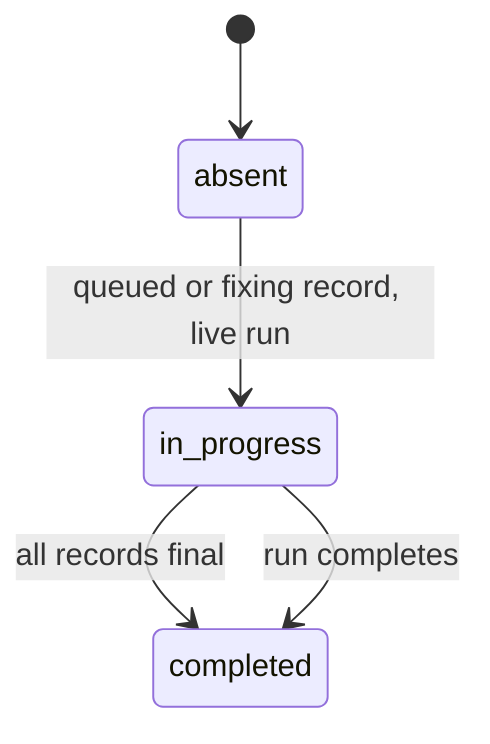

# Spec Delta

## MODIFIED Requirements

### Requirement: Step detail kind
Each step `detail` SHALL carry `kind`: `waves`, `dimensions`, `explorers`, `rounds`, `findings`, `guardrails`, `result`, or `fixes`. A step with no detail SHALL have no `detail` key. An empty list SHALL be absent, and the `kind` SHALL stay.

#### Scenario: Plan station with no explorers
- **WHEN** a ship state has `planExploreSummary: []`
- **THEN** the `plan` step has `detail` `{kind:"explorers"}` and no `explorers` key

#### Scenario: Harden step
- **WHEN** a ship run has the step `harden`
- **THEN** the step has no `detail` key

#### Scenario: Clean commit step
- **WHEN** the ship step `commit` is `completed` with result `nothing to commit: execute committed 5 wave commit(s)`
- **THEN** the step has `detail` `{kind:"result", result:"nothing to commit: execute committed 5 wave commit(s)"}`

#### Scenario: Normal commit step
- **WHEN** the ship step `commit` is `completed` with result `committed 3f2a9c1`
- **THEN** the step has no `detail` key

#### Scenario: Received-review step with fixes
- **WHEN** a ship state holds 2 valid records in `healing.fixProgress`
- **THEN** the `received-review` step has `detail` with `kind:"fixes"` and 2 rows in `fixes`

## ADDED Requirements

### Requirement: Step times
The snapshot SHALL copy `startedAt` and `completedAt` of each ship step and each execute wave when the value parses as RFC 3339, and SHALL omit the key when the value is absent or does not parse.

#### Scenario: Running ship step
- **WHEN** a ship step has `startedAt` `2026-10-10T10:00:00Z` and no `completedAt`
- **THEN** the snapshot step has `startedAt` `2026-10-10T10:00:00Z`
- **AND** the snapshot step has no `completedAt` key

#### Scenario: Bad time text
- **WHEN** a ship step has `startedAt` `yesterday`
- **THEN** the snapshot step has no `startedAt` key

#### Scenario: Pending execute wave
- **WHEN** a planned execute wave has not started
- **THEN** its snapshot step has no `startedAt` key and no `completedAt` key

#### Scenario: Plan step
- **WHEN** a plan pipeline has the step `explore`
- **THEN** the step has no `startedAt` key and no `completedAt` key

### Requirement: Received-review step
The snapshot SHALL show a `received-review` step right after the first `review` step of a ship pipeline when `healing.fixProgress` holds at least one valid record, and SHALL show no such step otherwise.

The status of the step:

#### Scenario: No fix records
- **WHEN** a ship state has no `healing.fixProgress` key
- **THEN** the ship pipeline has no `received-review` step

#### Scenario: Fix in progress
- **WHEN** a live ship run has one record with status `fixing`
- **THEN** the `received-review` step has status `in_progress` and no `completedAt` key

#### Scenario: All fixes final
- **WHEN** every record has status `fixed`, `failed` or `deferred`
- **THEN** the `received-review` step has status `completed`
- **AND** its `startedAt` is the earliest `firstAt` and its `completedAt` is the latest `updatedAt`

#### Scenario: Stopped fix pass
- **WHEN** a ship run has `pipelineCompletedAt` set and one record still has status `queued`
- **THEN** the `received-review` step has status `completed`
- **AND** the row keeps status `queued`

#### Scenario: Inserted completed step
- **WHEN** the step is inserted with status `completed` into a pipeline with progress 4 of 6
- **THEN** the progress is 5 of 7

#### Scenario: Stored received-review step
- **WHEN** the ship pipeline already has a step named `received-review` with status `skipped`
- **THEN** that step gets the `fixes` detail and keeps status `skipped`

### Requirement: Fix rows
Each `fixes` row SHALL carry `title` (redacted, at most 120 characters), `severity`, `file`, and `status`, and SHALL carry `line` only when it is not 0. The snapshot SHALL skip a record with an unknown status or severity, or with no title.

| Field | Values |
|---|---|
| `status` | `queued`, `fixing`, `fixed`, `failed`, `deferred` |
| `severity` | `critical`, `high`, `medium`, `low`, `info` |

#### Scenario: Unknown status
- **WHEN** a record has status `paused`
- **THEN** the `fixes` list has no row for that record

#### Scenario: No line
- **WHEN** a record has no `line`
- **THEN** its row has no `line` key

### Requirement: Durations on the page
The page SHALL show the run duration in a chip right after the branch name, and the duration of each step that has a valid `startedAt` under the step name. A running time SHALL increase each second.

#### Scenario: Running pipeline chip
- **WHEN** a pipeline has status `running` and a valid `startedAt`
- **THEN** the chip has the class `live` and a lamp

#### Scenario: Completed pipeline chip
- **WHEN** a pipeline has status `completed`
- **THEN** the chip shows the time from start to end and has no lamp

#### Scenario: Pending step
- **WHEN** a step has status `pending`
- **THEN** the station shows no duration

### Requirement: Received-review tile
The page SHALL show the received-review tile with a progress line, a progress bar, and one row for each fix with severity, title, file and status. The tile SHALL show `No fixes yet.` when the list is empty.

#### Scenario: Three fixes
- **WHEN** the step has 3 fixes with status `fixed`, `fixing` and `queued`
- **THEN** the progress line is `1 of 3 fixed · 1 fixing · 1 queued`
- **AND** the progress bar has `max=3` and `value=1`

#### Scenario: No fixes
- **WHEN** the step has `detail` `{kind:"fixes"}` and no `fixes` key
- **THEN** the tile shows `No fixes yet.`

### Requirement: Issue and finding rows
The issues tile SHALL list issues from `critical` to `info`, with equal severities in source order. Issue rows and finding rows SHALL show at most 2 lines of text, and a click SHALL open the full text in the detail viewer.

#### Scenario: Unsorted issues
- **WHEN** a pipeline has issues with severity `low`, `critical`, `low`
- **THEN** the tile lists the `critical` issue first, then the two `low` issues in source order

#### Scenario: Click a clamped row
- **WHEN** the user clicks the second issue row
- **THEN** the detail viewer shows the full text of that issue

### Requirement: Review cards
The review tile SHALL span the full row and SHALL show one card for each dimension. The page SHALL pack the cards into columns of at least 360 px, the tallest card first and each card in the shortest column, and SHALL pack again when the grid size changes.

#### Scenario: Three cards in two columns
- **WHEN** the cards have heights 100, 300 and 200 and the grid has room for 2 columns
- **THEN** column 1 holds card 2, and column 2 holds cards 1 and 3 in source order

#### Scenario: Wave heading
- **WHEN** the review has dimensions in wave 1 and wave 2
- **THEN** the heading of wave 2 starts a new set of columns

### Requirement: Archive icon
A `completed`, `failed`, or `stalled` pipeline SHALL show an archive icon as the first control of its options, with the accessible name `Archive` and the tooltip `Archive this run`.

#### Scenario: Options order
- **WHEN** a pipeline has status `failed`
- **THEN** the options are the archive icon, the repo name, the issue chip, the status, and the details toggle, in this order

### Requirement: Glass dialogs and close icon
The confirm dialogs and the detail viewer SHALL use the fill `rgba(0,0,0,0.38)` with a 5 px blur and no blur on the layer behind the dialog. The detail viewer SHALL have a close icon as its first element, with the accessible name `Close` and no text.

#### Scenario: Close the detail viewer
- **WHEN** the user clicks the close icon
- **THEN** the detail viewer closes and the focus goes back to the row that opened it
