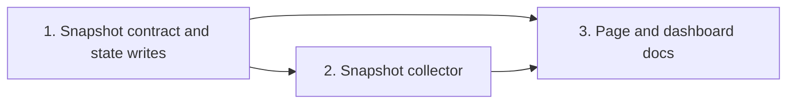

# Tasks

Group dependencies. Group 2 and group 3 start after the parts of group 1 that they read.

## 1. Snapshot contract and state writes

- [ ] 1.1 Add the explorer summary builder in internal/tools/plan_explore_summary.go — verify: go test ./internal/tools/ -run TestPlanExploreSummary <!-- ref:1-1-add-the-explorer-summary-builder-in-c432de -->
- [ ] 1.2 Add the snapshot types, detail kinds, read seams, and issue helpers in internal/tools/dashboard_snapshot.go — verify: go test -tags integration ./internal/tools/ -run TestDashboard <!-- ref:1-2-add-the-snapshot-types-detail-kinds-0880bb -->
- [ ] 1.3 Write plannedTasks at execute init in internal/tools/execute_state.go, with schema and state-format docs — verify: go test -tags integration ./internal/tools/ -run 'TestExecState_Init|TestExecuteStateSchema|TestPayloads_SchemaChecksums' <!-- ref:1-3-write-plannedtasks-at-execute-init-i-4749ec -->
- [ ] 1.4 Write run.meta at the first ledger check-in in internal/tools/execute_state.go — verify: go test -tags integration ./internal/tools/ -run TestExecState_Ledger <!-- ref:1-4-write-run-meta-at-the-first-ledger-c-1d6757 -->
- [ ] 1.5 Keep the review ledger at Step 9 in plugins/sdlc/skills/review/SKILL.md — verify: go test ./internal/skillcheck/... <!-- ref:1-5-keep-the-review-ledger-at-step-9-in-743d7c -->
- [ ] 1.6 Add the review-round marker and blockingCount in internal/tools/plan.go and internal/tools/plan_support.go — verify: go test -tags integration ./internal/tools/ -run 'TestPlanMark|TestPlanMergeResults' <!-- ref:1-6-add-the-review-round-marker-and-bloc-a1adab -->
- [ ] 1.7 Call review-round at each round exit in plugins/sdlc/skills/plan/SKILL.md, with state-format and docs/plan-architecture.md — verify: go test ./internal/skillcheck/... <!-- ref:1-7-call-review-round-at-each-round-exit-44c757 -->
- [ ] 1.8 Write one failure history row at ship fail in internal/tools/ship_state.go, with schema and docs — verify: go test -tags integration ./internal/tools/ -run 'TestShipState_Fail|TestShipStateSchema|TestPayloads_SchemaChecksums' && go test ./internal/skillcheck/... <!-- ref:1-8-write-one-failure-history-row-at-shi-06eb3a -->
- [ ] 1.9 Copy the explorer summary at cleanup-pipeline in internal/tools/ship_state.go, with schema and docs — verify: go test -tags integration ./internal/tools/ -run 'TestShipState_CleanupPipeline|TestShipStateSchema|TestPayloads_SchemaChecksums' && go test ./internal/skillcheck/... <!-- ref:1-9-copy-the-explorer-summary-at-cleanup-465d70 -->

## 2. Snapshot collector

- [ ] 2.1 Build waves, tasks, and commit state in internal/tools/dashboard_execute_detail.go — verify: go test -tags integration ./internal/tools/ -run TestDashboardExecuteDetail <!-- ref:2-1-build-waves-tasks-and-commit-state-i-e254f4 -->
- [ ] 2.2 Build the 5 plan stations, explorers, and rounds in internal/tools/dashboard_plan.go — verify: go test -tags integration ./internal/tools/ -run 'TestDashboardPlan|TestDashboardSnapshot' <!-- ref:2-2-build-the-5-plan-stations-explorers-ada864 -->
- [ ] 2.3 Join execute, review, and plan data into ship rows in internal/tools/dashboard_join.go — verify: go test -tags integration ./internal/tools/ -run 'TestDashboardJoin|TestDashboardSnapshot' <!-- ref:2-3-join-execute-review-and-plan-data-in-92b4ad -->
- [ ] 2.4 Split issue location, map severity, add issue sources, and add review findings detail in internal/tools/dashboard_issues.go — verify: go test -tags integration ./internal/tools/ -run 'TestDashboardIssues|TestDashboardSnapshot' <!-- ref:2-4-split-issue-location-map-severity-ad-b2e343 -->
- [ ] 2.5 Add the repo history list in internal/tools/dashboard_activity.go — verify: go test -tags integration ./internal/tools/ -run 'TestDashboardActivity|TestDashboardSnapshot' <!-- ref:2-5-add-the-repo-history-list-in-interna-75c9c5 -->
- [ ] 2.6 Add the shared snapshot fixture in internal/dashboard/web/testdata/snapshot.fixture.json — verify: go test ./internal/tools/ -run TestDashboardFixture <!-- ref:2-6-add-the-shared-snapshot-fixture-in-i-c65c7f -->

## 3. Page and dashboard docs

- [ ] 3.1 Add pure view helpers, section summaries, hash parser, and new tones in internal/dashboard/web/static/view.js — verify: node --test internal/dashboard/web/testdata/view.test.cjs <!-- ref:3-1-add-pure-view-helpers-section-summar-a0ee59 -->
- [ ] 3.2 Replace the page markup and styles with header tabs, repo filter, and tile grid in internal/dashboard/web/static/index.html and app.css — verify: go test ./internal/dashboard/... <!-- ref:3-2-replace-the-page-markup-and-styles-w-bec15b -->
- [ ] 3.3 Build the tabs, repo filter, pipeline blocks, station track, and Activity tab in internal/dashboard/web/static/render.js and app.js — verify: node --test internal/dashboard/web/testdata/view.test.cjs && go test ./internal/dashboard/... <!-- ref:3-3-build-the-tabs-repo-filter-pipeline-444cbc -->
- [ ] 3.4 Build the step tiles, issues tile, session tile, and History table in internal/dashboard/web/static/render.js — verify: node --test internal/dashboard/web/testdata/view.test.cjs && go test ./internal/dashboard/... <!-- ref:3-4-build-the-step-tiles-issues-tile-ses-6ace71 -->
- [ ] 3.5 Document the snapshot contract, page layout, history, and ledger lifetime in docs/dashboard.md — verify: go test ./internal/skillcheck/... <!-- ref:3-5-document-the-snapshot-contract-page-2bff5b -->
