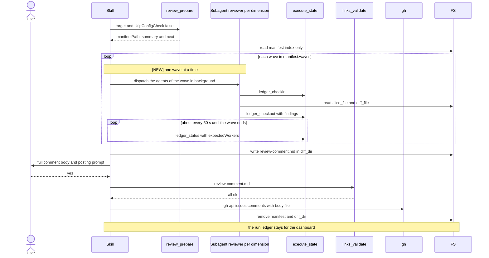

# Spec Delta

## MODIFIED Requirements

### Requirement: Dry run
When `--dry-run` is passed the skill SHALL print the review plan from the manifest, delete `manifestPath` and `manifest.diff_dir`, and stop without dispatching any agent.

The printed plan has this shape:

```text
Review Plan (dry run — no agents dispatched)

  Base branch:    {manifest.base_branch}
  Changed files:  {manifest.git.changed_files_count}
  Dimensions:     {manifest.summary.active_dimensions} active in {manifest.summary.wave_count} wave(s) of up to {manifest.plan_critique.max_parallel_dimensions}, {manifest.summary.skipped_dimensions} skipped

| Dimension | Files | Severity | Status |
|-----------|-------|----------|--------|
{one row per entry in manifest.dimensions}

Plan critique:
  - Uncovered files:       {plan_critique.uncovered_files or "none"}
  - Over-broad:            {plan_critique.over_broad_dimensions or "none"}
  - Suggested dimensions:  {plan_critique.uncovered_suggestions[].dimension or "none"}

To execute the full review, run /review (without --dry-run).
```

- The plan has no `queued` count and no `Queued (not reviewed)` line.

#### Scenario: Dry run stops early
- **WHEN** the user runs `/review --dry-run`
- **THEN** the skill prints `Review Plan (dry run — no agents dispatched)` and the dimension table
- **AND** runs `rm -f "<manifestPath>"` and `rm -rf "{manifest.diff_dir}"`, and stops
- **AND** does not call `ledger_cleanup`, because no `runId` exists yet

#### Scenario: Dry run with queued dimensions
- **WHEN** the user runs `/review --dry-run` with 21 active dimensions, `summary.wave_count` `3`, `plan_critique.max_parallel_dimensions` `8`, and 2 skipped dimensions
- **THEN** the `Dimensions:` line is `21 active in 3 wave(s) of up to 8, 2 skipped`
- **AND** the plan has no `Queued (not reviewed)` line

#### Scenario: Dry run with no queued dimensions
- **WHEN** the user runs `/review --dry-run` and `summary.wave_count` is `1`
- **THEN** the `Dimensions:` line contains `in 1 wave(s) of up to`
- **AND** the plan has no `Queued (not reviewed)` line

### Requirement: Run and worker identifiers
The skill SHALL derive one ledger `runId` per run and one `workerId` per dispatched dimension.

- `runId` is `review-` + the manifest `timestamp`, with every character outside `[A-Za-z0-9_-]` replaced by `-`.
- `workerId` is the dimension `name` lowercased, with every run of characters outside `[A-Za-z0-9_-]` collapsed to one `-`.
- The skill adds a `workerId` to the `expectedWorkers` list only when it starts the agent of that worker. `expectedWorkers` never holds a worker of a wave that has not started.

#### Scenario: Timestamp with colons
- **WHEN** the manifest `timestamp` is `2026-09-30T10:15:00Z`
- **THEN** `runId` is `review-2026-09-30T10-15-00Z`

#### Scenario: Later wave not expected yet
- **WHEN** the skill has started `waves[0]` and `waves[1]` has not started
- **THEN** `expectedWorkers` holds only the worker IDs of `waves[0]`

### Requirement: Reviewer dispatch
The skill SHALL dispatch one background Agent per dimension name in `manifest.waves`, one wave at a time, with all agents of one wave in a single message and `run_in_background: true`. The skill SHALL start the next wave only after every worker of the current wave is done, skipped or stopped.

- The skill finds the `manifest.dimensions[]` entry of each name in the wave to build the agent prompt.
- When `manifest.waves` is empty, the skill starts no agent and does not poll. It goes to findings consolidation with zero findings.
- Each agent's `model` is `dimension.model` when set, otherwise `manifest.subagent_model`, forwarded verbatim.
- The skill prefers the Workflow tool's native fan-out when it is available. It runs one fan-out per wave, with at most `manifest.plan_critique.max_parallel_dimensions` agents.
- `SKIPPED` dimensions get no agent.

Each reviewer agent prompt requires this order:

| Order | Agent action |
|---|---|
| 1 | `execute_state({action: "ledger_checkin", runId, workerId})` before reading its files |
| 2 | Read `slice_file` (JSON: `body`, `matched_files`, `file_context`, `warnings`) and `diff_file` |
| 3 | Review only `matched_files`, only for the dimension's concern; at most 20 findings |
| 4 | `execute_state({action: "ledger_checkout", runId, workerId, findings})` last |

- `findings` is a raw JSON array of `{severity, file, line, rationale}`, or `[]` when there are none.
- The default severity for findings is the dimension's `severity`.
- When `truncated` is `true`, the skill treats that dimension's `diff_file` as partial; findings outside it may exist.
- Every reviewer prompt carries the dimension's `truncated` value in a "Diff Completeness" section. When it is `true`, the prompt tells the agent its diff is partial, that a footer starting with `# --- Truncated` lists the omitted files, and that it must not call the omitted files clean.

Main review flow from prepare to cleanup. The wave loop is new:



#### Scenario: Per-dimension model override
- **WHEN** a dimension has `model: "opus"` and `manifest.subagent_model` is `sonnet`
- **THEN** that dimension's agent is dispatched with model `opus`

#### Scenario: Skipped dimension
- **WHEN** a dimension has `status: "SKIPPED"`
- **THEN** no agent is dispatched for it

#### Scenario: Truncated dimension prompt
- **WHEN** a dimension has `truncated: true`
- **THEN** its reviewer prompt contains `truncated: true`
- **AND** the prompt says the diff file is partial and names the `# --- Truncated` footer

#### Scenario: Three waves
- **WHEN** `manifest.waves` holds waves of 8, 8 and 5 names
- **THEN** the skill sends three dispatch messages, one per wave, in wave order
- **AND** the second message is sent only after every worker of the first wave is done, skipped or stopped
- **AND** 21 agents run in total

#### Scenario: No wave
- **WHEN** `manifest.waves` is `[]`
- **THEN** the skill starts no agent and makes no `ledger_status` call
- **AND** the comment reports zero findings

### Requirement: Ledger polling
The skill SHALL poll `execute_state({action: "ledger_status", runId, expectedWorkers, timeoutSeconds: 1800})` about every 60 seconds for each wave until every worker of that wave is done, skipped, or stopped.

- The skill SHALL NOT end the poll of a wave while a worker of that wave is still running. A worker ends as stopped only after it is confirmed stalled or missing on two polls in a row.
- Workers of earlier waves are already done, skipped or stopped. The skill does not count them for the current wave and does not stop them again.
- After the last wave ends, the skill consolidates the findings from the last poll.

#### Scenario: All workers done
- **WHEN** every expected `workerId` of the last wave shows `status: "done"`
- **THEN** the skill stops polling and consolidates findings

#### Scenario: Wave ends and a next wave exists
- **WHEN** every worker of `waves[0]` is done and `waves[1]` exists
- **THEN** the skill stops polling for `waves[0]` and starts the agents of `waves[1]`

### Requirement: Stalled and missing workers
The skill SHALL wait one more poll when a `workerId` of the current wave first appears in `stalledWorkers` or `missingWorkers`, and SHALL stop waiting on it when it appears there again on the next poll.

- The skill then calls `TaskStop` once for that worker, and the worker counts as stopped.
- When `TaskStop` returns an ownership error, the skill does not retry it and names the worker `possibly still running` in the comment.
- The skill keeps the poll for the other workers of the current wave. When the wave ends, the next wave starts, or consolidation starts after the last wave.
- The final `review-comment.md` names every skipped dimension.
- A stalled-twice dimension gets its own block with the note `Skipped — worker stalled twice; no findings collected`.
- For a missing worker, the skill also logs a warning.

#### Scenario: Worker stalled on two polls
- **WHEN** worker `security` is in `stalledWorkers` on two polls in a row
- **THEN** the skill calls `TaskStop` once for `security` and continues without it
- **AND** the comment states that `security` was skipped and its findings are absent

#### Scenario: Worker stalled once
- **WHEN** a worker is in `stalledWorkers` on one poll and `done` on the next
- **THEN** its findings are included

#### Scenario: Stalled worker in an early wave
- **WHEN** a worker of `waves[0]` is stalled on two polls in a row and `waves[1]` exists
- **THEN** the skill starts `waves[1]` after the other workers of `waves[0]` are done
- **AND** the skill does not call `TaskStop` again for the stopped worker in a later wave

### Requirement: Consolidated comment file
The skill SHALL write the consolidated comment with the Write tool to `{manifest.diff_dir}/review-comment.md`.

- First line: `## Code Review — {N} dimension(s), {M} finding(s)`; `{N}` excludes dimensions skipped as stalled.
- Second block: `> Automated review by \`review\` v{plugin_version} · {date}`, with `{plugin_version}` from `manifest.plugin_version` and `{date}` as `YYYY-MM-DD`.
- The comment has no `Queued (not reviewed` line, because every matching dimension runs.
- A `### Summary` table with columns `Dimension | Findings | Critical | High | Medium | Low | Info` and a **Total** row.
- A `### Verdict: {verdict}` heading and a one-sentence assessment. The heading has no `partial coverage` caveat.
- One `### {dimension.name} — {N} finding(s)` block per dimension, with findings in a `<details>` element.
- Each finding: `#### [{SEVERITY}] {title}`, `**File:** \`{file}:{line}\``, description, `**Suggestion:**`.
- The body never includes an AI-tool attribution line.

#### Scenario: Comment persisted
- **WHEN** consolidation finishes
- **THEN** `{manifest.diff_dir}/review-comment.md` exists and starts with `## Code Review —`

#### Scenario: Queued note present
- **WHEN** the review ran 21 dimensions in 3 waves
- **THEN** the comment contains no `Queued (not reviewed` line
- **AND** the first line is `## Code Review — 21 dimension(s), {M} finding(s)` when no worker stalled

#### Scenario: Queued note absent
- **WHEN** the review ran in one wave
- **THEN** the comment contains no `Queued (not reviewed` line

#### Scenario: Verdict carries a coverage caveat
- **WHEN** the review ran in more than one wave and the findings give the verdict `APPROVED`
- **THEN** the verdict heading is `### Verdict: APPROVED`
- **AND** Step 8 treats the verdict as `APPROVED`

#### Scenario: Verdict without queued dimensions
- **WHEN** the review ran in one wave
- **THEN** the verdict heading has no `partial coverage` caveat

## ADDED Requirements

### Requirement: Interrupted review restarts
The skill SHALL NOT resume an interrupted `/review` run. A new `/review` run SHALL start at Step 0 with a new manifest and a new `runId`, and SHALL NOT read the ledger files of the old run.

#### Scenario: Run interrupted between waves
- **WHEN** a `/review` run stops after `waves[0]` ends and before `waves[1]` starts
- **AND** the user runs `/review` again
- **THEN** the skill calls `review_prepare` again and derives a new `runId`
- **AND** the skill starts from `waves[0]` of the new manifest
