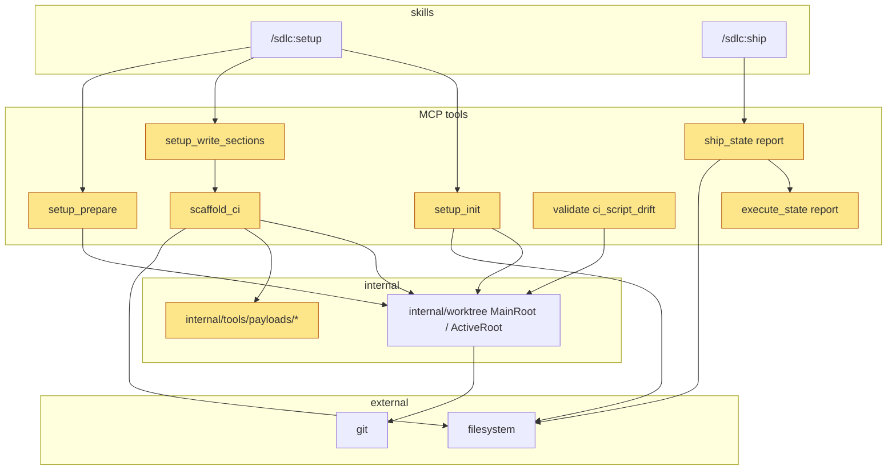
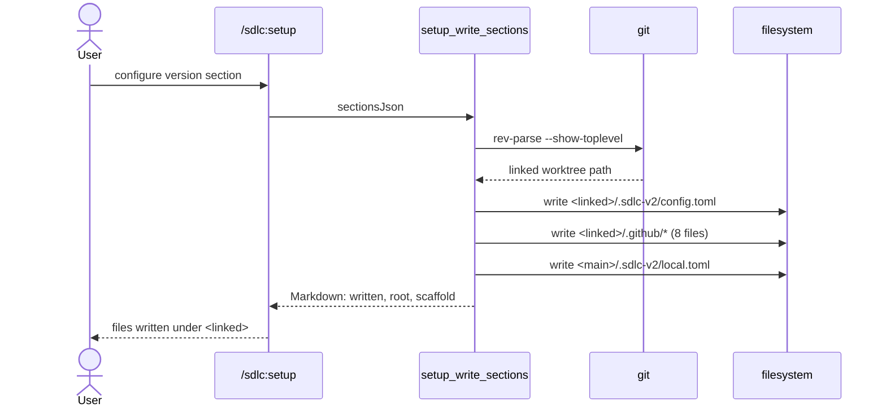

# Design

## Context

- Motivation: see proposal.md - Why.
- Payloads under `internal/tools/payloads/` are standalone copies; there is no shared module (`release-on-main.cjs:67-68`). `TestPayloads_MatchCheckedIn` requires each payload to be byte-identical to its `.github/` copy.
- `scaffold_ci` detects drift from version markers only (`scaffold.go:50-101`). Every edited payload must bump its marker.
- `internal/worktree` has `MainRoot()` (state, shared) and `ActiveRoot()` (checked-out content). `harden` and `openspec_stage` already write git-tracked files to the active root (`harden.go:620-676`, `plan_support.go:268-301`).
- `ship_report.go` renders every section; `renderShipReportCLIEvidence` (`:819-831`) prints one bullet per command; `renderShipReportNext` (`:852-859`) writes the tool instruction into the file.
- The bug report says `release-on-main.yml` lost a concurrency block and `retag-release.yml` moved `contents: write` to workflow level. This repo's history has neither (no `concurrency:` at any marker version; permissions always workflow-level). The concurrency block is added as hardening; the permissions item is dropped because `retag-release` is removed.

## Goals / Non-Goals

**Goals:**

- Fix every payload defect in the bug report that still applies after `retag-release` is removed.
- Make every git-tracked write by `scaffold_ci`, `setup_write_sections` and `setup_init` land in the active worktree, and every drift read look there.
- Cut the ship report to stats for high-volume sections, put every run metric in one Summary table, and keep per-item lines only where a person must act (deferred findings, failed commands, critical/high/medium fixes).

**Non-Goals:**

- No change to how other tools read `.sdlc-v2/config.toml` (they keep reading the main root).
- No `execFileSync` rewrite of payload exec helpers; allowlist validation plus quoting closes the injection path.
- No change to the execute skill's own LLM-rendered report; only the shared duration rule changes.
- No new CLI evidence fields (duration, tool kind); stats use existing fields.
- No cleanup of `retag-release` files already installed in user projects.
- No change to `reportData` or the `read` action; the ledger stays unclamped in data.

## Decisions

| Decision | Chosen | Rejected alternatives | Reason |
|---|---|---|---|
| check-changelog tag logic | Inline a copy of `highestSemverTag` (prefix strip, anchored regex) | Shared module; `git -c versionsort.suffix=-` sort | Payloads are standalone by design; the anchored filter alone fixes both defects |
| check-changelog testability | Add `require.main === module` guard, export `resolveVersionFromTags`; test with real tags in a temp git repo | Subprocess-only test | Guardrail `test-coverage-required` asks for importable scripts; real git keeps the test functional |
| Promote target | Require target == series version; message names the matching level | Derive target from series, drop `level` input | Keeps the workflow input contract; smallest change |
| Release branch | `RELEASE_BRANCH` env from `github.event.repository.default_branch`; fail when `GITHUB_REF_NAME` differs | Hardcode `main` | Works for repos whose default branch is not `main` |
| Ref safety | Allowlist `^[A-Za-z0-9._/-]+$` + quote every ref, in promote-release and release-on-main | `execFileSync` everywhere | Allowlist blocks shell metacharacters; far smaller diff (guardrail `kiss`); release-on-main shares the pattern (guardrail `dry`) |
| retag-release | Remove from manifest, payloads, dogfood copies | Legacy config flag; anchor regex only | User decision D4; deprecated script; no new config key |
| Worktree roots | Active root for `config.toml`, `.github/*`, `.gitignore` blocks, templates, drift reads; main root for `local.toml` and `runs/` | Everything active; everything main | User decisions D3 and D6: git-tracked files follow the branch; `local.toml` and `runs/` are gitignored and shared |
| Active root failure | scaffold_ci: `InfraError`; setup_write_sections and setup_init: cwd fallback; drift readers: main-root fallback | Silent main fallback in scaffold_ci | A silent fallback re-creates the original bug |
| Testable roots | Core functions take explicit roots (`setupPrepareWithDrift`, `setupWriteSections(contentRoot, stateRoot, ...)`, `setupInitRoots`); old single-root names stay as wrappers | Resolve roots inside core functions | Existing tests call the core functions with temp dirs from inside this repo; resolving there would return this repo's path |
| Report summary | One `Area \| Result` table under the title, computed from existing output fields with the same counters as the sections | Summary in the tool output only | User asked for all metrics in one place in the file |
| Report text safety | Every stored string goes through a short-form helper; commands become one code span with a backtick-aware fence | Escape only `|` (today) | Multi-line commands and backticks broke the whole file layout |
| Hardened trigger cleanup | Short form at render time | Normalize in `healing_record` | `trigger` is the upsert key; changing stored values risks breaking `started` → `done` matching; render-time also fixes old state |
| Report Next | Drop `## Next` from Markdown; `next` field unchanged | Strip only when writing | One code path; `display` equals the file (spec scenario "Write markdown") |
| Execution duration end | `runCompletedAt`, else latest wave `completedAt`, else now | Always now | Report written after the run gave durations longer than the run |

Architecture of the touched parts:

Main runtime flow (setup in a linked worktree):

State diagram: skipped. No persisted state changes shape.

Output struct changes:

| Struct | Field | Type | Encoding | Example |
|---|---|---|---|---|
| `ScaffoldCIOut` | `Root` (`json:"root"`) | string | absolute path | `/repos/app-feat-x` |
| `SetupWriteSectionsOut` | `Root` (`json:"root"`) | string | absolute path | `/repos/app-feat-x` |
| `SetupInitOut` | `Root` (`json:"root"`) | string | absolute path | `/repos/app-feat-x` |

## Risks / Trade-offs

| Risk | Impact | Mitigation |
|---|---|---|
| Tools still read `config.toml` from the main root | In a linked worktree, a config change written by setup takes effect only after merge | Same model as `harden`; documented in `docs/versioning.md` |
| First setup in a linked worktree | Main checkout gets `local.toml` before it has the `.sdlc-v2/.gitignore` that ignores it; `git status` on main shows it as untracked until merge | Accepted; writing `.gitignore` to main would bring back the wrong-checkout write |
| retag removal leaves old copies in user repos | Old script keeps running there | Proposal marks it BREAKING; `scaffold_ci` never touches the files, so users delete them by hand |
| `--limit 1000` still caps notes | A release with more than 1000 PRs fails | Fails loudly with `reached the 1000 PR limit` instead of dropping notes |
| Summary and sections disagree | A reader trusts a wrong number | Each summary number uses the same counting helper as its section; a test compares them |
| Command grouping is a heuristic | A pipeline like `cd x && go test` groups as `go test`, a shell loop as `for` | Rules are fixed and table-tested; the full log path stays in the report |
| Tests pin report text | Many `ship_report_test.go` assertions change | Rewrite assertions per section in the same task |
| Allowlist rejects an unusual but legal branch name | Promotion fails with `invalid branch name` | Message names the pattern; default branches are plain names |
