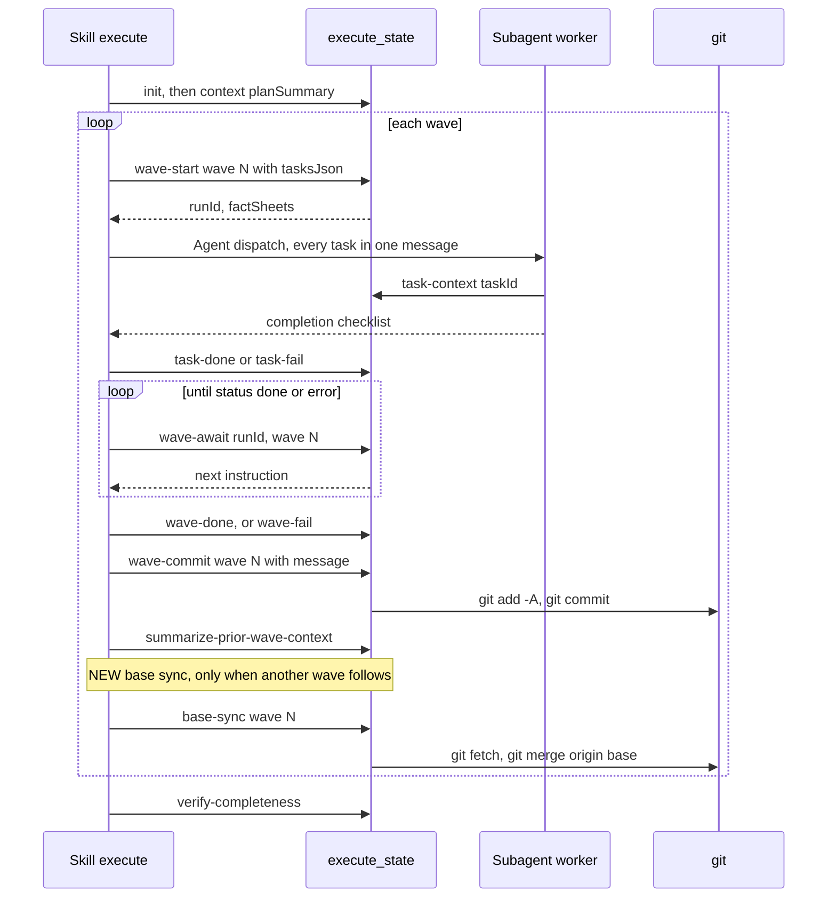

# Spec Delta

## MODIFIED Requirements

### Requirement: Wave loop order
The skill SHALL bootstrap run state once with `init` and `context`, then run each wave in this fixed order: wave-start, dispatch, record on return, await, act on `next`, gates, base sync.

Main wave loop (new step marked):

- `init` fields: `branch`, `quality`, `totalTasks`, `plannedTaskIds`, `planPath`, `planHash`, `waveTimeoutSeconds`, `waveIntervalSeconds`, `commitWaves`.
- The skill computes `planHash` itself: `shasum -a 256 "$PLAN_FILE" | cut -d' ' -f1`.
- `context` call: `data` = `{"planSummary": "<2-3 sentence goal>"}`.
- Batching and worker names are fixed before `wave-start` and sent in `tasksJson` as `workerName`, `batchId`, `batchIndex`.
- Pre-wave: 1 trivial task runs inline; 2+ trivial tasks go to one haiku batch agent.
- Gates run in this order: spec-compliance review, post-wave guardrail check, OpenSpec task flip, `wave-done` (or `wave-fail` with `timedOut: true`), `wave-commit`, progress report, `summarize-prior-wave-context`, then `base-sync` when another wave follows.
- Follow-up findings go to `execute_state` `action: "issue-draft"` with `branch`, `taskId`, `issueDraftTitle`, `issueDraftBody`.

#### Scenario: Plan changed since init
- **WHEN** `wave-start` returns `halt: true` with `reason` "plan hash mismatch"
- **THEN** the skill renders `reason` and `next`
- **AND** the skill dispatches nothing

#### Scenario: Task returns
- **WHEN** a dispatched Agent returns
- **THEN** the skill runs phantom-success checks (`git diff --stat`, `verifyToken` canary, batch `filesChanged` distinctness)
- **AND** the skill calls `task-done` or `task-fail` for that task right away, not at the end of the wave

#### Scenario: Wave still pending after a re-dispatch
- **WHEN** `wave-await` returns `status` `"pending"`
- **THEN** the skill does not start the gates

#### Scenario: Last wave
- **WHEN** wave N is the last wave of the plan
- **THEN** the skill does not call `base-sync` after it

### Requirement: Workspace derivation and pre-execution rebase
The skill SHALL derive the workspace from git state without a flag, and SHALL never create a git worktree.

| Condition | Outcome |
|---|---|
| `--branch` passed | Skip detection. Trust caller branch and cwd. |
| Linked worktree, or current branch is neither the default branch nor the base branch | `continue`: run in place. |
| Main worktree and on the default branch or the base branch | `branch`: derive a branch name and create it. |

- Current branch comes from `git branch --show-current`, never the session-start `gitStatus` snapshot.
- Default branch comes from `git symbolic-ref refs/remotes/origin/HEAD`, fallback `main`.
- Base branch is the resolved base branch (`[git] baseBranch`, else the default branch).
- Branch name uses `workspace.branch` in `.sdlc-v2/local.toml`: `template` (default `"{type}/{slug}"`), `slugMaxLength` (default `50`), `typeMap`.
- The only prompt in workspace derivation is the branch-name confirmation in the `branch` outcome, and only when effective auto is false.

#### Scenario: On default branch in auto mode
- **WHEN** the workspace outcome is `branch`
- **AND** effective auto is true
- **THEN** the skill runs `git checkout -b "<derived-name>"` and logs one line

#### Scenario: On default branch in interactive mode
- **WHEN** the workspace outcome is `branch`
- **AND** effective auto is false
- **THEN** the skill asks with AskUserQuestion: "Create `<derived-name>`" or "Use a different name"
- **AND** the skill runs `git checkout -b` with the chosen name

#### Scenario: Rebase auto with a behind branch
- **WHEN** `--rebase auto` is passed
- **AND** `git merge-base --is-ancestor origin/<base> HEAD` fails after `git fetch origin <base>`
- **THEN** the skill runs `git rebase origin/<base>`
- **AND** on conflict it runs `git rebase --abort`, warns, and continues on the current base

#### Scenario: Rebase prompt
- **WHEN** `--rebase prompt` is passed
- **THEN** the skill asks with AskUserQuestion before rebasing

## ADDED Requirements

### Requirement: Base sync conflict resolution
When `base-sync` returns `status: "conflict"`, the skill SHALL dispatch one sub-agent with the `conflictedFiles`, the plan's goal, and the incoming base commits, and SHALL then call `base-sync-resolve`; when the sub-agent reports failure or `base-sync-resolve` fails, the skill SHALL call `base-sync-resolve` with `abort: true` and continue with the next wave.

- A conflict never stops the run.
- On resume, when the last `baseSyncs` entry has `status: "conflict"`, the skill calls `base-sync-resolve` with `abort: true` before the next `wave-start`.
- Each outcome (`merged`, `resolved`, `aborted`, `skipped`) is one line in the progress report.
- The end-of-run report lists every `aborted` sync as `Base sync aborted at wave <N>: conflicts left for ship rebase`.

#### Scenario: Conflict resolved
- **WHEN** `base-sync` returns `conflict` and the sub-agent resolves every file
- **THEN** the skill calls `base-sync-resolve` and gets `status: "resolved"`
- **AND** the next wave starts

#### Scenario: Conflict not resolvable
- **WHEN** `base-sync-resolve` fails because conflict markers remain
- **THEN** the skill calls `base-sync-resolve` with `abort: true`
- **AND** the next wave starts on the previous base

#### Scenario: Resume after an unresolved conflict
- **WHEN** execute resumes and the last `baseSyncs` entry has `status: "conflict"`
- **THEN** the skill calls `base-sync-resolve` with `abort: true` before the next `wave-start`
