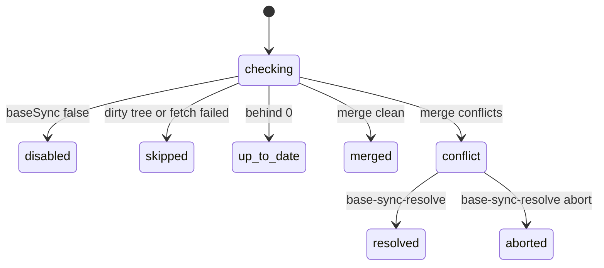

# Spec Delta

## MODIFIED Requirements

### Requirement: Action selection
The tool SHALL run exactly one operation per call, selected by the `action` field, and SHALL ignore every input field the selected action does not read.

Actions, their fields, and what they touch:

| Action | Required | Optional | Execute state file | Other side effects |
|---|---|---|---|---|
| `wave-compute` | `planPath` | `extraDepsJson` | none | reads plan file |
| `resolve-config` | — | `branch`, `auto`, `quality`, `commitWaves` | none | may move keys from `.sdlc-v2/config.toml` to `.sdlc-v2/local.toml` |
| `init` | `branch`, `quality` | `totalTasks`, `plannedTaskIds`, `planPath`, `planHash`, `commitWaves`, `sessionId`, `waveTimeoutSeconds`, `waveIntervalSeconds` | creates | config migration; OpenSpec materialize; OpenSpec `tasks.md` ref stamps |
| `wave-start` | `wave` | `branch`, `tasksJson`, `runId`, `detail` | writes | fact sheets; server dispatch state |
| `wave-done` | `wave` | `branch`, `decisions`, `status`, `timedOut`, `detail` | writes | `.sdlc-v2/timings.json` |
| `wave-fail` | `wave` | `branch`, `timedOut`, `error`, `detail` | writes | — |
| `wave-committed` | `wave` | `branch`, `sha` | writes | — |
| `wave-commit` | `wave`, `message` | `branch`, `detail` | writes | `git add -A`, `git commit` |
| `base-sync` | `wave` | `branch` | writes | `git fetch`, `git merge` |
| `base-sync-resolve` | `wave` | `branch`, `abort` | writes | `git commit` or `git merge --abort` |
| `task-done` | `wave`, `taskId` | `branch`, `taskName`, `complexity`, `risk`, `filesChanged`, `filesAdded`, `verifyToken`, `status`, `error` | writes | — |
| `task-fail` | `wave`, `taskId` | `branch`, `runId`, `taskName`, `complexity`, `risk`, `error`, `skippedDependency` | writes | reads worker progress |
| `task-redispatch` | `taskId` | `branch`, `runId`, `wave` | writes | server dispatch state reseeded |
| `task-context` | `taskId` | `branch`, `runId`, `wave` | reads | stamps `contextFetchedAt` |
| `context` | `data` | `branch` | writes | — |
| `read` | — | `branch` | reads | — |
| `cleanup` | — | `branch` | writes terminal stamp | removes run and ledger dirs |
| `gc` | — | `ttlDays`, `dryRun` | deletes stale files | removes stale run dirs |
| `summarize-prior-wave-context` | — | `branch`, `maxFiles`, `maxDecisions`, `maxInterfaces`, `maxTaskIds` | reads | — |
| `wave-split` | `dispatched` | `wave`, `missingIds`, `branch`, `splitDepth`, `maxSplitDepth`, `stateFile` | best-effort write | — |
| `verify-completeness` | — | `branch`, `stateFile` | reads | may write ship state |
| `wave-progress` | `runId` | `readProgress`, `taskId`, `phase`, `lastCompletedTask`, `acceptanceDone`, `filesTouched`, `blocker` | none | worker progress file |
| `wave-await` | `runId`, `wave` | `branch`, `stateFile` | reads | reclaim stamps; poll file |
| `resume-reset` | — | `branch`, `runId` | writes | server dispatch state reseeded |
| `ledger_checkin` | `runId`, `workerId` | `stepId` | none | ledger file |
| `ledger_checkout` | `runId`, `workerId` | `findings` | none | ledger file |
| `ledger_status` | `runId` | `timeoutSeconds`, `expectedWorkers` | none | — |
| `ledger_cleanup` | `runId` | — | none | removes ledger dir |
| `log-cli` | `cliCommand` | `cliExitCode`, `cliOutput`, `branch`, `wave` | none | CLI evidence log |
| `drift-log` | `driftSeverity`, `driftSummary` | `driftDetail`, `wave`, `taskId`, `branch` | writes | — |
| `issue-draft` | `issueDraftTitle`, `issueDraftBody` | `issueDraftLabels`, `taskId`, `branch` | writes | `.sdlc-v2/history/deferred.json` |
| `decide` | `decideType`, `decideId` | `decideDecision`, `decideReason`, `branch` | writes | — |
| `report` | — | `branch`, `write`, `format`, `body` | reads | report file when `write` is true |

- `payload` is reserved and no action reads it.
- Tool annotations: `Title` `Read or update execute run state`, `ReadOnly` false, `Destructive` true, `Idempotent` false, `OpenWorld` true (`base-sync` fetches from the git remote).

#### Scenario: Unknown action
- **WHEN** `action` is not one of the 33 actions above
- **THEN** the tool fails with a DomainError whose message starts with `unknown action "<action>" (sdlc v<version>, commit <sha>)`
- **AND** the Suggestion says the action is not in the running binary and advises updating the sdlc plugin

#### Scenario: Unread fields are ignored
- **WHEN** a caller passes a field that the selected action does not list
- **THEN** the call behaves as if that field were absent

### Requirement: init action
The `init` action SHALL create a new execute state file for `branch`, after passing the config migration gate, and SHALL return its path.

| Persisted key | Value |
|---|---|
| `version`, `skill` | `1`, `execute` |
| `startedAt` | now, RFC 3339 UTC |
| `branch`, `worktree` | `branch` input; active worktree path |
| `planPath`, `planHash` | inputs, or `null` when empty |
| `quality` | `quality` input |
| `commitWaves` | `"true"` or `"false"`; any other value becomes `"true"` |
| `totalTasks`, `plannedTaskIds` | inputs; `plannedTaskIds` is `null` when not passed |
| `waves`, `context` | `[]`, `{}` |
| `pipelineAuto` | true when the branch's ship state has `flags.auto: true` |
| `waveTimeoutSeconds` | `waveTimeoutSeconds` input > ship `flags.executeWaveTimeout` > 1800 |
| `waveIntervalSeconds` | `waveIntervalSeconds` input > ship `flags.executeWaveInterval` > 60 |
| `sessionId` | `sessionId` input, or `null` |
| `openspec` | `{change, materialized}` when the plan names an OpenSpec change, else absent |

| Output field | Meaning |
|---|---|
| `filePath` | path of the new state file |
| `pipelineAuto` | diagnostic copy of the persisted value |
| `materialized` | `"created"`, `"already"`, or absent when the plan has no `**OpenSpec-Staging:**` header |
| `warnings` | non-fatal problems (ship state unreadable, OpenSpec ref stamp skipped) |
| `migration` | `{changes[], backupPath}` when the config was migrated |

- When `planPath` is readable and has an `**OpenSpec-Staging:**` header, init materializes the staged change first, as defined by the `openspec-staging` capability. A materialize error fails init and no state file is created.
- When `planPath` is readable and its `**Source:**` line names `openspec/changes/<name>/`, init then appends `<!-- ref:... -->` comments to the task lines of `openspec/changes/<name>/tasks.md` (in the active worktree) that have no ref comment yet.

| Condition | Class | Message / Suggestion (short) |
|---|---|---|
| `branch` empty | DomainError | `--branch is required for init` |
| `quality` empty | DomainError | `--quality is required for init` / call `resolve-config` first |
| config missing or too new | DataError | `config-version: <reason>` / run the migrate tool or `/setup` |
| materialize fails | DomainError | message from the `openspec-staging` capability |
| state file cannot be created | InfraError | `init state: <err>` |

#### Scenario: Successful init
- **WHEN** `init` is called with `branch` and `quality`
- **THEN** a state file `.sdlc-v2/runs/execute-<branch-slug>-<timestamp>.json` holds the keys above
- **AND** the response carries `filePath` and `pipelineAuto`

#### Scenario: Missing config
- **WHEN** the project has no sdlc config
- **THEN** the tool fails with a DataError starting `config-version:`

#### Scenario: Wave timeouts from ship state
- **WHEN** `waveTimeoutSeconds` is not passed and the ship state has `flags.executeWaveTimeout: 900`
- **THEN** the state records `waveTimeoutSeconds: 900`

#### Scenario: Unreadable plan path
- **WHEN** `planPath` cannot be read
- **THEN** init still succeeds
- **AND** `warnings` contains `init: openspec ref stamp skipped: plan unreadable: <err>`

#### Scenario: OpenSpec plan
- **WHEN** the plan's `**Source:**` line is `openspec/changes/<name>/`
- **THEN** task lines in `openspec/changes/<name>/tasks.md` that have no ref comment yet gain ref comments

#### Scenario: Staged OpenSpec plan
- **WHEN** the plan has `**OpenSpec-Staging:** .sdlc-v2/openspec-staging/add-widget/` and `openspec/changes/add-widget/` does not exist
- **THEN** init creates `openspec/changes/add-widget/` from the staged files before stamping refs
- **AND** the response has `materialized: "created"`

## ADDED Requirements

### Requirement: base-sync action
The `base-sync` action SHALL bring new commits from `origin/<base>` into the current branch with a merge, where `<base>` is the resolved base branch, and SHALL record the outcome in the state's `baseSyncs[]` as `{wave, status, base, behind, sha, at}`, plus `conflictedFiles` when `status` is `conflict`.

| # | Condition | `status` | Effect |
|---|---|---|---|
| 1 | Config `[execute] baseSync = false` | `disabled` | nothing |
| 2 | Worktree has uncommitted changes | `skipped` | warning `base-sync skipped: uncommitted changes` |
| 3 | `git fetch origin <base>` fails | `skipped` | warning `base-sync skipped: <cause>` |
| 4 | `HEAD..origin/<base>` has 0 commits | `up-to-date` | nothing |
| 5 | `git merge --no-edit origin/<base>` succeeds | `merged` | merge commit; `behind` = commit count brought in; `sha` = new `HEAD` |
| 6 | Merge stops on conflicts | `conflict` | merge left in progress; `conflictedFiles[]` returned |

- `[execute] baseSync` defaults to `true`.
- Merge, not rebase: already committed wave SHAs stay ancestors of `HEAD`.
- `next` for `conflict`: `Resolve the conflicts in conflictedFiles, then call base-sync-resolve. Call base-sync-resolve with abort:true if they cannot be resolved.`

#### Scenario: New commits on the base
- **WHEN** `origin/develop` has 3 commits not in `HEAD`, `baseBranch = "develop"`, and the tree is clean
- **THEN** `base-sync` returns `status: "merged"` and `behind: 3`
- **AND** every earlier wave `committedSha` is still an ancestor of `HEAD`

#### Scenario: Conflict
- **WHEN** the merge conflicts in `internal/foo.go`
- **THEN** `base-sync` returns `status: "conflict"` and `conflictedFiles: ["internal/foo.go"]`
- **AND** `git status` shows a merge in progress

#### Scenario: Dirty tree
- **WHEN** the worktree has an uncommitted change
- **THEN** `base-sync` returns `status: "skipped"` and does not fetch

### Requirement: base-sync-resolve action
The `base-sync-resolve` action SHALL finish or abort the merge that `base-sync` left in progress, and SHALL update the wave's `baseSyncs[]` entry.

| Input | Check | `status` | Effect |
|---|---|---|---|
| `abort: true` | — | `aborted` | `git merge --abort`; warning `base-sync aborted: continuing on the previous base` |
| `abort` absent | unmerged files remain, or a previously conflicted file still has a `<<<<<<<` or `>>>>>>>` line | — | DomainError listing the files; merge stays in progress |
| `abort` absent | checks pass | `resolved` | `git add` the conflicted files, `git commit --no-edit`; `sha` = new `HEAD` |

| Condition | Class | Message (short) |
|---|---|---|
| No merge in progress and `abort` absent | DomainError | `base-sync-resolve: no merge in progress` |

- With `abort: true` and no merge in progress, the action does nothing and returns `status: "aborted"` with a warning.

#### Scenario: Resolved
- **WHEN** the conflicted files have no conflict markers and no unmerged paths remain
- **THEN** `base-sync-resolve` commits the merge and returns `status: "resolved"`

#### Scenario: Markers left
- **WHEN** `internal/foo.go` still contains `<<<<<<<`
- **THEN** the call fails with a DomainError naming `internal/foo.go`

#### Scenario: Abort
- **WHEN** `base-sync-resolve` is called with `abort: true`
- **THEN** no merge is in progress afterwards and `HEAD` equals the `HEAD` before `base-sync`

#### Scenario: Abort with no merge in progress
- **WHEN** `base-sync-resolve` is called with `abort: true` and no merge is in progress
- **THEN** the action changes nothing and returns `status: "aborted"` with a warning
