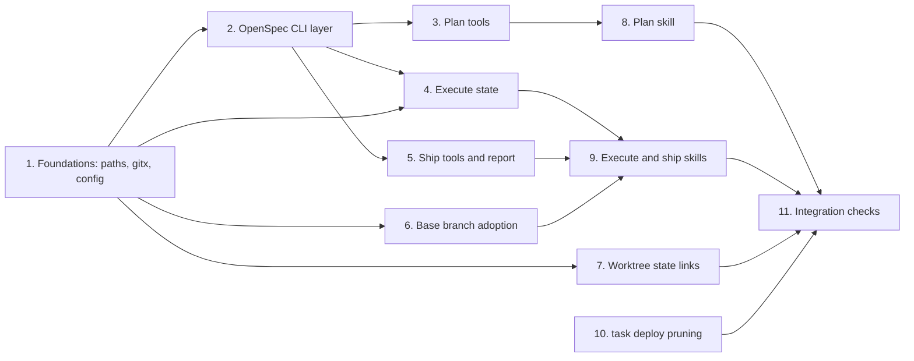

# Tasks

Group dependencies (groups with no path between them can run in parallel):

## 1. Foundations: paths, gitx, config

- [ ] 1.1 Add named constants for every `.sdlc-v2/` entry plus `LinkedStateEntries` and `UnlinkedStateEntries` lists in `internal/paths/paths.go`, and replace the string literals in `internal/tools/*.go` and `internal/hooks/*.go` — verify: `go test ./internal/paths/ -run TestStateEntryListsCoverEveryEntry` <!-- ref:1-1-add-named-constants-for-every-sdlc-v-b3537d -->
- [x] 1.2 Add `BaseBranch(cfg)` (config `[git] baseBranch`, fallback `DefaultBranch`), `FetchBranch`, `BehindCount`, `Merge`, `MergeAbort`, `UnmergedFiles` in `internal/gitx/gitx.go` — verify: `go test ./internal/gitx/ -run 'TestBaseBranch|TestBehindCount|TestMerge'` (real git in `t.TempDir`) <!-- ref:1-2-add-basebranch-cfg-config-git-basebr-b50231 -->
- [x] 1.3 Add `[git] baseBranch` and `[execute] baseSync` to `plugins/sdlc/schemas/sdlc-config.schema.json`, `plugins/sdlc/templates/config.toml`, and the config loader in `internal/config/` — verify: `go test ./internal/config/ -run TestGitBaseBranch` and the template/schema sync test <!-- ref:1-3-add-git-basebranch-and-execute-bases-be5a51 -->

## 2. OpenSpec CLI layer

- [x] 2.1 Add CLI wrappers `List`, `ListSpecs`, `Status`, `Instructions` (JSON decode, `nested_change_directory` warnings) in `internal/openspec/cli.go` with an injectable runner — verify: `go test ./internal/openspec/ -run TestCLIWrappers` <!-- ref:2-1-add-cli-wrappers-list-listspecs-stat-ffaf53 -->
- [x] 2.2 Add `Stage(activeRoot, change, files)` with name/path checks, whole-dir replace, `stage.json` SHA-256, temp-copy `validate --strict` in `internal/openspec/stage.go` — verify: `go test ./internal/openspec/ -run TestStage` (incl. `../config.toml` rejection, git status clean) <!-- ref:2-2-add-stage-activeroot-change-files-wi-143bce -->
- [x] 2.3 Add `Materialize(activeRoot, planContent)` implementing rules 1–7, rollback on validate failure, `git add`, staging delete in `internal/openspec/materialize.go` — verify: `go test ./internal/openspec/ -run TestMaterialize` (created, already, differs, missing, hash mismatch, rollback) <!-- ref:2-3-add-materialize-activeroot-planconte-8b898f -->
- [x] 2.4 Replace `specs/*.md` / one-level globs with `Status` artifact paths in `internal/openspec/openspec.go`, `internal/tools/plan.go:270`, `internal/tools/plan_explore.go:212` — verify: `go test ./internal/openspec/ ./internal/tools/ -run 'TestNestedDeltaSpecs'` <!-- ref:2-4-replace-specs-md-one-level-globs-wit-e37003 -->

## 3. Plan tools

- [x] 3.1 Switch `plan_prepare` OpenSpec detection to `List`/`Status`, add `groupedChanges`, `deltaSpecPaths`, grouped-name error, `openspec CLI unavailable` error in `internal/tools/plan.go` — verify: `go test ./internal/tools/ -run 'TestPlanPrepareOpenspec'` <!-- ref:3-1-switch-plan-prepare-openspec-detecti-b2f547 -->
- [x] 3.2 Replace `openspecInlineGenerate` with `openspecStage` in `PlanPrepareIn` and skeleton-body rules in `internal/tools/plan.go` — verify: `go test ./internal/tools/ -run TestPlanPrepareSkeletonOpenspecStage` <!-- ref:3-2-replace-openspecinlinegenerate-with-22ea32 -->
- [x] 3.3 Add `openspec_stage` action (inputs, outputs, `next`, errors) to `internal/tools/plan_support.go`, keeping `ReadOnly:true` — verify: `go test ./internal/tools/ -run 'TestPlanSupportOpenspecStage|TestReadOnlyToolsWriteNothingTracked'` <!-- ref:3-3-add-openspec-stage-action-inputs-out-457f63 -->
- [x] 3.4 Add `rejected` (default `[]`) and server-set `at` to `criticalDecisions` entries in `internal/tools/plan.go` (`plan_mark`) — verify: `go test ./internal/tools/ -run TestPlanMarkCriticalDecisionsRejected` <!-- ref:3-4-add-rejected-default-and-server-set-7fa708 -->
- [x] 3.5 Stop deleting the plan run file and `.evidence/` on `planIntegrity.done` in `internal/hooks/stop_hooks.go` — verify: `go test ./internal/hooks/ -run TestStopPlanIntegrityKeepsDoneRun` <!-- ref:3-5-stop-deleting-the-plan-run-file-and-590ecc -->
- [ ] 3.6 Update `plugins/sdlc/skills/plan/state-format.md` and `docs/plan-architecture.md` for staging, `openspecStage`, `rejected`, plan-run lifetime — verify: `links_validate` MCP tool on the changed docs <!-- ref:3-6-update-plugins-sdlc-skills-plan-stat-ae2649 -->

## 4. Execute state

- [x] 4.1 Call `Materialize` at the start of `init` before ref stamping, persist `openspec`, return `materialized` in `internal/tools/execute_state.go` — verify: `go test ./internal/tools/ -run 'TestExecuteInitMaterialize'` <!-- ref:4-1-call-materialize-at-the-start-of-ini-9c4646 -->
- [x] 4.2 Add `base-sync` action (disabled, skipped dirty, skipped fetch, up-to-date, merged, conflict; `baseSyncs[]` record) in `internal/tools/execute_state.go` — verify: `go test ./internal/tools/ -run TestExecuteBaseSync` (real git, remote in `t.TempDir`) <!-- ref:4-2-add-base-sync-action-disabled-skippe-65f7a1 -->
- [ ] 4.3 Add `base-sync-resolve` action (`abort`, unmerged check, marker scan, commit) and the `Abort` input field in `internal/tools/execute_state.go` — verify: `go test ./internal/tools/ -run TestExecuteBaseSyncResolve` <!-- ref:4-3-add-base-sync-resolve-action-abort-u-137962 -->
- [ ] 4.4 Update the action list, unknown-action message, and annotations entry for the 2 new actions in `internal/tools/execute_state.go` and `internal/tools/annotations_test.go` — verify: `go test ./internal/tools/ -run 'TestExecuteStateUnknownAction|TestAnnotations'` <!-- ref:4-4-update-the-action-list-unknown-actio-58e6d2 -->
- [ ] 4.5 Assert every earlier `committedSha` stays an ancestor after a `merged` sync and that resume cross-check passes in `internal/tools/execute_state_test.go` — verify: `go test ./internal/tools/ -run TestBaseSyncKeepsWaveAncestry` <!-- ref:4-5-assert-every-earlier-committedsha-st-4b9a5d -->

## 5. Ship tools and report

- [x] 5.1 Call `Materialize` in `ship_prepare` after validation and before state write, honor `dryRun`, add `openspec` output in `internal/tools/ship.go` — verify: `go test ./internal/tools/ -run 'TestShipPrepareMaterialize'` <!-- ref:5-1-call-materialize-in-ship-prepare-aft-0a04e5 -->
- [x] 5.2 Derive `flags.openspecChange` from the plan `**Source:**` header with `sources.openspecChange` and the mismatch warning in `internal/tools/ship.go` — verify: `go test ./internal/tools/ -run TestShipPrepareOpenspecChangeFromPlan` <!-- ref:5-2-derive-flags-openspecchange-from-the-f227c8 -->
- [x] 5.3 Add `at` to `decide` entries in `internal/tools/ship_state.go` — verify: `go test ./internal/tools/ -run TestShipStateDecideAt` <!-- ref:5-3-add-at-to-decide-entries-in-internal-9224fc -->
- [x] 5.4 Add `planning` (from the linked plan run) and merged `timeline` to the report, plus `## Planning` and `## Timeline` Markdown sections in `internal/tools/ship_report.go` — verify: `go test ./internal/tools/ -run 'TestShipReportPlanning|TestShipReportTimeline'` <!-- ref:5-4-add-planning-from-the-linked-plan-ru-a04863 -->
- [ ] 5.5 Delete the linked plan run and `.evidence/` in `cleanup-pipeline` only after the stamp and when the report file exists; add `planRun` output in `internal/tools/ship_state.go` — verify: `go test ./internal/tools/ -run TestCleanupPipelineDeletesReportedPlanRun` <!-- ref:5-5-delete-the-linked-plan-run-and-evide-273019 -->

## 6. Base branch adoption

- [x] 6.1 Use `gitx.BaseBranch` instead of `DefaultBranch` for commit-list ranges and new-PR base in `internal/tools/commit.go`, `internal/tools/pr.go` (explicit `--base` still wins) — verify: `go test ./internal/tools/ -run 'TestPrBaseBranchConfig|TestCommitRangeBaseBranch'` <!-- ref:6-1-use-gitx-basebranch-instead-of-defau-5d0e30 -->
- [x] 6.2 Use `gitx.BaseBranch` for the review diff base and for the default-branch push gate in `internal/tools/review.go`, `internal/tools/ship.go` — verify: `go test ./internal/tools/ -run 'TestReviewBaseBranchConfig|TestShipPushGateBaseBranch'` <!-- ref:6-2-use-gitx-basebranch-for-the-review-d-6c991b -->
- [x] 6.3 Document `[git] baseBranch` in `docs/getting-started.md` and the setup config section — verify: `links_validate` on the changed docs <!-- ref:6-3-document-git-basebranch-in-docs-gett-2c127b -->

## 7. Worktree state links

- [x] 7.1 Create missing symlinks for `LinkedStateEntries` in a linked worktree, skip existing real entries with the warning line, fail open on errors, in `internal/hooks/session_start.go` — verify: `go test ./internal/hooks/ -run 'TestSessionStartWorktreeLinks'` (main worktree no-op, idempotent, real dir kept, permission error) <!-- ref:7-1-create-missing-symlinks-for-linkedst-f4bdbd -->
- [x] 7.2 Exempt symlinks that resolve to the same main-worktree entry from `findStrayStateEntries` in `internal/tools/validators.go` — verify: `go test ./internal/tools/ -run 'TestStrayStateAcceptsLinks|TestStrayStateWrongLinkTarget'` <!-- ref:7-2-exempt-symlinks-that-resolve-to-the-b6ef27 -->
- [x] 7.3 Assert `git status --porcelain` is empty after linking in `internal/hooks/session_start_test.go` — verify: `go test ./internal/hooks/ -run TestWorktreeLinksGitClean` <!-- ref:7-3-assert-git-status-porcelain-is-empty-6ad091 -->
- [x] 7.4 Describe worktree links in `docs/getting-started.md` (or `docs/plan-architecture.md` state section) — verify: `links_validate` on the changed doc <!-- ref:7-4-describe-worktree-links-in-docs-gett-4d4b00 -->

## 8. Plan skill

- [x] 8.1 Replace flags with `--spec [<name>]` and the `--from-openspec` alias + deprecation line in `plugins/sdlc/skills/plan/SKILL.md` frontmatter and Step 0 — verify: `grep -n 'from-openspec' plugins/sdlc/skills/plan/SKILL.md` shows only the alias text <!-- ref:8-1-replace-flags-with-spec-name-and-the-723847 -->
- [x] 8.2 Rewrite the gate check (Create / Use existing / Skip; non-functional hint; `--auto` takes Create) and remove option "Start OpenSpec flow" in `plugins/sdlc/skills/plan/SKILL.md` — verify: `grep -n 'openspec create\|Start OpenSpec flow\|openspecInlineGenerate' plugins/sdlc/skills/plan/SKILL.md` returns nothing <!-- ref:8-2-rewrite-the-gate-check-create-use-ex-dd75c6 -->
- [x] 8.3 Add the staging flow (status order, `openspec instructions --json`, `openspec_stage`, 5 retries, both header lines) and grouped-change message in `plugins/sdlc/skills/plan/SKILL.md` — verify: read-through against `specs/skill-plan/spec.md` "OpenSpec artifact staging" <!-- ref:8-3-add-the-staging-flow-status-order-op-3d4634 -->
- [ ] 8.4 Replace the inline "Draft" appendix rule (b) with link + traceability only, and switch delta-spec reads to `fromOpenspec.deltaSpecPaths` in `plugins/sdlc/skills/plan/SKILL.md` and `plan-format-reference.md` — verify: `grep -n 'openspec-target' plugins/sdlc/skills/plan/` returns nothing <!-- ref:8-4-replace-the-inline-draft-appendix-ru-0f7ce0 -->
- [ ] 8.5 Add the `criticalDecisions` call with `rejected` before handoff in `plugins/sdlc/skills/plan/SKILL.md` — verify: `grep -n 'criticalDecisions' plugins/sdlc/skills/plan/SKILL.md` <!-- ref:8-5-add-the-criticaldecisions-call-with-1a6b7f -->
- [ ] 8.6 Sync `docs/skills/plan.md` and the contributor workflow in `openspec/config.yaml` (`--spec` instead of `--from-openspec`) — verify: `diff` of flag lists between `SKILL.md` and `docs/skills/plan.md` is empty <!-- ref:8-6-sync-docs-skills-plan-md-and-the-con-b865e5 -->

## 9. Execute and ship skills

- [ ] 9.1 Add the `base-sync` step after `summarize-prior-wave-context` (skip after the last wave) and the conflict sub-agent + `base-sync-resolve` / abort flow in `plugins/sdlc/skills/execute/SKILL.md` — verify: read-through against `specs/skill-execute/spec.md` <!-- ref:9-1-add-the-base-sync-step-after-summari-88fb7c -->
- [ ] 9.2 Use the base branch in execute's pre-execution rebase and workspace derivation in `plugins/sdlc/skills/execute/SKILL.md` — verify: `grep -n 'origin/<defaultBranch>' plugins/sdlc/skills/execute/SKILL.md` returns nothing <!-- ref:9-2-use-the-base-branch-in-execute-s-pre-95ae0d -->
- [ ] 9.3 Make OpenSpec steps fail on a named-but-missing change and read the change from `flags.openspecChange` in `plugins/sdlc/skills/ship/SKILL.md` — verify: read-through against `specs/skill-ship/spec.md` "OpenSpec steps" <!-- ref:9-3-make-openspec-steps-fail-on-a-named-b500e7 -->
- [ ] 9.4 Move `report` (write) before `cleanup-pipeline`, drop 10c from end-of-run records, use base branch in the rebase step in `plugins/sdlc/skills/ship/SKILL.md` and `reference.md` — verify: `grep -n 'cleanup-pipeline\|action:"report"' plugins/sdlc/skills/ship/SKILL.md` shows report first <!-- ref:9-4-move-report-write-before-cleanup-pip-551379 -->
- [ ] 9.5 Sync `docs/skills/execute.md` and `docs/skills/ship.md` — verify: step lists match the SKILL.md files <!-- ref:9-5-sync-docs-skills-execute-md-and-docs-8c768f -->

## 10. task deploy pruning

- [x] 10.1 Delete other `sdlc-*-{{OS}}-{{ARCH}}` binaries and their `.signed` files in `{{.CACHE_DIR}}/bin` before the copy in the `deploy` task of `Taskfile.yml` — verify: run `task deploy` twice with different `VERSION` values and `ls ~/.sdlc-cache/bin` shows one binary + its `.signed` <!-- ref:10-1-delete-other-sdlc-os-arch-binaries-612af3 -->

## 11. Integration checks

- [ ] 11.1 Run the full suite — verify: `task check` <!-- ref:11-1-run-the-full-suite-verify-task-chec-ea85af -->
- [ ] 11.2 Smoke: in a scratch repo with OpenSpec, `/sdlc:plan` in plan mode → Create → approve → `/sdlc:ship --plan <file>`; confirm change committed, validated, archived, report has `## Planning` and `## Timeline`, plan run deleted after report — verify: manual checklist in `docs/smoke-test.md` <!-- ref:11-2-smoke-in-a-scratch-repo-with-opensp-5144f8 -->
- [ ] 11.3 Smoke: linked worktree session shows `.sdlc-v2/runs` symlink and live run files; `git status` clean — verify: manual checklist in `docs/smoke-test.md` <!-- ref:11-3-smoke-linked-worktree-session-shows-89629b -->
- [ ] 11.4 Validate the change itself — verify: `openspec validate plan-openspec-and-run-improvements --strict` <!-- ref:11-4-validate-the-change-itself-verify-o-6a4bcb -->

## 12. Guardrail coherence

- [x] 12.1 Return the active plan guardrails as `guardrails` from the `openspec_instructions` action in `internal/tools/plan_support.go` — verify: `go test ./internal/tools/ -run TestPlanSupportOpenspecInstructions` <!-- ref:12-1-return-the-active-plan-guardrails-a-17fcff -->
- [x] 12.2 Treat plan guardrails as authoring constraints for `design` and `tasks`, and re-stage `tasks.md` from the final plan tasks before handoff in `plugins/sdlc/skills/plan/SKILL.md` — verify: read-through against `specs/skill-plan/spec.md` "OpenSpec artifacts follow plan guardrails" <!-- ref:12-2-treat-plan-guardrails-as-authoring-310d30 -->
- [ ] 12.3 Pass `{GUARDRAILS}` to the Gate A intake audit and report guardrail conflicts in `tasks.md` or `design.md` as caveats in `plugins/sdlc/skills/plan/intake-verify-prompt.md` and `plugins/sdlc/skills/plan/SKILL.md` — verify: `go test ./internal/skillcheck/...` <!-- ref:12-3-pass-guardrails-to-the-gate-a-intak-1f60e3 -->
