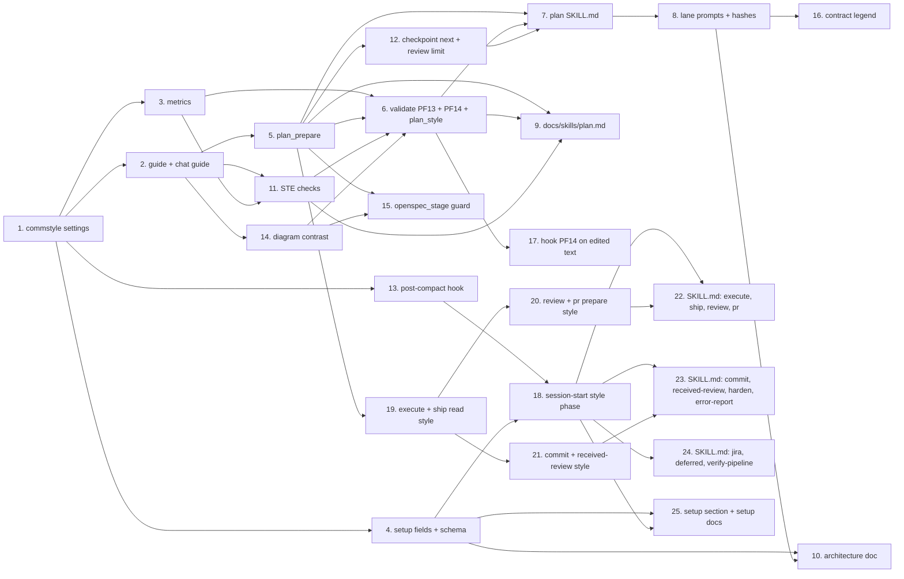

# Tasks

## 1. commstyle package

- [ ] 1.1 Add settings from `[style]` + `[planStyle]` (shared and plan-only keys, legacy warnings), value lists (5 audiences, default functional), technicalTerms, limits and InstructionsText in internal/commstyle/style.go (plan Task 1) — verify: go test ./internal/commstyle/ -run 'TestFromSections|TestLimitsFor' <!-- ref:1-1-add-settings-from-style-planstyle-sh-1ecc9f -->
- [ ] 1.2 Add Go-string rule packs (full 20-rule STE pack, steAvoidWords, exact Mermaid classDefs), the 9-tag plan guide and the 5-tag chat guide in internal/commstyle/packs.go and internal/commstyle/guide.go (plan Task 2) — verify: go test ./internal/commstyle/ -run TestGuide <!-- ref:1-2-add-go-string-rule-packs-full-20-rul-fd0ad4 -->
- [ ] 1.3 Add plan metrics and proseLine in internal/commstyle/metrics.go (plan Task 3) — verify: go test ./internal/commstyle/ -run TestMeasure <!-- ref:1-3-add-plan-metrics-and-proseline-in-in-4633b3 -->
- [ ] 1.4 Add strict STE checks in internal/commstyle/ste.go and call them from Measure (plan Task 11) — verify: go test ./internal/commstyle/ -run 'TestSte|TestMeasure' <!-- ref:1-4-add-strict-ste-checks-in-internal-co-2e27f9 -->
- [ ] 1.5 Add the WCAG diagram contrast checks (fenced and line mode) in internal/commstyle/diagram.go (plan Task 14) — verify: go test ./internal/commstyle/ -run 'TestMermaidContrast|TestGuide' <!-- ref:1-5-add-the-wcag-diagram-contrast-checks-b7fa3d -->

## 2. Config surfaces

- [ ] 2.1 Add styleFields, update planStyleFields from commstyle value lists, add the `style` schema property, the `LocalSections` entry and the `[style]` / `[planStyle]` blocks in plugins/sdlc/templates/local.toml, update the schema hash pin, add the schema and template enum tests (plan Task 4) — verify: go test ./internal/setupmeta/ ./internal/config/ && go test ./internal/tools/ -run 'TestPlanStyle|TestPayloads_SchemaChecksums' <!-- ref:2-1-add-stylefields-update-planstylefiel-45d1b7 -->
- [ ] 2.2 Register the communication-style setup section and update setup SKILL.md and docs/skills/setup.md (plan Task 25) — verify: go test ./internal/setupmeta/ ./internal/prtemplate/ ./internal/skillcheck/... <!-- ref:2-2-register-the-communication-style-set-e79695 -->

## 3. MCP tools and hooks

- [ ] 3.1 Return the new style fields, write style-guide.md, add G22 to lanes[3] in internal/tools/plan.go (plan Task 5) — verify: go test ./internal/tools/ -run 'TestPlanPrepare|TestPlanStyle|TestPlanMergeResults|TestPlanMark_Checkpoint' <!-- ref:3-1-return-the-new-style-fields-write-st-9d0608 -->
- [ ] 3.2 Add PF13 and PF14 to plan_format, DiagramContrastFindings, and the plan_style action with styleReport in internal/tools/validators.go (plan Task 6) — verify: go test ./internal/tools/ -run 'TestValidatePlanFormat|TestValidatePlanStyle|TestPlanFormatFixesAreSelfContained' <!-- ref:3-2-add-pf13-and-pf14-to-plan-format-dia-960c70 -->
- [ ] 3.3 Return reviewLoop.maxRounds = 5 from plan_prepare; checkpoint next prints the custom instructions text and the last-round notice (plan Task 12) — verify: go test ./internal/tools/ -run 'TestPlanMark_Checkpoint|TestPlanPrepare' <!-- ref:3-3-return-reviewloop-maxrounds-5-from-p-4fc0bf -->
- [ ] 3.4 Print custom plan instructions in the post-compact lines of internal/hooks/session_start.go (plan Task 13) — verify: go test ./internal/hooks/ -run TestPipelineResumePhase_PlanPostCompact <!-- ref:3-4-print-custom-plan-instructions-in-th-12738d -->
- [ ] 3.5 Reject hard-to-read Mermaid colors in openspec_stage and name the exact classDefs in openspec/config.yaml (plan Task 15) — verify: go test ./internal/tools/ -run TestPlanSupportOpenspecStage <!-- ref:3-5-reject-hard-to-read-mermaid-colors-i-580632 -->
- [ ] 3.6 Run PF14 on the edited text in the PostToolUse plan hook (plan Task 17) — verify: go test ./internal/hooks/ -run TestPostToolValidate_Plan <!-- ref:3-6-run-pf14-on-the-edited-text-in-the-p-371b57 -->
- [ ] 3.7 Print the communication style block on every session-start source (plan Task 18) — verify: go test ./internal/hooks/ -run 'TestSessionStart|TestCommunicationStylePhase' <!-- ref:3-7-print-the-communication-style-block-45bdea -->
- [ ] 3.8 Add ChatStyle and return style from execute_state and ship_state read (plan Task 19) — verify: go test ./internal/tools/ -run 'TestChatStyle|TestExecState_Read|TestShipState_Read' <!-- ref:3-8-add-chatstyle-and-return-style-from-51a6f2 -->
- [ ] 3.9 Return style from review_prepare and pr_prepare (plan Task 20) — verify: go test ./internal/tools/ -run 'TestReviewPrepare|TestPrPrepare' <!-- ref:3-9-return-style-from-review-prepare-and-1adcb4 -->
- [ ] 3.10 Return style from commit_prepare (not in its manifest) and received_review_prepare (plan Task 21) — verify: go test ./internal/tools/ -run 'TestCommitPrepare|TestReceivedReview' <!-- ref:3-10-return-style-from-commit-prepare-no-2cdc59 -->

## 4. Skills and prompts

- [ ] 4.1 Apply the guide, G22, the harden-gate scope, the style report, the diagram colors rule and the review limit from reviewLoop.maxRounds in plugins/sdlc/skills/plan/SKILL.md; replace R62 in plan-format-reference.md; set the limit 5 in plan-reviewer-prompt.md; update both pinned hashes (plan Task 7) — verify: go test ./internal/skillcheck/... <!-- ref:4-1-apply-the-guide-g22-the-harden-gate-a891ef -->
- [ ] 4.2 Add G22 (incl. LLM-judged STE rules and custom instructions) to the lane prompts and update their pinned hashes (plan Task 8) — verify: go test ./internal/skillcheck/... && go test ./internal/tools/ -run TestPlanMergeResults <!-- ref:4-2-add-g22-incl-llm-judged-ste-rules-an-f8f174 -->
- [ ] 4.3 Replace the Contract Examples section with the Contract legend (plan Task 16) — verify: go test ./internal/skillcheck/... <!-- ref:4-3-replace-the-contract-examples-sectio-868eb7 -->
- [ ] 4.4 Add the communication style line to execute, ship, review, pr SKILL.md (plan Task 22) — verify: grep -c "Communication style" in each file = 1 <!-- ref:4-4-add-the-communication-style-line-to-139918 -->
- [ ] 4.5 Add the communication style line to commit, received-review, harden, error-report SKILL.md (plan Task 23) — verify: grep -c "Communication style" in each file = 1 <!-- ref:4-5-add-the-communication-style-line-to-67dd89 -->
- [ ] 4.6 Add the communication style line to jira, deferred, verify-pipeline SKILL.md (plan Task 24) — verify: grep -c "Communication style" in each file = 1 <!-- ref:4-6-add-the-communication-style-line-to-8c9f42 -->

## 5. Docs

- [ ] 5.1 Add the plan writing style section with examples (5 audiences, STE rules, Mermaid colors, plugin-wide note) in docs/skills/plan.md (plan Task 9) — verify: grep -c writingStandard docs/skills/plan.md <!-- ref:5-1-add-the-plan-writing-style-section-w-f759e2 -->
- [ ] 5.2 Fix style rows, gate and PF tables (PF13, PF14), and the review limit in docs/plan-architecture.md (plan Task 10) — verify: grep -n "planStyle.verbosity\|NARRATIVE_RULES\|G1-G21\|Max 3" docs/plan-architecture.md returns no hit <!-- ref:5-2-fix-style-rows-gate-and-pf-tables-pf-2c0bbb -->
