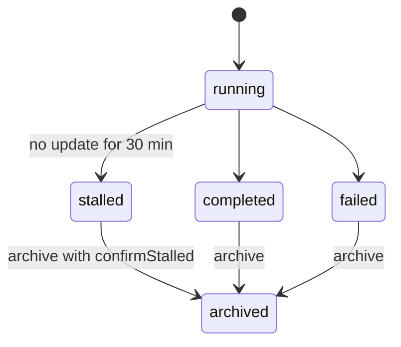

# Spec Delta

## MODIFIED Requirements

### Requirement: Endpoints
The server SHALL serve these endpoints and no others.

| Method | Path | Success |
|---|---|---|
| GET | `/` | 200, the page with the token of this server start in `<meta name="sdlc-token">` |
| GET | `/static/*` | 200, an embedded page file |
| GET | `/api/snapshot` | 200, the snapshot JSON |
| GET | `/api/events` | 200, a `text/event-stream` of snapshots |
| GET | `/api/health` | 200, `{"pid":<n>,"version":"<v>","startedAt":"<RFC3339>"}` |
| GET | `/api/learning` | 200, `{"found":<bool>,"body":"<redacted text>","truncated":<bool>}` |
| POST | `/api/stop` | 202, `{"stopping":true}` |
| POST | `/api/run-archive` | 200, `{"runId","dir","moved","deleted"}` |
| POST | `/api/cache-clear` | 200, `{"freedBytes","classes","skipped"}` |

#### Scenario: Health answer
- **WHEN** a GET request reaches `/api/health`
- **THEN** the body has the server `pid`, `version`, and `startedAt`
- **AND** the body does not hold the token

### Requirement: Plan station on a ship run
A ship run whose state has `planExploreSummary` SHALL get a first step `plan` with status `completed` that lists the stored explorers, and the stored `planReviewRounds` with `maxRounds` when that key is not empty. A ship run without `planExploreSummary` SHALL get no `plan` step.

#### Scenario: Stored summary
- **WHEN** a ship state has `planExploreSummary` with explorer `auth-flow`
- **THEN** the first ship step is `plan` and lists explorer `auth-flow`
- **AND** the progress total goes up by 1

#### Scenario: Stored review rounds
- **WHEN** a ship state also has `planReviewRounds` with 2 rounds
- **THEN** the `plan` step lists the 2 rounds and `maxRounds`

## ADDED Requirements

### Requirement: Guarded change requests
Every POST route SHALL check the `Origin` and the `X-Sdlc-Token` header before it reads the body, and SHALL answer every error with JSON `{"error":{"code","message","suggestion"}}`.

#### Scenario: Archive from another website
- **WHEN** a `POST /api/run-archive` has `Origin: https://evil.example`
- **THEN** the response status is 403 with code `FORBIDDEN_ORIGIN`
- **AND** no file changes

#### Scenario: Wrong token
- **WHEN** a `POST /api/cache-clear` has a loopback `Origin` and a wrong `X-Sdlc-Token`
- **THEN** the response status is 403 with code `FORBIDDEN_TOKEN`

#### Scenario: Body is not JSON
- **WHEN** a `POST /api/run-archive` has `Content-Type: text/plain`
- **THEN** the response status is 415 with code `BAD_CONTENT_TYPE`

#### Scenario: Body too large
- **WHEN** a `POST /api/run-archive` body is over 8 KiB
- **THEN** the response status is 413 with code `BODY_TOO_LARGE`

#### Scenario: Unknown repo
- **WHEN** `repo` is not a registered display root
- **THEN** the response status is 404 with code `REPO_NOT_FOUND`

### Requirement: Run archive
The server SHALL move a finished or stalled run, with its nested runs, reports and ledgers, into `<repo>/.sdlc-v2/run-archive/<runId>/`, SHALL delete its working dirs, and SHALL refuse a running run.

#### Scenario: Archive a finished ship run
- **WHEN** the page archives a `completed` ship run with a nested execute run
- **THEN** both state files, the ledger and the reports are under `run-archive/<runId>/`
- **AND** the next snapshot does not list the run

#### Scenario: Running run
- **WHEN** the row status is `running`
- **THEN** the response status is 409 with code `RUN_ACTIVE`

#### Scenario: Stalled run without confirm
- **WHEN** the row status is `stalled` and `confirmStalled` is `false`
- **THEN** the response status is 409 with code `CONFIRM_STALLED`

#### Scenario: Bad run id
- **WHEN** `runId` is `../x`
- **THEN** the response status is 400 with code `BAD_RUN_ID`
- **AND** no file changes

### Requirement: Cache clear
The server SHALL delete rotated evidence files older than 30 minutes, `sdlc-*` temp dirs older than 24 hours except `sdlc-explore-*`, and reports that no ship or execute state owns, and SHALL truncate the server log.

- History, learnings, timings, live runs, archived runs and live evidence stay.
- A delete error adds one `skipped` row with the reason, and the clear continues.

#### Scenario: Recent rotated evidence
- **WHEN** a `.jsonl.1` evidence file changed 5 minutes ago
- **THEN** the file stays and `skipped` has the reason `changed less than 30 minutes ago`

### Requirement: Learning body on open
The `GET /api/learning` route SHALL return the redacted body of the learning entry with the given date and heading, cut at 8000 characters, and SHALL need no token.

#### Scenario: No match
- **WHEN** no entry has the date and heading
- **THEN** the response is 200 with `found: false`

### Requirement: Same step detail in ship and standalone runs
A ship review step SHALL list the findings of each dimension with text, severity, file and line, the same rows as a standalone review step.

#### Scenario: Ship review findings
- **WHEN** a ship run has a joined review with 2 findings in dimension `security-review`
- **THEN** the ship review step lists the 2 finding rows under `security-review`

### Requirement: Deferred item metadata
Each open deferred item SHALL carry `created`, `source`, `severity`, `file`, `line` and `reason`, with `""` or `0` for an absent value.

#### Scenario: Absent file
- **WHEN** a deferred item has no file
- **THEN** `file` is `""`

### Requirement: Session command groups
Each session SHALL carry `commandGroups` over all commands of the session, with `label`, `count`, `share` and one `majority` group.

| Programs in the command | Label |
|---|---|
| 1 or 2 | the first program |
| 3 or more | `a + b + c` |
| none | `(other)` |

#### Scenario: Pipe of three programs
- **WHEN** a session runs `cat a | grep x | wc -l`
- **THEN** `commandGroups` has a group with label `cat + grep + wc`

### Requirement: Detail viewer
The page SHALL open a right-side modal panel with the full text and metadata of a deferred item, issue, learning or finding, and SHALL return focus to the same row when the panel closes.

#### Scenario: Open a learning
- **WHEN** the user clicks a learning row
- **THEN** the panel shows the heading and fills the body from `GET /api/learning`

#### Scenario: Item gone
- **WHEN** the next snapshot no longer has the open item
- **THEN** the panel shows `no longer open`

### Requirement: Uniform station width
Every pipeline station SHALL use the same fixed width, and every execute step SHALL use the wide layout for 0, 1 or more waves.

#### Scenario: One-wave execute
- **WHEN** an execute step has 1 wave
- **THEN** the step uses the wide layout
