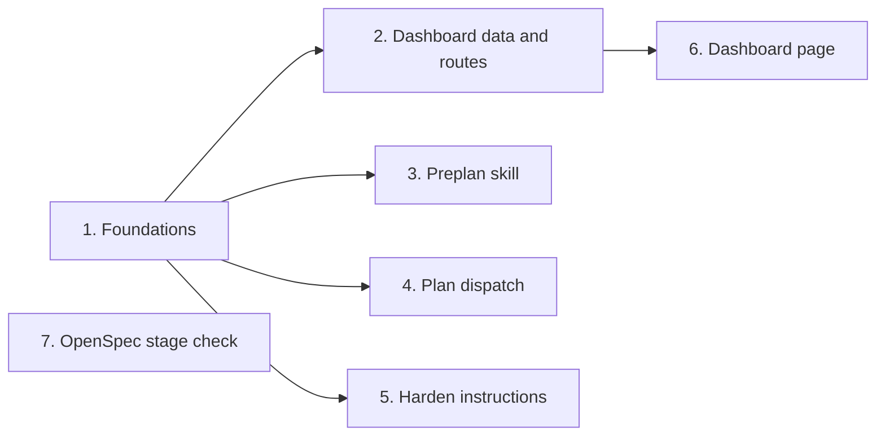

# Tasks

Group dependencies (groups with no path between them can run in parallel):

## 1. Foundations

- [ ] 1.1 Add `PreplanSubdir` and `RunArchiveSubdir` to linked state entries in internal/paths/paths.go — verify: go test ./internal/paths/ ./internal/worktree/ ./internal/hooks/ ./internal/tools/ -run 'StateEntry|StateLink' <!-- ref:1-1-add-preplansubdir-and-runarchivesubd-fe6b2a -->
- [ ] 1.2 Add the `preplan_context` action in internal/tools/plan_support.go — verify: go test ./internal/tools/ -run 'PlanSupport|UnknownAction|Annotation' <!-- ref:1-2-add-the-preplan-context-action-in-in-becc34 -->
- [ ] 1.3 Extract `guardMutation`, `writeAPIError` and `ResolveDisplayRoot` in internal/dashboard/web/server.go and internal/tools/dashboard_roots.go — verify: go test ./internal/dashboard/web/ ./internal/tools/ -run 'Handler|Stop|DisplayRoot' <!-- ref:1-3-extract-guardmutation-writeapierror-941025 -->
- [ ] 1.4 Add the per-run artifact resolver and `bareRunName` in internal/tools/run_artifacts.go — verify: go test ./internal/tools/ <!-- ref:1-4-add-the-per-run-artifact-resolver-an-1deea5 -->
- [ ] 1.5 Add the `[harden]` section to config, schema and template in internal/config/config.go — verify: go test ./... <!-- ref:1-5-add-the-harden-section-to-config-sch-a08b33 -->
- [ ] 1.6 Reject a guardrail severity downgrade in internal/tools/validators.go — verify: go test ./internal/tools/ -run 'Guardrail|ValidateTool' <!-- ref:1-6-reject-a-guardrail-severity-downgrad-d5c508 -->
- [ ] 1.7 Split the guardrail lane and add `style-compliance` in internal/tools/plan.go — verify: go test ./internal/tools/ ./internal/skillcheck/ -run 'PlanPrepare|PlanSkills' <!-- ref:1-7-split-the-guardrail-lane-and-add-sty-074539 -->

## 2. Dashboard data and routes

- [ ] 2.1 Add `FindingItems` to ship review dimensions in internal/tools/dashboard_join.go — verify: go test ./internal/tools/ -run 'Dashboard' <!-- ref:2-1-add-findingitems-to-ship-review-dime-bf3a5c -->
- [ ] 2.2 Copy `planReviewRounds` and show rounds in the ship plan step in internal/tools/ship_state.go — verify: go test ./internal/tools/ -run 'Dashboard|CleanupPipeline|ShipStateSchema' <!-- ref:2-2-copy-planreviewrounds-and-show-round-581659 -->
- [ ] 2.3 Add deferred item metadata in internal/tools/dashboard_activity.go — verify: go test ./internal/tools/ -run 'Dashboard' <!-- ref:2-3-add-deferred-item-metadata-in-intern-07ce9e -->
- [ ] 2.4 Add session command groups in internal/tools/dashboard_command_groups.go — verify: go test ./internal/tools/ -run 'Dashboard|CommandGroup|CommandPrograms|GroupSessionCommands' <!-- ref:2-4-add-session-command-groups-in-intern-7624e4 -->
- [ ] 2.5 Add the learning body loader in internal/tools/dashboard_activity.go — verify: go test ./internal/tools/ -run 'Learning' <!-- ref:2-5-add-the-learning-body-loader-in-inte-64d187 -->
- [ ] 2.6 Add `ArchiveRun` in internal/tools/dashboard_archive.go — verify: go test ./internal/tools/ -run 'Archive' <!-- ref:2-6-add-archiverun-in-internal-tools-das-5861fa -->
- [ ] 2.7 Add `ClearCache` in internal/tools/dashboard_clear.go — verify: go test ./internal/tools/ -run 'ClearCache' <!-- ref:2-7-add-clearcache-in-internal-tools-das-ea52b6 -->
- [ ] 2.8 Add the archive, clear and learning routes in internal/dashboard/web/server.go — verify: go test ./internal/dashboard/... ./cmd/... && go test -tags integration ./tests/integration/... <!-- ref:2-8-add-the-archive-clear-and-learning-r-0e5824 -->

## 3. Preplan skill

- [ ] 3.1 Write the preplan skill in plugins/sdlc/skills/preplan/SKILL.md — verify: go test ./internal/skillcheck/... <!-- ref:3-1-write-the-preplan-skill-in-plugins-s-eccfc6 -->
- [ ] 3.2 Write the preplan user docs in docs/skills/preplan.md — verify: the README and getting-started rows link to the page <!-- ref:3-2-write-the-preplan-user-docs-in-docs-851d21 -->
- [ ] 3.3 Add the preplan parity test in internal/skillcheck/skillcheck_preplan_test.go — verify: go test ./internal/skillcheck/... ./internal/setupmeta/... <!-- ref:3-3-add-the-preplan-parity-test-in-inter-40cdeb -->

## 4. Plan dispatch

- [ ] 4.1 Change Step 2 and Step 3 dispatch rules in plugins/sdlc/skills/plan/SKILL.md — verify: go test ./internal/skillcheck/... <!-- ref:4-1-change-step-2-and-step-3-dispatch-ru-e907ef -->
- [ ] 4.2 Update the lane count and lane names in docs/plan-architecture.md — verify: grep -rniE "(five|5)[- ]lanes?" docs plugins/sdlc/skills returns nothing <!-- ref:4-2-update-the-lane-count-and-lane-names-35e35a -->

## 5. Harden instructions

- [ ] 5.1 Add the harden instructions loader in internal/tools/harden_instructions.go — verify: go test ./internal/tools/ ./internal/hardensurfaces/ -run 'HardenInstructions|ProposalIDs' <!-- ref:5-1-add-the-harden-instructions-loader-i-3028b5 -->
- [ ] 5.2 Add `customInstructions` and `next` to the harden manifest and output in internal/tools/prepare_orchestrator.go — verify: go test ./... <!-- ref:5-2-add-custominstructions-and-next-to-t-79a760 -->
- [ ] 5.3 Print and apply the instructions in plugins/sdlc/skills/harden/SKILL.md — verify: go test ./internal/skillcheck/... <!-- ref:5-3-print-and-apply-the-instructions-in-4d989f -->
- [ ] 5.4 Document custom instructions in docs/skills/harden.md — verify: grep -rn "harden.instructions" docs finds both files <!-- ref:5-4-document-custom-instructions-in-docs-a8a49c -->

## 6. Dashboard page

- [ ] 6.1 Add request builders and detail lookup in internal/dashboard/web/static/view.js — verify: node --test internal/dashboard/web/testdata/view.test.cjs <!-- ref:6-1-add-request-builders-and-detail-look-30afe3 -->
- [ ] 6.2 Add finding rows, group table and viewer body in internal/dashboard/web/static/render.js — verify: go test ./internal/tools/ -run DashboardFixture && node --test internal/dashboard/web/testdata/view.test.cjs <!-- ref:6-2-add-finding-rows-group-table-and-vie-7715b4 -->
- [ ] 6.3 Add the viewer and confirm markup in internal/dashboard/web/static/index.html — verify: go test ./internal/dashboard/web/ <!-- ref:6-3-add-the-viewer-and-confirm-markup-in-541e6e -->
- [ ] 6.4 Wire the detail viewer, archive and clear in internal/dashboard/web/static/app.js — verify: go test ./internal/dashboard/web/ && node --test internal/dashboard/web/testdata/view.test.cjs <!-- ref:6-4-wire-the-detail-viewer-archive-and-c-bed3d7 -->
- [ ] 6.5 Document routes, archive, clear and viewer in docs/dashboard.md — verify: grep -c "planReviewRounds" docs/dashboard.md is 1 or more <!-- ref:6-5-document-routes-archive-clear-and-vi-ae3a1d -->

## 7. OpenSpec stage check

- [ ] 7.1 Copy the current target specs into the stage check temp dir in internal/openspec/stage.go — verify: go test ./internal/openspec/ ./internal/tools/ -run 'Stage|OpenspecStage|PlanSupport' <!-- ref:7-1-copy-the-current-target-specs-into-t-b77899 -->

## Workflow follow-up

- Archive the change after review with `/sdlc:ship`.
