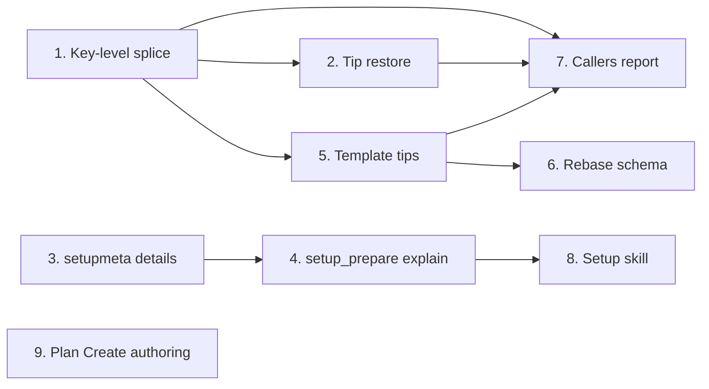

# Tasks

Group dependencies:

## 1. Key-level splice for config section writes

- [ ] 1.1 Replace the whole-section splice with key-level edits and the commented-header insert in internal/config/splice.go — verify: go test ./internal/config/ <!-- ref:1-1-replace-the-whole-section-splice-wit-e3de7d -->
- [ ] 1.2 Refuse the full rewrite with ErrWouldDropComments when the file has a comment line in internal/config/config.go — verify: go test ./internal/config/ <!-- ref:1-2-refuse-the-full-rewrite-with-errwoul-44c4e9 -->
- [ ] 1.3 Add one test case per splice rule and update the fixtures that now keep comments in internal/config/splice_test.go — verify: go test ./internal/config/ <!-- ref:1-3-add-one-test-case-per-splice-rule-an-9d9851 -->
- [ ] 1.4 Update the kept-comment fixtures in internal/tools/setup_write_test.go and internal/tools/migrate_test.go — verify: go test ./internal/tools/ <!-- ref:1-4-update-the-kept-comment-fixtures-in-bb27ba -->

## 2. Restore template tips on each config write

- [ ] 2.1 Add RestoreTips and the restoreTips seam in internal/config/tips.go — verify: go test ./internal/config/ -run TestRestoreTips <!-- ref:2-1-add-restoretips-and-the-restoretips-65edae -->
- [ ] 2.2 Call the restore for config.toml and local.toml in writeSectionFile in internal/config/config.go — verify: go test ./internal/config/ ./internal/tools/ <!-- ref:2-2-call-the-restore-for-config-toml-and-bdbefa -->
- [ ] 2.3 Add restore and failure-path tests in internal/config/tips_test.go — verify: go test ./internal/config/ <!-- ref:2-3-add-restore-and-failure-path-tests-i-738926 -->

## 3. Option details and examples in setupmeta

- [ ] 3.1 Add Details and Examples to Field and write text for all fields in internal/setupmeta/sections.go — verify: go test ./internal/setupmeta/ <!-- ref:3-1-add-details-and-examples-to-field-an-447cab -->
- [ ] 3.2 Add TestFields_HaveDetailsAndExamples in internal/setupmeta/sections_test.go — verify: go test ./internal/setupmeta/ <!-- ref:3-2-add-testfields-havedetailsandexample-08ac7d -->

## 4. explain input and examples in setup_prepare

- [ ] 4.1 Add the explain input, examples, explanation, next and the tool description in internal/tools/setup.go — verify: go test ./internal/tools/ -run TestSetupPrepare <!-- ref:4-1-add-the-explain-input-examples-expla-d15613 -->
- [ ] 4.2 Add one test per explain error row and the camelCase check in internal/tools/setup_test.go — verify: go test ./... <!-- ref:4-2-add-one-test-per-explain-error-row-a-df579c -->

## 5. Tip comments for each option in the templates

- [ ] 5.1 Add tips and commented examples in plugins/sdlc/templates/config.toml — verify: go test ./internal/tools/ -run TestTemplate <!-- ref:5-1-add-tips-and-commented-examples-in-p-5bd67e -->
- [ ] 5.2 Add tips and commented examples in plugins/sdlc/templates/local.toml — verify: go test ./internal/tools/ -run TestTemplate <!-- ref:5-2-add-tips-and-commented-examples-in-p-302325 -->
- [ ] 5.3 Add TestTemplate_EveryLeafOptionHasTip and TestTemplate_TipExamplesMatchSchema in internal/tools/template_tips_test.go — verify: task check <!-- ref:5-3-add-testtemplate-everyleafoptionhast-91b249 -->

## 6. Align the rebase schema and add an enum sync test

- [ ] 6.1 Widen ship.rebase to five values in plugins/sdlc/schemas/sdlc-local.schema.json — verify: task check <!-- ref:6-1-widen-ship-rebase-to-five-values-in-f091c9 -->
- [ ] 6.2 Change the rebase tip to list five values in plugins/sdlc/templates/local.toml — verify: go test ./internal/tools/ -run TestTemplate <!-- ref:6-2-change-the-rebase-tip-to-list-five-v-74077d -->
- [ ] 6.3 Add TestFieldOptions_AcceptedBySchema in internal/setupmeta/schema_sync_test.go — verify: go test ./internal/setupmeta/ -run TestFieldOptions <!-- ref:6-3-add-testfieldoptions-acceptedbyschem-c66baf -->

## 7. Callers report comment-safe writes

- [ ] 7.1 Add the next field, the new warning text and the description sentence in internal/tools/setup_write.go — verify: go test ./internal/tools/ -run TestSetupWriteSections <!-- ref:7-1-add-the-next-field-the-new-warning-t-4ee95d -->
- [ ] 7.2 Return a DomainError for ErrWouldDropComments and add the description sentence in internal/tools/migrate.go — verify: go test ./internal/tools/ -run TestMigrate <!-- ref:7-2-return-a-domainerror-for-errwoulddro-8094a8 -->
- [ ] 7.3 Add the ship-tip and restore tests in internal/tools/setup_write_test.go — verify: go test ./internal/tools/ -run TestSetupWriteSections <!-- ref:7-3-add-the-ship-tip-and-restore-tests-i-2e6a11 -->
- [ ] 7.4 Add the commented-destination import test in internal/tools/migrate_test.go — verify: go test ./... <!-- ref:7-4-add-the-commented-destination-import-667f62 -->

## 8. Setup skill shows examples and explains options

- [ ] 8.1 Add the Examples line and the Step 3.G explain rule in plugins/sdlc/skills/setup/SKILL.md — verify: go test ./internal/skillcheck/... <!-- ref:8-1-add-the-examples-line-and-the-step-3-088ab0 -->
- [ ] 8.2 Move the setup SKILL.md line keys in internal/skillcheck/skillcheck_worktree_test.go — verify: go test ./internal/skillcheck/... <!-- ref:8-2-move-the-setup-skill-md-line-keys-in-2f32f3 -->
- [ ] 8.3 Document the explain call and the examples display in docs/skills/setup.md — verify: grep -n "explain" docs/skills/setup.md <!-- ref:8-3-document-the-explain-call-and-the-ex-2f6bdb -->

## 9. Plan skill authors OpenSpec files after review

- [ ] 9.1 Apply sites S1 to S11 in plugins/sdlc/skills/plan/SKILL.md — verify: go test ./internal/skillcheck/... <!-- ref:9-1-apply-sites-s1-to-s11-in-plugins-sdl-6e1e40 -->
- [ ] 9.2 Update the Gate A bullet in docs/skills/plan.md — verify: grep -rn "Create-flow re-stage" plugins/sdlc docs <!-- ref:9-2-update-the-gate-a-bullet-in-docs-ski-69b292 -->
- [ ] 9.3 Update the OpenSpec staging intro and the Create guardrails row in docs/plan-architecture.md — verify: grep -rn "Step 0 step b" plugins/sdlc docs <!-- ref:9-3-update-the-openspec-staging-intro-an-1c826d -->
