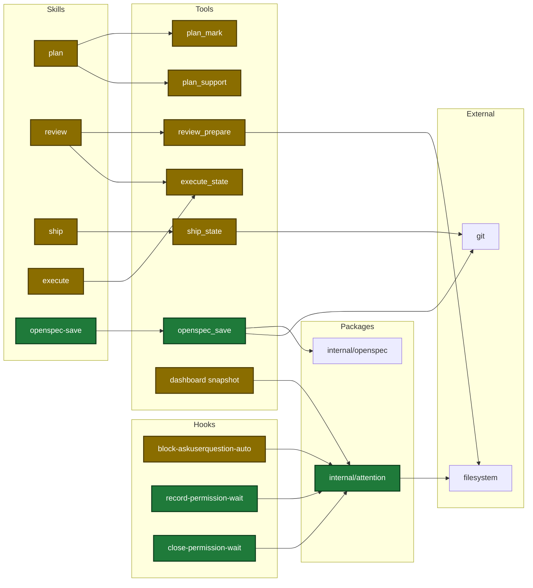
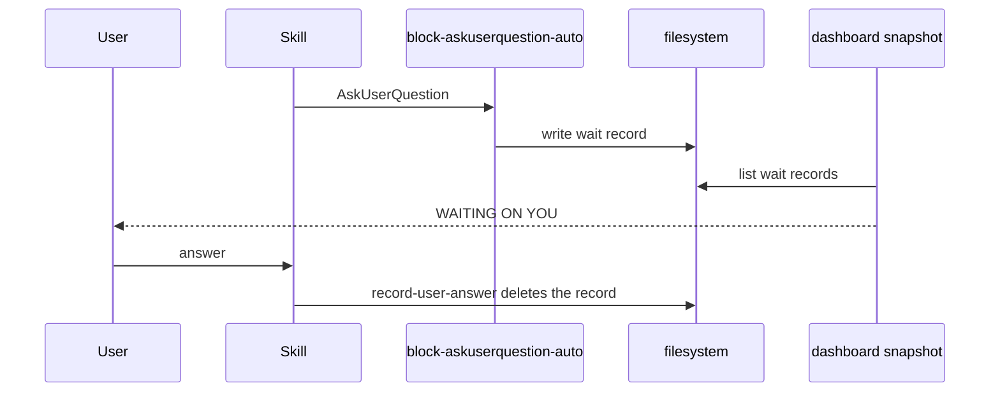
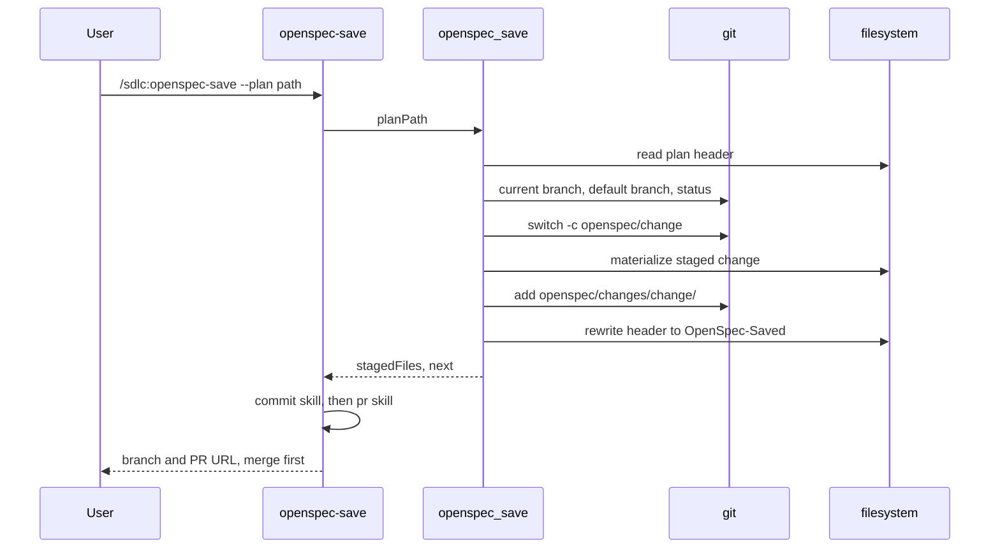
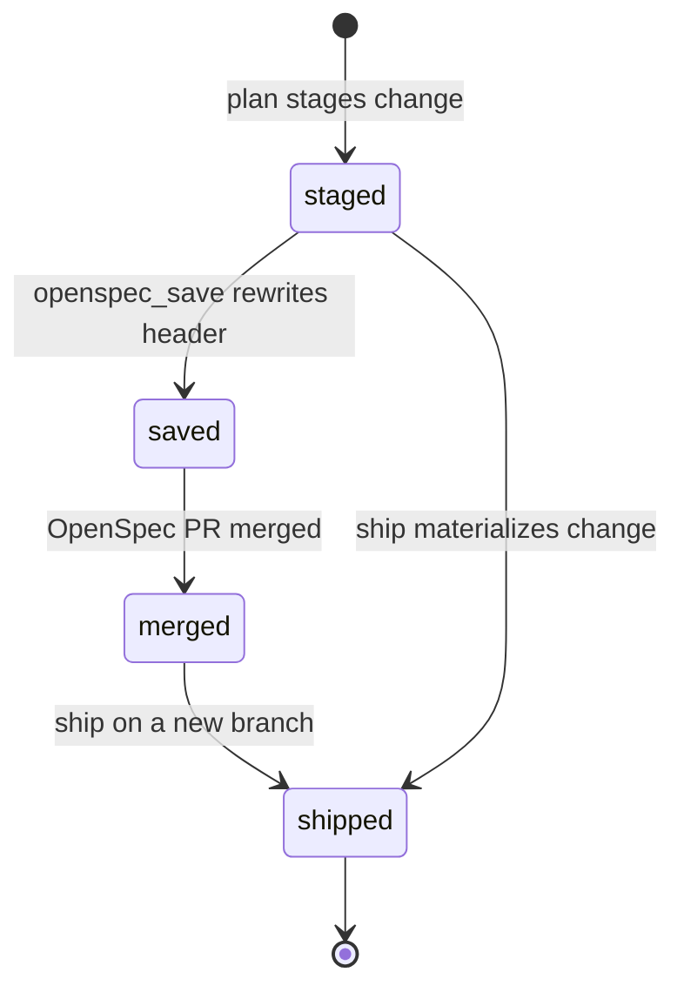
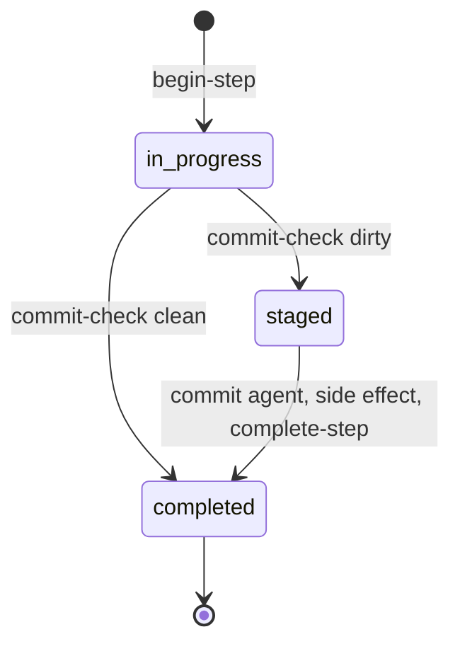

# Design

## Context

- See proposal.md (Why). The dashboard snapshot reads only what a run did, not what it planned or waits for.
- Hooks run on every tool call. A slow or failing hook slows or blocks the session.
- `render.js` must not use `document` or `window` (page test). The page test bans the word `note` in `render.js`.
- `plan_support` is read-only. No tool creates a branch.

## Goals / Non-Goals

**Goals:**
- Add the missing data at its source, with one reader for each data shape.
- Keep old state files valid: every new key is optional.

**Non-Goals:**
- Fix hook `timeout` units of old entries.
- Stacked PRs or a ship `--base` flag.
- A `test:web` Taskfile task.

## Decisions

| ID | Choice | Rejected | Why |
|---|---|---|---|
| KD3 | One package `internal/attention` owns the wait record | Hooks and snapshot each parse the file | one source of truth |
| KD4 | `Notification` hook with matcher `permission_prompt` | `PermissionRequest` hook | user design; the matcher filters the type |
| KD5 | Page computes elapsed time from `askedAt` | Elapsed field in the snapshot | the server pushes only on a hash change |
| KD6 | Detail kind `result` only for a clean commit step | Kind `note` on every step | page word guard; every ship step has a result |
| KD7 | `ship_state` `commit-check` | `git status` in skill text | deterministic work belongs in Go |
| KD8 | Finding ID = `f-` + 8 hex of SHA-256 of the dedup key | Reviewers fill an ID | reuses the existing dedup key |
| KD11 | `review_prepare` writes `run.meta`. Dry run writes nothing | Write at first check-in | the page needs the plan before any worker starts |
| KD12 | `init` takes `plannedWavesJson` from the caller | Recompute waves from the plan | keeps critique edits such as a wave split |
| KD13 | New tool `openspec_save` | An action on an existing tool | existing tools are read-only or own run state |
| KD14 | Rewrite `**OpenSpec-Staging:**` to `**OpenSpec-Saved:**` | Keep the Staging line | ship and execute then find nothing to save |
| KD15 | `.track` drops the 1100 px cap, keeps the `auto-fit` wrap | One row with a sideways scroll | user chose wrap |
| KD16 | One reader for `run.meta` serves dashboard and ship report | Each consumer parses | one source of truth |
| KD20 | `openspec_save` runs on the default branch or `openspec/<change>` only | Any branch | a feature branch mixes spec and code |
| KD22 | OpenSpec PR runs the pr skill interactive | `pr --auto` | `pr --auto` stops without a release level |
| KD23 | `commit-check` compares HEAD with `commitBaseHead` | Trust a clean tree | a commit can land before an interruption |

Architecture of the touched parts:



Main runtime flow, a waiting question:



OpenSpec save flow:



Persisted state changes:



Commit step states with `commit-check`:



New input fields:

| Field | Type | Encoding | Example |
|---|---|---|---|
| `ReviewPrepareIn.dryRun` | bool | plain JSON bool | `true` |
| `ExecuteStateIn.plannedWavesJson` | string | JSON-encoded array | `'[{"number":1,"taskIds":["2"]}]'` |
| `ExecuteStateIn.reason` | string | plain text enum | `stalled` |
| `OpenspecSaveIn.planPath` | string | plain text absolute path | `/Users/me/.claude/plans/x.md` |

State key diff:

```diff
 # plan state
+guardrailCounts = {total, error, warning}
+reviewRounds[].findings = [{id, fixed}]
+reviewOutcome = {findings:[{id, text, choice, reason}]}
 # ship state
+commitBaseHead = "<sha>"
 # execute state
+plannedWaves = [{number, taskIds}]
 # run.meta
+waves, dimensions[{name, workerId, wave, stopReason}]
```

## Risks / Trade-offs

- [A hook adds time to every tool call] → the close hook is async and does one directory lookup with no record.
- [No hook fires when the user rejects a prompt] → the next prompt, session end, or a 24 h expiry closes the record.
- [A sub-agent permission prompt has another session ID] → no mark shows. The run can turn `stalled` as today.
- [A reworded summary gets a new finding ID] → distinct totals are an upper bound.
- [`openspec_save` switches branches] → it runs only when the user calls `/sdlc:openspec-save`, and every check runs before the switch.
- [The OpenSpec PR is not merged before ship] → the ship missing-on-disk message tells the user to merge it first.
