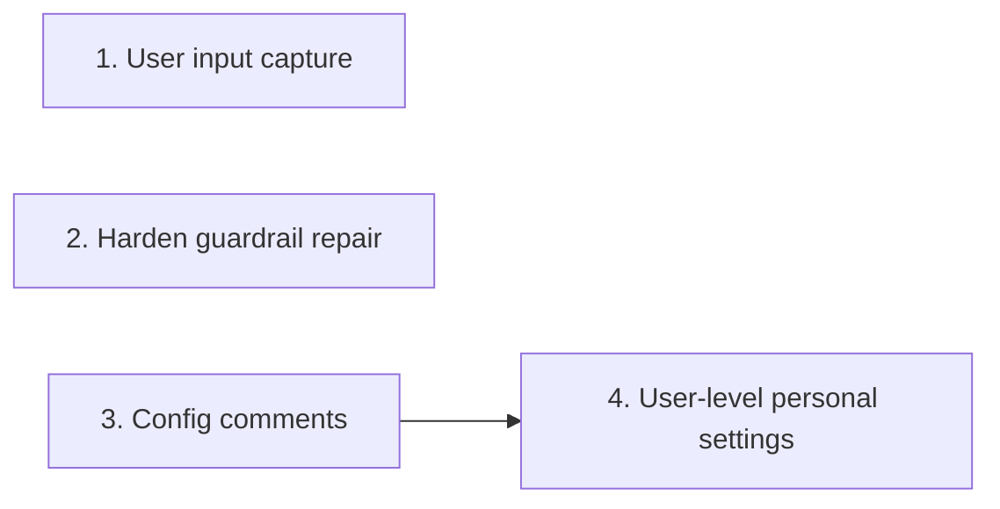

# Tasks

Group dependencies (groups 1, 2 and 3 can run in parallel):

## 1. User input capture

- [ ] 1.1 Add the prompt classifier and entry `kind` in internal/tools/user_input_evidence.go — verify: go test ./internal/tools/ -run 'TestCleanUserPrompt|TestAppendUserInput' <!-- ref:1-1-add-the-prompt-classifier-and-entry-384a76 -->
- [ ] 1.2 Drop injected turns and store clean text with kind prompt in internal/hooks/user_input_record.go — verify: go test ./internal/hooks/ -run TestRecordUserInput <!-- ref:1-2-drop-injected-turns-and-store-clean-46fa42 -->
- [ ] 1.3 Add the `record-user-answer` hook in internal/hooks/user_input_answer.go, internal/hooks/hooks.go and plugins/sdlc/hooks/hooks.json — verify: go test ./internal/hooks/ ./internal/skillcheck/... <!-- ref:1-3-add-the-record-user-answer-hook-in-i-c58e3a -->
- [ ] 1.4 Render the Kind column, flat full text and answer counts in internal/tools/ship_report.go, and update docs/skills/ship.md — verify: go test ./internal/tools/ -run 'TestShipReport' <!-- ref:1-4-render-the-kind-column-flat-full-tex-3cb47c -->

## 2. Harden guardrail repair

- [ ] 2.1 Add `candidatesJson`, `fix` hints and byte wording to the guardrails action in internal/tools/validators.go — verify: go test ./internal/tools/ -run 'TestValidateGuardrails' <!-- ref:2-1-add-candidatesjson-fix-hints-and-byt-b57308 -->
- [ ] 2.2 Add `guardrails[]` and the 1024-byte split rule to plugins/sdlc/agents/harden-orchestrator.md — verify: manual read of the proposal schema and Step 4 <!-- ref:2-2-add-guardrails-and-the-1024-byte-spl-25e68d -->
- [ ] 2.3 Change Step 5a to check, repair, write and then validate in plugins/sdlc/skills/harden/SKILL.md, and update docs/skills/harden.md — verify: go test ./internal/skillcheck/... <!-- ref:2-3-change-step-5a-to-check-repair-write-6bc75c -->

## 3. Config comments

- [ ] 3.1 Uncomment matching example lines and commented headers in place in internal/config/splice.go — verify: go test ./internal/config/ -run 'TestSplice' <!-- ref:3-1-uncomment-matching-example-lines-and-029d78 -->
- [ ] 3.2 Restore tips from commented examples in the whole file in internal/config/tips.go and internal/config/config.go — verify: go test ./internal/config/ ./internal/tools/ -run 'Tip|SetupWrite' <!-- ref:3-2-restore-tips-from-commented-examples-1f1e04 -->
- [ ] 3.3 Comment out every `[ship]` key with its built-in default in plugins/sdlc/templates/local.toml and internal/tools/template_tips_test.go — verify: go test ./internal/tools/ ./internal/config/ ./internal/setupmeta/ -run 'Template|Tip|SetupInit' <!-- ref:3-3-comment-out-every-ship-key-with-its-ebf203 -->

## 4. User-level personal settings

- [ ] 4.1 Add the user file path, the merged loader and `LocalFilesLabel` in internal/config/config.go and internal/config/main_test.go — verify: go test ./internal/config/... <!-- ref:4-1-add-the-user-file-path-the-merged-lo-d5ea3f -->
- [ ] 4.2 Add `TestMain` isolation in internal/tools, internal/hooks, internal/skillcheck and tests/integration/pipeline_smoke_test.go — verify: go test ./... && task test <!-- ref:4-2-add-testmain-isolation-in-internal-t-2cb6df -->
- [ ] 4.3 Add the `target` input to internal/tools/setup_write.go — verify: go test ./internal/tools/ -run 'SetupWrite' <!-- ref:4-3-add-the-target-input-to-internal-too-362914 -->
- [ ] 4.4 Return `localValues`, `userConfigPath` and `defaultTarget` from internal/tools/setup.go and internal/setupmeta/sections.go — verify: go test ./internal/tools/ ./internal/setupmeta/ -run 'SetupPrepare|Sections' <!-- ref:4-4-return-localvalues-userconfigpath-an-380e98 -->
- [ ] 4.5 Use `LocalFilesLabel` in the messages of internal/tools/review.go, internal/tools/pr.go and internal/tools/ship.go — verify: go test ./internal/tools/ -run 'Review|PR|Ship' <!-- ref:4-5-use-localfileslabel-in-the-messages-8c6d17 -->
- [ ] 4.6 Add the save-target question and `localValues` in plugins/sdlc/skills/setup/SKILL.md, re-key internal/skillcheck/skillcheck_worktree_test.go, and update docs/skills/setup.md — verify: go test ./internal/skillcheck/... <!-- ref:4-6-add-the-save-target-question-and-loc-095d5c -->
- [ ] 4.7 Document the user file in docs/getting-started.md, docs/plan-architecture.md, plugins/sdlc/skills/ship/config-format.md and README.md — verify: grep -rln "\.sdlc-v2/local\.toml" docs plugins/sdlc/skills README.md, each hit reviewed <!-- ref:4-7-document-the-user-file-in-docs-getti-5051e8 -->
- [ ] 4.8 Run the full check and a deployed smoke test — verify: task check, then task deploy, plugin reload, one ship run records a `kind: answer` entry <!-- ref:4-8-run-the-full-check-and-a-deployed-sm-759ebc -->
