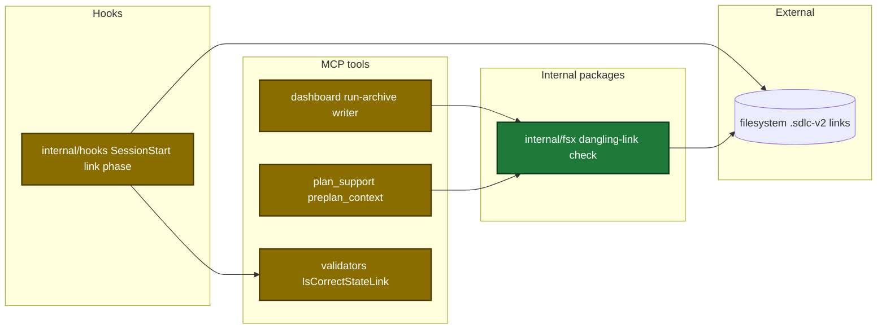
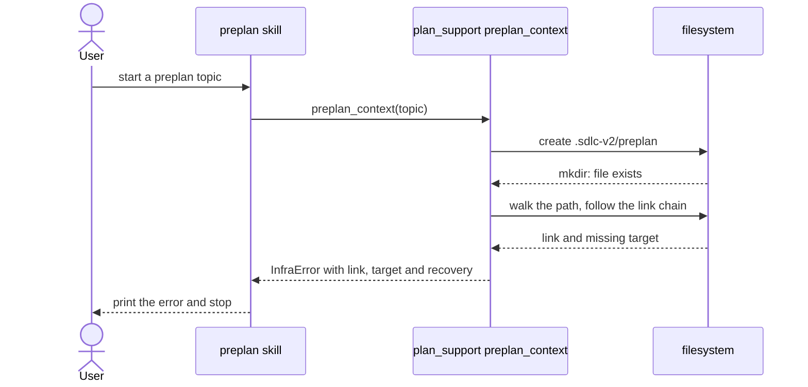
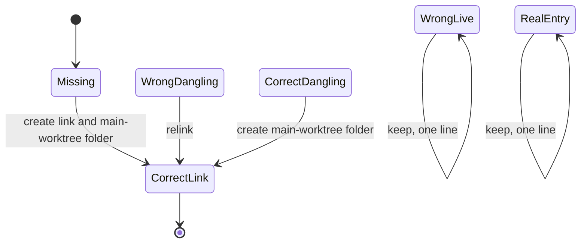

# Design

## Context

- See proposal.md - Why.
- The link phase runs in the SessionStart hook. It treats each existing link as correct and makes each new link dangling until the first write.
- Two writers fail on a dangling link: the dashboard archive writer and `preplan_context`. The dashboard dialog shows only the error message, not the suggestion.

Architecture of the touched parts:

Main runtime flow for a write through a dangling link:

States of one linked entry at session start:

## Goals / Non-Goals

**Goals:**

- One shared check that finds the dangling link on a failed write path.
- Repair at each session start, with one output line for each action or failure.

**Non-Goals:**

- Find which code wrote the reverse links.
- Change other folder writers behind linked entries.
- Show the archive suggestion in the dashboard dialog.

## Decisions

| Decision | Chosen | Rejected alternatives | Reason |
|---|---|---|---|
| Home of the check | `internal/fsx` | `internal/paths`, one check for each writer | `fsx` imports no other internal package. Both writers import it. |
| When the check runs | only after a write fails with `fs.ErrExist` | a check before each write | the normal path has no extra cost |
| Recovery text place | in the error message | a dashboard JS change to show the suggestion | the dialog shows only the message |
| Main-worktree test | `<active root>/.git` is a folder | a path compare only | git gives each linked worktree a `.git` file |
| Link compare | reuse `IsCorrectStateLink` | a new string compare | it treats `/var` and `/private/var` as the same path |
| Folder-link recovery | new session, or `mkdir -p <target>` | remove the link | a removed folder link makes the next write create a real folder in the linked worktree |
| Link chain | report the last link and its missing target (at most 40 links) | report the first link | the first link points to a link that exists, so `mkdir -p` fails |

## Risks / Trade-offs

| Risk | Impact | Mitigation |
|---|---|---|
| The main guard removes links at each session start | a user link could be removed | remove only dangling links whose target ends with `/.sdlc-v2/<entry>`, never a real file or folder |
| Remove then symlink is not atomic | a failed symlink leaves no entry | the next session repairs the missing entry |
| A dangling reverse link in the main worktree | a linked-worktree session cannot repair it | the hook prints a line that says to start a session in the main worktree |
| The `mkdir -p` recovery in the main worktree | creates a folder under the old worktree path | the new-session recovery comes first in the text |
