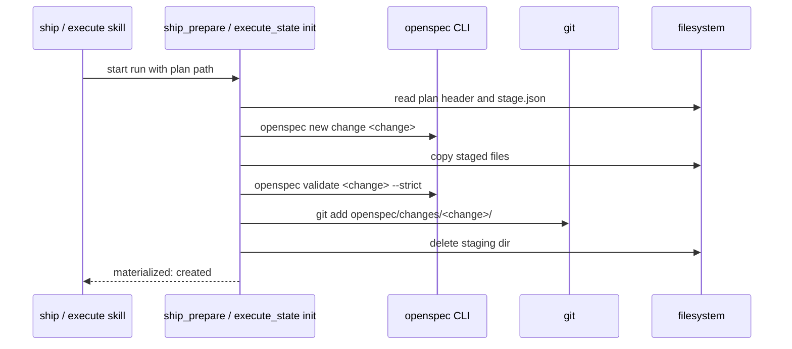

# openspec-staging Specification

## Purpose
Lets plan author OpenSpec artifacts while Claude Code plan mode forbids tracked-file writes, and moves them into `openspec/changes/<name>/` deterministically when execute or ship starts.

## Requirements

### Requirement: Staging location and layout
The system SHALL stage OpenSpec artifacts only in `<active-worktree>/.sdlc-v2/openspec-staging/<change>/`, never in the main worktree when the active worktree is a linked one, and never under `openspec/`.

Staging layout for the `spec-driven` schema (artifact paths follow the CLI's `outputPath` values):

```text
<active-worktree>/.sdlc-v2/openspec-staging/<change>/
  proposal.md
  design.md          (optional)
  specs/**/*.md
  tasks.md
  stage.json         { change, schema, planPath, files: [{ path, sha256 }], validatedAt }
```

- `stage.json` lists every staged artifact file with its SHA-256.
- `.openspec.yaml` is never staged; `openspec new change` creates it.
- Every staged path is gitignored; `git status --porcelain` stays empty after staging.

#### Scenario: Stage in a linked worktree
- **WHEN** plan stages change `add-widget` while the active worktree is a linked worktree at `/repo-wt`
- **THEN** the files exist under `/repo-wt/.sdlc-v2/openspec-staging/add-widget/`
- **AND** nothing is written under the main worktree's `.sdlc-v2/openspec-staging/`

#### Scenario: Git stays clean
- **WHEN** staging completes
- **THEN** `git status --porcelain` in the active worktree prints nothing

### Requirement: Staged names and paths are checked
The system SHALL reject a staging request before any write when the change name is not a bare kebab-case name or when any file path is absolute, contains `..`, or matches none of the artifact `outputPath` patterns the OpenSpec CLI reports for the project's schema. The system SHALL build this allowlist from `artifactPaths[].outputPath` of `openspec status --change <change> --json`, run in a temp change (a new temp directory holding a copy of `openspec/config.yaml`, after `openspec new change <change>` there); for `spec-driven` the result is `proposal.md`, `design.md`, `tasks.md`, `specs/**/*.md`. The system never hardcodes this list.

#### Scenario: Path traversal
- **WHEN** a staging request has file path `../config.toml`
- **THEN** the call fails with a DomainError naming the path
- **AND** no file is written

#### Scenario: Bad change name
- **WHEN** the change name is `grp/demo`
- **THEN** the call fails with a DomainError and no file is written

### Requirement: Pre-approval validation on a temp copy
After staging, the system SHALL copy `openspec/config.yaml`, the staged change, and the current `openspec/specs/<capability>/spec.md` of each capability that the change has a delta for into a new temp directory, run `openspec validate <change> --strict` there, return the CLI exit code and output, and record `validatedAt` in `stage.json` only when the exit code is 0.

- A capability with no current spec copies nothing.
- A current spec over 1 MiB, or one that cannot be read, stops the stage call with an error and no `validatedAt`.

#### Scenario: Valid staged change
- **WHEN** the staged change passes `openspec validate --strict` in the temp copy
- **THEN** the result reports `valid: true`
- **AND** `stage.json` has `validatedAt`

#### Scenario: Invalid staged change
- **WHEN** validation fails in the temp copy
- **THEN** the result reports `valid: false` with the CLI output
- **AND** `stage.json` has no `validatedAt`
- **AND** the repository is unchanged

#### Scenario: Modified delta drops a current scenario
- **WHEN** the change has a MODIFIED delta for `tool-plan-prepare` that leaves out a scenario of the current `openspec/specs/tool-plan-prepare/spec.md`
- **THEN** the result reports `valid: false`
- **AND** the output has `omits scenario(s) the current spec still has`

### Requirement: Plan header links the plan to staging
A plan whose OpenSpec change is staged SHALL carry both header lines, verbatim:

```text
**Source:** openspec/changes/<change>/
**OpenSpec-Staging:** .sdlc-v2/openspec-staging/<change>/
```

#### Scenario: Header written
- **WHEN** plan stages change `add-widget`
- **THEN** the plan file contains `**Source:** openspec/changes/add-widget/`
- **AND** it contains `**OpenSpec-Staging:** .sdlc-v2/openspec-staging/add-widget/`

### Requirement: Materialize when a run starts
When ship starts (`ship_prepare`) or standalone execute starts (`execute_state` `init`) with a plan that has an `**OpenSpec-Staging:**` header, the system SHALL materialize the staged change before any other run work, by the first matching rule below.

| # | Condition | Result |
|---|---|---|
| 1 | No `**OpenSpec-Staging:**` header | Nothing happens |
| 2 | Change name fails the name check | DomainError; nothing written |
| 3 | `openspec/changes/<change>/` exists and the staging dir is missing | Already materialized by an earlier start; no compare; result `materialized: "already"` |
| 4 | `openspec/changes/<change>/` exists, staging dir present, every `stage.json` file matches the target by SHA-256 | Already materialized: staging dir deleted; result `materialized: "already"` |
| 5 | `openspec/changes/<change>/` exists, staging dir present, any file differs | DomainError `openspec change <change> already exists and differs from staging`; nothing overwritten |
| 6 | Target and staging dir both missing | DomainError naming the expected staging path |
| 7 | A staged file's SHA-256 differs from `stage.json` | DomainError `staged file <path> changed after validation`; nothing written |
| 8 | Otherwise | Run `openspec new change <change>`, copy each `stage.json` file to the same relative path, run `openspec validate <change> --strict` |

- When rule 8 validation fails, the system deletes `openspec/changes/<change>/`, keeps the staging dir, and returns a DomainError with the CLI output.
- When rule 8 succeeds, the system runs `git add openspec/changes/<change>/`, deletes the staging dir, and returns `materialized: "created"`.
- `.openspec.yaml` created by `openspec new change` is never overwritten.
- Under `ship_prepare` `dryRun: true`, nothing is materialized.

Materialize flow at run start:



#### Scenario: First start materializes
- **WHEN** `/sdlc:ship --plan <file>` starts and the plan stages `add-widget`
- **THEN** `openspec/changes/add-widget/` holds the staged files and `.openspec.yaml`
- **AND** `git diff --cached --name-only` lists the new files
- **AND** `.sdlc-v2/openspec-staging/add-widget/` no longer exists

#### Scenario: Second start is a no-op
- **WHEN** ship materialized `add-widget` and then execute `init` runs for the same plan
- **THEN** the result is `materialized: "already"`
- **AND** no file under `openspec/changes/add-widget/` changes

#### Scenario: Validation fails at materialize
- **WHEN** `openspec validate add-widget --strict` fails after the copy
- **THEN** `openspec/changes/add-widget/` does not exist
- **AND** the staging dir is unchanged
- **AND** the run does not start

#### Scenario: Staging from another worktree
- **WHEN** the plan was staged in worktree A and ship starts in worktree B
- **THEN** the call fails with a DomainError naming `<B>/.sdlc-v2/openspec-staging/<change>/` as the missing path

#### Scenario: Dry run
- **WHEN** `ship_prepare` is called with `dryRun: true` for a staged plan
- **THEN** `openspec/changes/<change>/` is not created

### Requirement: Saved header stops a second save
A plan whose header has `**OpenSpec-Saved:**` and no `**OpenSpec-Staging:**` line SHALL materialize nothing at ship or execute start. `openspec_save` writes this header after it saves the change.

#### Scenario: Ship after openspec-save
- **WHEN** `/sdlc:openspec-save` saved the change and the user starts ship
- **THEN** `ship_prepare` materializes nothing
- **AND** the change is not saved again
