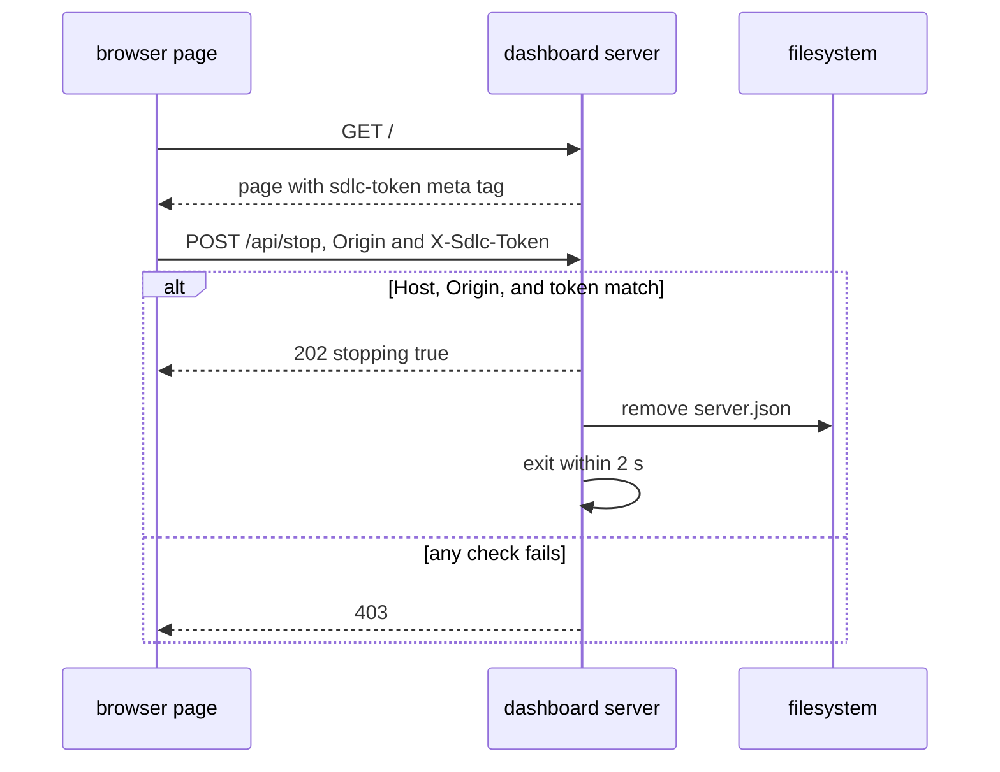
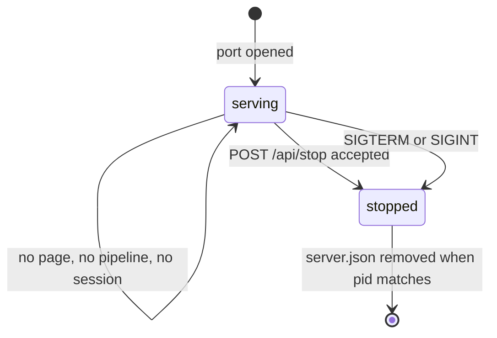
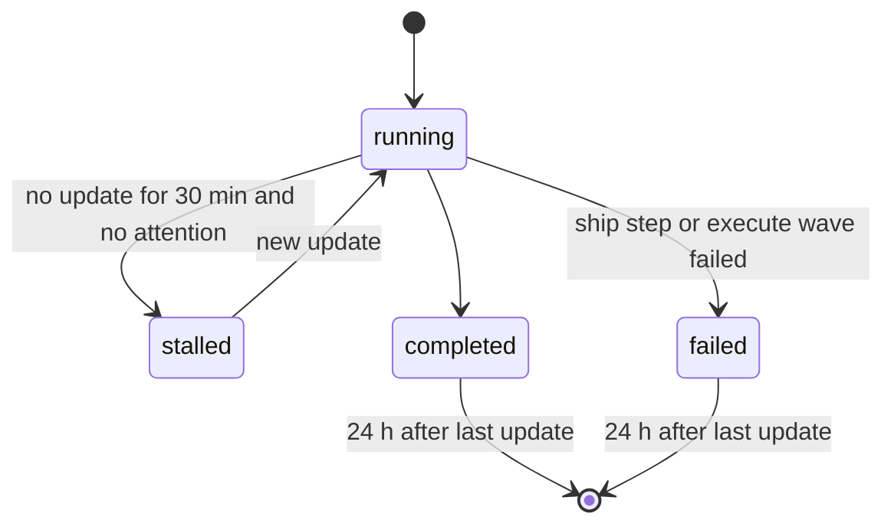
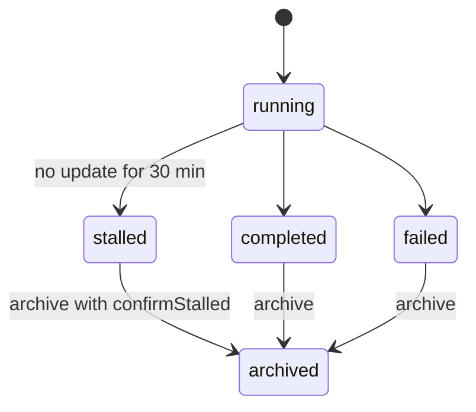
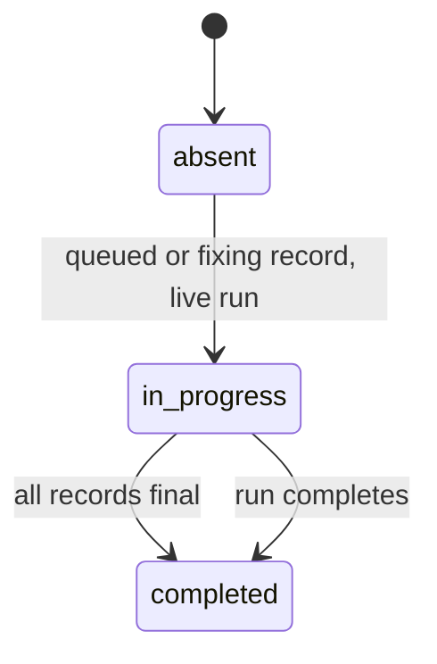

# pipeline-dashboard Specification

## Purpose
Gives the developer one local web page that updates itself and shows the sdlc pipelines of every registered repo, their progress, session activity, issues, and learnings.

## Requirements

### Requirement: Detached server command
The `sdlc dashboard serve` command SHALL run the dashboard server as its own process, separate from every MCP process, and SHALL validate `--port` (integer `1024-65535`, default `7385`) before it opens a port.

#### Scenario: Bad port value
- **WHEN** the command runs with `--port 80`
- **THEN** the exit code is 2
- **AND** stderr is `sdlc dashboard: --port must be 1024-65535`
- **AND** no port is opened

#### Scenario: Value that is not a number
- **WHEN** the command runs with `--port abc`
- **THEN** the exit code is 2
- **AND** stderr is `sdlc dashboard: --port must be 1024-65535`

### Requirement: Loopback access
The server SHALL listen on `127.0.0.1` only, SHALL reject a request whose `Host` header is not `127.0.0.1:<port>` or `localhost:<port>`, and SHALL accept GET only, except `POST /api/stop`, `POST /api/run-archive` and `POST /api/cache-clear`.

#### Scenario: Foreign host header
- **WHEN** a request has `Host: evil.example:7385`
- **THEN** the response status is 403

#### Scenario: Write method on a read endpoint
- **WHEN** a POST request reaches `/api/snapshot`
- **THEN** the response status is 405

#### Scenario: Unknown path
- **WHEN** a GET request reaches `/nothing`
- **THEN** the response status is 404

### Requirement: Endpoints
The server SHALL serve these endpoints and no others.

| Method | Path | Success |
|---|---|---|
| GET | `/` | 200, the page with the token of this server start in `<meta name="sdlc-token">` |
| GET | `/static/*` | 200, an embedded page file |
| GET | `/api/snapshot` | 200, the snapshot JSON |
| GET | `/api/events` | 200, a `text/event-stream` of snapshots |
| GET | `/api/health` | 200, `{"pid":<n>,"version":"<v>","startedAt":"<RFC3339>"}` |
| GET | `/api/learning` | 200, `{"found":<bool>,"body":"<redacted text>","truncated":<bool>}` |
| POST | `/api/stop` | 202, `{"stopping":true}` |
| POST | `/api/run-archive` | 200, `{"runId","dir","moved","deleted"}` |
| POST | `/api/cache-clear` | 200, `{"freedBytes","classes","skipped"}` |

#### Scenario: Health answer
- **WHEN** a GET request reaches `/api/health`
- **THEN** the body has the server `pid`, `version`, and `startedAt`
- **AND** the body does not hold the token

### Requirement: Guarded stop request
The server SHALL stop within 2 s after a `POST /api/stop` whose `Origin` is `http://127.0.0.1:<port>` or `http://localhost:<port>` and whose `X-Sdlc-Token` header equals the token of this server start. Every other stop request SHALL get 403 and the server SHALL keep running.

- The token is 32 random bytes, hex encoded, new at each server start.
- The token compare takes the same time for every wrong value.

#### Scenario: Good stop request
- **WHEN** the page sends `POST /api/stop` with `Origin: http://127.0.0.1:7385` and the right `X-Sdlc-Token`
- **THEN** the response status is 202
- **AND** the server exits within 2 s
- **AND** `~/.sdlc-cache/dashboard/server.json` is removed

#### Scenario: Request from another website
- **WHEN** a `POST /api/stop` has `Origin: https://evil.example`
- **THEN** the response status is 403
- **AND** the server keeps running

#### Scenario: Missing token
- **WHEN** a `POST /api/stop` has a loopback `Origin` and no `X-Sdlc-Token`
- **THEN** the response status is 403
- **AND** the server keeps running

#### Scenario: Token of an old server start
- **WHEN** a `POST /api/stop` sends the token of an earlier server start
- **THEN** the response status is 403

### Requirement: Event stream
The `/api/events` endpoint SHALL send `retry: 3000` and one `snapshot` event at connect, SHALL check the state files every 2 s, SHALL send a new `snapshot` event only when the snapshot changed, and SHALL send a `: ping` comment every 15 s.

#### Scenario: New connection
- **WHEN** a browser connects to `/api/events`
- **THEN** the stream starts with `retry: 3000`
- **AND** the next event is `event: snapshot` with the full snapshot

#### Scenario: No change
- **WHEN** no state or evidence file changes for 2 s
- **THEN** no new `snapshot` event is sent

#### Scenario: Step changes
- **WHEN** a ship run changes its step
- **THEN** a new `snapshot` event with the new step is sent within 2 s

### Requirement: One server for each computer
The open port SHALL act as the lock: a second server that cannot open the port SHALL exit 0 when the port answers an sdlc `/api/health` body, and SHALL exit 3 otherwise.

#### Scenario: sdlc server already active
- **WHEN** a server is active on port 7385
- **AND** a second `sdlc dashboard serve --port 7385` starts
- **THEN** the second process exits 0

#### Scenario: Another program holds the port
- **WHEN** a program that is not sdlc holds port 7385
- **AND** `sdlc dashboard serve --port 7385` starts
- **THEN** the process exits 3

### Requirement: Server life
The server SHALL run until a guarded stop request, SIGTERM, or SIGINT, and SHALL NOT stop because no page, pipeline, or session is active. On stop it SHALL remove the server record only when the record `pid` is its own pid.

#### Scenario: Nothing active for a day
- **WHEN** no page is open, no pipeline runs, and no session is active for 24 h
- **THEN** the server still answers `GET /api/health`

#### Scenario: Terminate signal
- **WHEN** the server gets SIGTERM
- **THEN** the server exits within 2 s
- **AND** it removes `server.json`

#### Scenario: Record of a newer server
- **WHEN** the server stops and `server.json` names another pid
- **THEN** `server.json` stays

### Requirement: Registered repos
The dashboard SHALL show each repo whose main worktree root is registered under `~/.sdlc-cache/dashboard/roots/`, or under `$SDLC_CACHE_DIR/dashboard/roots/` when `SDLC_CACHE_DIR` is set, and SHALL drop a root that has no `.sdlc-v2` folder or was not seen for 7 days.

#### Scenario: Two sessions of one repo
- **WHEN** two sessions of the same repo start
- **THEN** the repo has one root file and one group on the page

#### Scenario: Session in a linked worktree
- **WHEN** a session starts in a linked worktree of the repo at `/r`
- **THEN** the root file names `/r`
- **AND** no root file names the linked worktree path

#### Scenario: Old root
- **WHEN** a root file has `lastSeen` older than 7 days
- **THEN** the repo does not show and its root file is deleted

#### Scenario: Cache folder override
- **WHEN** `SDLC_CACHE_DIR` is `/x`
- **THEN** root files are written under `/x/dashboard/roots/`

### Requirement: Worktree of a run
The snapshot SHALL read runs only from the `.sdlc-v2/runs/` folder of the main worktree, and SHALL give each ship and execute run the `worktree` path stored in its state file. A plan or review run SHALL get `worktree:""`.

#### Scenario: Run in a linked worktree
- **WHEN** a ship run starts in the linked worktree `/r-feat-x` of the repo at `/r`
- **THEN** the run shows once, in the group of `/r`
- **AND** the run has `worktree:"/r-feat-x"`
- **AND** the page shows `r-feat-x` next to the branch

#### Scenario: Run in the main worktree
- **WHEN** a ship run starts in `/r`
- **THEN** the page shows no worktree label for the run

### Requirement: Pipeline status
The snapshot SHALL give each ship, execute, plan, and review run one status of `running`, `stalled`, `completed`, or `failed`, and SHALL show a `completed` or `failed` run only when its last update is in the last 24 h. A `running` run with `attention` SHALL not turn `stalled`.

#### Scenario: Stalled run
- **WHEN** a ship run is in flight
- **AND** its last update is 31 min old
- **THEN** its status is `stalled`

#### Scenario: Old finished run
- **WHEN** an execute run has `runStatus:"completed"`
- **AND** its last update is 25 h old
- **THEN** the run is not in the snapshot

#### Scenario: Waiting run
- **WHEN** a running pipeline has `attention`
- **AND** its last update is 31 min old
- **THEN** its status is `running`

### Requirement: Terminal status rules
The snapshot SHALL set the status `completed` or `failed` of a run by this table.

| Kind | `completed` when | `failed` when |
|---|---|---|
| ship | `pipelineStatus` is `completed` | a step is `failed` and the run is not in flight |
| execute | `runStatus` is `completed` | a wave is `failed` and no wave is `in_progress` |
| plan | `planIntegrity.done` is set | never |
| review | each dimension file has `checkoutAt` | never |

#### Scenario: Failed ship step
- **WHEN** the ship step `pr` is `failed` and the run is not in flight
- **THEN** the status is `failed`

### Requirement: Last update time
The last update of a run SHALL be the newest of the state file time, the task progress file times, and the evidence line times of the branch.

#### Scenario: Evidence newer than state
- **WHEN** the state file of a run is 40 min old
- **AND** an evidence line of the branch is 5 min old
- **THEN** the last update of the run is 5 min old

### Requirement: Step status
The snapshot SHALL give each step of a run one status from the `steps[].status` set of `ship-state.schema.json`: `pending`, `in_progress`, `completed`, `skipped`, or `failed`.

#### Scenario: Stored ship step status
- **WHEN** a ship step has the stored status `skipped`
- **THEN** the step status is `skipped`

### Requirement: Step status by run kind
The snapshot SHALL take the status of one step from the run kind by this table.

| Kind | One step is | Status rule |
|---|---|---|
| ship | a ship step | the stored value |
| execute | a wave | the stored value, with `partial` shown as `failed`. A planned wave that has not started is `pending` |
| plan | a station that groups checkpoint steps | before, at, after the station of the current step: `completed`, `in_progress`, `pending`. With the `done` marker: all `completed` |
| review | a dimension | `completed` when `checkoutAt` is set, `skipped` when `run.meta` has a stop reason, `pending` when planned with no worker file, else `in_progress` |

#### Scenario: Partial wave
- **WHEN** an execute wave has status `partial`
- **THEN** the step status is `failed`

#### Scenario: Plan checkpoint
- **WHEN** a plan run is at checkpoint step `5`
- **THEN** stations `setup`, `explore`, and `draft` are `completed`
- **AND** station `review` is `in_progress` and station `finalize` is `pending`

#### Scenario: Planned dimension not started
- **WHEN** `run.meta` plans dimension `docs-review` and no worker file exists for it
- **THEN** the step `docs-review` is `pending`

#### Scenario: Stopped dimension
- **WHEN** `run.meta` has `stopReason` `stalled` for dimension `perf-review`
- **THEN** the step `perf-review` is `skipped` with `reason` `stalled`

### Requirement: Pipeline issues
The snapshot SHALL list one issue for each failed ship step, each failed or partial execute wave, each finding of a review dimension file, each failed task row with an error, each state issue not matched by these, and each stalled run.

| Match | `source` | `severity` | `text` | `ref` |
|---|---|---|---|---|
| ship step `failed` | `step` | `high` | the step `error` or `reason` | step name |
| execute wave `failed` or `partial` | `wave` | `high` | wave status | `wave <n>` |
| review finding | `review` | the finding `severity` | the rationale | dimension name |
| failed task row with `error` | `task` | `high` | the error | task id |
| state `issues[]` entry with no matching issue above | `state` | the mapped severity | summary and detail | task id, else step, else `wave <n>` |
| stalled run | `pipeline` | `medium` | `no update for 30+ min` | empty |

Each issue also has `file` and `line`. They are empty except for a review finding. `line` is text, for example `42` or `12-14`.

#### Scenario: Failed ship step
- **WHEN** the ship step `pr` is `failed` with error `gh auth failed`
- **THEN** the pipeline has the issue `{source:"step", severity:"high", text:"gh auth failed", file:"", line:"", ref:"pr"}`

#### Scenario: Review finding
- **WHEN** a review dimension file `code` holds a finding with severity `medium`, file `a.go`, line `12`, rationale `nil map`
- **THEN** the pipeline has the issue `{source:"review", severity:"medium", text:"nil map", file:"a.go", line:"12", ref:"code"}`

#### Scenario: State issue of a failed step
- **WHEN** a ship state has a `ship-fail` state issue for step `pr`
- **AND** the pipeline has a `step` issue with `ref:"pr"`
- **THEN** the state issue is not listed

#### Scenario: Other state issue
- **WHEN** an execute state has a state issue with category `drift` for wave `2`
- **THEN** the pipeline has one issue with `source:"state"` and `ref:"wave 2"`

#### Scenario: Stalled run issue
- **WHEN** a run has the status `stalled`
- **THEN** the pipeline has one issue with `source:"pipeline"`, `severity:"medium"`, and `text:"no update for 30+ min"`

### Requirement: Session activity
The snapshot SHALL build one session entry for each non-empty `sessionId` in `cli-executions.jsonl`, `user-inputs.jsonl`, and `mcp-invocations.jsonl` of a repo, with prompt, command, and MCP call counts and a timeline of the newest 50 events.

#### Scenario: Active session
- **WHEN** the newest evidence line of a session is 10 min old
- **THEN** the session has `active:true`

#### Scenario: Inactive session
- **WHEN** the newest evidence line of a session is 31 min old
- **THEN** the session has `active:false`

#### Scenario: Empty session id
- **WHEN** an evidence line has `sessionId:""` or no `sessionId`
- **THEN** the line belongs to no session

### Requirement: Prompt preview
The snapshot SHALL show at most 120 characters of a prompt, with `…` appended when cut, and SHALL run secret redaction on the preview again.

#### Scenario: Long prompt
- **WHEN** a recorded prompt has 300 characters
- **THEN** the timeline text is the first 120 characters plus `…`

#### Scenario: Secret in a preview
- **WHEN** a recorded prompt contains `Bearer abc.def`
- **THEN** the timeline text does not contain `abc.def`

### Requirement: Learnings and deferred items
The snapshot SHALL list the learnings log entries of the last 24 h with their run tag and branch when present, and the open deferred items with `high` priority first.

#### Scenario: Learnings of today
- **WHEN** the learnings log has one entry dated today and one dated 3 days ago
- **THEN** the snapshot lists only the entry of today

#### Scenario: Deferred order
- **WHEN** one `low` and one `high` deferred item are open
- **THEN** the `high` item is listed first

### Requirement: Empty lists
The snapshot SHALL write every list as `[]`, never `null`, and SHALL give a repo whose folder is absent an `error` text and empty lists.

#### Scenario: Absent repo folder
- **WHEN** a registered root no longer exists
- **THEN** the repo entry has a non-empty `error` and `pipelines:[]`

### Requirement: Dashboard settings
The `[dashboard]` section of the merged personal config SHALL accept `autoStart` (boolean, default `false`) and `port` (integer 1024-65535, default `7385`), and SHALL reject an out-of-range port. The user changes `port` when another program uses the default port.

#### Scenario: No section
- **WHEN** neither `~/.sdlc/local.toml` nor `.sdlc-v2/local.toml` has `[dashboard]`
- **THEN** the settings are `autoStart:false` and `port:7385`

#### Scenario: Custom port
- **WHEN** `~/.sdlc/local.toml` has `[dashboard]` with `port = 7400`
- **THEN** the settings have `port:7400`

#### Scenario: Bad port
- **WHEN** `[dashboard]` has `port = 80`
- **THEN** a `DomainError` names `port` and the range `1024-65535`
- **AND** its `Suggestion` names `~/.sdlc/local.toml` and `.sdlc-v2/local.toml`

#### Scenario: Parse error
- **WHEN** a config file does not parse
- **THEN** the settings read returns an error and does not use the defaults

### Requirement: Session start registration
Each session start SHALL register the main worktree root of the repo, and SHALL start the server on the configured `port` with no wait when `autoStart` is `true`. The hook SHALL exit 0 on every path.

| autoStart | Result | Banner line |
|---|---|---|
| `false` | server not started | none |
| `true` | already active or started | `sdlc dashboard: http://127.0.0.1:<port>` |
| `true` | config or start error | `sdlc dashboard: not started — <reason>` |

#### Scenario: Auto-start on
- **WHEN** `autoStart = true` and `port = 7385`
- **AND** a session starts
- **THEN** the banner has the line `sdlc dashboard: http://127.0.0.1:7385`

#### Scenario: Auto-start on a custom port
- **WHEN** `autoStart = true` and `port = 7400`
- **AND** a session starts
- **THEN** the banner has the line `sdlc dashboard: http://127.0.0.1:7400`

#### Scenario: Registration failure
- **WHEN** the root file cannot be written
- **THEN** the session start prints nothing about the dashboard and exits 0

#### Scenario: Clear or compaction
- **WHEN** a session clears or compacts while a server is active
- **THEN** no second server starts

### Requirement: Command records carry the session id
The `pipeline-continue` hook SHALL write the hook `session_id` as the `sessionId` key of each line it appends to `.sdlc-v2/evidence/cli-executions.jsonl`, and the key SHALL be present when the id is empty.

#### Scenario: Command during a ship run
- **WHEN** a ship run is active and the hook payload has `session_id:"3f2c"`
- **THEN** the appended line has `"sessionId":"3f2c"`

#### Scenario: No session id
- **WHEN** the hook payload has no `session_id`
- **THEN** the appended line has `"sessionId":""`

### Requirement: Page behavior
The page SHALL show the pipelines of all repos as one feed of blocks, SHALL remember the chosen tab and the repo filter across reloads, SHALL show each block in its default state after a reload (unfinished blocks open, finished blocks collapsed), and SHALL insert all snapshot text as plain text, never as HTML.

| State | Text |
|---|---|
| no pipeline in any repo | `Nothing is running. Start /sdlc:ship in any repo and it shows here.` |
| no pipeline in the repos of the filter | `No pipelines for the selected repos.` |
| event stream lost | `Reconnecting…` |

#### Scenario: Filter after reload
- **WHEN** the user turns on the repo chip `sdlc-plugin` and reloads the page
- **THEN** the chip `sdlc-plugin` is still on

#### Scenario: Tab after reload
- **WHEN** the user opens the History tab and reloads the page
- **THEN** the History tab is open

#### Scenario: Group state after reload
- **WHEN** the user collapses an unfinished block and opens a finished block
- **AND** the user reloads the page
- **THEN** the unfinished block is open and the finished block is collapsed

#### Scenario: Markup in a prompt
- **WHEN** a prompt preview contains `<b>x</b>`
- **THEN** the page shows the text `<b>x</b>` and no bold text

#### Scenario: Reduced motion
- **WHEN** the browser has `prefers-reduced-motion: reduce`
- **THEN** the lamp of the active step does not pulse

### Requirement: Stop button
The page SHALL show a **Stop server** button that opens a confirm dialog, and SHALL send the guarded stop request only after the user confirms.

| State | Text |
|---|---|
| confirm dialog | `Stop the dashboard server? Every open dashboard page loses its connection. Run /sdlc:dashboard to start it again.` |
| stop accepted | `Server stopped. Run /sdlc:dashboard to start it again.` |
| stop refused or network error | `The server did not stop. Run /sdlc:dashboard --stop.` |

#### Scenario: Cancel
- **WHEN** the user clicks **Stop server** and then **Cancel**
- **THEN** no request is sent and the page stays connected

#### Scenario: Confirmed stop
- **WHEN** the user clicks **Stop server** and confirms
- **AND** the server answers 202
- **THEN** the page shows `Server stopped. Run /sdlc:dashboard to start it again.`
- **AND** the page does not try to connect again

#### Scenario: Refused stop
- **WHEN** the server answers 403
- **THEN** the page shows `The server did not stop. Run /sdlc:dashboard --stop.`

### Requirement: Issue severity values
The snapshot SHALL give each issue one severity of `critical`, `high`, `medium`, `low`, or `info`. It SHALL map `error` to `high`, `warning` to `medium`, and any other value to `info`.

#### Scenario: Error severity
- **WHEN** a state issue has severity `error`
- **THEN** the issue has `severity:"high"`

#### Scenario: Unknown severity
- **WHEN** a state issue has severity `notice`
- **THEN** the issue has `severity:"info"`

### Requirement: Step detail kind
Each step `detail` SHALL carry `kind`: `waves`, `dimensions`, `explorers`, `rounds`, `findings`, `guardrails`, `result`, or `fixes`. A step with no detail SHALL have no `detail` key. An empty list SHALL be absent, and the `kind` SHALL stay.

#### Scenario: Plan station with no explorers
- **WHEN** a ship state has `planExploreSummary: []`
- **THEN** the `plan` step has `detail` `{kind:"explorers"}` and no `explorers` key

#### Scenario: Harden step
- **WHEN** a ship run has the step `harden`
- **THEN** the step has no `detail` key

#### Scenario: Clean commit step
- **WHEN** the ship step `commit` is `completed` with result `nothing to commit: execute committed 5 wave commit(s)`
- **THEN** the step has `detail` `{kind:"result", result:"nothing to commit: execute committed 5 wave commit(s)"}`

#### Scenario: Normal commit step
- **WHEN** the ship step `commit` is `completed` with result `committed 3f2a9c1`
- **THEN** the step has no `detail` key

#### Scenario: Received-review step with fixes
- **WHEN** a ship state holds 2 valid records in `healing.fixProgress`
- **THEN** the `received-review` step has `detail` with `kind:"fixes"` and 2 rows in `fixes`

### Requirement: Review findings detail
Each `completed` dimension step of a standalone review run SHALL have `detail.kind` `findings` and its findings with text, severity, file, and line. An `in_progress` dimension SHALL have no detail.

#### Scenario: Dimension with a finding
- **WHEN** the dimension file `correctness` holds one finding with rationale `off-by-one in batch cursor pagination`, severity `medium`, file `internal/payout/batch.go`, line `88`
- **THEN** the step `correctness` has `detail` `{kind:"findings", findings:[{text:"off-by-one in batch cursor pagination", severity:"medium", file:"internal/payout/batch.go", line:"88"}]}`

#### Scenario: Dimension with no finding
- **WHEN** the dimension `security` is checked out with no finding
- **THEN** the step `security` has `detail` `{kind:"findings"}`

#### Scenario: Dimension still running
- **WHEN** the dimension `performance` has no `checkoutAt`
- **THEN** the step `performance` has no `detail` key

### Requirement: Execute step detail
The snapshot SHALL give each execute wave step a `detail.waves` entry with the wave number, status, commit sha (`""` when not committed), and its tasks with id, name, and status. A planned wave from `plannedWaves` that has not started SHALL be a `pending` wave step with its tasks. Planned tasks in no wave and no planned wave SHALL go to a last step `queued` with status `pending`.

#### Scenario: Running task
- **WHEN** a started wave has a task with no task row
- **AND** the progress file of that task exists
- **THEN** the task status is `in_progress`

#### Scenario: Planned task not started
- **WHEN** the execute state has `plannedTasks` with task `7`
- **AND** no wave and no planned wave holds task `7`
- **THEN** the last step is `queued` with task `7` in `detail.queued`

#### Scenario: Old run without names
- **WHEN** an execute state has no `plannedTasks` key
- **THEN** each task without a name shows its id and `name:""`

#### Scenario: Commits off
- **WHEN** the execute state has `commitWaves:"false"`
- **THEN** the pipeline has `commitWaves:false`

#### Scenario: Planned waves before the first wave
- **WHEN** the execute state has `plannedWaves` `[{number:1, taskIds:["1","2"]}, {number:2, taskIds:["3"]}]` and no started wave
- **THEN** the steps are `wave 1` and `wave 2`, both `pending`
- **AND** no `queued` step exists

### Requirement: Plan stations
The snapshot SHALL show a plan run as 5 stations: `setup` (step 0), `explore` (1), `draft` (2), `review` (3 to 6), `finalize` (6.5 to 7). Progress SHALL count stations, with total 5. Station `setup` SHALL have `guardrails` detail when the plan state has `guardrailCounts`.

#### Scenario: Explore detail
- **WHEN** the plan evidence holds writer `explore-auth-flow` with 12 items
- **THEN** station `explore` lists explorer `auth-flow` with `total:12` and its first 5 findings

#### Scenario: Review rounds
- **WHEN** the plan state has 2 `reviewRounds` rows and the run is at step `5`
- **THEN** station `review` lists 2 rounds with `maxRounds:5`
- **AND** the progress label is `round 3 of 5`

#### Scenario: Unreadable evidence
- **WHEN** the plan evidence path cannot be read
- **THEN** station `explore` has no detail
- **AND** the snapshot does not fail

#### Scenario: Guardrail counts
- **WHEN** the plan state has `guardrailCounts` `{total:3, error:2, warning:1}`
- **THEN** station `setup` has `detail` `{kind:"guardrails", guardrails:{total:3, error:2, warning:1}}`

### Requirement: Ship run joins
The snapshot SHALL nest an execute run and a review run into the ship run of the same branch. A nested run SHALL not show as its own pipeline. A run that matches no ship run SHALL stay its own pipeline.

#### Scenario: Execute inside the ship window
- **WHEN** an execute run on branch `feat/x` starts after the ship run on `feat/x` starts
- **THEN** the ship step `execute` holds the waves of that execute run
- **AND** the execute run is not its own pipeline

#### Scenario: Review with a ship run id
- **WHEN** the `run.meta` file of a review ledger has the ship run id of a ship run
- **THEN** the ship step `review` lists the review dimensions

#### Scenario: Review without run meta
- **WHEN** a review ledger folder has no `run.meta`
- **THEN** the review run stays its own pipeline

#### Scenario: Two matching execute runs
- **WHEN** two execute runs match one ship run
- **THEN** the newest execute run nests and the other stays its own pipeline

### Requirement: Review station totals
The ship step `review` SHALL list each planned dimension with its name, wave, status, finding count, worst severity, and stop reason, and SHALL give the totals found, fixed, deferred, and unaccounted from the ship healing data when that data exists. With a review plan, it SHALL give `reviewPlan` totals: waves planned and run, dimensions planned and run, and never started.

#### Scenario: Dimension count
- **WHEN** a nested review dimension `security` has 3 findings, one of them `high`
- **THEN** the dimension has `findings:3` and `worst:"high"`

#### Scenario: Totals
- **WHEN** the ship healing data has 9 found, 6 fixed, 3 deferred, and 0 unaccounted
- **THEN** the review step has `reviewTotals` `{found:9, fixed:6, deferred:3, unaccounted:0}`

#### Scenario: Never-started dimensions
- **WHEN** `run.meta` plans 23 dimensions in 3 waves and 8 dimensions have worker files in wave 1
- **THEN** `reviewPlan` is `{wavesPlanned:3, wavesRun:1, dimensionsPlanned:23, dimensionsRun:8, neverStarted:15}`

### Requirement: Plan station on a ship run
A ship run whose state has `planExploreSummary` SHALL get a first step `plan` with status `completed` that lists the stored explorers, and the stored `planReviewRounds` with `maxRounds` when that key is not empty. A ship run without `planExploreSummary` SHALL get no `plan` step.

#### Scenario: Stored summary
- **WHEN** a ship state has `planExploreSummary` with explorer `auth-flow`
- **THEN** the first ship step is `plan` and lists explorer `auth-flow`
- **AND** the progress total goes up by 1

#### Scenario: Stored review rounds
- **WHEN** a ship state also has `planReviewRounds` with 2 rounds
- **THEN** the `plan` step lists the 2 rounds and `maxRounds`

### Requirement: Pipeline session
Each pipeline SHALL carry `sessionId` from its state, or `""`. A nested execute run without an id SHALL use the ship id. The page SHALL show the session with that id, else the newest session on the same branch.

#### Scenario: No session id
- **WHEN** a pipeline has `sessionId:""`
- **AND** two sessions exist on its branch
- **THEN** the page shows the session with the newest last activity

### Requirement: Run history
Each repo SHALL carry `history`: the 50 newest rows of `runs.jsonl`, newest first, each with kind, branch, outcome, start time, end time, and duration. A missing file SHALL give `history:[]`.

#### Scenario: Failure row
- **WHEN** `runs.jsonl` holds a ship row with `outcome:"failure"`
- **THEN** `history` lists it with `outcome:"failure"`

#### Scenario: Corrupt line
- **WHEN** one line of `runs.jsonl` does not parse
- **THEN** the other rows still show

### Requirement: Page layout
The page SHALL have the title `sdlc signal room`, with a `(N) ` prefix when N pipelines in the repos in scope wait for a person, and a header with the tabs Pipelines, Activity, and History, each with a count. Under the header a sticky repo filter SHALL serve all three tabs. The page SHALL have no left rail.

#### Scenario: Tabs by keyboard
- **WHEN** the Pipelines tab has focus and the user presses the right arrow key
- **THEN** the Activity tab opens

#### Scenario: End key
- **WHEN** a tab has focus and the user presses `End`
- **THEN** the History tab opens

#### Scenario: Narrow page
- **WHEN** the page is narrower than 1000 px
- **THEN** the header counts are hidden

#### Scenario: Waiting title
- **WHEN** 1 pipeline in scope has `attention`
- **THEN** the title is `(1) sdlc signal room`

### Requirement: Repo filter
The filter SHALL show `All` and one chip for each repo with its pipeline count. Many chips SHALL be able to be on. No chip on SHALL mean all repos. The filter SHALL hide the blocks, activity rows, and history rows of other repos. Tab counts SHALL use the filter. Header counts SHALL not.

#### Scenario: Two chips on
- **WHEN** the chips `sdlc-plugin` and `payments-service` are on
- **THEN** the Pipelines tab shows only the blocks of those two repos

#### Scenario: Failed run count
- **WHEN** the repo `identity-service` has a failed run
- **THEN** its chip shows the pipeline count in red

#### Scenario: Header counts
- **WHEN** a chip is on
- **THEN** the header counts running, stalled, and failed still count all repos

### Requirement: Pipeline blocks
The Pipelines tab SHALL show one block for each pipeline in 5 groups: waiting on you, running, failed, stalled, completed. In each group the newest `startedAt` SHALL come first. A block head SHALL show the status lamp, kind, branch, repo name, an issue chip when issues exist, the status word, and a `details N` toggle.

#### Scenario: Default state
- **WHEN** the page loads with one running and one completed pipeline
- **THEN** the running block is open and the completed block is collapsed

#### Scenario: Collapsed block
- **WHEN** the user collapses a block
- **THEN** the block shows its head and track only

#### Scenario: Collapse all
- **WHEN** a visible block is open and the user clicks `Collapse all details`
- **THEN** every visible block collapses and the button text is `Expand all details`

#### Scenario: Waiting run first
- **WHEN** the snapshot has a completed run, a running run, and a running run with `attention`
- **THEN** the order is the run with `attention`, the running run, the completed run

#### Scenario: Newest first in a group
- **WHEN** two running runs started at 10:00 and 11:00
- **THEN** the 11:00 run comes first

### Requirement: Step tiles
A block SHALL show one open tile for each step with detail, in track order, with the step name and a summary. A step with no detail SHALL have no tile. Issues SHALL be a tile when issues exist, open by default. Session SHALL be a tile when a session is found, closed by default.

#### Scenario: Review tile summary
- **WHEN** a review step has 5 dimensions, 3 done, and totals with 5 found
- **THEN** its tile summary is `3/5 dimensions done · 5 findings`

#### Scenario: Station click
- **WHEN** the user clicks the station `review` of a collapsed block
- **THEN** the block opens, the `review` tile opens, and the page scrolls to it

#### Scenario: Station with no tile
- **WHEN** the user clicks the station `commit` that has no detail
- **THEN** nothing changes

#### Scenario: Commits off
- **WHEN** a pipeline has `commitWaves:false`
- **THEN** each wave shows `commits off`

#### Scenario: Explorer with more findings
- **WHEN** an explorer has `total:12`
- **THEN** the tile shows 2 findings and `10 more`

#### Scenario: Empty findings tile
- **WHEN** a findings tile has no findings
- **THEN** the tile shows `No findings.`

### Requirement: Page state across snapshots
A new snapshot SHALL keep, for each pipeline, the collapsed state, the tiles the user closed, and the selected station. It SHALL keep the scroll position and the keyboard focus.

#### Scenario: Closed tile
- **WHEN** the user closes the `execute` tile and a new snapshot arrives
- **THEN** the `execute` tile stays closed

#### Scenario: Scroll position
- **WHEN** the user scrolls down the feed and a new snapshot arrives
- **THEN** the scroll position does not change

### Requirement: Page links
The page SHALL read the URL hash on load and on each hash change. `#<pipeline id>` SHALL scroll to that block. `#<pipeline id>/<n>` SHALL also select station n. `#activity` and `#history` SHALL open that tab.

#### Scenario: Link to a station
- **WHEN** the page opens with `#ship-feat-x-20261007T072607Z/2`
- **THEN** the page scrolls to that ship block and selects station 2

#### Scenario: Link to a tab
- **WHEN** the page opens with `#history`
- **THEN** the History tab opens

#### Scenario: Unknown id
- **WHEN** the hash names no pipeline and no tab
- **THEN** the page ignores the hash

### Requirement: Activity and history tabs
The Activity tab SHALL show `Open deferred (n)` and then `Learnings today (n)`, each row with its repo. The History tab SHALL show one table with outcome, kind, branch, repo, finished time, and duration. Each list SHALL have its own empty text.

#### Scenario: No history
- **WHEN** no repo in scope has history rows
- **THEN** the History tab shows `No finished runs for the selected repos.`

#### Scenario: No deferred items
- **WHEN** no repo in scope has open deferred items
- **THEN** the Activity tab shows `No open deferred items.`

### Requirement: Page text safety and contrast
The page SHALL insert every snapshot string as plain text, SHALL show a URL ref as text and not as a link, and SHALL give every text colour a contrast of 4.5:1 or more on the page background.

#### Scenario: Markup in a branch name
- **WHEN** a branch name is `<b>x</b>`
- **THEN** the page shows the text `<b>x</b>` and no bold text

#### Scenario: URL ref
- **WHEN** an explorer finding has ref `https://example.com`
- **THEN** the page shows the ref as text with no link

### Requirement: Pipeline attention
A pipeline SHALL carry `attention` `{kind, askedAt, header, text}` from the newest open wait record whose session and branch match the pipeline, when the pipeline is `running`. Otherwise `attention` SHALL be absent. A nested execute run SHALL show no second mark.

#### Scenario: Matching record
- **WHEN** a record has session `s1` and branch `feat/x`
- **AND** a running pipeline has `sessionId` `s1` on branch `feat/x`
- **THEN** the pipeline has `attention` with the record header and text

#### Scenario: Other branch
- **WHEN** a record has session `s1` and branch `main`
- **AND** the pipeline is on branch `feat/x`
- **THEN** the pipeline has no `attention` key

#### Scenario: Old record
- **WHEN** the record `askedAt` is 25 h old
- **THEN** the pipeline has no `attention` key

### Requirement: Waiting mark on the page
A block with `attention` SHALL show `◈ WAITING ON YOU · <elapsed>` and `<header>: "<text>"`, a `waiting` lamp ring, and a `◈` glyph on the current station. The header SHALL show a `waiting` count over all repos. The elapsed time SHALL update every second.

#### Scenario: Banner
- **WHEN** a pipeline has `attention` asked 252 s ago with header `Guardrail`
- **THEN** the block shows `◈ WAITING ON YOU · 4m 12s`

#### Scenario: Reduced motion
- **WHEN** the user prefers reduced motion
- **THEN** the lamp ring does not pulse

### Requirement: Station track
The station track SHALL use the full panel width. Every station SHALL be 112 px wide and SHALL start at the left edge of the track. Stations SHALL wrap to a new row when the track has no room for one more station. The track SHALL not scroll sideways.

#### Scenario: Wide panel
- **WHEN** a panel is 2560 px wide and a ship run has 10 stations
- **THEN** all stations are in one row

#### Scenario: Narrow panel
- **WHEN** a review run has 23 stations in a 1280 px panel
- **THEN** the stations wrap to more rows
- **AND** the track has no horizontal scroll

### Requirement: Plan review totals and outcomes
Station `review` SHALL carry `roundTotals` `{iterations, violations, fixes, distinct}`, `repairLimit`, and `outcomes`. With finding IDs on every round, totals SHALL count distinct IDs. Otherwise they SHALL sum the round counts with `distinct:false`. `repairLimit` SHALL be true when the last round is at the limit with Issues Found.

#### Scenario: Distinct totals
- **WHEN** round 1 found `a`, `b`, `g1` and fixed `a`, `g1`, and round 2 found and fixed `b`
- **THEN** `roundTotals` is `{iterations:2, violations:3, fixes:3, distinct:true}`

#### Scenario: Old rounds
- **WHEN** a round has no `findings` key
- **THEN** `roundTotals.distinct` is `false`

#### Scenario: Outcome list
- **WHEN** the plan state has `reviewOutcome` with finding `f-9d01aa42` and choice `accepted`
- **THEN** `outcomes` lists `f-9d01aa42` with choice `accepted`

#### Scenario: Review tile
- **WHEN** `roundTotals` is `{iterations:5, violations:7, fixes:6, distinct:true}` and `repairLimit` is true
- **THEN** the tile shows `5 iterations · 7 violations · 6 fixes` and `REPAIR LIMIT REACHED`

### Requirement: Guarded change requests
Every POST route SHALL check the `Origin` and the `X-Sdlc-Token` header before it reads the body, and SHALL answer every error with JSON `{"error":{"code","message","suggestion"}}`.

#### Scenario: Archive from another website
- **WHEN** a `POST /api/run-archive` has `Origin: https://evil.example`
- **THEN** the response status is 403 with code `FORBIDDEN_ORIGIN`
- **AND** no file changes

#### Scenario: Wrong token
- **WHEN** a `POST /api/cache-clear` has a loopback `Origin` and a wrong `X-Sdlc-Token`
- **THEN** the response status is 403 with code `FORBIDDEN_TOKEN`

#### Scenario: Body is not JSON
- **WHEN** a `POST /api/run-archive` has `Content-Type: text/plain`
- **THEN** the response status is 415 with code `BAD_CONTENT_TYPE`

#### Scenario: Body too large
- **WHEN** a `POST /api/run-archive` body is over 8 KiB
- **THEN** the response status is 413 with code `BODY_TOO_LARGE`

#### Scenario: Unknown repo
- **WHEN** `repo` is not a registered display root
- **THEN** the response status is 404 with code `REPO_NOT_FOUND`

### Requirement: Run archive
The server SHALL move a finished or stalled run, with its nested runs, reports and ledgers, into `<repo>/.sdlc-v2/run-archive/<runId>/`, SHALL delete its working dirs, and SHALL refuse a running run.

#### Scenario: Archive a finished ship run
- **WHEN** the page archives a `completed` ship run with a nested execute run
- **THEN** both state files, the ledger and the reports are under `run-archive/<runId>/`
- **AND** the next snapshot does not list the run

#### Scenario: Running run
- **WHEN** the row status is `running`
- **THEN** the response status is 409 with code `RUN_ACTIVE`

#### Scenario: Stalled run without confirm
- **WHEN** the row status is `stalled` and `confirmStalled` is `false`
- **THEN** the response status is 409 with code `CONFIRM_STALLED`

#### Scenario: Bad run id
- **WHEN** `runId` is `../x`
- **THEN** the response status is 400 with code `BAD_RUN_ID`
- **AND** no file changes

### Requirement: Cache clear
The server SHALL delete rotated evidence files older than 30 minutes, `sdlc-*` temp dirs older than 24 hours except `sdlc-explore-*`, and reports that no ship or execute state owns, and SHALL truncate the server log.

- History, learnings, timings, live runs, archived runs and live evidence stay.
- A delete error adds one `skipped` row with the reason, and the clear continues.

#### Scenario: Recent rotated evidence
- **WHEN** a `.jsonl.1` evidence file changed 5 minutes ago
- **THEN** the file stays and `skipped` has the reason `changed less than 30 minutes ago`

### Requirement: Learning body on open
The `GET /api/learning` route SHALL return the redacted body of the learning entry with the given date and heading, cut at 8000 characters, and SHALL need no token.

#### Scenario: No match
- **WHEN** no entry has the date and heading
- **THEN** the response is 200 with `found: false`

### Requirement: Same step detail in ship and standalone runs
A ship review step SHALL list the findings of each dimension with text, severity, file and line, the same rows as a standalone review step.

#### Scenario: Ship review findings
- **WHEN** a ship run has a joined review with 2 findings in dimension `security-review`
- **THEN** the ship review step lists the 2 finding rows under `security-review`

### Requirement: Deferred item metadata
Each open deferred item SHALL carry `created`, `source`, `severity`, `file`, `line` and `reason`, with `""` or `0` for an absent value.

#### Scenario: Absent file
- **WHEN** a deferred item has no file
- **THEN** `file` is `""`

### Requirement: Session command groups
Each session SHALL carry `commandGroups` over all commands of the session, with `label`, `count`, `share` and one `majority` group.

| Programs in the command | Label |
|---|---|
| 1 or 2 | the first program |
| 3 or more | `a + b + c` |
| none | `(other)` |

#### Scenario: Pipe of three programs
- **WHEN** a session runs `cat a | grep x | wc -l`
- **THEN** `commandGroups` has a group with label `cat + grep + wc`

### Requirement: Detail viewer
The page SHALL open a right-side modal panel with the full text and metadata of a deferred item, issue, learning or finding, and SHALL return focus to the same row when the panel closes.

#### Scenario: Open a learning
- **WHEN** the user clicks a learning row
- **THEN** the panel shows the heading and fills the body from `GET /api/learning`

#### Scenario: Item gone
- **WHEN** the next snapshot no longer has the open item
- **THEN** the panel shows `no longer open`

### Requirement: Uniform station width
Every pipeline station SHALL use the same fixed width, and every execute step SHALL use the wide layout for 0, 1 or more waves.

#### Scenario: One-wave execute
- **WHEN** an execute step has 1 wave
- **THEN** the step uses the wide layout

### Requirement: Step times
The snapshot SHALL copy `startedAt` and `completedAt` of each ship step and each execute wave when the value parses as RFC 3339, and SHALL omit the key when the value is absent or does not parse.

#### Scenario: Running ship step
- **WHEN** a ship step has `startedAt` `2026-10-10T10:00:00Z` and no `completedAt`
- **THEN** the snapshot step has `startedAt` `2026-10-10T10:00:00Z`
- **AND** the snapshot step has no `completedAt` key

#### Scenario: Bad time text
- **WHEN** a ship step has `startedAt` `yesterday`
- **THEN** the snapshot step has no `startedAt` key

#### Scenario: Pending execute wave
- **WHEN** a planned execute wave has not started
- **THEN** its snapshot step has no `startedAt` key and no `completedAt` key

#### Scenario: Plan step
- **WHEN** a plan pipeline has the step `explore`
- **THEN** the step has no `startedAt` key and no `completedAt` key

### Requirement: Received-review step
The snapshot SHALL show a `received-review` step right after the first `review` step of a ship pipeline when `healing.fixProgress` holds at least one valid record, and SHALL show no such step otherwise.

The status of the step:

#### Scenario: No fix records
- **WHEN** a ship state has no `healing.fixProgress` key
- **THEN** the ship pipeline has no `received-review` step

#### Scenario: Damaged fix records
- **WHEN** `healing.fixProgress` is not a list, or is a list with records and no valid record
- **THEN** the ship pipeline has no `received-review` step
- **AND** the pipeline has one `state` issue with severity `medium` that names `healing.fixProgress`

#### Scenario: Fix in progress
- **WHEN** a live ship run has one record with status `fixing`
- **THEN** the `received-review` step has status `in_progress` and no `completedAt` key

#### Scenario: All fixes final
- **WHEN** every record has status `fixed`, `failed` or `deferred`
- **THEN** the `received-review` step has status `completed`
- **AND** its `startedAt` is the earliest `firstAt` and its `completedAt` is the latest `updatedAt`

#### Scenario: Stopped fix pass
- **WHEN** a ship run has `pipelineCompletedAt` set and one record still has status `queued`
- **THEN** the `received-review` step has status `completed`
- **AND** the row keeps status `queued`

#### Scenario: Inserted completed step
- **WHEN** the step is inserted with status `completed` into a pipeline with progress 4 of 6
- **THEN** the progress is 5 of 7

#### Scenario: Stored received-review step
- **WHEN** the ship pipeline already has a step named `received-review` with status `skipped`
- **THEN** that step gets the `fixes` detail and keeps status `skipped`

### Requirement: Fix rows
Each `fixes` row SHALL carry `title` (redacted, at most 120 characters), `severity`, `file`, and `status`, and SHALL carry `line` only when it is not 0. The snapshot SHALL skip a record with an unknown status or severity, or with no title.

| Field | Values |
|---|---|
| `status` | `queued`, `fixing`, `fixed`, `failed`, `deferred` |
| `severity` | `critical`, `high`, `medium`, `low`, `info` |

#### Scenario: Unknown status
- **WHEN** a record has status `paused`
- **THEN** the `fixes` list has no row for that record

#### Scenario: No line
- **WHEN** a record has no `line`
- **THEN** its row has no `line` key

### Requirement: Durations on the page
The page SHALL show the run duration in a chip right after the branch name, and the duration of each step that has a valid `startedAt` under the step name. A running time SHALL increase each second.

#### Scenario: Running pipeline chip
- **WHEN** a pipeline has status `running` and a valid `startedAt`
- **THEN** the chip has the class `live` and a lamp

#### Scenario: Completed pipeline chip
- **WHEN** a pipeline has status `completed`
- **THEN** the chip shows the time from start to end and has no lamp

#### Scenario: Pending step
- **WHEN** a step has status `pending`
- **THEN** the station shows no duration

### Requirement: Received-review tile
The page SHALL show the received-review tile with a progress line, a progress bar, and one row for each fix with severity, title, file and status. The tile SHALL show `No fixes yet.` when the list is empty.

#### Scenario: Three fixes
- **WHEN** the step has 3 fixes with status `fixed`, `fixing` and `queued`
- **THEN** the progress line is `1 of 3 fixed · 1 fixing · 1 queued`
- **AND** the progress bar has `max=3` and `value=1`

#### Scenario: No fixes
- **WHEN** the step has `detail` `{kind:"fixes"}` and no `fixes` key
- **THEN** the tile shows `No fixes yet.`

### Requirement: Issue and finding rows
The issues tile SHALL list issues from `critical` to `info`, with equal severities in source order. Issue rows and finding rows SHALL show at most 2 lines of text, and a click SHALL open the full text in the detail viewer.

#### Scenario: Unsorted issues
- **WHEN** a pipeline has issues with severity `low`, `critical`, `low`
- **THEN** the tile lists the `critical` issue first, then the two `low` issues in source order

#### Scenario: Click a clamped row
- **WHEN** the user clicks the second issue row
- **THEN** the detail viewer shows the full text of that issue

### Requirement: Review cards
The review tile SHALL span the full row and SHALL show one card for each dimension. The page SHALL pack the cards into columns of at least 360 px, the tallest card first and each card in the shortest column, and SHALL pack again when the grid size changes.

#### Scenario: Three cards in two columns
- **WHEN** the cards have heights 100, 300 and 200 and the grid has room for 2 columns
- **THEN** column 1 holds card 2, and column 2 holds cards 1 and 3 in source order

#### Scenario: Wave heading
- **WHEN** the review has dimensions in wave 1 and wave 2
- **THEN** the heading of wave 2 starts a new set of columns

### Requirement: Archive icon
A `completed`, `failed`, or `stalled` pipeline SHALL show an archive icon as the first control of its options, with the accessible name `Archive` and the tooltip `Archive this run`.

#### Scenario: Options order
- **WHEN** a pipeline has status `failed`
- **THEN** the options are the archive icon, the repo name, the issue chip, the status, and the details toggle, in this order

### Requirement: Glass dialogs and close icon
The confirm dialogs and the detail viewer SHALL use the fill `rgba(0,0,0,0.38)` with a 5 px blur and no blur on the layer behind the dialog. The detail viewer SHALL have a close icon as its first element, with the accessible name `Close` and no text.

#### Scenario: Close the detail viewer
- **WHEN** the user clicks the close icon
- **THEN** the detail viewer closes and the focus goes back to the row that opened it
