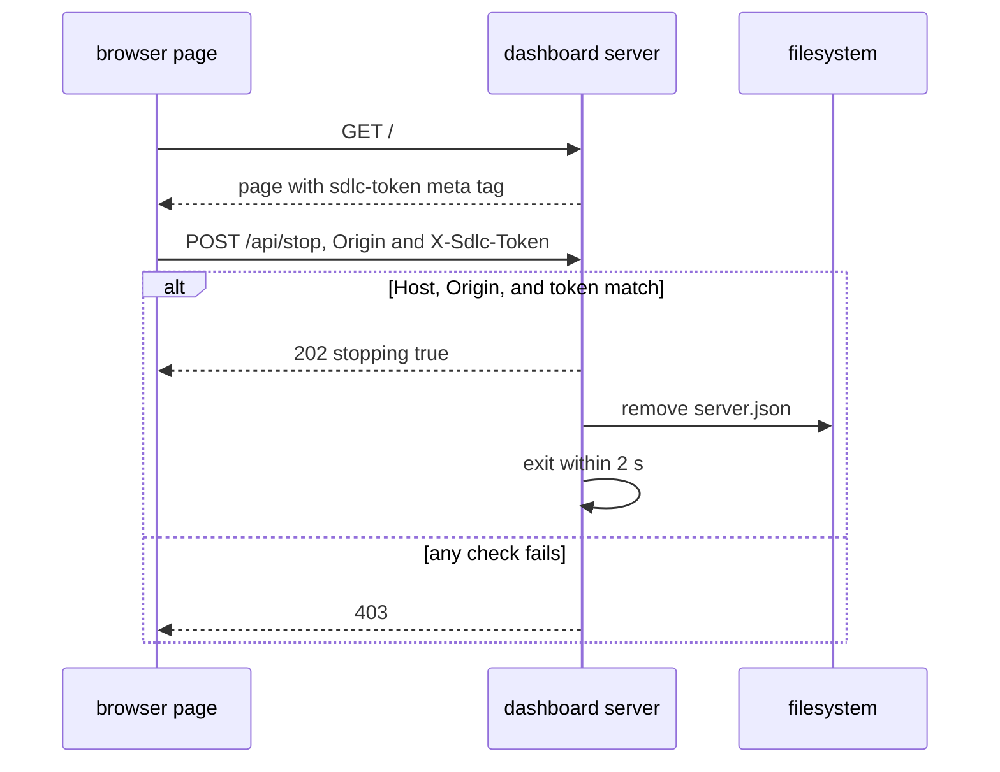
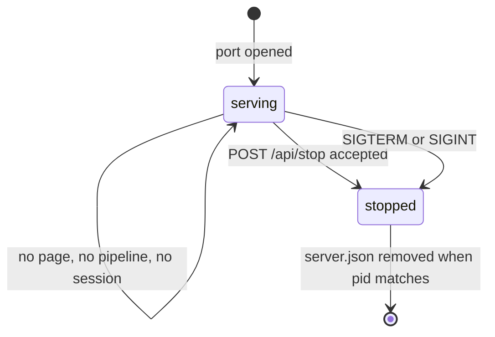
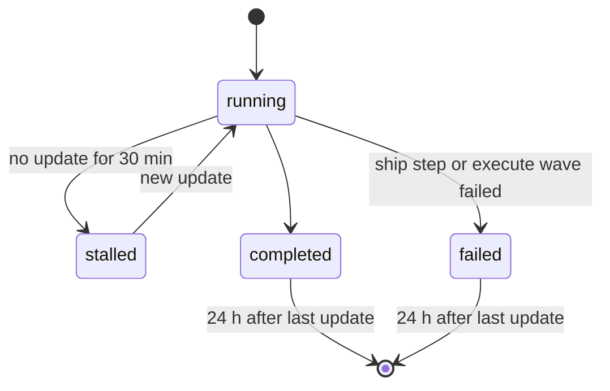

# pipeline-dashboard Specification

## Purpose
Gives the developer one local web page that updates itself and shows the sdlc pipelines of every registered repo, their progress, session activity, issues, and learnings.

## Requirements

### Requirement: Detached server command
The `sdlc dashboard serve` command SHALL run the dashboard server as its own process, separate from every MCP process, and SHALL validate `--port` (integer `1024-65535`, default `7385`) before it opens a port.

#### Scenario: Bad port value
- **WHEN** the command runs with `--port 80`
- **THEN** the exit code is 2
- **AND** stderr is `sdlc dashboard: --port must be 1024-65535`
- **AND** no port is opened

#### Scenario: Value that is not a number
- **WHEN** the command runs with `--port abc`
- **THEN** the exit code is 2
- **AND** stderr is `sdlc dashboard: --port must be 1024-65535`

### Requirement: Loopback access
The server SHALL listen on `127.0.0.1` only, SHALL reject a request whose `Host` header is not `127.0.0.1:<port>` or `localhost:<port>`, and SHALL accept GET only, except `POST /api/stop`.

#### Scenario: Foreign host header
- **WHEN** a request has `Host: evil.example:7385`
- **THEN** the response status is 403

#### Scenario: Write method on a read endpoint
- **WHEN** a POST request reaches `/api/snapshot`
- **THEN** the response status is 405

#### Scenario: Unknown path
- **WHEN** a GET request reaches `/nothing`
- **THEN** the response status is 404

### Requirement: Endpoints
The server SHALL serve these endpoints and no others.

| Method | Path | Success |
|---|---|---|
| GET | `/` | 200, the page with the token of this server start in `<meta name="sdlc-token">` |
| GET | `/static/*` | 200, an embedded page file |
| GET | `/api/snapshot` | 200, the snapshot JSON |
| GET | `/api/events` | 200, a `text/event-stream` of snapshots |
| GET | `/api/health` | 200, `{"pid":<n>,"version":"<v>","startedAt":"<RFC3339>"}` |
| POST | `/api/stop` | 202, `{"stopping":true}` |

#### Scenario: Health answer
- **WHEN** a GET request reaches `/api/health`
- **THEN** the body has the server `pid`, `version`, and `startedAt`
- **AND** the body does not hold the token

### Requirement: Guarded stop request
The server SHALL stop within 2 s after a `POST /api/stop` whose `Origin` is `http://127.0.0.1:<port>` or `http://localhost:<port>` and whose `X-Sdlc-Token` header equals the token of this server start. Every other stop request SHALL get 403 and the server SHALL keep running.

- The token is 32 random bytes, hex encoded, new at each server start.
- The token compare takes the same time for every wrong value.

#### Scenario: Good stop request
- **WHEN** the page sends `POST /api/stop` with `Origin: http://127.0.0.1:7385` and the right `X-Sdlc-Token`
- **THEN** the response status is 202
- **AND** the server exits within 2 s
- **AND** `~/.sdlc-cache/dashboard/server.json` is removed

#### Scenario: Request from another website
- **WHEN** a `POST /api/stop` has `Origin: https://evil.example`
- **THEN** the response status is 403
- **AND** the server keeps running

#### Scenario: Missing token
- **WHEN** a `POST /api/stop` has a loopback `Origin` and no `X-Sdlc-Token`
- **THEN** the response status is 403
- **AND** the server keeps running

#### Scenario: Token of an old server start
- **WHEN** a `POST /api/stop` sends the token of an earlier server start
- **THEN** the response status is 403

### Requirement: Event stream
The `/api/events` endpoint SHALL send `retry: 3000` and one `snapshot` event at connect, SHALL check the state files every 2 s, SHALL send a new `snapshot` event only when the snapshot changed, and SHALL send a `: ping` comment every 15 s.

#### Scenario: New connection
- **WHEN** a browser connects to `/api/events`
- **THEN** the stream starts with `retry: 3000`
- **AND** the next event is `event: snapshot` with the full snapshot

#### Scenario: No change
- **WHEN** no state or evidence file changes for 2 s
- **THEN** no new `snapshot` event is sent

#### Scenario: Step changes
- **WHEN** a ship run changes its step
- **THEN** a new `snapshot` event with the new step is sent within 2 s

### Requirement: One server for each computer
The open port SHALL act as the lock: a second server that cannot open the port SHALL exit 0 when the port answers an sdlc `/api/health` body, and SHALL exit 3 otherwise.

#### Scenario: sdlc server already active
- **WHEN** a server is active on port 7385
- **AND** a second `sdlc dashboard serve --port 7385` starts
- **THEN** the second process exits 0

#### Scenario: Another program holds the port
- **WHEN** a program that is not sdlc holds port 7385
- **AND** `sdlc dashboard serve --port 7385` starts
- **THEN** the process exits 3

### Requirement: Server life
The server SHALL run until a guarded stop request, SIGTERM, or SIGINT, and SHALL NOT stop because no page, pipeline, or session is active. On stop it SHALL remove the server record only when the record `pid` is its own pid.

#### Scenario: Nothing active for a day
- **WHEN** no page is open, no pipeline runs, and no session is active for 24 h
- **THEN** the server still answers `GET /api/health`

#### Scenario: Terminate signal
- **WHEN** the server gets SIGTERM
- **THEN** the server exits within 2 s
- **AND** it removes `server.json`

#### Scenario: Record of a newer server
- **WHEN** the server stops and `server.json` names another pid
- **THEN** `server.json` stays

### Requirement: Registered repos
The dashboard SHALL show each repo whose main worktree root is registered under `~/.sdlc-cache/dashboard/roots/`, or under `$SDLC_CACHE_DIR/dashboard/roots/` when `SDLC_CACHE_DIR` is set, and SHALL drop a root that has no `.sdlc-v2` folder or was not seen for 7 days.

#### Scenario: Two sessions of one repo
- **WHEN** two sessions of the same repo start
- **THEN** the repo has one root file and one group on the page

#### Scenario: Session in a linked worktree
- **WHEN** a session starts in a linked worktree of the repo at `/r`
- **THEN** the root file names `/r`
- **AND** no root file names the linked worktree path

#### Scenario: Old root
- **WHEN** a root file has `lastSeen` older than 7 days
- **THEN** the repo does not show and its root file is deleted

#### Scenario: Cache folder override
- **WHEN** `SDLC_CACHE_DIR` is `/x`
- **THEN** root files are written under `/x/dashboard/roots/`

### Requirement: Worktree of a run
The snapshot SHALL read runs only from the `.sdlc-v2/runs/` folder of the main worktree, and SHALL give each ship and execute run the `worktree` path stored in its state file. A plan or review run SHALL get `worktree:""`.

#### Scenario: Run in a linked worktree
- **WHEN** a ship run starts in the linked worktree `/r-feat-x` of the repo at `/r`
- **THEN** the run shows once, in the group of `/r`
- **AND** the run has `worktree:"/r-feat-x"`
- **AND** the page shows `r-feat-x` next to the branch

#### Scenario: Run in the main worktree
- **WHEN** a ship run starts in `/r`
- **THEN** the page shows no worktree label for the run

### Requirement: Pipeline status
The snapshot SHALL give each ship, execute, plan, and review run one status of `running`, `stalled`, `completed`, or `failed`, and SHALL show a `completed` or `failed` run only when its last update is in the last 24 h.

#### Scenario: Stalled run
- **WHEN** a ship run is in flight
- **AND** its last update is 31 min old
- **THEN** its status is `stalled`

#### Scenario: Old finished run
- **WHEN** an execute run has `runStatus:"completed"`
- **AND** its last update is 25 h old
- **THEN** the run is not in the snapshot

### Requirement: Terminal status rules
The snapshot SHALL set the status `completed` or `failed` of a run by this table.

| Kind | `completed` when | `failed` when |
|---|---|---|
| ship | `pipelineStatus` is `completed` | a step is `failed` and the run is not in flight |
| execute | `runStatus` is `completed` | a wave is `failed` and no wave is `in_progress` |
| plan | `planIntegrity.done` is set | never |
| review | each dimension file has `checkoutAt` | never |

#### Scenario: Failed ship step
- **WHEN** the ship step `pr` is `failed` and the run is not in flight
- **THEN** the status is `failed`

### Requirement: Last update time
The last update of a run SHALL be the newest of the state file time, the task progress file times, and the evidence line times of the branch.

#### Scenario: Evidence newer than state
- **WHEN** the state file of a run is 40 min old
- **AND** an evidence line of the branch is 5 min old
- **THEN** the last update of the run is 5 min old

### Requirement: Step status
The snapshot SHALL give each step of a run one status from the `steps[].status` set of `ship-state.schema.json`: `pending`, `in_progress`, `completed`, `skipped`, or `failed`.

#### Scenario: Stored ship step status
- **WHEN** a ship step has the stored status `skipped`
- **THEN** the step status is `skipped`

### Requirement: Step status by run kind
The snapshot SHALL take the status of one step from the run kind by this table.

| Kind | One step is | Status rule |
|---|---|---|
| ship | a ship step | the stored value |
| execute | a wave | the stored value, with `partial` shown as `failed` |
| plan | a checkpoint step | before, at, after the current step: `completed`, `in_progress`, `pending` |
| review | a dimension | `completed` when `checkoutAt` is set, else `in_progress` |

#### Scenario: Partial wave
- **WHEN** an execute wave has status `partial`
- **THEN** the step status is `failed`

#### Scenario: Plan checkpoint
- **WHEN** a plan run is at checkpoint step `5`
- **THEN** steps `0` to `4` are `completed`, step `5` is `in_progress`, and later steps are `pending`

### Requirement: Pipeline issues
The snapshot SHALL list one issue for each failed ship step, each failed or partial execute wave, and each finding of a review dimension file.

| Match | `source` | `severity` | `text` |
|---|---|---|---|
| ship step `failed` | `step` | `high` | the step `error` or `reason` |
| execute wave `failed` or `partial` | `wave` | `high` | wave number and status |
| review finding | `review` | the finding `severity` | `<file>:<line> <rationale>` |

#### Scenario: Failed ship step
- **WHEN** the ship step `pr` is `failed` with error `gh auth failed`
- **THEN** the pipeline has the issue `{source:"step", severity:"high", text:"pr: gh auth failed"}`

#### Scenario: Review finding
- **WHEN** a review dimension file holds a finding with severity `medium`, file `a.go`, line `12`, rationale `nil map`
- **THEN** the pipeline has an issue with `source:"review"`, `severity:"medium"`, `text:"a.go:12 nil map"`

### Requirement: Session activity
The snapshot SHALL build one session entry for each non-empty `sessionId` in `cli-executions.jsonl`, `user-inputs.jsonl`, and `mcp-invocations.jsonl` of a repo, with prompt, command, and MCP call counts and a timeline of the newest 50 events.

#### Scenario: Active session
- **WHEN** the newest evidence line of a session is 10 min old
- **THEN** the session has `active:true`

#### Scenario: Inactive session
- **WHEN** the newest evidence line of a session is 31 min old
- **THEN** the session has `active:false`

#### Scenario: Empty session id
- **WHEN** an evidence line has `sessionId:""` or no `sessionId`
- **THEN** the line belongs to no session

### Requirement: Prompt preview
The snapshot SHALL show at most 120 characters of a prompt, with `…` appended when cut, and SHALL run secret redaction on the preview again.

#### Scenario: Long prompt
- **WHEN** a recorded prompt has 300 characters
- **THEN** the timeline text is the first 120 characters plus `…`

#### Scenario: Secret in a preview
- **WHEN** a recorded prompt contains `Bearer abc.def`
- **THEN** the timeline text does not contain `abc.def`

### Requirement: Learnings and deferred items
The snapshot SHALL list the learnings log entries of the last 24 h with their run tag and branch when present, and the open deferred items with `high` priority first.

#### Scenario: Learnings of today
- **WHEN** the learnings log has one entry dated today and one dated 3 days ago
- **THEN** the snapshot lists only the entry of today

#### Scenario: Deferred order
- **WHEN** one `low` and one `high` deferred item are open
- **THEN** the `high` item is listed first

### Requirement: Empty lists
The snapshot SHALL write every list as `[]`, never `null`, and SHALL give a repo whose folder is absent an `error` text and empty lists.

#### Scenario: Absent repo folder
- **WHEN** a registered root no longer exists
- **THEN** the repo entry has a non-empty `error` and `pipelines:[]`

### Requirement: Dashboard settings
The `[dashboard]` section of the merged personal config SHALL accept `autoStart` (boolean, default `false`) and `port` (integer 1024-65535, default `7385`), and SHALL reject an out-of-range port. The user changes `port` when another program uses the default port.

#### Scenario: No section
- **WHEN** neither `~/.sdlc/local.toml` nor `.sdlc-v2/local.toml` has `[dashboard]`
- **THEN** the settings are `autoStart:false` and `port:7385`

#### Scenario: Custom port
- **WHEN** `~/.sdlc/local.toml` has `[dashboard]` with `port = 7400`
- **THEN** the settings have `port:7400`

#### Scenario: Bad port
- **WHEN** `[dashboard]` has `port = 80`
- **THEN** a `DomainError` names `port` and the range `1024-65535`
- **AND** its `Suggestion` names `~/.sdlc/local.toml` and `.sdlc-v2/local.toml`

#### Scenario: Parse error
- **WHEN** a config file does not parse
- **THEN** the settings read returns an error and does not use the defaults

### Requirement: Session start registration
Each session start SHALL register the main worktree root of the repo, and SHALL start the server on the configured `port` with no wait when `autoStart` is `true`. The hook SHALL exit 0 on every path.

| autoStart | Result | Banner line |
|---|---|---|
| `false` | server not started | none |
| `true` | already active or started | `sdlc dashboard: http://127.0.0.1:<port>` |
| `true` | config or start error | `sdlc dashboard: not started — <reason>` |

#### Scenario: Auto-start on
- **WHEN** `autoStart = true` and `port = 7385`
- **AND** a session starts
- **THEN** the banner has the line `sdlc dashboard: http://127.0.0.1:7385`

#### Scenario: Auto-start on a custom port
- **WHEN** `autoStart = true` and `port = 7400`
- **AND** a session starts
- **THEN** the banner has the line `sdlc dashboard: http://127.0.0.1:7400`

#### Scenario: Registration failure
- **WHEN** the root file cannot be written
- **THEN** the session start prints nothing about the dashboard and exits 0

#### Scenario: Clear or compaction
- **WHEN** a session clears or compacts while a server is active
- **THEN** no second server starts

### Requirement: Command records carry the session id
The `pipeline-continue` hook SHALL write the hook `session_id` as the `sessionId` key of each line it appends to `.sdlc-v2/evidence/cli-executions.jsonl`, and the key SHALL be present when the id is empty.

#### Scenario: Command during a ship run
- **WHEN** a ship run is active and the hook payload has `session_id:"3f2c"`
- **THEN** the appended line has `"sessionId":"3f2c"`

#### Scenario: No session id
- **WHEN** the hook payload has no `session_id`
- **THEN** the appended line has `"sessionId":""`

### Requirement: Page behavior
The page SHALL group pipelines by repo, SHALL remember which groups are open across reloads, and SHALL insert all snapshot text as plain text, never as HTML.

| State | Text |
|---|---|
| no pipeline in any repo | `Nothing is running. Start /sdlc:ship in any repo and it shows here.` |
| event stream lost | `Reconnecting…` |

#### Scenario: Group state after reload
- **WHEN** the user closes the group of one repo and reloads the page
- **THEN** that group stays closed

#### Scenario: Markup in a prompt
- **WHEN** a prompt preview contains `<b>x</b>`
- **THEN** the page shows the text `<b>x</b>` and no bold text

#### Scenario: Reduced motion
- **WHEN** the browser has `prefers-reduced-motion: reduce`
- **THEN** the lamp of the active step does not pulse

### Requirement: Stop button
The page SHALL show a **Stop server** button that opens a confirm dialog, and SHALL send the guarded stop request only after the user confirms.

| State | Text |
|---|---|
| confirm dialog | `Stop the dashboard server? Every open dashboard page loses its connection. Run /sdlc:dashboard to start it again.` |
| stop accepted | `Server stopped. Run /sdlc:dashboard to start it again.` |
| stop refused or network error | `The server did not stop. Run /sdlc:dashboard --stop.` |

#### Scenario: Cancel
- **WHEN** the user clicks **Stop server** and then **Cancel**
- **THEN** no request is sent and the page stays connected

#### Scenario: Confirmed stop
- **WHEN** the user clicks **Stop server** and confirms
- **AND** the server answers 202
- **THEN** the page shows `Server stopped. Run /sdlc:dashboard to start it again.`
- **AND** the page does not try to connect again

#### Scenario: Refused stop
- **WHEN** the server answers 403
- **THEN** the page shows `The server did not stop. Run /sdlc:dashboard --stop.`
