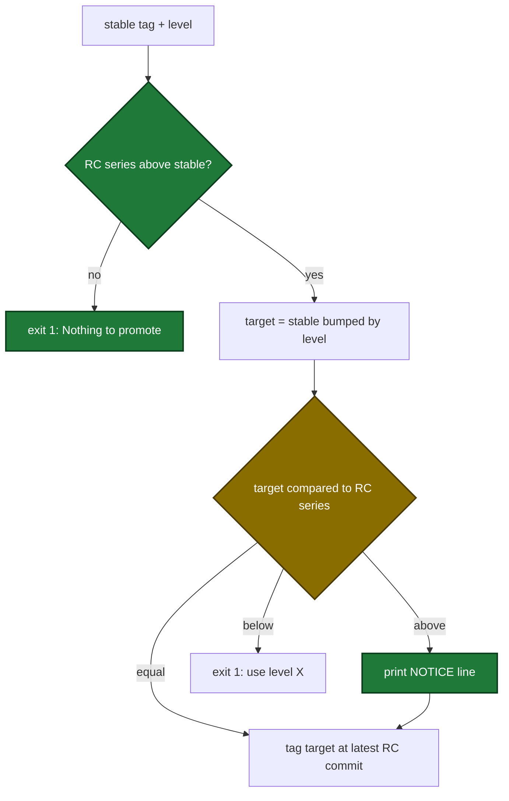

# release-ci-payloads Specification

## Purpose
Runtime behavior of the release scripts and workflows that `scaffold_ci` installs into a project: which version the changelog check uses, which branch a promotion pushes to, and when a release must stop instead of publishing partial data.

## Requirements

### Requirement: Changelog check uses the latest final tag
`check-changelog.cjs` SHALL, when `version.versionFile.enabled` is not true, check the changelog entry for the highest tag whose remainder, after removing `version.tag.prefix` (or one leading `v` when no prefix is set), matches `^\d+\.\d+\.\d+$`.

- A tag with any suffix after the patch number (for example `-rc1`) is never the checked version.
- When a prefix is set, tags that do not start with it are ignored.
- When no tag matches, the script prints `Warning: could not determine current version. Skipping changelog check.` and exits 0.

#### Scenario: RC tag sorts above the final tag
- **WHEN** the repo has tags `v1.0.0` and `v1.0.1-rc1` and `CHANGELOG.md` has `## [1.0.0]`
- **THEN** the check passes for version `1.0.0`

#### Scenario: Final tag and its RC both exist
- **WHEN** the repo has tags `v1.0.1-rc1` and `v1.0.1`
- **THEN** the checked version is `1.0.1`

#### Scenario: Configured prefix
- **WHEN** `version.tag.prefix` is `app-v` and the repo has tags `app-v2.0.0` and `v9.0.0`
- **THEN** the checked version is `2.0.0`

### Requirement: Promotion target is not below the active RC series
`promote-release.cjs` SHALL promote only when the active RC series is above the latest stable tag and the version computed from the latest stable tag and the `level` input is equal to or above the active RC series, and SHALL otherwise exit 1 before any git write.

- The script checks the series first. A series equal to or below the latest stable version gives an error that starts with `Nothing to promote:`.
- An equal target tags the target version at the latest RC commit of the series.
- A target above the series prints one line that starts with `NOTICE:` and names the target tag and the series. Then it tags the target version at the latest RC commit of the series.
- A target below the series gives an error that names the chosen level, the computed tag and the series version.
- That error names the first of `patch`, `minor`, `major` that reaches the series. When no level reaches the series, the error says `no level reaches <series> from <stable>`.
- The RC lookup and its log lines use the series version, not the target version.

Promotion decision from the inputs to the tag:

#### Scenario: Level skips past the RC series
- **WHEN** the latest stable tag is `v1.4.9`, the active RC series is `1.4.10`, and `level` is `minor`
- **THEN** the script prints a line that starts with `NOTICE:` and contains `v1.5.0, above the active RC series 1.4.10`
- **AND** the script tags `v1.5.0` at the latest `v1.4.10-rcN` commit
- **AND** no tag `v1.4.10` is pushed

#### Scenario: Level matches the RC series
- **WHEN** the latest stable tag is `v1.4.9`, the active RC series is `1.4.10`, and `level` is `patch`
- **THEN** the script tags `v1.4.10` at the latest `v1.4.10-rcN` commit
- **AND** the script prints no `NOTICE:` line

#### Scenario: Major level above the RC series
- **WHEN** the latest stable tag is `v0.3.3`, the active RC series is `0.3.4`, and `level` is `major`
- **THEN** the target is `1.0.0`
- **AND** the script prints a `NOTICE:` line before it tags `v1.0.0`

#### Scenario: Level below the RC series
- **WHEN** the latest stable tag is `v1.4.9`, the active RC series is `3.0.0`, and `level` is `patch`
- **THEN** the script exits 1 with the message `Chosen level "patch" produces v1.4.10, but the active RC series is 3.0.0. no level reaches 3.0.0 from 1.4.9`
- **AND** no tag is pushed

#### Scenario: RC series already released
- **WHEN** the latest stable tag is `v0.3.2` and the active RC series is `0.3.1` or `0.3.2`
- **THEN** the script exits 1 with a message that starts with `Nothing to promote:`
- **AND** no tag is pushed

#### Scenario: Second promotion of the same series
- **WHEN** a `patch` promotion of a series finished and the maintainer runs a second `patch` promotion
- **THEN** the second run exits 1 and stderr contains `Nothing to promote`
- **AND** no new tag is pushed

### Requirement: Promotion pushes only to the release branch
`promote-release.cjs` SHALL deliver the bump commit to the branch named by env `RELEASE_BRANCH` (default `main`), and SHALL exit 1 before any git write when `GITHUB_REF_NAME` is set and differs from that branch.

- `promote-release.yml` sets `RELEASE_BRANCH` and the checkout `ref` to `${{ github.event.repository.default_branch }}`.

#### Scenario: Dispatch from a feature branch
- **WHEN** `RELEASE_BRANCH` is `main` and `GITHUB_REF_NAME` is `feat/x`
- **THEN** the script exits 1 with a message containing `promote-release must run from "main"`
- **AND** no `git push` runs

### Requirement: Ref names validated before git and gh commands
`promote-release.cjs` and `release-on-main.cjs` SHALL reject, with exit 1 and before any git write, a branch name they will push to that does not match `^[A-Za-z0-9._/-]+$`, and SHALL quote every ref they put in a git or gh command.

#### Scenario: Shell characters in the branch name
- **WHEN** `RELEASE_BRANCH` is `main$(id)`
- **THEN** `promote-release.cjs` exits 1 with a message containing `invalid branch name`
- **AND** no `git push` runs

### Requirement: Binary build dispatch only when the workflow exists
`promote-release.cjs` SHALL run `gh workflow run release.yml` only when `.github/workflows/release.yml` exists in the repo, and SHALL otherwise log `release.yml not found — skipping binary build dispatch`.

#### Scenario: Project without release.yml
- **WHEN** a promotion succeeds in a repo with no `.github/workflows/release.yml`
- **THEN** no `gh workflow run` call is made
- **AND** the log contains `skipping binary build dispatch`

#### Scenario: Project with release.yml
- **WHEN** a promotion succeeds in a repo that has `.github/workflows/release.yml`
- **THEN** `gh workflow run release.yml --ref "<tag>"` runs once

### Requirement: Workflow inputs passed through env
`promote-release.yml` SHALL pass the `level` input to the script through env `LEVEL` and SHALL NOT expand any `${{ inputs.* }}` expression inside a `run:` script.

- The script reads `LEVEL` first, then its first argument.

#### Scenario: No input expression in run
- **WHEN** the installed `promote-release.yml` is read
- **THEN** no `run:` value contains `${{ inputs.`
- **AND** the promote step has `env.LEVEL: ${{ inputs.level }}`

### Requirement: Release stops when notes cannot be collected
`release-on-main.cjs` SHALL throw, and so exit 1 before any tag or GitHub Release is created, when collecting release notes since the last final tag fails.

| Failure | Error contains |
|---|---|
| Tag date cannot be read | `cannot read date of tag <tag>` |
| `gh pr list` fails | `gh pr list failed` |
| `gh pr list` output is not JSON | `cannot parse gh pr list output` |
| Result has 1000 PRs (the limit) | `reached the 1000 PR limit` |

- With no previous final tag, notes are empty and the release continues.

#### Scenario: gh fails during a final release
- **WHEN** `gh pr list` exits non-zero while collecting notes for a final release
- **THEN** the script exits 1 with an error containing `gh pr list failed`
- **AND** no tag and no GitHub Release are created

### Requirement: Release on main runs one at a time
`release-on-main.yml` SHALL declare a workflow-level `concurrency` block with `group: release-on-main` and `cancel-in-progress: false`.

#### Scenario: Two quick merges
- **WHEN** two pushes to `main` start the workflow within seconds
- **THEN** the second run waits until the first run ends
