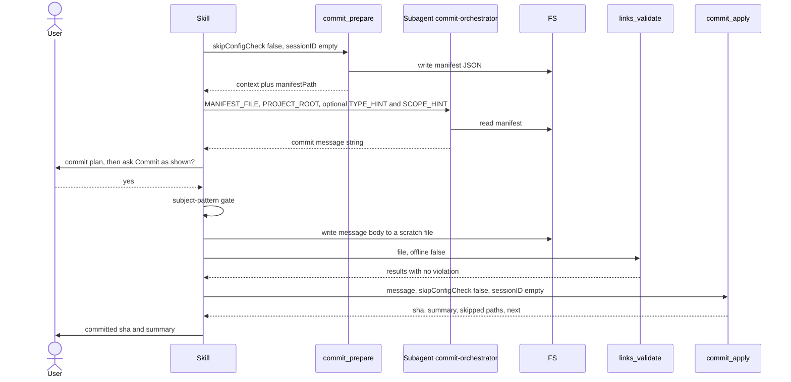

# skill-commit Specification

## Purpose
The `commit` skill (`/commit`) drafts a commit message that matches the project's style from the staged diff, shows the commit plan, and commits after user approval. It uses the `commit_prepare`, `links_validate` and `commit_apply` MCP tools and the `sdlc:commit-orchestrator` subagent.

## Requirements

### Requirement: Arguments
The skill SHALL accept the arguments `[--scope <scope>] [--type <type>] [--auto] [--force-default-branch]` with the effects below, and SHALL ignore the legacy flags `--no-stash` and `--amend`.

| Flag | Effect |
|---|---|
| `--scope <scope>` | Drafting hint for the commit scope, sent as the `SCOPE_HINT:` prompt line. No tool validates or enforces it. When set, the OpenSpec trailer lookup is skipped. |
| `--type <type>` | Drafting hint for the commit type, sent as the `TYPE_HINT:` prompt line. No tool validates or enforces it. |
| `--auto` | Skips the commit-plan approval prompt (implied `yes`). Suppresses the `harden` option at the subject-pattern gate. |
| `--force-default-branch` | No-op. There is no default-branch block to override. |
| `--no-stash`, `--amend` (legacy, not in `argument-hint`) | Ignored. The skill never stashes and always creates a new commit. |

#### Scenario: Legacy amend flag
- **WHEN** the user runs `/commit --amend`
- **THEN** the skill creates a new commit
- **AND** it does not change the previous commit

#### Scenario: Type flag reaches drafting
- **WHEN** the user runs `/commit --type fix`
- **AND** `commitConfig` is `null`
- **THEN** the orchestrator prompt has the line `TYPE_HINT: fix`
- **AND** the returned subject uses the type `fix`

#### Scenario: Force default branch flag
- **WHEN** the user runs `/commit --force-default-branch`
- **THEN** the skill behaves as if the flag were not passed

### Requirement: Plan mode stop
The skill SHALL stop before any tool call when plan mode is active.

#### Scenario: Plan mode active
- **WHEN** the system context contains `Plan mode is active`
- **THEN** the skill says `This skill requires write operations (git commit). Exit plan mode first, then re-invoke /commit.`
- **AND** it calls no MCP tool and dispatches no subagent

### Requirement: Main flow order
The skill SHALL call `commit_prepare` first, then dispatch `sdlc:commit-orchestrator`, then get approval, then pass the subject-pattern gate and the link gate, and only then call `commit_apply`.

Main flow of one `/commit` run that ends in a commit:



#### Scenario: Link gate fails
- **WHEN** `links_validate` returns an entry with `status` `violation`
- **THEN** the skill does not call `commit_apply`

### Requirement: Context gathering stop paths
The skill SHALL call `commit_prepare({ skipConfigCheck: false, sessionID: "" })` and SHALL stop when the call fails or its `errors` list is non-empty. It SHALL show every `warnings` entry before continuing.

| Condition | Skill action |
|---|---|
| `commit_prepare` returns a tool error | Show the error, stop |
| `errors` is non-empty (e.g. `no files staged for commit`, `config check failed: ...`) | Show each error, stop |
| `warnings` is non-empty | Show the warnings, continue |

#### Scenario: Nothing staged
- **WHEN** `commit_prepare` returns `errors` with `no files staged for commit`
- **THEN** the skill shows that error and stops
- **AND** it does not dispatch `sdlc:commit-orchestrator`

### Requirement: Default-branch warning
The skill SHALL warn the user before the approval prompt when `onDefaultBranch` is `true`, and SHALL NOT block the commit for that reason.

- The approval prompt is the only gate for a commit on the default branch.

#### Scenario: Commit on main
- **WHEN** `commit_prepare` returns `onDefaultBranch: true`
- **THEN** the skill warns that the commit goes directly to the default branch
- **AND** it continues to the approval prompt

### Requirement: WIP commit reporting
The skill SHALL report WIP commits listed in `wipSquash.commits` and SHALL NOT squash them.

- Message when N > 0: `Detected N WIP commit(s) from execute. This port does not squash them automatically — they will remain as separate commits in history; the new commit you are about to make is additional, not a replacement. Squash them yourself beforehand if you want a single commit for this change.`
- The skill continues after the message.
- The final subject MUST NOT start with `wip:` or `wip(execute):`; the skill checks this itself before showing the message.

#### Scenario: Two WIP commits on the branch
- **WHEN** `wipSquash.commits` holds 2 entries
- **THEN** the skill says `Detected 2 WIP commit(s) from execute.` followed by the rest of the message
- **AND** the WIP commits stay in history unchanged

### Requirement: Orchestrator dispatch
The skill SHALL dispatch `sdlc:commit-orchestrator` with `model: haiku` and a prompt of two required lines plus at most the two optional hint lines, and SHALL NOT dispatch it when `manifestPath` is empty or `(none)`.

```text
MANIFEST_FILE: <manifestPath from commit_prepare>
PROJECT_ROOT: <cwd>
TYPE_HINT: <--type value>
SCOPE_HINT: <--scope value>
```

| Hint line | Sent when |
|---|---|
| `TYPE_HINT:` | `--type` was passed, and `commitConfig.allowedTypes` is absent or contains the value |
| `SCOPE_HINT:` | `--scope` was passed, and `commitConfig.allowedScopes` is absent or contains the value |

- When a flag value is not allowed by `commitConfig`, the skill drops the hint and tells the user it was ignored.
- `commit_prepare` takes no scope, type or auto input: its `flags.scope` and `flags.type` are always `null` and `flags.auto` is always `false`. The hint lines are the only path for `--scope` and `--type`.

| Condition | Skill action |
|---|---|
| `manifestPath` empty or `(none)` | Show the `manifestPath:` warning, stop, no dispatch |
| Orchestrator returns a non-empty string | Use it as `MESSAGE` |
| Orchestrator returns an empty string | Surface the manifest `errors`, stop |

- The skill forwards `manifestPath` as given; it writes no manifest itself.
- The orchestrator has only the Read tool: it calls no git, no `gh`, no MCP tool, and writes no file.

#### Scenario: Type not in allowed types
- **WHEN** the user runs `/commit --type docs`
- **AND** `commitConfig.allowedTypes` is `["feat", "fix"]`
- **THEN** the prompt has no `TYPE_HINT:` line
- **AND** the skill tells the user that `--type docs` was ignored

#### Scenario: Manifest not written
- **WHEN** `commit_prepare` returns `manifestPath` as `(none)` and a `manifestPath:` warning
- **THEN** the skill shows that warning and stops
- **AND** no subagent is dispatched

### Requirement: Message drafting rules
The orchestrator SHALL return only one raw commit message string, with no preamble, fence, JSON or commentary, drafted from the staged diff under the rules below.

| Rule | Detail |
|---|---|
| Style | Detected from `recentCommits`; conventional commits when `recentCommits` is empty |
| Subject | 72 characters or less, imperative mood, no trailing period, no file paths |
| Body | Only when the change is non-trivial; blank line after the subject |
| Accuracy | Every claim traceable to `staged.diff`, or to `staged.diffStat` and `staged.truncatedFiles` when `staged.diffTruncated` is `true` |
| `TYPE_HINT` / `SCOPE_HINT` | Used as the type / scope when the prompt has the line |
| `commitConfig.allowedTypes` | Type chosen only from this list |
| `commitConfig.allowedScopes` | Scope chosen only from this list, or omitted |
| `commitConfig.subjectPattern` | Subject must match this regex |
| `commitConfig.requireBodyFor` | Body required when the type is in this list |
| `commitConfig.requiredTrailers` | Each key present as `Key: Value` after a blank line; empty value when unknown |
| Self-critique | Re-check each rule; at most 2 fix iterations per rule |

- `commitConfig` rules apply only when `commitConfig` is not `null`, and they win over the style from `recentCommits`.

#### Scenario: Allowed types configured
- **WHEN** `commitConfig.allowedTypes` is `["feat", "fix"]`
- **AND** `recentCommits` use the type `chore`
- **THEN** the returned subject uses `feat` or `fix`

### Requirement: OpenSpec-Change trailer
The skill SHALL append `OpenSpec-Change: <change-directory-name>` after a blank line to a message that already has a body, when `--scope` was not passed and one active OpenSpec change is found.

- Active changes: `openspec/changes/*/proposal.md`, excluding `archive/`, only when `openspec/config.yaml` exists.
- A change is chosen when it is the only active change, or when its name matches the current branch name.
- An `OpenSpec active:` line in the session-start system reminder replaces the file lookup.

#### Scenario: One active change and a body
- **WHEN** `--scope` is not passed and `openspec/changes/add-oauth2-pkce/proposal.md` is the only active change
- **AND** `MESSAGE` has a body
- **THEN** `MESSAGE` ends with `OpenSpec-Change: add-oauth2-pkce`

#### Scenario: Subject-only message
- **WHEN** one active change exists and `MESSAGE` has no body
- **THEN** no `OpenSpec-Change` trailer is added

### Requirement: Commit plan approval gate
The skill SHALL show the full commit plan and SHALL NOT call `commit_apply` before the user answers `yes` to `Commit as shown?` via AskUserQuestion, unless `--auto` was passed.

| Plan block | Source |
|---|---|
| Message | `MESSAGE` |
| Staged | `staged.diffStat` and `staged.files` |
| Also staged by commit_apply | `unstaged.files` not under `.sdlc-v2/` (omitted when empty) |
| Left out (.sdlc-v2/) | `unstaged.files` under `.sdlc-v2/` (omitted when empty) |
| Not committed (untracked) | `untracked.files` (omitted when empty) |
| Trailer | `OpenSpec-Change` value, when added |

| Answer | Skill action |
|---|---|
| `yes` | Go to the subject-pattern gate |
| `edit` | Ask what to change, revise `MESSAGE`, re-check the subject pattern, show the plan again |
| `cancel` | Abort with no change |

- The plan says that `MESSAGE` describes the staged diff only.
- With `--auto`, the plan is still shown and the answer is taken as `yes`.

#### Scenario: User cancels
- **WHEN** the user answers `cancel`
- **THEN** the skill calls neither `links_validate` nor `commit_apply`

#### Scenario: Auto mode
- **WHEN** the skill runs with `--auto`
- **THEN** it shows the commit plan
- **AND** it asks no approval question

### Requirement: Subject-pattern gate
The skill SHALL check, without running a command, that the subject matches `commitConfig.subjectPattern` when that key is set, and SHALL NOT commit a subject that does not match.

- Skipped when `commitConfig` is `null` or `subjectPattern` is absent.
- On mismatch the skill shows `commitConfig.subjectPatternError`, or the pattern when that key is absent.
- It then asks via AskUserQuestion: `edit subject`, `harden`, `cancel`. No other choice overrides the gate.
- `harden` is not offered with `--auto`.
- `harden` dispatches `Skill(harden)` with `--failure-text "Subject pattern reject: subject does not match commitConfig.subjectPattern"`, `--skill commit`, `--step "Step 5 — subject pattern gate"`, `--operation "subject pattern validation"`.

#### Scenario: Subject does not match
- **WHEN** `commitConfig.subjectPattern` is set and the subject does not match it
- **AND** `commitConfig.subjectPatternError` is set
- **THEN** the skill shows the `subjectPatternError` text
- **AND** it does not call `commit_apply`

### Requirement: Link verification gate
The skill SHALL write the commit message body to a scratch file with the Write tool, call `links_validate` on it, and SHALL stop when any result has `status` `violation`.

- Call: `links_validate({ file: "<scratch file path>", offline: false })`.
- `offline: true` is used in sandboxed or offline environments.
- `ok` and `skipped` results pass.
- On a violation the skill shows each violation's `url`, `line`, `reason` and `detail`, then stops. It does not retry and does not edit URLs without user input.

#### Scenario: Unreachable link in the body
- **WHEN** `links_validate` returns one entry with `status` `violation` and `reason` `url-not-found`
- **THEN** the skill shows that entry's `url`, `line`, `reason` and `detail`
- **AND** it stops without calling `commit_apply`

### Requirement: Commit call and failure handling
The skill SHALL call `commit_apply({ message: MESSAGE, skipConfigCheck: false, sessionID: "" })` once both gates pass, and SHALL show any tool error and stop.

- When a pre-commit hook rejected the commit, the skill says `The commit hook rejected this commit. Fix the hook issue and re-run /commit.`
- There is no stash to restore after a failure.

#### Scenario: Hook rejects the commit
- **WHEN** `commit_apply` fails because a pre-commit hook rejected the commit
- **THEN** the skill says `The commit hook rejected this commit. Fix the hook issue and re-run /commit.`
- **AND** it stops

### Requirement: Commit contents
The skill SHALL commit every tracked change outside `.sdlc-v2/` together with what is already staged. It SHALL NOT stage untracked files, stash, or amend.

- At least one file must be staged before the run.
- Staging a subset does not narrow the commit: unstaged tracked edits outside `.sdlc-v2/` are committed too.

#### Scenario: Partial staging
- **WHEN** `a.ts` is staged and the tracked `b.ts` has unstaged edits
- **THEN** the commit holds both `a.ts` and `b.ts`
- **AND** the plan lists `b.ts` under `Also staged by commit_apply`

### Requirement: Result reporting
The skill SHALL treat a non-empty `sha` as success, show the first 7 characters of `sha` with the subject and the `summary` text verbatim, and SHALL NOT report any path in `skippedUntrackedPaths` or `skippedTrackedPaths` as committed.

- The skill does not recompute a file count or diff stat.
- Blocks `Not committed (untracked)` and `Not committed (.sdlc-v2/)` are shown only when the matching list is not `(none)`.
- When a skipped list is non-empty, the skill follows the `**Next:**` line verbatim.
- Without a `**Next:**` line, the skill tells the user to `git add` the listed paths and run `/commit` again, and says this makes a second commit.

#### Scenario: Untracked file left out
- **WHEN** `commit_apply` returns `skippedUntrackedPaths` holding `src/auth/notes.md`
- **THEN** the skill lists `src/auth/notes.md` under `Not committed (untracked)`
- **AND** it follows the returned `**Next:**` instruction

### Requirement: Learning capture
The skill SHALL call `learnings_log` with `action: "append"` after a commit when the detected commit style was non-conventional or unusual.

- Entry format: `## YYYY-MM-DD — commit: <brief summary>` followed by what was learned.

#### Scenario: Ticket-prefix style
- **WHEN** the commit succeeds and `recentCommits` use a non-conventional style such as `PROJ-123: ...`
- **THEN** the skill calls `learnings_log` with `action: "append"` and an entry starting `## ` and containing `— commit:`

### Requirement: Error reporting
The skill SHALL invoke the `error-report` skill only for a `commit_apply` error that looks like a defect, not a user or config problem.

| Error | Invoke `error-report` |
|---|---|
| `commit_prepare` tool error | No |
| `errors` includes `no files staged for commit` | No |
| `commit_apply` error from a pre-commit hook | No |
| `commit_apply` other error that looks like a defect | Yes |
| `links_validate` violations | No |

- The report carries: Skill `commit`, Step, Operation (tool name and input), Error (tool message), and Suggested investigation (git identity, branch protection rules).

#### Scenario: Unexpected commit_apply failure
- **WHEN** `commit_apply` returns an `InfraError` that is not a hook failure and looks like a defect
- **THEN** the skill invokes `error-report` with Skill `commit`
