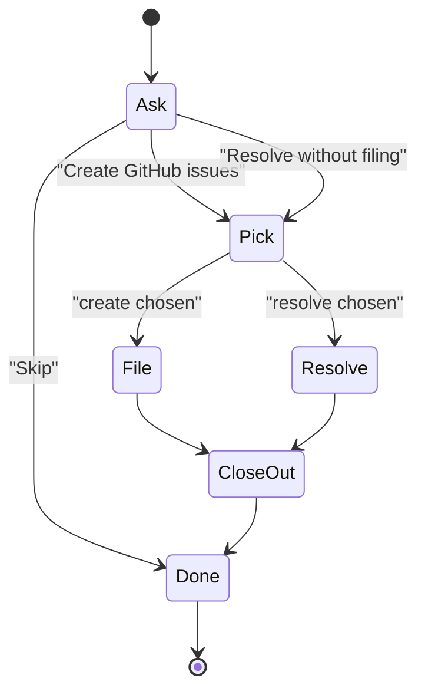

# skill-deferred Specification

## Purpose
The `deferred` skill lists and triages deferred items (review findings and issue drafts that earlier pipeline runs recorded but did not fix). Users invoke it to file items as GitHub issues or resolve them; `ship` Step 10b follows the same triage flow.

## Requirements

### Requirement: Arguments and modes
The skill SHALL select its mode from the arguments below and SHALL stop with the usage line `/sdlc:deferred [--list | --resolve <id>]` before calling any tool when the arguments are invalid.

| Arguments | Mode |
|---|---|
| none | Triage |
| `--list` | List open items |
| `--resolve <id>` | Resolve one item without filing |

Invalid: both flags, `--resolve` without an id, or any other argument.

#### Scenario: Both flags given
- **WHEN** the skill is invoked with `--list --resolve d1`
- **THEN** it prints `/sdlc:deferred [--list | --resolve <id>]` and stops
- **AND** it calls no tool

### Requirement: Store access through ship_state only
The skill SHALL read and change deferred items only through `ship_state` actions and SHALL NOT read or edit `<MAIN_ROOT>/.sdlc-v2/history/deferred.json` directly.

| Action | Returns | Notes |
|---|---|---|
| `deferred_list` | `issues`, `openCount` | `issues` includes resolved items; no `display` |
| `deferred_propose_followups` | `openCount`, `groups`, `display` | `groups` maps `high` / `medium` / `low` to open items; `display` is empty when `openCount` is 0 |
| `deferred_resolve` (`detail.id`) | `ok`, `id` | Unknown id is a DomainError pointing at `deferred_list`; an already-resolved id succeeds and changes nothing |

- An item has `id`, `created`, `source`, `priority`, `description`, `status`, and may have `severity`, `file`, `line`, `reason`.
- The skill never adds an item.

#### Scenario: Unknown id
- **WHEN** `ship_state({action:"deferred_resolve", detail:{id:"nope"}})` is called for an id not in the store
- **THEN** it returns a DomainError whose suggestion names `deferred_list`

### Requirement: List mode
With `--list`, the skill SHALL call `ship_state({action:"deferred_list"})` and print a Markdown table of open items only, then stop without asking or changing anything.

| Column | Value |
|---|---|
| `ID` | `id` |
| `Priority` | `priority` |
| `Reason` | `reason`, else `source` |
| `Created` | `created` |
| `Description` | `description`, plus ` (file:line)` when `file` is set; `:line` dropped when `line` is 0 |

- Rows: high priority first, oldest first within one priority.
- When `openCount` is 0 it prints exactly `No deferred items open.` and no table.

#### Scenario: No open items
- **WHEN** `deferred_list` returns `openCount: 0`
- **THEN** the skill prints `No deferred items open.`

#### Scenario: Resolved items hidden
- **WHEN** the store holds one open and one resolved item
- **THEN** the table has one row

### Requirement: Resolve mode
With `--resolve <id>`, the skill SHALL check the item status with `deferred_list` first and SHALL call `deferred_resolve` only when the item is not already resolved.

- Already resolved: print `<id> is already resolved.` and stop.
- Success: print `Resolved <id> without filing an issue.`
- Tool error: print the message and suggestion as given; for an unknown id tell the user to run `/sdlc:deferred --list`.
- This mode asks no question and calls no `gh` command.

#### Scenario: Id already resolved
- **WHEN** `--resolve d1` names an item whose `status` is `resolved`
- **THEN** the skill prints `d1 is already resolved.`
- **AND** it does not call `deferred_resolve`

#### Scenario: Open id resolved
- **WHEN** `--resolve d1` names an open item
- **THEN** the skill calls `ship_state({action:"deferred_resolve", detail:{id:"d1"}})`
- **AND** prints `Resolved d1 without filing an issue.`

### Requirement: Triage mode entry
With no arguments, the skill SHALL call `ship_state({action:"deferred_propose_followups"})`, print exactly `No deferred items open.` and stop when `openCount` is 0, and otherwise render `display` verbatim before the triage flow.

- `display` is never paraphrased or reformatted.
- Triage mode has no auto mode; it always asks before it acts.

#### Scenario: Open items exist
- **WHEN** `openCount` is 3
- **THEN** the skill prints `display` unchanged
- **AND** it asks the triage question

### Requirement: Triage question and item pick
The skill SHALL ask one `AskUserQuestion` with options **Create GitHub issues**, **Resolve without filing** and **Skip**, then, for the first two, ask which items to act on.

Triage flow:



- **Skip** changes nothing; every item stays open.
- The pick is one multi-select question, one option per open item, labelled `[<id>] <description>`.
- Exactly one open item is picked without asking.
- When there are more items than the question can list, the skill prints the ids and asks for ids or `all` in chat.

#### Scenario: Single open item
- **WHEN** one item is open and the user picks **Resolve without filing**
- **THEN** the skill resolves that item without a pick question

### Requirement: File picked items with approval
For each picked item, the skill SHALL show the full title and body in chat and get approval (file, change, or skip this item) before running `gh issue create` with label `deferred-followup`.

- The body is passed to `gh` from a file or standard input, not inline.
- "change the text" takes edits, shows the full text again, and asks again.
- "skip" leaves the item open.
- After `gh` succeeds the skill calls `deferred_resolve` for the item and prints the issue URL.
- No issue body carries an AI-tool attribution line.

#### Scenario: Issue filed
- **WHEN** the user approves the shown text and `gh issue create` succeeds
- **THEN** the skill calls `deferred_resolve` for that item
- **AND** prints the issue URL

#### Scenario: No approval
- **WHEN** the user picks skip for an item
- **THEN** `gh issue create` is not run and the item stays open

### Requirement: Filing failure handling
When `gh issue create` fails, the skill SHALL print the error, leave the item open, not call `deferred_resolve`, and act on the failure kind below.

| `gh issue create` failure | Action |
|---|---|
| Auth, permission, or repo not found | Stop the batch and tell the user what to fix |
| Network, 5xx, or rate limit | Retry this item once; on a second failure stop the batch |
| Timeout or killed command | Run `gh issue list --label deferred-followup --search "<title>"`; if found treat as filed, else retry once |
| Missing `deferred-followup` label | Handle the label (see Label creation), then retry this item |
| Anything else | Go on to the next item |

- If `deferred_resolve` fails after the issue exists, the skill prints the URL and tells the user to run `/sdlc:deferred --resolve <id>`; it does not file again.

#### Scenario: Auth failure
- **WHEN** `gh issue create` fails with an auth error on the first of three items
- **THEN** the skill stops the batch
- **AND** all three items stay open

### Requirement: Label creation needs approval
The skill SHALL NOT run `gh label create deferred-followup` without asking the user first, and SHALL offer filing without the label as the other choice.

#### Scenario: Label missing, user declines creation
- **WHEN** the label is missing and the user chooses to file without it
- **THEN** the issue is created with no label
- **AND** `gh label create` is not run

### Requirement: Resolve without filing
For **Resolve without filing**, the skill SHALL call `deferred_resolve` for each picked item with no draft, no `gh` call and no further question.

#### Scenario: Two items resolved
- **WHEN** the user picks two items under **Resolve without filing**
- **THEN** the skill calls `deferred_resolve` twice
- **AND** it runs no `gh` command

### Requirement: Close-out line
At the end of the triage flow the skill SHALL print one line with three counts: items filed, items resolved without filing, and items still open.

#### Scenario: Mixed outcome
- **WHEN** two items are open, one is filed and the other is skipped
- **THEN** the close-out line reports 1 filed, 0 resolved without filing, 1 still open

### Requirement: Issue text
The skill SHALL use the item `description` as the title and build the body below, leaving out any line whose field is empty.

```text
## Deferred follow-up

{description}

- Priority: {priority}
- Recorded: {created}
- Severity: {severity}
- Location: {file}:{line}
- Reason deferred: {reason}
- Deferred item id: {id}
```

- `Location` drops `:{line}` when `line` is 0 or unset.
- The body has no `Source` line.
- When the caller holds a fuller draft (ship execute-drift drafts with `title` and `body`), that draft is used instead; it goes through the same show and approve steps.

#### Scenario: Item without file
- **WHEN** the item has no `file`
- **THEN** the body has no `Location` line
