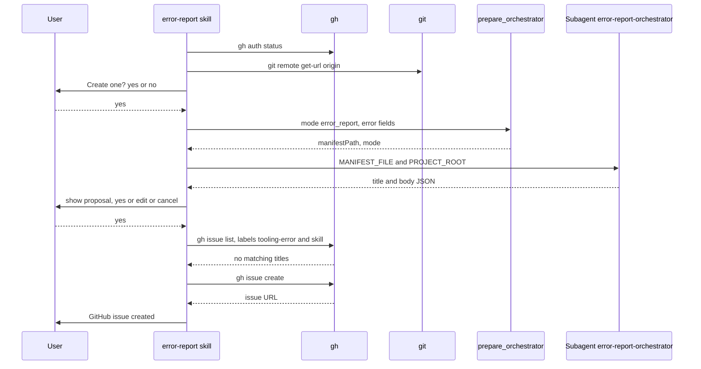

# skill-error-report Specification

## Purpose
The `error-report` skill proposes a GitHub issue in `rnagrodzki/sdlc-plugin` for an actionable sdlc tooling error, with two user consent gates and a duplicate search. Other sdlc skills dispatch it from their error paths; a user can also invoke it directly with the error fields inline.

## Requirements

### Requirement: Invocation
The skill SHALL run only when another skill dispatches it through the Skill tool or a user invokes `/sdlc:error-report` with the error fields, and SHALL NOT trigger on conversation content alone.

| Input | Meaning |
|---|---|
| Skill | Skill that hit the error |
| Step | Step that failed |
| Operation | What was being attempted |
| Error | Full error details (exit code, message, HTTP status) |
| Suggested investigation | Skill-specific diagnostic hints |

- Direct form: `/sdlc:error-report skill=<skill> step=<step> operation=<operation> error=<errorText> exitOrHttpCode=<code> errorType=<type>`.
- The skill front matter sets `user-invocable: true` and pins no `model`.

#### Scenario: Caller cannot use the Skill tool
- **WHEN** a calling skill cannot dispatch `error-report` through the Skill tool
- **THEN** the user can run `/sdlc:error-report` with the same fields inline

### Requirement: Issue-worthiness filter
The skill SHALL continue only for issue-worthy errors and SHALL return silently to the caller's error handling for all others.

| Issue-worthy | Not issue-worthy |
|---|---|
| MCP `*_prepare` tool returns a domain or infra error | Domain-validation error from a prepare tool (missing or invalid input) |
| `gh pr create` / `gh pr edit` fails with a non-auth error; `git tag` or `git push` fails | HTTP 401 or 403 |
| HTTP 400 / 5xx on the same external API operation 2+ times in a row | HTTP 404 on an issue key |
| HTTP 409 that persists after one retry | User cancellation |
| `execute` task fails after 2 retries | Lint-only failure |
| Build failure that blocks wave progression | Missing project key or config; `gh auth` not logged in |

#### Scenario: Expired token
- **WHEN** the reported error is HTTP 401
- **THEN** the skill shows no proposal and returns to the caller

### Requirement: Pre-flight checks
Before any prompt, the skill SHALL run `gh auth status` and `git remote get-url origin`, and SHALL skip the proposal silently when either fails or the remote is empty.

- The remote check only confirms a remote exists; the target repo is always `rnagrodzki/sdlc-plugin`.

#### Scenario: gh not authenticated
- **WHEN** `gh auth status` exits non-zero
- **THEN** the skill asks nothing and returns to the caller's error handling

### Requirement: Main flow ordering
The skill SHALL run classify, pre-flight, consent gate 1, `prepare_orchestrator`, orchestrator dispatch, consent gate 2, duplicate search, then issue creation, with both gates and all `gh` calls in the main context.

Main flow when no duplicate issue exists:

#### Scenario: Normal creation
- **WHEN** both gates get **yes** and no duplicate is found
- **THEN** the skill prints `GitHub issue created: #<number> — <url>`

### Requirement: Consent gate 1
The skill SHALL ask `This error may be worth tracking as a GitHub issue. Create one? (yes / no)` with `AskUserQuestion` before calling any tool that prepares the report.

- On **no** it returns to the caller's error handling and does nothing else.

#### Scenario: User declines
- **WHEN** the user answers **no** at gate 1
- **THEN** `prepare_orchestrator` is not called

### Requirement: Manifest preparation
After gate 1, the skill SHALL call `prepare_orchestrator` with `mode: "error_report"` and `skill`, `step`, `operation`, `errorText`, `exitOrHttpCode`, `errorType`, `userIntent`, `argsString`, `suggestedInvestigation`.

- `skill`, `step`, `operation` and `errorText` are required; the rest may be empty.
- The tool returns only `manifestPath` and `mode`.
- On a tool error the skill shows the error and stops; it does not dispatch `error-report` on its own failure.

#### Scenario: Prepare tool fails
- **WHEN** `prepare_orchestrator` returns an error
- **THEN** the skill shows the error message and stops

### Requirement: Orchestrator dispatch
The skill SHALL dispatch `sdlc:error-report-orchestrator` with model `haiku` and a prompt of exactly two lines, `MANIFEST_FILE: <manifestPath>` and `PROJECT_ROOT: <cwd>`, and SHALL stop when the response does not parse as `{title, body}`.

The subagent:

- Reads the manifest and takes the `ToolingError.md` template text from its `template` field; it reads no template file from `PROJECT_ROOT`.
- Fills every `{placeholder}` only from manifest fields and removes a section whose field is empty.
- Builds the title `[<skill>] <one-line error summary>`, at most 72 characters.
- Calls no `gh` or `git`, writes no file, and returns only the JSON object.

Priority shown at gate 2:

| Priority | Error kinds |
|---|---|
| High | Prepare-tool crash or infra error; build failure blocking waves |
| Medium | CLI failure; persistent API error; escalated task failure |

#### Scenario: Unparseable response
- **WHEN** the subagent response is not valid JSON
- **THEN** the skill removes the manifest file and stops

#### Scenario: User project without the plugin tree
- **WHEN** the skill runs in a user project that has no `skills/error-report/templates/ToolingError.md`
- **THEN** the subagent builds the body from the manifest `template` field
- **AND** it does not try to read a template path under `PROJECT_ROOT`

### Requirement: Issue body template
The issue body SHALL follow the `ToolingError.md` section layout with no raw `{placeholder}` text left.

| Section | Filled from |
|---|---|
| `## Error Summary` | One-line summary of `errorText` |
| `## Skill Context` | `skill`, `step`, `operation`, `timestamp` |
| `## Error Details` | `errorType`, `exitOrHttpCode`, `errorText` in a code fence |
| `## Environment` | `repository`, `currentBranch` |
| `## Reproduction` | `userIntent`, `argsString`, `step` |
| `## Impact` | One line inferred from `operation` |
| `## Suggested Investigation` | `suggestedInvestigation` |

#### Scenario: No investigation hints
- **WHEN** `suggestedInvestigation` is empty
- **THEN** the body has no `## Suggested Investigation` section

### Requirement: Consent gate 2
The skill SHALL show the title, priority, labels (`tooling-error`, `<skill>`) and body, then ask **yes**, **edit** or **cancel** with `AskUserQuestion`.

- **edit** applies the change in the main context, without a new dispatch, and asks again.
- **cancel** removes the manifest and returns to the caller; nothing is created.

#### Scenario: User edits the title
- **WHEN** the user answers **edit** with a new title
- **THEN** the skill shows the updated proposal and asks again

### Requirement: Duplicate issue search
After gate 2 **yes**, the skill SHALL list open issues with `gh issue list --repo "rnagrodzki/sdlc-plugin" --label "tooling-error" --label "<skill>" --state open --limit 10 --json number,title,url` and keep those whose title starts with `[<skill>]`.

- No match: go to issue creation without a prompt.
- Matches: ask **comment**, **new** or **cancel**.
- **comment**: user picks an issue, approves the body `Additional occurrence reported by error-report:` plus the proposal body, then the skill runs `gh issue comment <number> --repo "rnagrodzki/sdlc-plugin" --body ...` and prints `Comment added to #<number> — <url>`.
- **cancel** at any point: remove the manifest, create nothing.

#### Scenario: Similar issue exists
- **WHEN** an open issue titled `[plan] Gate A dispatch timeout` exists and the skill is `plan`
- **THEN** the skill offers **comment**, **new** and **cancel**

### Requirement: Issue creation
The skill SHALL create the issue with `gh issue create --repo "rnagrodzki/sdlc-plugin" --title ... --body ... --label "tooling-error" --label "<skill>"` and SHALL retry at most once.

- When a label is missing it runs `gh label create "tooling-error" ... --color "d93f0b"` and `gh label create "<skill>" ... --color "0075ca"`, then retries once.
- After a failed retry it prints `Could not create GitHub issue: <error>` and does not retry again.
- The title and body never carry an AI-tool attribution line.
- Issues are never created in any repository other than `rnagrodzki/sdlc-plugin`.

#### Scenario: Retry also fails
- **WHEN** `gh issue create` fails, labels are created, and the retry fails
- **THEN** the skill prints `Could not create GitHub issue: <error>`
- **AND** it makes no third attempt

### Requirement: Return to caller and cleanup
The skill SHALL remove the manifest with `rm -f "<manifestPath>"` on every stop after `prepare_orchestrator`, and SHALL return control to the calling skill's error handling without replacing it.

#### Scenario: After success
- **WHEN** the issue is created
- **THEN** the manifest file is removed
- **AND** the calling skill continues with its own error output and stop behavior
