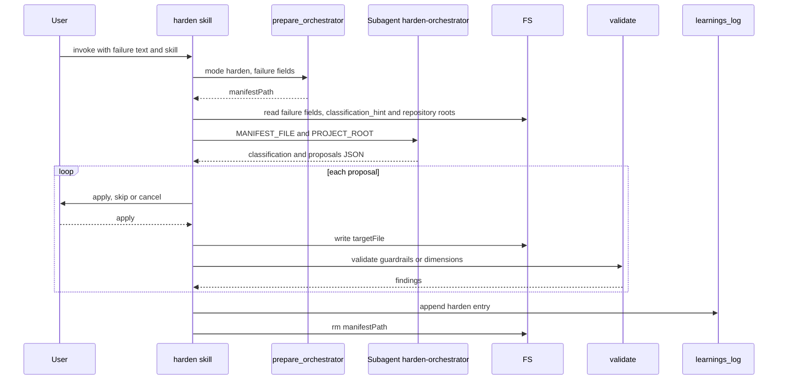

# skill-harden Specification

## Purpose
The `harden` skill runs after an SDLC pipeline failure and proposes strengthen-only edits to plan guardrails, execute guardrails, review dimensions and Copilot instructions, applied only with approval. Users, caller-skill failure menus, `received-review` and the `ship` harden step invoke it.

## Requirements

### Requirement: Input modes and flags
The skill SHALL require exactly one of `--failure-text`, `--from-issue` or `--from-learnings`, and SHALL stop with an error before calling `prepare_orchestrator` when none or more than one is given.

| Flag | Meaning |
|---|---|
| `--failure-text <text>` | Failure text given inline (default mode) |
| `--from-issue <num>` | Failure text is the body of GitHub issue `<num>` |
| `--from-learnings` | Triage every non-harden learnings entry |
| `--skill <name>` | Failing skill; required with `--failure-text` and `--from-issue`, ignored with `--from-learnings` |
| `--step`, `--operation`, `--exit-code`, `--error-type`, `--user-intent`, `--args-string` | Optional failure context passed to `prepare_orchestrator` |
| `--auto` | Accept every proposal without prompting (see Auto mode) |

#### Scenario: Two input modes given
- **WHEN** the skill is invoked with both `--failure-text "x"` and `--from-issue 12`
- **THEN** it stops with a mutual-exclusion error
- **AND** it does not call `prepare_orchestrator`

#### Scenario: No input mode given
- **WHEN** the skill is invoked with only `--skill plan`
- **THEN** it stops with an error message

### Requirement: Auto mode
The skill SHALL honour `--auto` only when it appears in its own arguments outside any quoted value, and under `--auto` SHALL call `AskUserQuestion` nowhere while keeping every strengthen-only and validate-and-revert rule.

- `--auto` is never inferred from pipeline context, conversation history or running as a subagent.
- Text inside `--failure-text "..."` that reads `--auto` is failure text, not a flag.
- `--auto` with `--from-learnings` is invalid: the skill stops with an error before calling `prepare_orchestrator`.
- Under `--auto` the skill never invokes `error-report`.

#### Scenario: --auto inside failure text
- **WHEN** the skill is invoked with `--failure-text "reviewer said --auto" --skill ship`
- **THEN** it runs with per-proposal approval prompts

#### Scenario: --auto with --from-learnings
- **WHEN** the skill is invoked with `--from-learnings --auto`
- **THEN** it stops with an error
- **AND** it does not call `prepare_orchestrator`

### Requirement: Main flow ordering
In `--failure-text` / `--from-issue` mode, the skill SHALL call `prepare_orchestrator` with `mode: "harden"` as its first tool call after argument parsing, then dispatch `sdlc:harden-orchestrator`, then present and apply proposals, then record a learnings entry.

Main flow for `--failure-text` / `--from-issue` mode:



- `skipConfigCheck` is `false` in this call.
- The skill does not read `.sdlc-v2/config.toml`, guardrail files or dimension files to decide classification.

#### Scenario: prepare_orchestrator returns an error
- **WHEN** `prepare_orchestrator` returns an error
- **THEN** the skill shows the error and stops
- **AND** it does not dispatch `harden` again or offer `error-report` for a validation error

### Requirement: Classification preview and plugin-defect hint
The skill SHALL read only `failure.*` and `classification_hint` from the manifest for the preview, show the preview, and SHALL skip the orchestrator when `classification_hint` is `plugin-defect`.

- Before dispatch it also reads `repository.contentRoot` and `repository.root`; it never loads the surface arrays.
- `classification_hint` is `plugin-defect` when `--from-issue` fetched an issue labelled `mcp-failure`.
- With that hint the skill goes straight to the plugin-defect route.
- With that hint the skill builds the result itself, in the orchestrator's plugin-defect shape: `classification: "plugin-defect"`, `routeToErrorReport: true`, `proposals: []`, a rationale naming the `mcp-failure` label, and `errorReportPayload` filled from `failure.*` (`errorType` defaults to `script crash`).

#### Scenario: Issue labelled mcp-failure
- **WHEN** `--from-issue 42` fetches an issue with label `mcp-failure`
- **THEN** the skill does not dispatch `sdlc:harden-orchestrator`
- **AND** it follows the plugin-defect route
- **AND** the payload it shows on that route is built from the manifest's `failure.*` fields

### Requirement: Orchestrator dispatch
The skill SHALL dispatch `sdlc:harden-orchestrator` with model `haiku` and a prompt of exactly two lines, `MANIFEST_FILE: <manifestPath>` and `PROJECT_ROOT: <repository.contentRoot>`, and SHALL stop when the response is not valid JSON.

The subagent returns one JSON object:

| Field | Meaning |
|---|---|
| `classification` | `user-code`, `plugin-defect` or `ambiguous` |
| `classificationRationale` | One sentence tied to the failure text or a manifest field |
| `routeToErrorReport` | `true` only for `plugin-defect` |
| `errorReportPayload` | `skill`, `step`, `operation`, `errorText`, `exitOrHttpCode`, `errorType`, or `null` |
| `skipped.reviewDimensions.rationale` | Why no review-dimension proposal was made |
| `proposals[]` | `surface`, `action` (`add` / `strengthen` / `consolidate`), `targetFile`, `patch`, `rationale` |

- The subagent only reads files. It does not call `gh` or `git` and writes nothing.
- `proposals` list `review-dimensions` first, then `plan-guardrails`, `execute-guardrails`, `copilot-instructions`.

#### Scenario: Orchestrator returns prose
- **WHEN** the subagent response is not parseable JSON
- **THEN** the skill shows the raw response and stops without retrying
- **AND** it removes the manifest file

### Requirement: Classification branching
The skill SHALL route `plugin-defect` results with `routeToErrorReport: true` to the plugin-defect route with no surface edits, and SHALL route `user-code` and `ambiguous` results to the proposal loop after showing the classification and rationale.

#### Scenario: No proposals
- **WHEN** the classification is `user-code` and `proposals` is empty
- **THEN** the skill prints `No actionable hardening proposals — the failure signal does not point at any of the loaded surfaces.`
- **AND** it removes the manifest and exits

### Requirement: Per-proposal approval and write order
The skill SHALL ask `AskUserQuestion` with options **apply**, **skip**, **cancel** for each proposal (unless `--auto`), and SHALL write each approved proposal to disk before presenting the next one.

- Each iteration re-reads `targetFile` from disk first.
- Approved changes are never batched across proposals.
- **cancel** stops the whole run after recording what was applied so far.
- Under `--auto` every proposal is treated as **apply**.

#### Scenario: User skips a proposal
- **WHEN** the user answers **skip** for proposal 1 of 2
- **THEN** proposal 1 is not written
- **AND** proposal 2 is presented

### Requirement: Target path confinement
Before any write, in every mode, the skill SHALL resolve `targetFile` to a clean absolute path and SHALL write only when it matches the proposal surface.

| `surface` | Allowed `targetFile` |
|---|---|
| `plan-guardrails`, `execute-guardrails` | exactly `<CONTENT_ROOT>/.sdlc-v2/config.toml` |
| `review-dimensions` | a `*.md` file directly in `<CONTENT_ROOT>/.sdlc-v2/review-dimensions/` |
| `copilot-instructions` | a `*.instructions.md` file directly in `<CONTENT_ROOT>/.github/instructions/` |

- A `..` segment, a symlink leaving the tree, a mismatch, or any other surface blocks the write.
- Without `--auto` the rejected path is shown and the proposal counts as **skip**.
- With `--auto` it is listed under `Skipped` as `targetFile outside surface: <path>`.
- A `skill-recommendation` proposal is never applied; under `--auto` it is listed as `skill-recommendation surface`.

#### Scenario: Path outside the surface
- **WHEN** a `plan-guardrails` proposal has `targetFile` `<CONTENT_ROOT>/../other/config.toml`
- **THEN** the skill does not write the file

### Requirement: Write, validate, revert
The skill SHALL validate each written proposal right after the write and SHALL restore the previous file content when validation reports findings.

| `surface` | Validation call |
|---|---|
| `plan-guardrails` / `execute-guardrails` | `validate({action: "guardrails", section: "plan" or "execute", activeWorktree: true})` |
| `review-dimensions` | `validate({action: "dimensions"})` |
| `copilot-instructions` | none |

- Without `--auto`: after the revert, `AskUserQuestion` offers **retry** (user adjusts the patch) or **cancel** (skip this proposal).
- With `--auto`: revert, no retry, list under `Reverted` with the first finding, continue.
- A `consolidate` proposal replaces the fields of the guardrail with the id cited in `patch`; it never removes fields or lowers severity.
- A `consolidate` whose guardrail id does not exist is malformed: shown to the user, or under `--auto` listed as `malformed consolidate` and skipped.

#### Scenario: New guardrail fails validation
- **WHEN** an applied `plan-guardrails` proposal makes `validate` return findings
- **THEN** `.sdlc-v2/config.toml` is restored to its pre-write content
- **AND** the findings are shown to the user

### Requirement: Copilot mirror for a new review dimension
After a successful `add` on `review-dimensions`, the skill SHALL call `dimensions_render_instructions` with `file: <targetFile>`, `commonFile: <CONTENT_ROOT>/.sdlc-v2/review-dimensions/_common.md` and `projectRoot: <CONTENT_ROOT>`, and SHALL halt the proposal loop when it fails.

- `strengthen` and `consolidate` actions do not regenerate a mirror.
- On failure the skill prints `Dimension written to <targetFile> but the Copilot mirror could not be created (<error>) — resolve manually before continuing.`
- On success it prints `Mirrored review dimension → <path>`.

#### Scenario: Mirror generation fails
- **WHEN** `dimensions_render_instructions` returns an error
- **THEN** no further proposal is processed
- **AND** under `--auto` the remaining proposals are listed under `Not processed`

### Requirement: Ambiguous upstream-report offer
When the classification is `ambiguous` and `errorReportPayload` is not `null`, the skill SHALL ask, after the proposal loop, whether to invoke `error-report` with options **invoke error-report** and **skip**.

- With `errorReportPayload: null` no offer is shown.
- Under `--auto` no offer is shown and the payload is listed under `Not filed`.

#### Scenario: User accepts the offer
- **WHEN** the user picks **invoke error-report**
- **THEN** the skill invokes `error-report` with the payload fields

### Requirement: Plugin-defect route
On the plugin-defect route the skill SHALL show `errorReportPayload`, ask **invoke error-report** or **cancel**, and SHALL edit no hardening surface.

- On **invoke error-report** it passes `skill`, `step`, `operation`, `error` (failure text), `exitOrHttpCode` and `errorType` (default `script crash`).
- Under `--auto` it only shows the payload, lists it under `Not filed`, and records `Routed: no`.

#### Scenario: Plugin defect under --auto
- **WHEN** the classification is `plugin-defect` and `--auto` is set
- **THEN** the skill does not invoke `error-report`
- **AND** the auto summary lists the payload under `Not filed`

### Requirement: Auto summary
Under `--auto` the skill SHALL print one summary block as its output, after the ambiguous offer step and on every early exit (empty proposals, mirror halt, plugin-defect route).

```text
harden --auto: {A} auto-accepted, {R} reverted, {S} skipped, {U} not processed
Auto-accepted:
Reverted (validation failed, file restored):
Skipped:
Not processed (5b halt):
Not filed (needs a human — invoke error-report manually):
```

- The header line is always printed; empty sections are omitted.
- A reverted proposal never appears under `Auto-accepted`.

#### Scenario: One accepted, one reverted
- **WHEN** under `--auto` proposal 1 passes validation and proposal 2 fails it
- **THEN** the header reads `harden --auto: 1 auto-accepted, 1 reverted, 0 skipped, 0 not processed`

### Requirement: Ship healing records
When its own `--step` argument is exactly `ship harden`, the skill SHALL call `ship_state` `healing_record` with `step: "harden"` and `detail.kind: "hardened"`: with `phase: "started"` before the proposal loop handles its first proposal, and with `phase: "done"` once at the run's exit.

- Both calls pass the same `trigger` (first 200 characters of the failure text), so `done` replaces `started`.
- On the empty-proposals exit and the plugin-defect route only `done` is sent, with `applied: []`.
- `done` carries `classification`, `applied[]` (`surface`, `action`, `targetFile`) and `skipped` count.
- A tool error prints one warning line and the run continues.
- With any other `--step` value neither call is made.

#### Scenario: Standalone run
- **WHEN** the skill runs with `--step "Step 5"`
- **THEN** it does not call `ship_state`

### Requirement: Learning capture
The skill SHALL append one entry through `learnings_log({action: "append"})` at the end of every run that reaches it.

```text
## YYYY-MM-DD — harden: <classification> for <failure.skill> at <failure.step>
Applied: <count> proposal(s) across <surface-list> | Skipped: <count> | Routed: <yes|no>
AmbiguousOffer: <not-applicable|offered-dispatched|offered-skipped|auto-suppressed>
Trigger: <first 80 chars of failure.text>
Dimensions: <dimension names created or modified>
```

- The `Dimensions:` line is present only when `review-dimensions` is in the surface list.

#### Scenario: No dimension touched
- **WHEN** only `plan-guardrails` proposals were applied
- **THEN** the entry has no `Dimensions:` line

### Requirement: Learnings triage mode
With `--from-learnings`, the skill SHALL read the log with `learnings_log({action: "read"})`, skip entries whose first line matches `## YYYY-MM-DD — harden:`, and run `prepare_orchestrator` (`skipConfigCheck: false`) plus the orchestrator once per remaining entry.

- Entries are split on blank lines; block 0 is the header; entries keep their original 1-based index.
- The skill name comes from `## YYYY-MM-DD — <skill>: ...`, else `unknown`.
- A per-entry tool error or JSON parse failure marks that entry errored; the run continues.
- A `config-version:` error is not per-entry: the skill shows it and stops the triage, removes no learnings entry, and writes no learnings entry.
- Results are grouped: `user-code` first, then `ambiguous`, then `plugin-defect`.
- Messages: `No learnings to triage.` when the log is missing or empty; `All learnings entries are harden-owned — nothing to triage.` when no candidate remains.

#### Scenario: Addressed entries are removed in one call
- **WHEN** entries 2 and 5 each had at least one applied proposal
- **THEN** the skill calls `learnings_log({action: "remove", indices: [2, 5]})` once
- **AND** it makes no single-index remove calls

#### Scenario: Stale config stops the triage
- **WHEN** `prepare_orchestrator` returns a `config-version:` error for the first candidate entry
- **THEN** the skill shows the error and dispatches no further entry
- **AND** it calls no `learnings_log` remove

#### Scenario: Plugin-defect entries are kept
- **WHEN** an entry was classified `plugin-defect`
- **THEN** it is not removed, even if `error-report` was invoked

### Requirement: Manifest cleanup
The skill SHALL run `rm -f "<manifestPath>"` on every exit path, including cancel, parse failure, empty proposals, the plugin-defect route and normal completion.

- In `--from-learnings` mode every manifest in the per-entry table is removed.

#### Scenario: Cancel mid-loop
- **WHEN** the user answers **cancel** on proposal 2
- **THEN** the manifest file is removed before the skill exits

### Requirement: Review-finding cluster dispatch
Callers that harden from review findings (`received-review` Step 11.6, `ship` step `harden`) SHALL build clusters with `ship_state({action: "harden_clusters"})` and SHALL invoke the skill once per cluster whose `alreadyHardened` is false, one cluster at a time.

- Dispatch shape: `--failure-text "<cluster.failureText>" --skill <caller> --step "<caller step>" --operation "review-feedback-driven hardening"`.
- `failureText` is passed verbatim; `harden_clusters` already replaced `"` with `'` and `\` with `/`.
- `--auto` is added only when the caller's own invocation had `--auto`.
- `below-threshold` deferrals and unaccounted findings are not passed as input.

#### Scenario: Finding text contains a flag
- **WHEN** a cluster `failureText` contains `--auto` and the caller ran without `--auto`
- **THEN** the dispatch does not carry `--auto` as a flag
