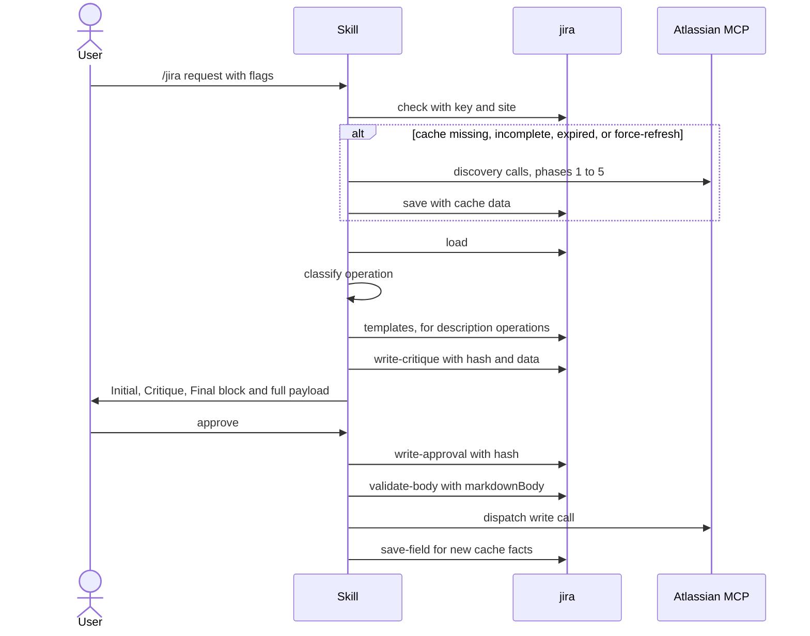
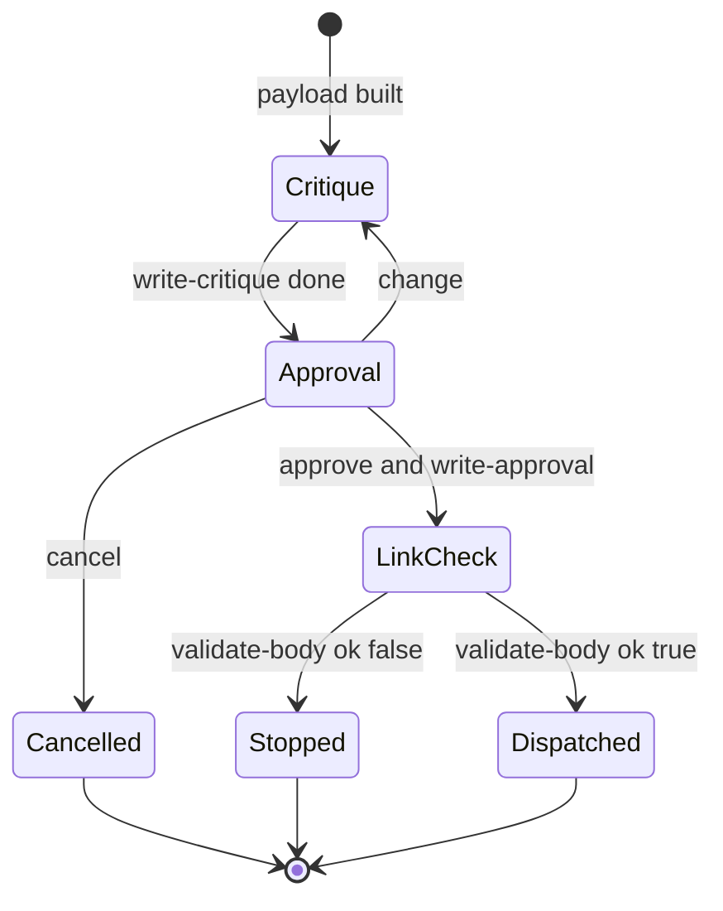

# skill-jira Specification

## Purpose
The `jira` skill runs Jira operations (create, edit, search, transition, comment, link, assign, worklog, view, bulk) through Atlassian MCP tools, using a per-project metadata cache kept by the `jira` MCP tool. The user invokes it as `/jira` or by asking for any Jira action.

## Requirements

### Requirement: Flags
The skill SHALL accept exactly the flags in this table.

| Flag | Effect | Default |
|---|---|---|
| `--project <KEY>` | Jira project key; first step of key resolution | auto-detected |
| `--force-refresh` | Rebuild the cache even when it is fresh | off |
| `--init-templates` | Copy default templates to `.sdlc-v2/jira-templates/`, then stop; copies nothing when no default templates are found | off |
| `--site <host>` | Sanitized site host (e.g. `acme_atlassian_net`) passed as `site` to `jira` `check` / `load` | unset |
| `--skip-workflow-discovery` | Skip workflow sampling during cache init; for CI | off |

- There is no `--auto` flag. No flag skips the write approval gate.

#### Scenario: Site flag
- **WHEN** the user runs `/jira --site acme_atlassian_net`
- **THEN** the skill passes `site: "acme_atlassian_net"` to `jira` `check`

### Requirement: Main flow ordering
The skill SHALL resolve the project key, check the cache, initialize or load it, classify the operation, run the write gates for write operations, dispatch the Atlassian MCP call, then update the cache.

Main flow of one write operation:



#### Scenario: Fresh complete cache
- **WHEN** `jira` `check` reports a complete, fresh cache
- **THEN** the skill calls `jira` `load` and makes no Atlassian discovery calls

### Requirement: Project key resolution
The skill SHALL resolve the project key by the first step in this order that yields a key.

| Step | Source | Rule |
|---|---|---|
| 1 | `--project <KEY>` | With `jira.projects` of 2+ keys, a key outside the list fails at `jira` `check` |
| 2 | Current git branch | First match of `[A-Z]{2,10}-\d+`, key part (`feat/PROJ-123-fix` gives `PROJ`); with `jira.projects` set, only listed keys are accepted |
| 3 | `jira` `check-default-project` | Non-empty `defaultProject` |
| 4 | AskUserQuestion, closed list | Only when `jira.projects` has 2+ keys: `Which Jira project key should I use?` |
| 5 | AskUserQuestion, free text | `Which Jira project key should I use? (e.g., PROJ, TEAM)` |

#### Scenario: Key from branch
- **WHEN** no `--project` is given and the branch is `feat/PROJ-123-fix`
- **THEN** the project key is `PROJ`

#### Scenario: Key outside jira.projects
- **WHEN** `--project BAZ` is given and `jira.projects` is `["FOO", "BAR"]`
- **THEN** `jira` `check` returns an error, the skill shows it, and stops

#### Scenario: Closed-list question
- **WHEN** steps 1 to 3 yield no key and `jira.projects` has 2+ keys
- **THEN** the skill asks via AskUserQuestion with options equal to `jira.projects`

### Requirement: Cache check routing
The skill SHALL call `jira` `check` before any operation, SHALL stop on a tool error, and SHALL route to cache initialization or cache load by the rules below.

| Condition | Route |
|---|---|
| `exists` is `false` | initialize |
| `missing` contains `cloudId`, `project`, `issueTypes`, or `fieldSchemas` | initialize |
| `--force-refresh` passed | initialize |
| `fresh` is `false` and `maxAgeHours` > 0 | initialize |
| otherwise | `jira` `load`, then classify |

- Hook fast-path: when the session-start reminder has a `Jira cache:` line saying `stale`, the skill skips `check` and prompts for `--force-refresh`.

#### Scenario: Tool error
- **WHEN** `jira` `check` returns an error
- **THEN** the skill shows the error message to the user and stops

#### Scenario: Permanent cache
- **WHEN** the cache is complete, `fresh` is `false`, and `maxAgeHours` is `0`
- **THEN** the skill loads the cache and does not rebuild it

### Requirement: Multi-site cache disambiguation
When `jira` `check` returns a non-empty `candidateSites`, the skill SHALL ask the user to pick one via AskUserQuestion and re-run `check` with `site` set to the answer.

#### Scenario: Key cached under two sites
- **WHEN** `check` returns `exists: false` and `candidateSites` `["a_atlassian_net", "b_atlassian_net"]`
- **THEN** the skill asks which site to use
- **AND** calls `check` again with the chosen `site`

### Requirement: Cache initialization
The skill SHALL build the cache from Atlassian MCP discovery calls, save it with `jira` `save`, then reload it with `jira` `load`.

| Phase | Atlassian MCP calls | Cache keys filled |
|---|---|---|
| 1 (parallel) | `getAccessibleAtlassianResources`, `atlassianUserInfo` | `cloudId`, `siteUrl` (first site), `currentUser` |
| 2 (parallel) | `getVisibleJiraProjects` with `searchString`, `getIssueLinkTypes` | `project`, `linkTypes` |
| 3 | `getJiraProjectIssueTypesMetadata` | `issueTypes` (`id`, `subtask`, `hierarchyLevel`) |
| 4 (parallel, one per type) | `getJiraIssueTypeMetaWithFields` | `fieldSchemas` |
| 5 (non-subtask types) | `searchJiraIssuesUsingJql`, `getTransitionsForJiraIssue` | `workflows` |
| 6 | — | `version` `1`, `lastUpdated` now, `maxAgeHours` `0`, `userMappings` `{}` |

- The cache is permanent by default (`maxAgeHours` `0`).
- Legacy caches under `.sdlc-v2/jira-cache/` or `.claude/jira-cache/` are not read or moved.
- After load, the skill reports `Cache initialized for <KEY> — <N> issue types, <N> workflow states mapped.`

#### Scenario: First use
- **WHEN** `check` returns `exists: false`
- **THEN** the skill runs phases 1 to 5, calls `jira` `save` with `data` holding `version`, `cloudId`, `project`, `siteUrl`
- **AND** then calls `jira` `load`

### Requirement: Workflow discovery skip and unsampled types
With `--skip-workflow-discovery`, the skill SHALL make no phase 5 calls and SHALL cache `workflows[<type>] = { "unsampled": true }` for each non-subtask issue type.

- The skill reads the flag from its own arguments; `check` always returns `flags.skipWorkflowDiscovery: false`.
- Subtask types get no `workflows` entry.
- Without the flag, a type with no issues at all is cached as `{ "unsampled": true }`; a status with no sample issue is skipped.
- A transition on an `unsampled` type uses a live `getTransitionsForJiraIssue` call for that issue.

#### Scenario: CI run
- **WHEN** the cache is initialized with `--skip-workflow-discovery`
- **THEN** no `searchJiraIssuesUsingJql` or `getTransitionsForJiraIssue` call is made during init
- **AND** each non-subtask type is cached with `unsampled: true`

### Requirement: Template initialization mode
With `--init-templates`, the skill SHALL call `jira` `init-templates`, offer a template choice for each unavailable type, and then stop without any Jira operation.

- Report: `<N> templates initialized (exact match), <N> skipped (already exist).`
- For each type in `unavailable` (when the cache is loaded), AskUserQuestion offers the suggested default (Recommended), the other defaults, and `Skip`.
- Suggestion: `hierarchyLevel` `1` gives `Epic`; `hierarchyLevel` `0` and not subtask gives `Task`; subtask gives `Skip (subtask)`; no `hierarchyLevel` gives no suggestion.
- Each non-Skip answer calls `jira` `copy-template` with `templateType` = the type and `templateFrom` = the answer.
- After the report, the skill calls `jira` `templates` to get `defaultTemplates`. When it is empty, the skill reports `No default templates found — nothing copied.`, points to `.sdlc-v2/jira-templates/<Type>.md`, says that create uses the base structure until then, and asks no per-type question.
- A suggestion is offered only when it is in `defaultTemplates`.

#### Scenario: Unavailable epic-level type
- **WHEN** `init-templates` returns `unavailable` `["Initiative"]` and its `hierarchyLevel` is `1`
- **THEN** the skill asks with `Epic` marked Recommended
- **AND** on that answer calls `copy-template` with `templateType` `Initiative` and `templateFrom` `Epic`

#### Scenario: Stop after templates
- **WHEN** `--init-templates` finishes
- **THEN** the skill runs no Jira operation

#### Scenario: No default templates
- **WHEN** `--init-templates` runs and `jira` `templates` returns an empty `defaultTemplates`
- **THEN** the skill reports `No default templates found — nothing copied.` and names `.sdlc-v2/jira-templates/<Type>.md`
- **AND** asks no per-type template question and calls no `copy-template`

### Requirement: Operation classification
The skill SHALL classify the request as one of `create`, `edit`, `search`, `transition`, `comment`, `link`, `assign`, `worklog`, `view`, or `bulk`, and SHALL ask one clarifying question via AskUserQuestion when the request is ambiguous.

- Read operations: `search`, `view`. They skip critique, approval, and link verification.
- All other operations are write operations and run all three gates.

#### Scenario: Read operation
- **WHEN** the user asks for the details of `PROJ-1`
- **THEN** the skill classifies it as `view` and calls `getJiraIssue` with no approval prompt

### Requirement: Description template resolution
Before building any `description` (every `create`; `edit` only when `description` changes), the skill SHALL call `jira` `templates` and use the resolved template, or, when the issue type is in `noneTypes`, the fixed base structure; the skill SHALL NOT stop because no template exists.

- A custom template at `.sdlc-v2/jira-templates/<Type>.md` wins over a default template.
- Default templates come from the directory the `jira` tool resolves (see tool-jira); the plugin ships none, so without one only custom templates resolve.
- For each `fallbacks` entry, print `Using <fallbackTo> template for <type> — override at .sdlc-v2/jira-templates/<type>.md`.
- The skill does not re-derive the fallback map; the tool owns it.
- Base structure, used only for a `noneTypes` type:

```markdown
## Summary
- {what_and_why}

## Context
- {background}

## Acceptance Criteria
- [ ] {criterion}
```

- The base structure is filled like a template: placeholders resolve per the placeholder rules, `## Context` may be removed when empty, and no other `## ` section is added.
- For a `noneTypes` type, the skill prints `No template for <type> — drafting the description from the base structure (Summary / Context / Acceptance Criteria). To use your own, create .sdlc-v2/jira-templates/<type>.md`, and appends ` or run /jira --init-templates` only when `defaultTemplates` is non-empty.
- Critique, approval, and link verification run unchanged for a base-structure description.

#### Scenario: Template exists
- **WHEN** the issue type resolves to a custom or default template
- **THEN** the skill builds the description from that template and prints no no-template notice

#### Scenario: No template
- **WHEN** the issue type is in `noneTypes`
- **THEN** the skill prints the no-template notice naming `.sdlc-v2/jira-templates/<type>.md`
- **AND** builds the description from the base structure instead of stopping
- **AND** runs critique, approval, and link verification before any dispatch

#### Scenario: No template and no defaults
- **WHEN** the issue type is in `noneTypes` and `defaultTemplates` is empty
- **THEN** the no-template notice does not mention `/jira --init-templates`

### Requirement: Placeholder resolution
The skill SHALL detect placeholders with the regex `\{[a-zA-Z_][a-zA-Z0-9_-]*\}|\[[^\]\n]{3,}\]`, SHALL ask the user via AskUserQuestion for every low-confidence marker, and SHALL never dispatch a payload that still holds a raw placeholder.

- Scope: `create` description, every string field of an `edit` (including ADF text nodes), and the `comment` markdown.
- Not applied to `transition`, `link`, or `worklog` payloads beyond the worklog comment.
- A marker is high-confidence only when filled from explicit user input or a definite cache value.

#### Scenario: Low-confidence marker
- **WHEN** a template marker `{root_cause}` cannot be filled from user input or the cache
- **THEN** the skill asks the user for it before critique

### Requirement: Critique pass
For every write operation, the skill SHALL run a critique of the payload, write the critique artifact through `jira` `write-critique`, and show an `Initial:` / `Critique:` / `Final:` block before the approval prompt.

| Check | Rule |
|---|---|
| Template completeness | Every `## ` heading in the description belongs to the resolved template (the base structure for a `noneTypes` type) |
| Field correctness | Issue type, project key, parent, components, labels match cached `allowedValues` |
| Workflow validity | For `transition`, the target status is reachable in the cached workflow |
| Terminology | Summary and description do not contradict |
| Terse content | Section bodies are lists or sub-headings; `## Acceptance Criteria` is only `- [ ] …` items; `## Release Notes` may be one sentence; summary is an imperative phrase of at most 100 characters |

- Hash: canonical JSON (stable key order, trailing whitespace trimmed from strings), then `printf '%s' "$canonical_json" | sha256sum | cut -c1-12` (or `shasum -a 256`).
- `write-critique` gets `hash` and `data` `{initial, findings, final}`.
- Critique changes are never applied silently.

#### Scenario: Critique before approval
- **WHEN** a `create` payload is built
- **THEN** the skill calls `jira` `write-critique` with the payload hash
- **AND** shows the `Initial:` / `Critique:` / `Final:` block before asking for approval

### Requirement: Write approval gate
For every write operation, the skill SHALL print the full final payload and ask via AskUserQuestion with the options `approve`, `change <what>`, and `cancel`, and SHALL dispatch nothing without `approve` in the current turn.

Write-operation gate states:



- On `approve` only, the skill calls `jira` `write-approval` with the same `hash`.
- On `change`, the skill returns to critique with a new hash.
- The gate applies also when another skill or pipeline invokes this skill. No hook enforces it; the prompt is the only boundary.

#### Scenario: Approve
- **WHEN** the user answers `approve`
- **THEN** the skill calls `jira` `write-approval` with the payload hash and continues to link verification

#### Scenario: Cancel
- **WHEN** the user answers `cancel`
- **THEN** the skill makes no Atlassian write call

#### Scenario: Change
- **WHEN** the user answers `change` with a revision
- **THEN** the skill rebuilds the payload and runs the critique again with a new hash

### Requirement: Link verification hard gate
Before dispatching `createJiraIssue`, `editJiraIssue`, or `addCommentToJiraIssue`, the skill SHALL call `jira` `validate-body` with the raw markdown body, and on `ok: false` SHALL NOT dispatch.

- On `ok: false` the skill shows `message` (or the violations) verbatim, stops, does not retry, and does not edit URLs without user input.
- It then calls `mcp_failure_record` with `tool` `jira validate-body`, `rPath` `R22`, `errorMessage` `link verification failed`, `recovered` `no`.
- For `comment`, the `validate-body` call happens while composing the comment, before critique and approval.
- Offline link checks depend on `SDLC_LINKS_OFFLINE=1` in the MCP server environment, not on a call input.

#### Scenario: Broken link
- **WHEN** `validate-body` returns `ok: false` for a description
- **THEN** the skill shows the violation message and does not call `createJiraIssue`
- **AND** records the failure with `mcp_failure_record`

#### Scenario: Clean body
- **WHEN** `validate-body` returns `ok: true`
- **THEN** the skill dispatches the write call

### Requirement: Operation dispatch
The skill SHALL dispatch each operation to the Atlassian MCP tool and payload shape in this table.

| Operation | Atlassian MCP tool | Payload rules |
|---|---|---|
| `create` | `createJiraIssue` | `contentFormat` `markdown`; `issueTypeName` exact cache name; sub-task needs top-level `parent` key |
| `edit` | `editJiraIssue` | flat `fields`; `labels` replaces all labels; `responseContentFormat` `markdown` |
| `search` | `searchJiraIssuesUsingJql` | JQL scoped to `project = <KEY>` unless cross-project is asked; `maxResults` `25` (summary) or `10` (detailed); offer `startAt` paging when `total` > `maxResults` |
| `transition` | `transitionJiraIssue` | `transition: { id }` from cached workflow; include `requiredFields`; if no transition matches, list available ones and ask |
| `comment` | `addCommentToJiraIssue` | `commentBody` = `adf` from `validate-body`; `contentFormat` `adf` |
| `link` | `createIssueLink` | `linkType.name` from cached `linkTypes`; `inwardIssue` / `outwardIssue` per wording |
| `assign` | `editJiraIssue` | `assignee: { accountId }` |
| `worklog` | `addWorklogToJiraIssue` | `timeSpent` as Jira duration (e.g. `2h 30m`); `adjustEstimate` `auto` |
| `view` | `getJiraIssue` | `responseContentFormat` `markdown` |
| `bulk` | per item | each item runs its own gates; independent items run in parallel, dependent items in order; progress after each batch; on partial failure, finish the rest and report all failures together |

- Tool prefix is `mcp__atlassian__` by default; the active prefix is used for every call in the session.

#### Scenario: Comment uses ADF
- **WHEN** the operation is `comment`
- **THEN** the skill sends the `adf` output of `validate-body` with `contentFormat` `adf`, never `markdown`

### Requirement: Cached values only after initialization
After cache initialization, the skill SHALL take `cloudId`, field schemas, link types, allowed values, and transition ids from the cache or user input, and SHALL NOT guess them.

- No `getAccessibleAtlassianResources`, `getJiraIssueTypeMetaWithFields`, or `getIssueLinkTypes` call after init, except the one `getAccessibleAtlassianResources` call of the cloudId authorization recovery.
- Transition ids come from the cache or a fresh `getTransitionsForJiraIssue`; transition names are never sent.
- On `create`, the skill asks for every required field in `fieldSchemas[<type>]` the user did not give.

#### Scenario: Required field missing
- **WHEN** a `create` lacks a field marked `required` in `fieldSchemas`
- **THEN** the skill asks the user for it before critique

### Requirement: Post-operation cache updates
The skill SHALL update the cache through `jira` `save-field` when an operation reveals new data, and SHALL rebuild the cache and retry once when cached data proves stale.

| Trigger | Action |
|---|---|
| New user resolved via `lookupJiraAccountId` | `save-field` with `fieldName` `userMappings`, `data` `{"<name>": "<accountId>"}` |
| Transition from a status not in the cache | `save-field` with `fieldName` `workflows` |
| Stale transition id (400/404) | `--force-refresh`, reload, retry once |
| Field key or value not in the cache | `--force-refresh`, reload, retry once |

- For `assign`, a name in `userMappings` is used directly; otherwise `lookupJiraAccountId` runs, and multiple matches are shown for the user to confirm.

#### Scenario: New assignee
- **WHEN** `lookupJiraAccountId` returns one confirmed account for `Alice`
- **THEN** the skill calls `jira` `save-field` with `fieldName` `userMappings` and `data` `{"Alice": "<accountId>"}`

### Requirement: Error recovery and failure telemetry
The skill SHALL retry a failed operation at most once without a diagnosis, and SHALL record MCP failures with `mcp_failure_record`.

| Error | Recovery |
|---|---|
| 400 on create or edit | Check field key and shape against `fieldSchemas`; on mismatch refresh the cache and retry once |
| 400 on transition | Add required transition fields; unknown id triggers refresh and one retry |
| 401 | Ask to reconnect the Atlassian MCP; no programmatic recovery |
| 403 | Report to the user |
| 404 issue | Ask the user to verify the key |
| 404 project | Re-run `check`; verify `cloudId` |
| 409 | Retry once |

- R9 exhausted (400 still fails after refresh): `mcp_failure_record` with `recovered` `no`, then report.
- Every retry, also a successful one, is recorded with `recovered` `yes:R9`.
- A failed live `getTransitionsForJiraIssue` on an unsampled type is recorded with `tool` `getTransitionsForJiraIssue`, `recovered` `no`.
- Remediation is manual; the skill does not file issues.

#### Scenario: 400 after refresh
- **WHEN** a create fails with 400 again after the cache refresh
- **THEN** the skill calls `mcp_failure_record` with `recovered` `no` and reports the error

### Requirement: cloudId authorization recovery
When a call fails with text matching `isn't explicitly granted`, or an auth/403 error that names the cloudId, the skill SHALL run this ladder once.

| Step | Action |
|---|---|
| 1 | Call `getAccessibleAtlassianResources` once |
| 2 | Compare its cloudId with the cached one |
| 3 | If different, run `--force-refresh` and reload the cache |
| 4 | Retry the call once under the primary prefix |
| 5 | If it fails again, record `mcp_failure_record` (`recovered` `no`), then retry once under `mcp__claude_ai_Atlassian__` if that prefix is registered |
| 6 | If the sibling prefix also fails, record `mcp_failure_record` again and report to the user |

- A prefix that works is kept for the rest of the session.

#### Scenario: Sibling prefix works
- **WHEN** the primary-prefix retry fails and the `mcp__claude_ai_Atlassian__` retry succeeds
- **THEN** the skill uses `mcp__claude_ai_Atlassian__` for the rest of the session

### Requirement: Learning capture
The skill SHALL record Jira discoveries (non-default field formats, workflow quirks, custom issue-type names, user lookup patterns, uncaptured required transition fields) with `learnings_log` `action` `append`.

- Entry heading: `## YYYY-MM-DD — jira: <brief summary>`.
- MCP failures are written by `mcp_failure_record`, not by this free-form entry.

#### Scenario: Custom subtask type
- **WHEN** the project uses a subtask type named `Sub-bug`
- **THEN** the skill appends a `learnings_log` entry with heading `## <date> — jira: ...`
