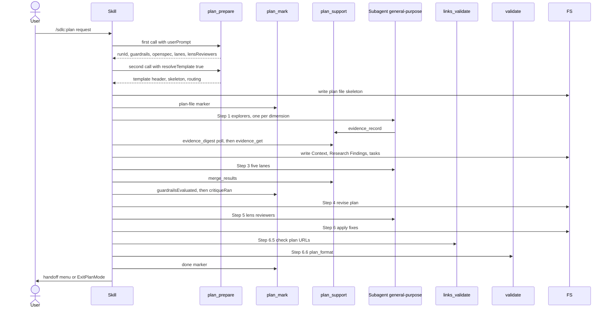

# skill-plan Specification

## Purpose
The `plan` skill (`/sdlc:plan`) turns requirements, a spec, or a user description into an implementation plan file that `execute` and `ship` consume. It is the designated plan-mode skill and runs its own critique and review loops before handing off.

## Requirements

### Requirement: Invocation flags
The skill SHALL accept the arguments in its `argument-hint`: `[--auto] [--spec [<change-name>]] [spec-file-path]`.

| Flag | Effect |
|---|---|
| `--auto` | Suppresses the structured-discovery and approach-check questions, the OpenSpec gate-check question (option **Create OpenSpec change** is taken), and every **harden** offer. Choices made without asking go into `## Key Decisions` and get a `## Deviations & assumptions` row with `asked=no`. |
| `--spec` | Opts into OpenSpec and skips the gate-check question. Without a name: use the branch-matched change, else ask which active change to use, or offer **Create OpenSpec change** when none exists. |
| `--spec <change-name>` | Plans directly from `openspec/changes/<change-name>/`; passed to `plan_prepare` as `fromOpenspec` |
| `--from-openspec <change-name>` | Deprecated alias of `--spec <change-name>` for one release; prints `--from-openspec is deprecated — use --spec <change-name>` |
| `[spec-file-path]` | Requirements file; a path into `openspec/changes/<name>/` selects that change |

- `--auto` never bypasses a Gate A `CRITICAL` verdict.
- `--auto` still asks three questions that have no safe default: which OpenSpec change to use when several match, whether to split into N plans, and what to do after `reviewLoop.maxRounds` (5) review rounds with open blocking issues. When AskUserQuestion is unavailable, the skill stops and reports instead of choosing.

#### Scenario: Auto mode at the OpenSpec gate check
- **WHEN** `--auto` is set and the gate check finds a functional request with no matching change
- **THEN** the skill does not call AskUserQuestion
- **AND** it takes **Create OpenSpec change** and adds a `## Deviations & assumptions` row with `asked=no`

#### Scenario: Auto mode with several OpenSpec changes
- **WHEN** `--auto` is set and several active OpenSpec changes exist with no branch match
- **THEN** the skill asks which change to use with AskUserQuestion

#### Scenario: Auto mode resolves an approach question
- **WHEN** `--auto` is set and decomposition reveals two viable approaches
- **THEN** the skill does not call AskUserQuestion
- **AND** it picks the most conservative option, using the closest match to existing codebase patterns as the tiebreaker, and adds a `## Deviations & assumptions` row with `asked=no`

#### Scenario: Deprecated alias
- **WHEN** the skill is invoked with `--from-openspec add-widget`
- **THEN** it behaves as `--spec add-widget`
- **AND** it prints `--from-openspec is deprecated — use --spec <change-name>`

### Requirement: Pipeline order
The skill SHALL run Steps 0 to 7 in order: setup, discovery, decomposition, 5-lane critique, improve, lens review, fixes, link check, format check, handoff.

Main flow of a full-pipeline run:

#### Scenario: Full pipeline
- **WHEN** `template.routing.pipelineMode` is `full` and `explorePack.manifestPath` is non-null with `scopeHintCount` above 3
- **THEN** the skill runs discovery fan-out, the Step 3 lanes, and the Step 5 review loop before Step 6.5

### Requirement: Mandatory state load
The skill SHALL call `plan_prepare({skipConfigCheck, fromOpenspec, userPrompt})` before any planning action. Only mode detection, requirement gathering, and OpenSpec change-name detection may come before it.

- When no spec or requirements are in context, the skill asks "What do you want to implement?" with AskUserQuestion first.
- The skill SHALL NOT read `.sdlc-v2/config.toml`, `.sdlc-v2/local.toml`, or other state files to get guardrails or plan state.
- The skill SHALL NOT call `plan_mark({marker: "skillInvoked"})`; `plan_prepare` writes it.
- It prints the "Context detection (from plan_prepare)" summary and the custom plan instructions from `style.instructions`.

#### Scenario: plan_prepare returns an error
- **WHEN** the first `plan_prepare` call errors
- **THEN** the skill prints the errors and stops

#### Scenario: No run tracked
- **WHEN** `runId` is empty or `(none)`
- **THEN** the skill stops with `plan needs a git repository to track its run`

### Requirement: OpenSpec gate check
When `openspec/config.yaml` exists and neither `--spec` nor a path into `openspec/changes/` was given, the skill SHALL classify the request before planning.

| Request | Action |
|---|---|
| Non-functional (refactor, config, docs, CI, deps, test-only) | Print ``OpenSpec detected — pass `--spec` to include spec context in planning.`` and continue without OpenSpec; no question |
| Functional, an active change matches the branch | Treat as `--spec <match>` and load that change |
| Functional, no match | AskUserQuestion with 3 options (below) |

| Option | Effect |
|---|---|
| 1. Create OpenSpec change (default) | Author the change artifacts and stage them (see "OpenSpec artifact staging"); plan from them. `--auto` takes this option without asking. |
| 2. Use existing change | List active changes from `openspec list --json`; load the chosen one |
| 3. Skip OpenSpec | Plan without OpenSpec; ship skips its OpenSpec steps with a reason |

- The question restates what OpenSpec is and what each option costs, per the decision-framing rule.
- No option tells the user to leave plan and run the CLI by hand.

#### Scenario: Functional change, user picks option 1
- **WHEN** the gate asks and the user selects "Create OpenSpec change"
- **THEN** the skill stages the change artifacts and continues planning from them

#### Scenario: Non-functional change
- **WHEN** the request is a refactor and no `--spec` was given
- **THEN** the skill prints ``OpenSpec detected — pass `--spec` to include spec context in planning.``
- **AND** it does not call AskUserQuestion

### Requirement: From-OpenSpec mode
When `fromOpenspec.valid` is true, the skill SHALL read the change's `proposal.md`, `design.md` (optional), every delta spec file listed by `openspec status --change <name> --json` (any depth under `specs/`), and `tasks.md` (optional), set `fromOpenspecDirect = true`, and skip the gate check and complexity routing.

- The plan header gets `**Source:** openspec/changes/<name>/` verbatim; `execute_state` init reads it later.
- `tasks.md` is the primary decomposition skeleton; structured discovery is skipped.
- Each task derived from an OpenSpec task carries an `**openspec-task:**` block with `change`, `ref`, `line`, `title`.
- Every OpenSpec task is covered by a plan task `ref` or listed under `## Out-of-scope OpenSpec tasks`.
- The skill never globs `specs/*.md` itself.

#### Scenario: Invalid change
- **WHEN** `--spec bad-name` is passed and `fromOpenspec.valid` is `false` with errors
- **THEN** the skill displays the errors and stops

#### Scenario: Nested delta specs
- **WHEN** the change has `specs/identity/user-auth/spec.md`
- **THEN** the skill reads that file as a delta spec

### Requirement: Template resolution and routing
After the gate check and routing, the skill SHALL call `plan_prepare` again with `resolveTemplate: true`, `fromOpenspecDirect`, `openspecInlineGenerate`, `lightweight`, `fileCount`, and the same first-call fields. It SHALL write `template.headerMarkdown` + `template.skeletonMarkdown` to the plan file.

| Scope | Normal mode | Plan mode |
|---|---|---|
| 1 file, clear change | Stop — tell the user no plan is needed | Lightweight plan |
| 2–3 files | Lightweight: no explorer fan-out, no Step 5 | Lightweight |
| 4+ files or unclear | Full pipeline | Full pipeline |
| Independent subsystems | Split into separate plans | Split |

- `template.routing.pipelineMode` (`full`, `lightweight`, `skip`) selects the branch; the "no plan needed" and "split" decisions stay with the skill.
- In Step 2, when requirements span independent subsystems, the skill asks with AskUserQuestion whether to proceed as one plan or split into N plans, and waits for the answer. `--auto` does not suppress this question.

#### Scenario: Lightweight routing
- **WHEN** `template.routing.pipelineMode` is `lightweight`
- **THEN** the skill skips explorer dispatch and the Step 5 review loop

### Requirement: Plan file location
The skill SHALL write the plan to exactly one file and record it with `plan_mark({marker: "plan-file", path})`.

- Plan mode: the path from "You should create your plan at `<path>`" is the only writable file.
- Normal mode order: user-given path, project `.claude/settings.json` `plansDirectory`, global `~/.claude/settings.json` `plansDirectory`, `~/.claude/plans/`.
- Normal-mode file name: `YYYY-MM-DD-<feature-name>.md`.
- Existing content is cleared and overwritten without asking, unless the post-compact resume path applies.
- Errors from the `plan-file` marker call are ignored.
- The skill creates no other scratch files; working state lives in the evidence store and checkpoints.

#### Scenario: Plan mode path
- **WHEN** a system-reminder says "Plan mode is active" and names a plan file
- **THEN** the skill writes only to that file and skips path resolution

### Requirement: Checkpoints and integrity markers
The skill SHALL record progress with `plan_mark`, one call at a time.

| When | Call |
|---|---|
| Step 0, after the `plan-file` marker | `plan_mark({marker: "checkpoint", path: "", data: {step: "0", iteration: 0}})` |
| Start of Steps 1, 2, 3, 4, 5, 6, 6.5, 6.6, 7 | `plan_mark({marker: "checkpoint", path: "", data: {step, iteration}})` |
| Fan-outs (Step 1 explorers, Step 3 lanes, Step 5 lenses or reviewer) | same, plus `expectedWriters` |
| After the `guardrail-compliance` lane result is merged | `plan_mark({marker: "guardrailsEvaluated"})` |
| After all five lanes returned and merged | `plan_mark({marker: "critiqueRan"})` |
| Before the Step 7 handoff branch | `plan_mark({marker: "done"})` |

- `guardrailsEvaluated` and `critiqueRan` are written once per run, never on a re-dispatch.
- Steps 0–2 use `iteration: 0`; the first Step 3 and Step 5 rounds are `r1`.

#### Scenario: Critique marker waits for all lanes
- **WHEN** four of the five Step 3 lanes have returned
- **THEN** the skill has not called `plan_mark({marker: "critiqueRan"})`

### Requirement: Post-compact resume
When the session context has an `Active plan (post-compact):` line whose plan file equals the designated plan file, the skill SHALL resume instead of starting over.

| Condition | Action |
|---|---|
| No line, or plan file differs | Normal Step 0 |
| Match, `step 0` | Redo gate check and routing; call `plan_prepare({resume: true, resolveTemplate: true, …})` |
| Match, step 1 or later | `plan_prepare({resume: true, resolveTemplate: true, skipConfigCheck: true})`, then `plan_support({action: "evidence_digest", runId})`, then continue at `checkpoint.step` and `checkpoint.iteration` |
| `plan_prepare` returns `no active plan run` | Print `No active plan run to resume — starting a new plan.` and run normal Step 0 |
| `evidence_digest` errors | Print the error; stop; tell the user to re-invoke `/sdlc:plan` |

- The template is written only when the plan file is empty.
- At step 1, explorers marked `done` are kept; missing or stalled ones are not re-dispatched.

#### Scenario: No run to resume
- **WHEN** the resume `plan_prepare` call returns `no active plan run`
- **THEN** the skill prints `No active plan run to resume — starting a new plan.`
- **AND** runs Step 0 normally

### Requirement: Sub-agent run context
Every sub-agent prompt (explorer, lane, lens, reviewer, Gate A) SHALL end with the run-context footer: the custom plan instructions and the `plan_support` `evidence_record` calls for status `running` and `done`.

| Writer | Writer ID |
|---|---|
| Explorer | `explore-<slug>` (slug max 56 chars) |
| Lane | `lane-<name>-r<n>` |
| Lens | `lens-<lens>-r<n>` |
| Single reviewer | `reviewer-r<n>` |
| Gate A | `gate-a` |
| Main session | `main` |

- Explorers receive only the instructions part of the footer; their Coordination block carries the `evidence_record` calls.
- After each AskUserQuestion answer the skill records `D<n>` via `plan_support` `evidence_record` as writer `main`.
- `main` `evidence_record` calls never run in parallel.
- When a writer has no `done` evidence, the skill uses the Agent return text and records it as a `main` item.

#### Scenario: Evidence record fails in a sub-agent
- **WHEN** a lane's `evidence_record` call fails
- **THEN** the skill uses the lane's Agent return value and records it as `<writerId>-result` under `main`

### Requirement: Discovery fan-out
In the full pipeline with a non-null `explorePack.manifestPath`, the skill SHALL derive 3–7 task-specific dimensions and dispatch one explorer per dimension in a single message.

- Dispatch: `subagent_type: general-purpose`, `model` from the dimension, `run_in_background: true`, and no `isolation` value.
- Modes: `code`, `web`, `hybrid`. At least one `web` or `hybrid` dimension when `webResearchSignal` is true or the prompt names a new external technology.
- No `web` or `hybrid` dimension for a pure internal refactor when `webResearchSignal` is false.
- Dimension names are task-shaped, never a bare axis such as `architecture` or `tests`.
- Poll `plan_support({action: "evidence_digest", …, statusOnly: true})` about every 60 seconds.
- A writer listed as stalled or missing on two polls in a row is skipped and named in the brief's `## Zero-Finding Dimensions`.
- The brief is stored with `plan_support` `evidence_record` only when it contains at least one `F-<dim>-<n>` finding ID.
- The skill runs `rm -rf <explorePack.outDir>` at every stop point when `outDir` is not null.

| Path | Trigger | Action |
|---|---|---|
| Lightweight | `scopeHintCount <= 3` or no manifest | Inline exploration in one parallel message; no brief |
| Error fallback | `explorePack.error` set, or brief has no finding IDs | `learnings_log` append, then inline exploration |

#### Scenario: Brief without finding IDs
- **WHEN** the consolidated brief matches no `F-[A-Za-z0-9_-]+-[0-9]+`
- **THEN** the skill calls `learnings_log({action: "append", …})`, deletes the temp directory, and explores inline
- **AND** the plan is still produced

### Requirement: Structured discovery questions
The skill SHALL ask targeted AskUserQuestion questions when requirements are vague or several materially different approaches exist, and SHALL wait for answers.

- Questions come verbatim from `template.discoveryQuestions`; when empty, the fallback is Scope, Integration, Success.
- Each question starts with one sentence on what it decides, scaled to `style.audience`.
- Skipped when `fromOpenspecDirect` is true or the OpenSpec artifacts already answer the questions.
- A Step 2 approach question already resolved in Step 1 is not asked again.

#### Scenario: Vague request in interactive mode
- **WHEN** the request is a single ambiguous sentence and `--auto` is not set
- **THEN** the skill asks the discovery questions before decomposing

### Requirement: Gate A intake audit
When `openspecContext.requirements` is not null, the skill SHALL dispatch one audit sub-agent with `subagentType`, `model`, and `promptTemplatePath` from `intakeAuditDispatch`, and SHALL act on its `verdict`.

| Verdict | Action |
|---|---|
| `CRITICAL` | Block Step 2; offer (a) fix the change artifacts and re-run or (b) override, recorded in `## Intake Audit Caveats`. No `--auto` bypass. |
| `WARNING` / `SUGGESTION` | Add `## Intake Audit Caveats` and continue |
| `PASS` | Continue |

- Null `promptTemplatePath`: print `Gate A skipped — intake-verify-prompt.md not found.`
- Plan not OpenSpec-sourced: print `Gate A skipped — plan is not OpenSpec-sourced.`

#### Scenario: Critical intake finding
- **WHEN** the Gate A agent returns `verdict: "CRITICAL"` and `--auto` is set
- **THEN** the skill does not start Step 2 until the user chooses fix or override

### Requirement: Task format
The skill SHALL write every section in the active template's `## Required Sections` in template order (the order of the `template.skeletonMarkdown` skeleton, filled in place), and SHALL give every task the metadata `execute` needs. `plan-format-reference.md` `## Section Order` places only sections the template does not list; where the two disagree, the template order wins.

- Per task: `**Complexity:**`, `**Risk:**`, `**Depends on:**`, `**Verify:**`, `**Files:**`, `**Acceptance criteria:**`, `**Contract:**`, plus any `tasks.requiredFields`.
- Each task touches 1–5 files; a plan has at least 2 tasks.
- `Depends on` defaults to `none` and names a concrete artifact when set.
- `**Contract:**` renders its shape as a fenced block, table, or diff, not prose.
- The temporary `## Requirements` section is removed after Step 2.

#### Scenario: Task touching too many files
- **WHEN** a drafted task touches 8 files
- **THEN** the skill splits it into tasks of at most 5 files

### Requirement: Step 3 lane critique
The skill SHALL dispatch all five `lanes[]` entries in one message, using `subagentType`, `model`, and `promptTemplatePath` from `plan_prepare` verbatim and no `isolation` value. It SHALL merge results with `plan_support({action: "merge_results", laneResults, expectedGates: ["G1".."G22"]})`.

- Before the merge, the skill maps each lane's JSON to the tool's lane shape; it never passes the raw lane JSON.

| `laneResults[]` field | Lanes 0–3 | Lane 4 (G17) |
|---|---|---|
| `name` | `lanes[i].name` | `lanes[4].name` |
| `status` | `pass` when `laneStatus` is `ok`; `fail` when `failed`, `timeout`, or no parseable JSON | `pass` when the G17 JSON parsed; `fail` on dispatch failure, timeout, malformed JSON, or null template |
| `gateIds` | the lane's `gateIds` | `["G17"]` |
| `issues[].severity` | `blocking` when the issue has `blocking: true` or `severity: "error"`; otherwise `advisory` | no issues |
| `issues[].summary` | `<taskRef>: <message>`, or `message` when `taskRef` is null | no issues |

- The mapping produces only lane `status` `pass` or `fail` and issue `severity` `blocking` or `advisory`; `merge_results` rejects any other value with a `DomainError` and merges nothing.
- Lane 4 is always in `laneResults`, so G17 is never a coverage gap; a failed lane 4 becomes an advisory note.
- A lane with null `promptTemplatePath` is not dispatched and becomes a synthetic entry with `status: "fail"` and one `blocking` issue.
- Exception: a null `lanes[4]` (G17) template counts as empty advisory findings and is logged with `learnings_log`.
- Step 3 does not edit the plan file.
- The `guardrail-compliance` lane receives `styleGuideFile` and evaluates G22 (style compliance), including the STE rules that need meaning and each custom plan instruction.

#### Scenario: Missing lane template
- **WHEN** `lanes[0].promptTemplatePath` is null
- **THEN** the merged issues include a blocking issue `Lane static-structural skipped — promptTemplatePath null (template not found at prepare time)`

#### Scenario: Lane reports an error-severity issue
- **WHEN** the static-structural lane returns `laneStatus: "ok"` and an issue with `severity: "error"`, `blocking: true`, `taskRef: "Task 3"`, and `message: "Depends on missing Task 9"`
- **THEN** the skill sends that lane with `status: "pass"` and an issue with `severity: "blocking"` and `summary: "Task 3: Depends on missing Task 9"`
- **AND** `merge_results` returns `mergedStatus: Issues Found`

### Requirement: Step 4 improve without a user touchpoint
The skill SHALL fix all Step 3 issues in the plan file without showing the plan to the user, then continue to Step 5.

- With guardrails configured, it writes `## Guardrail Compliance` (`Guardrail | Severity | Status | Rationale`).
- An error-severity guardrail failure it cannot fix triggers an offer of **harden** next to revision options; on selection it dispatches `Skill(harden)` with `--skill plan` and `--step "Step 4 — IMPROVE"`.
- Non-empty G17 findings are spliced in as `## Suggested Review Dimensions`.
- `## OpenSpec Appendix`: `plan_support({action: "openspec_appendix", …})` output when `fromOpenspecDirect`; drafted proposal, delta specs, and tasks with `<!-- openspec-target: <path> -->` markers when `openspecInlineGenerate`; otherwise `Not applicable — no OpenSpec change`.

#### Scenario: Unfixable guardrail in auto mode
- **WHEN** an error-severity guardrail blocks the plan and `--auto` is set
- **THEN** the skill does not offer **harden**

### Requirement: Step 5 review loop
Except for lightweight plans, the skill SHALL review the plan and loop through Step 6 at most `reviewLoop.maxRounds` times, a value that `plan_prepare` returns (5).

| Plan size | Dispatch |
|---|---|
| 5 or more tasks | All 3 `lensReviewers[]` in one message, `run_in_background: false`, model opposite to the plan author's |
| Fewer than 5 tasks | One reviewer from `plan-reviewer-prompt.md` with `{LENS}=all` |

- The skill waits for every dispatched result before merging with `plan_support({action: "merge_results", lensResults})`; the iteration counter moves only then.
- Each lens result is sent as `name` = the lens, `status` = the `**Status:**` value as written (`Approved` or `Issues Found`; the tool ignores letter case), one `blocking` issue per `**Issues**` bullet, and one recommendation per `**Recommendations**` bullet.
- It regenerates `## Verification Scorecard` each round: dimension counts, traceability matrix, and a verdict.
- `Approved` ends the loop; Step 6 is a no-op. `Issues Found` goes to Step 6.
- After round `reviewLoop.maxRounds` with open blocking issues it summarizes them, asks with AskUserQuestion, and offers **harden** unless `--auto` is set. `--auto` does not suppress the question itself.
- The skill contains no hardcoded round number; every limit site reads `reviewLoop.maxRounds`.

#### Scenario: Review does not converge
- **WHEN** the fifth review round still has blocking issues
- **THEN** the skill surfaces the issues with AskUserQuestion instead of looping again

#### Scenario: Third round does not stop the loop
- **WHEN** the third review round still has blocking issues
- **THEN** the skill goes to Step 6 and runs round 4

### Requirement: Step 6 fixes and material change re-dispatch
The skill SHALL snapshot the plan with `plan_support({action: "material_snapshot"})` before fixes and compare with `plan_support({action: "material_compare"})` after. A material change SHALL trigger one merged re-dispatch of all 5 lanes and all lenses.

- The merged re-dispatch counts as one iteration and merges with `merge_results` and `isRedispatch: true`.
- A Gate B `CRITICAL` verdict adds its findings to the Step 6 blocking issues.
- An error-severity guardrail finding in the re-dispatch triggers the same **harden** offer as Step 4.

#### Scenario: Wording-only fix
- **WHEN** Step 6 changes only wording
- **THEN** the change is not material
- **AND** only the Step 5 reviewers are dispatched again

### Requirement: Hard gates before handoff
The skill SHALL pass two hard gates before Step 7. On failure it SHALL show the findings verbatim and stop, with no retry, auto-edit, or bypass.

| Gate | Call | Fails when |
|---|---|---|
| Step 6.5 links | `links_validate({file: <plan>, offline: false})` | Any result `status` is not `ok` |
| Step 6.6 format | `validate({action: "plan_format", file: <plan>, final, template})` | `findings` is not empty |

- Full pipeline: `final: true` and `template` set to `template.activeTemplatePath`.
- Lightweight: `final: false` and no `template`.

#### Scenario: Broken link
- **WHEN** `links_validate` returns a result with status other than `ok`
- **THEN** the skill lists the violations and stops before Step 7

### Requirement: Handoff
The skill SHALL call `plan_mark({marker: "done"})` and then hand off without running `execute` or `ship` in the same turn.

- With a scorecard, it prints `Verification Scorecard: <verdict line> — see ## Verification Scorecard in the plan for details.`
- With a non-empty `styleReport.instructions`, it prints a self-check table (`# | Instruction | Followed? | Where`) with evidence from the plan file and fixes every "no" row first.
- Plan mode: announce the path with `ship` and `execute` options, then call ExitPlanMode.
- Normal mode: show the menu `ship`, `execute`, `done`; invoke the chosen skill with the Skill tool.
- After writing the plan it appends a learning entry with `learnings_log`.

#### Scenario: Normal mode handoff
- **WHEN** the plan passes both hard gates in normal mode
- **THEN** the skill shows `ship`, `execute`, `done`
- **AND** on `done` it ends without further action

### Requirement: OpenSpec artifact staging
When the user picks **Create OpenSpec change**, the skill SHALL author each artifact in the order of `artifacts` returned by `plan_support({action:"openspec_instructions"})`, using each artifact's `template`, `instruction`, `context`, and `rules` from that result as the template source (not the OpenSpec CLI directly), and SHALL save them only through `plan_support({action:"openspec_stage"})`.

- The skill never writes under `openspec/` and never runs `openspec new change` itself, in plan mode or normal mode.
- `context` and `rules` constrain the content; they are not copied into the artifact.
- When `openspec_stage` returns `valid: false`, the skill fixes the artifacts and stages again, at most 5 times, then shows the CLI output and stops.
- The plan header gets both `**Source:** openspec/changes/<name>/` and `**OpenSpec-Staging:** .sdlc-v2/openspec-staging/<name>/`.
- The `## OpenSpec Appendix` holds only the link to the staging dir and the requirement-to-task table; it never holds spec content.

#### Scenario: Plan mode
- **WHEN** plan mode is active and the user picks **Create OpenSpec change** for `add-widget`
- **THEN** the only files written are the plan file and files under `.sdlc-v2/openspec-staging/add-widget/`

#### Scenario: Validation keeps failing
- **WHEN** `openspec_stage` returns `valid: false` five times in a row
- **THEN** the skill shows the last CLI output and stops without a plan handoff

### Requirement: OpenSpec artifacts follow plan guardrails
The skill SHALL apply the active plan guardrails to OpenSpec artifacts before the guardrail lane runs.
- Create: the skill SHALL treat `guardrails` from `openspec_instructions` as constraints when it authors
  `design` and `tasks`. After Step 6 fixes and before Step 6.5, the skill SHALL rebuild `tasks.md` from the
  final plan tasks and call `openspec_stage` again with all artifacts.
- Existing change: Gate A SHALL receive the guardrails. A task or design decision that conflicts with an
  `error` guardrail is a `WARNING` finding; with a `warning` guardrail, a `SUGGESTION`. Guardrail findings
  never make the verdict `CRITICAL`.

#### Scenario: Create flow re-stages tasks
- **WHEN** the guardrail lane splits plan task 3 into two tasks
- **THEN** the staged `tasks.md` lists both tasks and `stage.json` has a new `validatedAt`

#### Scenario: Existing change breaks a guardrail
- **WHEN** `tasks.md` adds a dependency and guardrail `no-new-deps` (severity `error`) is active
- **THEN** Gate A returns a `WARNING` naming `no-new-deps` and the task line
- **AND** the plan lists it under `## Intake Audit Caveats`

### Requirement: Grouped OpenSpec changes are rejected
When `plan_prepare` reports a grouped change warning, the skill SHALL show the warning message verbatim and SHALL NOT offer the grouped change as an option.

#### Scenario: Grouped change present
- **WHEN** `openspec/changes/grp/demo/` exists
- **THEN** the skill prints the `nested_change_directory` message, which tells the user to rename the change to a flat name such as `grp-demo`
- **AND** `grp` and `grp/demo` are not in the "Use existing change" list

### Requirement: Structured decision recording
Before handoff, the skill SHALL record every `## Key Decisions` entry with one `plan_mark({marker:"criticalDecisions", data:{decisions:[...]}})` call, each entry `{key, choice, rejected, reason}`, where `rejected` lists `{option, why}` for each alternative the plan considered and did not choose.

#### Scenario: Decision with a rejected alternative
- **WHEN** the plan chooses merge over rebase for base sync
- **THEN** the recorded entry is `{key:"base-sync-method", choice:"merge", rejected:[{option:"rebase", why:"rewrites committed wave SHAs"}], reason:"..."}`

### Requirement: Writing guide applied
The skill SHALL write every narrative section of the plan per `style.writingGuide` from `plan_prepare`, and SHALL print the style settings and every `style.warnings` entry in Step 0 and on resume.

- The skill does not hardcode writing rules; the guide replaces them.
- The skill marks new and changed Mermaid nodes only with the two classDefs in the guide, in the plan file and in OpenSpec artifacts.
- G22 issues from the `guardrail-compliance` lane are fixed in Step 4 like other blocking issues.

#### Scenario: Warning shown at start
- **WHEN** `style.warnings` has one entry
- **THEN** Step 0 prints that entry under the style settings line

### Requirement: Style report at handoff
Before the instruction self-check and the Step 7 menu, the skill SHALL call `validate({action: "plan_style", file: <plan>})`, adding `template` on the full pipeline, and SHALL print `styleReport` as a table with one row per measured section, then the banned-phrase hits, the STE hits, and the diagram contrast hits.

#### Scenario: Report printed
- **WHEN** Step 6.6 passes
- **THEN** Step 7 prints the style report table above the `ship` / `execute` lines

### Requirement: Contract legend section
The shipped plan template SHALL require `## How to read a task Contract` in place of `## Contract Examples`. Step 2 SHALL write it as one intro sentence and one table with the columns `Key | What it pins | Why the executor needs it | See`, one row per Contract key (`shape`, `names`, `mirror`, `decisions`, `sync`, `example`). Each `See` cell SHALL name a real `Task N` of the same plan, or `not used`. The skill SHALL NOT copy the worked examples from `plan-format-reference.md` into the plan.

- When a project template still lists `Contract Examples`, the skill writes the same legend under that heading.

#### Scenario: Default template
- **WHEN** a plan uses the shipped template
- **THEN** the plan has `## How to read a task Contract` with 6 table rows
- **AND** each `See` cell names a task of that plan or says `not used`

#### Scenario: Old project template
- **WHEN** the active template lists `Contract Examples`
- **THEN** the plan has `## Contract Examples` with the legend table
