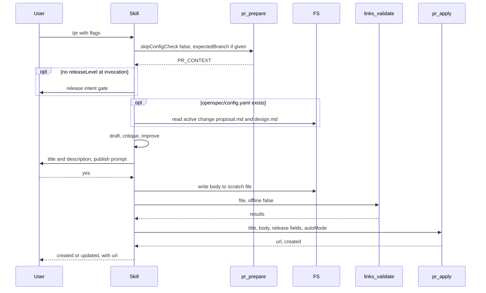
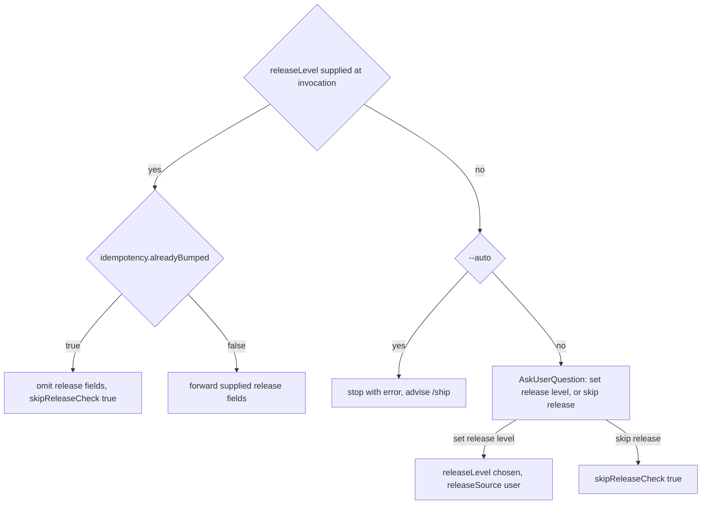

# skill-pr Specification

## Purpose
The `pr` skill (`/pr`) drafts a pull request title and description from `pr_prepare` context, gets user approval, checks links, and publishes through `pr_apply`. Users invoke it directly; `/ship` dispatches it with release intent already resolved.

## Requirements

### Requirement: Flags and invocation inputs
The skill SHALL accept the flags `--draft`, `--update`, `--base <branch>`, `--auto`, `--skip-approval`, and `--label <name>`, and SHALL honor only `--auto` and `--skip-approval`.

| Flag | Effect |
|---|---|
| `--draft` | Not supported; `pr_apply` has no draft field |
| `--update` | No separate behavior; `pr_apply` decides create vs update itself |
| `--base <branch>` | Not supported; `pr_apply` has no base-branch field |
| `--auto` | Skips the publish prompt; sets `autoMode: true` on `pr_apply`; stops a standalone call that has no release intent |
| `--skip-approval` | Skips the publish prompt only; `autoMode` stays driven by `--auto` |
| `--label <name>` | Not supported; the only label applied is the `release:*` label from `releaseLevel` |

Inputs an orchestrating caller may pass (no CLI flag exists for them):

| Input | Use |
|---|---|
| `expectedBranch` | Forwarded to `pr_prepare` |
| `releaseLevel`, `releaseNotes`, `releasePreRelease`, `releaseSource` | Release intent, forwarded to `pr_apply` |

#### Scenario: Unsupported flag
- **WHEN** `/pr --draft` is invoked
- **THEN** the PR is published through `pr_apply` without a draft setting

### Requirement: Main flow and tool order
The skill SHALL call `pr_prepare` first, `links_validate` next, and `pr_apply` last, and SHALL NOT run git or gh commands itself.

Main flow of one `/pr` run:

- The skill starts by announcing `I'm using pr (sdlc v{sdlc_version}).`, dropping the version part when no version is known.
- All data comes from `PR_CONTEXT` and the conversation; the skill does not gather diffs.
- No subagent is dispatched.

#### Scenario: Publish order
- **WHEN** the user approves the draft
- **THEN** `links_validate` runs before `pr_apply`

### Requirement: Plan mode stop
The skill SHALL stop before any tool call when plan mode is active.

- Announcement: `This skill requires write operations (creating or updating a pull request). Exit plan mode first, then re-invoke /pr.`

#### Scenario: Plan mode active
- **WHEN** the system context contains `Plan mode is active`
- **THEN** the skill shows the announcement and stops
- **AND** `pr_prepare` is not called

### Requirement: Preflight via pr_prepare
The skill SHALL call `pr_prepare` with `skipConfigCheck: false`, passing `expectedBranch` only when the caller supplied one, and SHALL stop on any preflight failure.

| `pr_prepare` result | Skill action |
|---|---|
| Tool error | Show the error, stop |
| `ok` is `false` | Show each entry of `errors`, stop |
| `warnings` not empty | Show them prominently, continue without asking |

- `ok: false` covers config migration failure, gh not logged in, gh account mismatch, an unsafe personal-key move, branch-guard failure, and being on `main` / `master`.

#### Scenario: On main branch
- **WHEN** `pr_prepare` returns `ok: false` because the branch is `main`
- **THEN** the skill shows the error and stops

#### Scenario: Uncommitted files
- **WHEN** `warnings` reports uncommitted changes
- **THEN** the skill shows the warning and continues to drafting

### Requirement: Invocation release intent is authoritative
The skill SHALL forward invocation-supplied `releaseLevel`, `releaseNotes`, `releasePreRelease`, and `releaseSource` to `pr_apply` unchanged, except when `PR_CONTEXT.idempotency.alreadyBumped` is `true`.

- `pr_prepare`'s `next` hint cannot override supplied release fields.
- Supplied release fields are never turned into `skipReleaseCheck: true`.
- The skill never invents a `releaseLevel` or a `releaseSource`.
- When `idempotency.alreadyBumped` is `true`, the skill omits all release fields and passes `skipReleaseCheck: true`, even when release fields were supplied.

#### Scenario: Dispatched by ship
- **WHEN** `/ship` dispatches the skill with `releaseLevel: "minor"` and `releaseSource: "config"`
- **THEN** the release intent gate is skipped
- **AND** `pr_apply` receives `releaseLevel: "minor"` and `releaseSource: "config"`

#### Scenario: Already bumped
- **WHEN** release fields were supplied and `idempotency.alreadyBumped` is `true`
- **THEN** `pr_apply` receives no release fields and `skipReleaseCheck: true`

### Requirement: Release intent gate
The skill SHALL resolve release intent before drafting when no `releaseLevel` was supplied at invocation.

How release intent is resolved:

- Auto mode: the skill stops with an error; standalone `/pr --auto` cannot decide release intent, and `pr_apply` rejects `releaseSource: "user"` under `autoMode`.
- Interactive prompt options: `Set release level` and `Skip release (acknowledged)`.
- With `bumpOptions` present: show `conventionalSummary` counts and `suggest`, then ask with one option per `bumpOptions` entry (`level` → `result`, marked as a preview), defaulting to the `suggest` level, plus an RC option (using `rcNext`) where `suggestedPreRelease` is set.
- With `bumpOptions` absent or empty: ask for `major` / `minor` / `patch` and whether it is an RC, with no version preview.
- The skill tells the user the numbers are a preview; CI picks the final version at merge time.
- A chosen RC variant sets `releasePreRelease: "rc"`.
- `Skip release (acknowledged)` is final; the skill does not ask again later.

#### Scenario: Standalone auto run
- **WHEN** `/pr --auto` runs with no `releaseLevel` supplied
- **THEN** the skill stops with an error and advises running `/ship`
- **AND** `pr_apply` is not called

#### Scenario: User picks a level
- **WHEN** the user picks `minor` in the interactive gate
- **THEN** the skill holds `releaseLevel: "minor"` and `releaseSource: "user"` for `pr_apply`

#### Scenario: User skips release
- **WHEN** the user picks `Skip release (acknowledged)`
- **THEN** `pr_apply` receives `skipReleaseCheck: true` and no release fields

### Requirement: Release notes drafting
The skill SHALL draft `releaseNotes` whenever a `releaseLevel` is held and `releaseNotes` is empty, whether the level came from the gate or the caller.

- Source: `PR_CONTEXT.commitsSinceTag` when present, else `PR_CONTEXT.commitsSinceBase`, plus conversation context.
- The notes cover every commit in the chosen list, not only the latest one.
- In the interactive gate, the skill shows the draft and lets the user amend it.

#### Scenario: Level without notes
- **WHEN** the caller supplies `releaseLevel: "patch"` and no `releaseNotes`
- **THEN** the skill drafts notes from `commitsSinceTag` or `commitsSinceBase`
- **AND** passes them as `releaseNotes` to `pr_apply`

### Requirement: Description structure
The skill SHALL use `PR_CONTEXT.template.headings` as the section list when a template exists, and the default 8-section layout otherwise, with every section present.

| Default section | Rule |
|---|---|
| `## Summary` | 1–3 plain-language sentences |
| `## JIRA Ticket` | Only when `jiraTicket` is not empty; otherwise the section is left out |
| `## Business Context` | Why the change is needed; `N/A` only for pure internal tooling |
| `## Business Benefits` | Value delivered; `N/A` only for pure internal tooling |
| `## Technical Design` | Approach, key decisions, trade-offs |
| `## Technical Impact` | Affected systems, breaking changes; `N/A` if isolated |
| `## Changes Overview` | Bullets grouped by concern; no file paths |
| `## Testing` | How it was verified; say so if no tests |

- Each section holds real content, `N/A` (with a short reason), or `Not detected`; never invented content.
- With a custom template, `template.content` guides how to fill each heading.
- When `template.legacy` is `true`, the skill says once that `.claude/pr-template.md` is deprecated and suggests moving it to `.sdlc-v2/pr-template.md`.
- The draft covers every commit in `PR_CONTEXT.commitsSinceBase`.
- When Business Context or Benefits cannot be filled from context, the skill asks with AskUserQuestion.

#### Scenario: No Jira ticket
- **WHEN** `jiraTicket` is empty and no template exists
- **THEN** the description has no `## JIRA Ticket` section

#### Scenario: Custom template
- **WHEN** `template.headings` is `Summary`, `Testing`
- **THEN** the description has exactly those sections, in that order

### Requirement: OpenSpec enrichment
The skill SHALL enrich the description from an active OpenSpec change when one can be identified without asking the user.

- Runs only when `openspec/config.yaml` exists.
- Active change: the one `openspec/changes/*/proposal.md` outside `archive/`; with several, the one matching `currentBranch`; if still ambiguous, skip silently.
- `proposal.md` fills Business Context and Business Benefits; `design.md`, when present, fills Technical Design.
- The line `**OpenSpec:** openspec/changes/<name>/` is added below the title.

#### Scenario: Two changes, none matches
- **WHEN** two active changes exist and neither matches the branch name
- **THEN** the skill skips enrichment without asking

### Requirement: Title
The skill SHALL draft a title under 72 characters in conventional commit style, unless the user directs otherwise.

- There is no config-backed title pattern and no title-pattern check.

#### Scenario: Feature branch
- **WHEN** the branch adds a feature
- **THEN** the title starts with `feat:` and is under 72 characters

### Requirement: Self-critique before review
The skill SHALL check the draft against its quality gates and revise it, up to 2 iterations per gate, before showing it to the user.

| Gate | Pass criteria |
|---|---|
| All sections present | Every template section has content, `N/A`, or `Not detected` |
| Specificity | Summary names a concrete change |
| Business honesty | Business sections concrete or `N/A` |
| No file paths | None in Changes Overview (only when that section exists) |
| Title length | `len(title) < 72` |
| No fabrication | Every claim traceable to context |
| JIRA accuracy | Section absent without a ticket; value matches `jiraTicket` |
| Audience check | Summary and business sections readable by non-technical readers |
| Documentation sync | Structural changes: ask the user to confirm docs are updated |
| Link verification | Deferred to the link gate before publishing |

- Gates still run under `--auto` and `--skip-approval`.

#### Scenario: Vague summary
- **WHEN** the draft Summary says `various improvements`
- **THEN** the skill rewrites it before showing the draft

### Requirement: Publish approval gate
The skill SHALL show the full title and description and SHALL NOT call `pr_apply` before an explicit `yes`, unless `--auto` or `--skip-approval` was passed.

- When a `releaseLevel` was passed at invocation, the skill first shows `Release: <level> (pre-release: rc) — publishing will apply label "release:<level>-rc"` or `Release: <level> — publishing will apply label "release:<level>"`; otherwise no release line.
- Prompt: `Publish this PR as shown?`, noting that create vs update is decided automatically.
- Options: `yes` publishes; `edit` asks what to change, revises, and shows the draft again; `cancel` aborts.
- `--auto` or `--skip-approval`: the draft is still shown, then treated as `yes`.

#### Scenario: User edits
- **WHEN** the user answers `edit`
- **THEN** the skill revises the draft and asks again

#### Scenario: User cancels
- **WHEN** the user answers `cancel`
- **THEN** `pr_apply` is not called

### Requirement: autoMode mapping
The skill SHALL pass `autoMode: true` to `pr_apply` if and only if `--auto` was passed.

- `--skip-approval` never sets `autoMode` and never remaps `releaseSource` or `releaseLevel`.

#### Scenario: Skip-approval without auto
- **WHEN** a caller dispatches the skill with `--skip-approval` and `releaseSource: "user"`, without `--auto`
- **THEN** `pr_apply` receives `autoMode: false` and `releaseSource: "user"`

#### Scenario: Auto flag
- **WHEN** the skill runs with `--auto` and `releaseSource: "config"` supplied
- **THEN** `pr_apply` receives `autoMode: true`

### Requirement: Link verification hard gate
The skill SHALL write the final body to a scratch file and call `links_validate` with `offline: false` before `pr_apply`, and SHALL stop on any violation.

- A `results[]` entry with `status` `violation` fails the gate; `ok` and `skipped` pass.
- On failure the skill shows `url`, `line`, `reason`, and `detail` for each violation and stops.
- No retry, no URL edits without user input, no bypass.

#### Scenario: Broken link
- **WHEN** `links_validate` returns one `violation`
- **THEN** the skill shows the violation and stops
- **AND** `pr_apply` is not called

### Requirement: Publish through pr_apply
The skill SHALL call `pr_apply` with `title`, `body`, `autoMode`, and either the resolved release fields or `skipReleaseCheck: true`, and SHALL report the result by `created`.

| Resolved intent | Fields sent |
|---|---|
| `releaseLevel` held | `releaseLevel`, `releaseNotes`, `releasePreRelease` (if set), `releaseSource` |
| Release skipped (gate option 2, or already bumped) | `skipReleaseCheck: true`, no release fields |

- `created: true` shows `Pull request created: <url>`.
- `created: false` shows `Pull request updated: <url>`.

#### Scenario: New PR
- **WHEN** `pr_apply` returns `created: true` and `url` `https://github.com/o/r/pull/9`
- **THEN** the skill shows `Pull request created: https://github.com/o/r/pull/9`

### Requirement: pr_apply failure
The skill SHALL show a `pr_apply` error and stop, with no retry and no account switch.

- For a gh install or auth problem, the skill tells the user to install and log in to the GitHub CLI.
- The skill offers to paste the drafted title and description for manual PR creation.

#### Scenario: gh permission error
- **WHEN** `pr_apply` returns an error
- **THEN** the skill shows it and stops
- **AND** offers the drafted title and description for manual use

### Requirement: No AI attribution
The skill SHALL NOT write an AI-tool attribution line, such as `Generated with Claude Code`, in the title or body.

#### Scenario: Body footer
- **WHEN** the skill drafts the body
- **THEN** the body has no `Generated with` attribution line

### Requirement: Error reporting
The skill SHALL offer the `error-report` skill only for failures that look like tool defects.

| Failure | Invoke `error-report` |
|---|---|
| `pr_prepare` tool error | Yes, if it looks like a defect |
| `PR_CONTEXT.ok` is `false` | No |
| `links_validate` violations | No |
| `pr_apply` tool error | Yes, if it looks like a defect |

- The report context names Skill `pr`, the failing step, the tool name and input, the error text, and suggests checking the plugin version, git remote and push state, and GitHub CLI auth.

#### Scenario: Auth failure is not a defect
- **WHEN** `PR_CONTEXT.ok` is `false` because gh is not logged in
- **THEN** the skill does not invoke `error-report`

### Requirement: Learnings and follow-ups
The skill SHALL record PR-related discoveries with `learnings_log` and SHALL suggest follow-up commands after publishing.

- Learning call: `learnings_log({action: "append", entry: "## YYYY-MM-DD — pr: 
\n
"})`.
- Topics: PR conventions, branch naming, CI requirements, template preferences, Jira key patterns, review quirks.
- Follow-up: `/review`; after OpenSpec enrichment also `openspec validate --strict <change>` and `openspec archive <change> --yes`.

#### Scenario: Enriched PR published
- **WHEN** the PR was enriched from change `add-login`
- **THEN** the follow-ups include `openspec validate --strict add-login`
