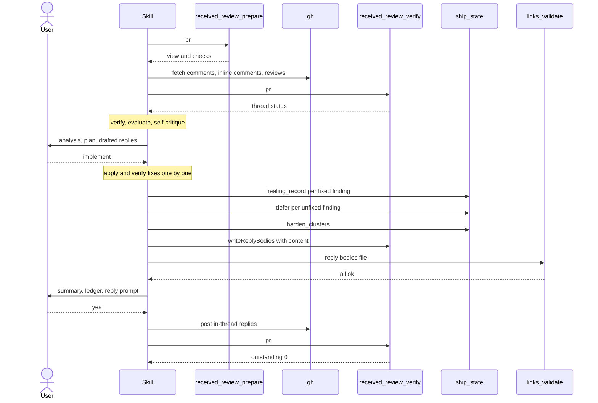
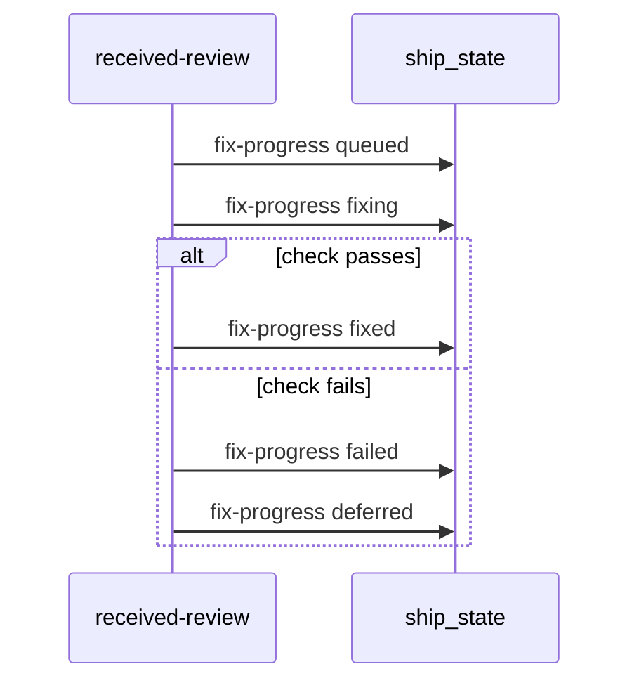

# skill-received-review Specification

## Purpose
The `received-review` skill processes code review feedback, from PR reviewer comments or from `/review` findings. It verifies each item against the codebase, decides a verdict, fixes accepted items after user consent, records every unfixed finding as a deferred item, and posts in-thread PR replies.

## Requirements

### Requirement: Arguments
The skill SHALL accept the flags `--pr <number>`, `--auto`, and `--no-harden`, and SHALL parse them only from its own invocation arguments.

| Flag | Effect |
|---|---|
| `--pr <number>` | PR whose feedback is processed. Enables `received_review_prepare`, `received_review_verify`, and PR replies. |
| `--auto` | Skips the Step 10 and Step 12 consent prompts and the harden cluster prompt. Only `agree-will-fix` items are auto-implemented. |
| `--no-harden` | Skips the harden meta-analysis step entirely. |

- `--auto` has one meaning: no confirmation prompt for "agree, will fix" items. There is no severity-based partial-auto mode.
- Pipeline context, conversation history, or inference never replaces the `--auto` flag.

#### Scenario: Dispatched by ship without --auto
- **WHEN** `/ship` dispatches the skill without passing `--auto`
- **THEN** the Step 10 consent gate still runs

### Requirement: Plan mode stop
The skill SHALL stop at start when plan mode is active.

#### Scenario: Plan mode active
- **WHEN** the system context contains "Plan mode is active"
- **THEN** the skill says "This skill requires write operations (file edits, gh api calls). Exit plan mode first, then re-invoke `/received-review`."
- **AND** stops

### Requirement: Main flow order
The skill SHALL run in this order: gather feedback, handle unclear items, verify, evaluate, present and get consent, implement, record findings, harden, verify links, reply, verify replies, log learnings.

- Last step: `learnings_log({action: "append", entry: "## YYYY-MM-DD — received-review: <brief summary>\n<details>"})`.

Main flow with a PR number in manual mode.



#### Scenario: No change before consent
- **WHEN** the skill has evaluated all items and not yet received `implement`
- **THEN** no file has been edited and no reply has been posted

#### Scenario: Run finishes
- **WHEN** the replies are posted and verified
- **THEN** the skill appends one entry with `learnings_log` action `append`

### Requirement: Feedback gathering
The skill SHALL collect feedback items into a list with columns `# | File | Line | Reviewer | Comment | Type | Comment ID`, where Type is one of `bug`, `style`, `architecture`, `feature-request`, `question`, `unclear`.

| Source | When | How |
|---|---|---|
| `received_review_prepare({pr})` | PR number available | PR overview (`view`) and CI status (`checks`); failing checks are reported in Step 10 |
| `gh pr view <pr> --comments` | PR number available | Top-level comments |
| `gh api repos/{owner}/{repo}/pulls/{pr}/comments` | PR number available | Inline comments with REST `id`, kept for replies |
| `gh api repos/{owner}/{repo}/pulls/{pr}/reviews` | PR number available | Submitted reviews |
| Dispatch prompt, conversation context, or user paste | No PR number | Findings from `/ship` or `/review` |

- `{owner}/{repo}` comes from `pr.owner`/`pr.repo` of `received_review_prepare`, or from `git remote get-url origin`.
- A `received_review_prepare` error is shown to the user; without a PR number that call is skipped.
- A persistent `gh` failure while fetching comments (auth error, repo not found) stops the skill after it asks the user to check `gh auth status` and the PR number; `error-report` is not invoked.

#### Scenario: Not authenticated
- **WHEN** `gh api repos/{owner}/{repo}/pulls/42/comments` fails with an auth error
- **THEN** the skill shows the error, asks the user to verify `gh auth status`, and stops

#### Scenario: PR number given
- **WHEN** the user runs `/received-review --pr 42`
- **THEN** the skill calls `received_review_prepare({pr: 42})`
- **AND** fetches comments with `gh api repos/{owner}/{repo}/pulls/42/comments`

#### Scenario: Findings from review
- **WHEN** no PR number is given and `/review` findings are in conversation context
- **THEN** the skill uses those findings as the items
- **AND** does not call `received_review_prepare`

### Requirement: Already-addressed comments
The skill SHALL skip only comments that are clearly already addressed, SHALL record each skip with `file:line` and the reason, and SHALL include a comment when in doubt.

- With a PR number, the skill calls `received_review_verify({pr})` and uses each thread's `status` (`outstanding`, `replied`, `self-replied`) for this check.
- A `received_review_verify` failure is noted and does not block the run.
- Step 12's summary lists every skipped comment.

#### Scenario: Verify tool fails
- **WHEN** the `received_review_verify` call in Step 1b fails
- **THEN** the skill notes the failure and continues with the raw comment data

### Requirement: Unclear items
The skill SHALL handle unclear items before any verification or fix.

| Mode | Behavior |
|---|---|
| Manual | Stop. Ask about all unclear items at once. Implement nothing yet. |
| `--auto` | Record each unclear item now with `ship_state({action: "defer", ...})`, `reason: "needs-direction"`, `description: "unclear: <what is ambiguous>"`. Exclude it from Steps 3–11. Continue with the clear items. |

- The `--auto` unclear-item record is final; the item is not recorded again in Step 11.

#### Scenario: Unclear item under --auto
- **WHEN** one item is unclear and `--auto` was passed
- **THEN** the skill calls `ship_state` action `defer` with `reason: "needs-direction"` and a description starting with `unclear:`
- **AND** the item gets no verification, evaluation, or fix attempt

#### Scenario: Unclear item in manual mode
- **WHEN** two items are unclear and `--auto` was not passed
- **THEN** the skill asks about both in one question
- **AND** makes no change

### Requirement: Verification against the codebase
The skill SHALL verify every item against the referenced code, its callers and dependents, and related modules and tests, and SHALL give it one verification status.

| Status | Meaning |
|---|---|
| confirmed | Claim is correct and the suggestion works in full context |
| confirmed, but suggestion is incomplete | Issue is real; the fix has side effects or misses related code |
| incorrect | Reviewer is wrong about what the code does |
| partially correct | Some aspects correct, some not |
| cannot verify | Needs runtime data or external context |

- A `cannot verify` item: in manual mode the skill asks the user for direction; under `--auto` it becomes `needs-direction` and is recorded in Step 11.

#### Scenario: Cannot verify under --auto
- **WHEN** an item needs production metrics to verify and `--auto` was passed
- **THEN** the item gets verdict `needs-direction` and is recorded in Step 11
- **AND** it is not dropped

### Requirement: Verdicts and auto-mode collapse
The skill SHALL give each verified item one verdict, and under `--auto` SHALL end a finding only by fixing it.

| Verdict | Manual mode | `--auto` mode | `reason` on the deferred record |
|---|---|---|---|
| `agree-will-fix` | fix now | fix now | none; not deferred |
| `agree-won't-fix` | allowed, reason stated | becomes `needs-direction` | `wont-fix` |
| `disagree` | allowed, reasoning stated | becomes `needs-direction` | `disagree` |
| `needs-direction` | allowed, owner input requested | allowed, 2+ approaches required | `needs-direction` |
| `cannot-verify` (Step 3) | ask the user | becomes `needs-direction` | `needs-direction` |

- `needs-direction` is valid only with two or more candidate approaches and a one-line trade-off.
- Exceptions without approaches: a Step 2 `--auto` unclear item (`unclear: ...`) and a Step 11 failed fix (`fix failed: ...`).
- Feature requests get a YAGNI check: the skill greps for real usage before accepting.

#### Scenario: Disagree under --auto
- **WHEN** the skill disagrees with a finding and `--auto` was passed
- **THEN** the finding's disposition is `needs-direction`
- **AND** its deferred record has `reason: "disagree"`

#### Scenario: Single approach
- **WHEN** only one reasonable fix exists for a finding
- **THEN** the verdict is not `needs-direction`; the skill makes the fix

### Requirement: Internal self-critique gates
The skill SHALL run a self-critique and revision pass on its evaluation and again on its drafted responses, and SHALL NOT show any output of these passes to the user.

| Pass | Gates |
|---|---|
| Evaluation | Verification completeness, no blind agreement, YAGNI applied, unclear items resolved, technical grounding |
| Responses | No performative language, technically grounded, technical pushback, thread-level replies, clear implementation plan, no blind agreement, proportional effort |

- Each gate gets at most 2 revision iterations.

#### Scenario: Gate results hidden
- **WHEN** the evaluation fails the "technical grounding" gate
- **THEN** the skill revises silently
- **AND** the user sees no gate status

### Requirement: Response drafting rules
The skill SHALL start each drafted response with the technical substance and SHALL NOT use performative or grateful openers.

- Forbidden: "You're absolutely right!", "Great point!", "Excellent feedback!", "Thanks for catching that!", any gratitude, "Let me implement that now" before verification.
- Pushback form: `Checked [location]. [What it does]. [Consequence]. Decision: [...]`.
- Replies go in-thread: `gh api repos/{owner}/{repo}/pulls/{pr}/comments/{comment_id}/replies`; never as a top-level PR comment.
- Reply bodies never include an AI-tool attribution line.

#### Scenario: Reply target
- **WHEN** a response answers inline comment `123`
- **THEN** it is posted to `.../pulls/{pr}/comments/123/replies`

### Requirement: Plan consent gate
The skill SHALL present an analysis table (`# | File | Line | Type | Verdict | Reasoning`), an action plan (will fix, will push back, needs direction), and all drafted responses before any change, and SHALL NOT implement without consent.

| Mode | Gate |
|---|---|
| Manual | AskUserQuestion "No changes have been made yet. How to proceed?" with `implement`, `edit`, `skip`. `edit` loops until `implement` or `skip`. |
| `--auto` | No prompt. Plan is still shown. Proceeds as `implement` for `agree-will-fix` items only. |

- `skip` discards the run: no fixes, no replies, no deferred records; the skill tells the user the findings exist only in the conversation.
- `needs-direction` items are never auto-actioned in either mode.

#### Scenario: User skips
- **WHEN** the user answers `skip`
- **THEN** no file is changed, no reply is posted, and no `ship_state` record is written

#### Scenario: Auto mode
- **WHEN** `--auto` was passed
- **THEN** the plan is displayed and fixes start without a prompt

### Requirement: Implementation
The skill SHALL implement accepted fixes one item at a time, blocking issues first, then simple fixes, then complex fixes, and SHALL verify each fix (compiles, tests pass) before the next.

- `agree-won't-fix`, `disagree`, and `needs-direction` items are not implemented.
- A fix that fails its own verification is reverted with `git checkout -- <files>` for that fix's files only.
- The failed item becomes unfixed with `reason: "needs-direction"` and `description: "fix failed: <error, max 200 chars>"`; no other approach is tried.
- In manual mode, the Step 12 summary names the failed fix and why.

#### Scenario: Fix breaks tests
- **WHEN** the fix for `api.go:42` makes tests fail
- **THEN** the skill reverts only that fix's files
- **AND** the finding is recorded in the Step 11 recording pass with `description` starting `fix failed:`

### Requirement: Finding records
After the fix pass, the skill SHALL record every finding once: `healing_record` for each fixed and verified finding, `defer` for each unfixed finding.

- No `defer` record is written before this point, except the Step 2 `--auto` unclear-item record.

Fixed finding:

```text
ship_state({action:"healing_record", step:"received-review", detail:{
  kind: "fixed", origin: "<local-review|pr-comment>",
  severity: "<critical|high|medium|low|info>", file, line, title }})
```

Unfixed finding:

```text
ship_state({action:"defer", step:"received-review", detail:{
  severity: "<critical|high|medium|low>", file, title, line,
  reason: "<wont-fix|disagree|needs-direction>",
  description: "<approach A vs approach B, then trade-off>",
  source: "received-review" }})
```

- `origin` is `pr-comment` for GitHub comments and `local-review` for everything else.
- Severity is `medium` when a human comment carries none.
- A `healing_record` failure prints `WARNING: could not record healing for <file>:<line> — <error>` and the run continues.

#### Scenario: Two fixed, one deferred
- **WHEN** two findings are fixed and one ends `disagree`
- **THEN** the skill makes two `healing_record` calls and one `defer` call with `reason: "disagree"`

### Requirement: Defer fallback and unaccounted findings
When a `defer` narration contains `WARNING: could not persist this item`, the skill SHALL NOT retry `defer` and SHALL call `ship_state({action: "deferred_add", ...})` once.

| `deferred_add` field | Value |
|---|---|
| `id` | `received-review-<short slug>-<YYYYMMDDThhmmssZ>` |
| `description` | `<file>:<line> [<severity>] <title> — reason: <reason>. <reasoning>` |
| `source` | `received-review` |
| `priority` | `high` for critical/high, `medium` for medium, `low` for low/info |

- When both calls fail, the finding is named as UNACCOUNTED in the Step 12 ledger; the run does not abort.

#### Scenario: Durable write fails twice
- **WHEN** `defer` warns `could not persist this item` and `deferred_add` also fails
- **THEN** the Step 12 ledger names that finding as UNACCOUNTED

### Requirement: Harden meta-analysis
The skill SHALL run a best-effort harden step after recording, whose failure never blocks link verification or replies.

| Condition | Behavior |
|---|---|
| `--no-harden` passed | Skip; summary line `harden dispatch skipped — --no-harden (ship harden step owns hardening)` |
| No AskUserQuestion and no `--auto` | Skip; summary line `harden dispatch skipped — no AskUserQuestion and no --auto` |
| Otherwise | Call `ship_state({action: "harden_clusters", detail: {findings: [...]}})` |

- Only findings with a Step 4 verdict enter clusters; `cannot-verify` findings do not.
- Manual mode: AskUserQuestion `dispatch | skip` per cluster with `alreadyHardened` false.
- `--auto`: dispatch every cluster with `alreadyHardened` false, without a prompt, passing `--auto`.
- Dispatch: `Skill("harden", "--failure-text \"<cluster.failureText>\" --skill received-review --step \"Step 11.6 — meta-analysis\" --operation \"review-feedback-driven hardening\"")`, with `failureText` copied verbatim.
- The skill never adds `--auto` to a dispatch unless its own invocation had `--auto`.
- A failed dispatch adds `harden dispatch failed — file=<key>` to the summary.
- `suppressed[]`, `loneDisagree[]`, and harden's `Auto-accepted` lines are copied into the summary.
- Cluster rules are defined by `harden_clusters`; see `plugins/sdlc/skills/harden/review-clusters.md`.

#### Scenario: No-harden flag
- **WHEN** `--no-harden` was passed
- **THEN** `harden_clusters` is not called
- **AND** the summary contains `harden dispatch skipped — --no-harden (ship harden step owns hardening)`

### Requirement: Link verification gate before replies
Before posting any reply the skill SHALL write all reply bodies with `received_review_verify({writeReplyBodies: true, content})` and validate them with `links_validate({file: ".sdlc-v2/state/artifacts/received-review-reply-bodies.md", offline: false})`.

- When any result has a status other than `ok` or `skipped`, the skill posts no reply, shows the violations (url, line, reason, detail) verbatim, and stops.
- It does not retry, does not edit URLs without user input, and does not bypass the gate.
- `offline: true` skips network reachability checks (for sandboxed CI).

#### Scenario: Unreachable link in a reply
- **WHEN** `links_validate` reports one URL with a status other than `ok` or `skipped`
- **THEN** no reply is posted and the reply step does not run

### Requirement: Summary and findings ledger
The skill SHALL print a summary and a ledger line that accounts for every finding the run touched, grouped by deferred `reason`.

```text
Review findings: 14 total = 9 fixed + 5 deferred
  needs-direction  2
  disagree         2
  wont-fix         1
Run /sdlc:deferred to act on the 5 deferred findings.
```

- A finding counts as deferred only when its record reached `.sdlc-v2/history/deferred.json` (`defer` without a persist warning, or `deferred_add` returning `{ok, id}`).
- When fixed + deferred is not the total: `... — <n> UNACCOUNTED. Names: <file:line>, ...`. The total is never adjusted.
- The `/sdlc:deferred` line appears only when the deferred count is not zero.
- The summary also lists comments skipped as already addressed, when any.

#### Scenario: Nothing deferred
- **WHEN** all findings were fixed
- **THEN** there is no `Run /sdlc:deferred` line

### Requirement: PR thread replies
After the summary, the skill SHALL post in-thread replies for the action-plan items when consent is given.

| Mode | Gate |
|---|---|
| No PR number | Print `no PR — thread replies skipped; ledger only`; skip replies and Step 12.5 |
| Manual | AskUserQuestion "Should I reply to all addressed review comments on the PR?" with `yes`, `skip`, `selective` |
| `--auto` | No prompt; reply to every action-plan item |

| Item | Reply body |
|---|---|
| agree, will fix | `Fixed — <what changed>` |
| disagree | The pushback response |
| agree, won't fix | `Acknowledged — not fixing in this PR because: <reason>` |
| needs direction, record succeeded | `Recorded for a decision — <approach A> or <approach B>; trade-off: <one line>. Tracked as a deferred follow-up (/sdlc:deferred).` |
| needs direction, record failed | Same text without the `Tracked as a deferred follow-up` sentence |

- The skill never resolves threads (no GraphQL `resolveReviewThread`); it tells the user which threads to resolve in the GitHub UI.
- A `gh api` 5xx on posting is retried once; after a second failure the drafted reply is shown for manual posting.

#### Scenario: Record failed
- **WHEN** a `needs-direction` finding is UNACCOUNTED
- **THEN** its reply does not claim it is tracked in `/sdlc:deferred`

#### Scenario: No PR
- **WHEN** no PR number is available
- **THEN** the skill prints `no PR — thread replies skipped; ledger only` and still prints the ledger

### Requirement: Post-reply verification
With a PR number, after posting replies, the skill SHALL call `received_review_verify({pr})` and, while `outstanding` is greater than 0, reply to each outstanding thread and verify again, for at most 2 rounds.

- Threads still outstanding after 2 rounds are reported to the user for manual handling.
- A `received_review_verify` failure is noted and the skill proceeds to its report.

#### Scenario: One thread missed
- **WHEN** `received_review_verify` returns `outstanding: 1`
- **THEN** the skill drafts and posts a reply for that thread and verifies again

### Requirement: Error reporting scope
The skill SHALL invoke `error-report` only when posting a reply with `gh api` fails twice with a 5xx or unexpected server error.

| Error | Invoke `error-report`? |
|---|---|
| `received_review_prepare` fails (bad PR, no remote, gh not authed) | No |
| `gh pr view` / `gh api` comment fetch fails | No |
| Comment refers to a file or line that no longer exists | No |
| Claim cannot be verified | No |
| `defer` warns `could not persist this item` | No |
| `links_validate` reports a violation | No |
| `gh api` reply post fails with 5xx twice | Yes |

- The report names Skill `received-review`, the step, the `gh api` operation, and the HTTP status and message.

#### Scenario: Reply post fails twice
- **WHEN** posting a reply returns HTTP 502 twice
- **THEN** the skill shows the drafted reply for manual posting
- **AND** invokes `error-report`

### Requirement: Fix progress records
In Step 11, the skill SHALL write the status of each will-fix finding with `ship_state` `healing_record` kind `fix-progress`, in the order of the diagram below.



#### Scenario: Fix passes its check
- **WHEN** the fix for `internal/auth/token.go:42` passes its check
- **THEN** the skill makes a `fix-progress` call with status `fixed` before the next fix starts
- **AND** the `fixed` kind call stays in the recording part of Step 11

#### Scenario: Fix fails its check
- **WHEN** the fix for `internal/api/errors.go:17` fails its check
- **THEN** the skill reverts the files of that fix
- **AND** the skill makes a `fix-progress` call with status `failed`

#### Scenario: Same key in each call
- **WHEN** the skill writes the statuses of one finding
- **THEN** each call has the same `origin`, `file`, `line`, and `title`

#### Scenario: Finding with no queued call
- **WHEN** a finding ends unfixed and got no `queued` call
- **THEN** the skill makes no `deferred` call for that finding

#### Scenario: Standalone run
- **WHEN** no ship run is live on the branch
- **THEN** each `fix-progress` call returns `written:false` and the fix pass continues

### Requirement: Fix progress write failure
A failed `fix-progress` call SHALL NOT stop a fix or a reply.

#### Scenario: Status write fails
- **WHEN** a `fix-progress` call returns an error
- **THEN** the skill prints `WARNING: could not record fix progress for <file>:<line> — <error>`
- **AND** the fix continues
