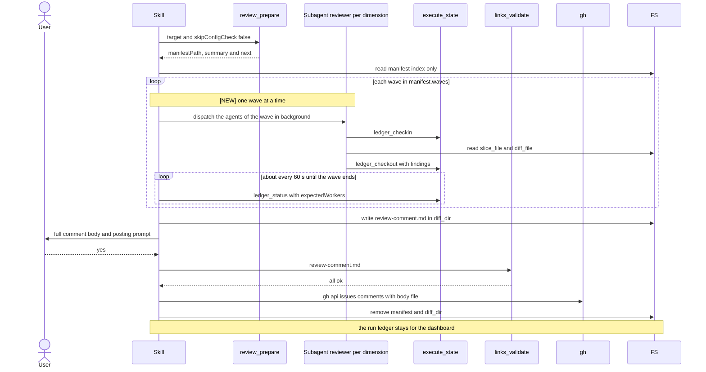

# skill-review Specification

## Purpose
The `review` skill reviews code changes across the project's review dimensions. It calls `review_prepare`, dispatches one background reviewer agent per dimension from the main session, collects findings through the `execute_state` ledger, and builds, shows, and optionally posts or saves one consolidated review comment.

## Requirements

### Requirement: Arguments
The skill SHALL accept only the flags `--base <branch>` and `--dry-run`.

| Flag | Effect |
|---|---|
| `--base <branch>` | Forwarded to `review_prepare` as `target`. |
| `--dry-run` | Prints the review plan and stops before any agent is dispatched. Not forwarded to the tool. |

- Review scope (`all`, `committed`, `staged`, `working`, `worktree`) comes from the `scope` key of the `[review]` section in `.sdlc-v2/local.toml`, read by `review_prepare` (default `all`). It is changed with `/setup` or by editing that file.
- The skill does not support `--committed`, `--staged`, `--working`, `--worktree`, `--set-default`, or `--dimensions`.

#### Scenario: Base branch override
- **WHEN** the user runs `/review --base develop`
- **THEN** the skill calls `review_prepare` with `target: "develop"` and `skipConfigCheck: false`

#### Scenario: No base flag
- **WHEN** the user runs `/review`
- **THEN** the skill calls `review_prepare` with an empty `target`

### Requirement: Prepare step and error stop
The skill SHALL call `review_prepare` first and SHALL stop when that call fails.

- On a tool error the skill shows the error message to the user and stops.
- When the tool reported a `manifestPath` before failing, the skill deletes it with `rm -f` first.

#### Scenario: No changed files
- **WHEN** `review_prepare` fails with `No changed files found`
- **THEN** the skill shows that error and stops
- **AND** no reviewer agent is dispatched

### Requirement: Thin-index manifest handling
The skill SHALL read the manifest at `manifestPath` into the main session and SHALL NOT read the contents of any `slice_file` or `diff_file` listed in it.

- Each `dimensions[]` entry carries only `name`, `description`, `severity`, `model`, `status`, `requires_full_diff`, `truncated`, `matched_count`, `diff_file`, `slice_file`.
- The skill passes `slice_file` and `diff_file` paths to each reviewer agent; the agent reads them.
- When `manifest.warnings` is non-empty, the skill shows every entry to the user before it continues.

#### Scenario: Paths only
- **WHEN** the skill builds a reviewer prompt
- **THEN** the prompt contains the `slice_file` and `diff_file` paths
- **AND** the main session has not read either file

#### Scenario: PR lookup warning
- **WHEN** `manifest.warnings` holds a failed-PR-lookup entry
- **THEN** the skill shows that warning to the user
- **AND** the posting step uses the no-PR options, because `manifest.pr.exists` is `false`

### Requirement: Dry run
When `--dry-run` is passed the skill SHALL print the review plan from the manifest, delete `manifestPath` and `manifest.diff_dir`, and stop without dispatching any agent.

The printed plan has this shape:

```text
Review Plan (dry run — no agents dispatched)

  Base branch:    {manifest.base_branch}
  Changed files:  {manifest.git.changed_files_count}
  Dimensions:     {manifest.summary.active_dimensions} active in {manifest.summary.wave_count} wave(s) of up to {manifest.plan_critique.max_parallel_dimensions}, {manifest.summary.skipped_dimensions} skipped

| Dimension | Files | Severity | Status |
|-----------|-------|----------|--------|
{one row per entry in manifest.dimensions}

Plan critique:
  - Uncovered files:       {plan_critique.uncovered_files or "none"}
  - Over-broad:            {plan_critique.over_broad_dimensions or "none"}
  - Suggested dimensions:  {plan_critique.uncovered_suggestions[].dimension or "none"}

To execute the full review, run /review (without --dry-run).
```

- The plan has no `queued` count and no `Queued (not reviewed)` line.

#### Scenario: Dry run stops early
- **WHEN** the user runs `/review --dry-run`
- **THEN** the skill prints `Review Plan (dry run — no agents dispatched)` and the dimension table
- **AND** runs `rm -f "<manifestPath>"` and `rm -rf "{manifest.diff_dir}"`, and stops
- **AND** does not call `ledger_cleanup`, because no `runId` exists yet

#### Scenario: Dry run with queued dimensions
- **WHEN** the user runs `/review --dry-run` with 21 active dimensions, `summary.wave_count` `3`, `plan_critique.max_parallel_dimensions` `8`, and 2 skipped dimensions
- **THEN** the `Dimensions:` line is `21 active in 3 wave(s) of up to 8, 2 skipped`
- **AND** the plan has no `Queued (not reviewed)` line

#### Scenario: Dry run with no queued dimensions
- **WHEN** the user runs `/review --dry-run` and `summary.wave_count` is `1`
- **THEN** the `Dimensions:` line contains `in 1 wave(s) of up to`
- **AND** the plan has no `Queued (not reviewed)` line

### Requirement: Run and worker identifiers
The skill SHALL derive one ledger `runId` per run and one `workerId` per dispatched dimension.

- `runId` is `review-` + the manifest `timestamp`, with every character outside `[A-Za-z0-9_-]` replaced by `-`.
- `workerId` is the dimension `name` lowercased, with every run of characters outside `[A-Za-z0-9_-]` collapsed to one `-`.
- The skill adds a `workerId` to the `expectedWorkers` list only when it starts the agent of that worker. `expectedWorkers` never holds a worker of a wave that has not started.

#### Scenario: Timestamp with colons
- **WHEN** the manifest `timestamp` is `2026-09-30T10:15:00Z`
- **THEN** `runId` is `review-2026-09-30T10-15-00Z`

#### Scenario: Later wave not expected yet
- **WHEN** the skill has started `waves[0]` and `waves[1]` has not started
- **THEN** `expectedWorkers` holds only the worker IDs of `waves[0]`

### Requirement: Reviewer dispatch
The skill SHALL dispatch one background Agent per dimension name in `manifest.waves`, one wave at a time, with all agents of one wave in a single message and `run_in_background: true`. The skill SHALL start the next wave only after every worker of the current wave is done, skipped or stopped.

- The skill finds the `manifest.dimensions[]` entry of each name in the wave to build the agent prompt.
- When `manifest.waves` is empty, the skill starts no agent and does not poll. It goes to findings consolidation with zero findings.
- Each agent's `model` is `dimension.model` when set, otherwise `manifest.subagent_model`, forwarded verbatim.
- The skill uses only background Agent dispatch, not a Workflow-tool fan-out: the stall, missing-worker and cleanup rules need a task ID for each worker to call `TaskStop`.
- When a dispatch returns no task ID, the worker stays in `expectedWorkers`, is handled as missing, and is named as possibly still running.
- `SKIPPED` dimensions get no agent.

Each reviewer agent prompt requires this order:

| Order | Agent action |
|---|---|
| 1 | `execute_state({action: "ledger_checkin", runId, workerId})` before reading its files |
| 2 | Read `slice_file` (JSON: `body`, `matched_files`, `file_context`, `warnings`) and `diff_file` |
| 3 | Review only `matched_files`, only for the dimension's concern; at most 20 findings |
| 4 | `execute_state({action: "ledger_checkout", runId, workerId, findings})` last |

- `findings` is a raw JSON array of `{severity, file, line, rationale}`, or `[]` when there are none.
- The default severity for findings is the dimension's `severity`.
- When `truncated` is `true`, the skill treats that dimension's `diff_file` as partial; findings outside it may exist.
- Every reviewer prompt carries the dimension's `truncated` value in a "Diff Completeness" section. When it is `true`, the prompt tells the agent its diff is partial, that a footer starting with `# --- Truncated` lists the omitted files, and that it must not call the omitted files clean.

Main review flow from prepare to cleanup. The wave loop is new:



#### Scenario: Per-dimension model override
- **WHEN** a dimension has `model: "opus"` and `manifest.subagent_model` is `sonnet`
- **THEN** that dimension's agent is dispatched with model `opus`

#### Scenario: Skipped dimension
- **WHEN** a dimension has `status: "SKIPPED"`
- **THEN** no agent is dispatched for it

#### Scenario: Truncated dimension prompt
- **WHEN** a dimension has `truncated: true`
- **THEN** its reviewer prompt contains `truncated: true`
- **AND** the prompt says the diff file is partial and names the `# --- Truncated` footer

#### Scenario: Three waves
- **WHEN** `manifest.waves` holds waves of 8, 8 and 5 names
- **THEN** the skill sends three dispatch messages, one per wave, in wave order
- **AND** the second message is sent only after every worker of the first wave is done, skipped or stopped
- **AND** 21 agents run in total

#### Scenario: No wave
- **WHEN** `manifest.waves` is `[]`
- **THEN** the skill starts no agent and makes no `ledger_status` call
- **AND** the comment reports zero findings

### Requirement: Ledger polling
The skill SHALL poll `execute_state({action: "ledger_status", runId, expectedWorkers, timeoutSeconds: 1800})` about every 60 seconds for each wave until every worker of that wave is done, skipped, or stopped.

- The skill SHALL NOT end the poll of a wave while a worker of that wave is still running. A worker ends as stopped only after it is confirmed stalled or missing on two polls in a row.
- Workers of earlier waves are already done, skipped or stopped. The skill does not count them for the current wave and does not stop them again.
- After the last wave ends, the skill consolidates the findings from the last poll.

#### Scenario: All workers done
- **WHEN** every expected `workerId` of the last wave shows `status: "done"`
- **THEN** the skill stops polling and consolidates findings

#### Scenario: Wave ends and a next wave exists
- **WHEN** every worker of `waves[0]` is done and `waves[1]` exists
- **THEN** the skill stops polling for `waves[0]` and starts the agents of `waves[1]`

### Requirement: Stalled and missing workers
The skill SHALL wait one more poll when a `workerId` of the current wave first appears in `stalledWorkers` or `missingWorkers`, and SHALL stop waiting on it when it appears there again on the next poll.

- The skill then calls `TaskStop` once for that worker, and the worker counts as stopped.
- When `TaskStop` returns an ownership error, the skill does not retry it and names the worker `possibly still running` in the comment.
- The skill ignores the findings of a stopped worker, also when a later poll shows it `done`.
- While a worker could not be stopped, the skill keeps `{manifest.diff_dir}` at cleanup and says in the output that the run can exceed `max_parallel_dimensions` agents.
- The skill keeps the poll for the other workers of the current wave. When the wave ends, the next wave starts, or consolidation starts after the last wave.
- The final `review-comment.md` names every skipped dimension.
- A stalled-twice dimension gets its own block with the note `Skipped — worker stalled twice; no findings collected`.
- For a missing worker, the skill also logs a warning.

#### Scenario: Worker stalled on two polls
- **WHEN** worker `security` is in `stalledWorkers` on two polls in a row
- **THEN** the skill calls `TaskStop` once for `security` and continues without it
- **AND** the comment states that `security` was skipped and its findings are absent

#### Scenario: Worker stalled once
- **WHEN** a worker is in `stalledWorkers` on one poll and `done` on the next
- **THEN** its findings are included

#### Scenario: Stalled worker in an early wave
- **WHEN** a worker of `waves[0]` is stalled on two polls in a row and `waves[1]` exists
- **THEN** the skill starts `waves[1]` after the other workers of `waves[0]` are done
- **AND** the skill does not call `TaskStop` again for the stopped worker in a later wave

### Requirement: Findings consolidation
The skill SHALL parse each worker's `findings` from the `ledger_status` response and SHALL deduplicate, flag contradictions, and recalibrate severities before building the comment.

| Case | Action |
|---|---|
| Same `file:line` from several dimensions | Keep the entry from the highest-severity dimension; add `Also flagged by: {other-dimension}` |
| Conflicting advice at the same `file:line` | Keep both; add `Note: conflicting recommendations — manual review required.` |
| Wrong severity (e.g. `info` for credential exposure) | Re-calibrate |
| Dimension with zero findings | Check whether its diff really has no issue for that concern |

- Findings are never written to `.sdlc-v2/runs/ledger/` files directly.

#### Scenario: Duplicate finding
- **WHEN** `security` (high) and `code-quality` (medium) both flag `api.go:42`
- **THEN** the comment keeps the `security` entry with `Also flagged by: code-quality`

### Requirement: Verdict
The skill SHALL compute the verdict from the consolidated findings with these rules, first match wins.

| Verdict | Condition |
|---|---|
| `CHANGES REQUESTED` | Any `critical` finding, or 3 or more `high` findings |
| `APPROVED WITH NOTES` | Any `high` finding, or 5 or more `medium` findings |
| `APPROVED` | All other cases |

#### Scenario: One critical finding
- **WHEN** the consolidated findings include one `critical`
- **THEN** the verdict is `CHANGES REQUESTED`

#### Scenario: Four medium findings
- **WHEN** the findings are 4 `medium` and nothing higher
- **THEN** the verdict is `APPROVED`

### Requirement: Consolidated comment file
The skill SHALL write the consolidated comment with the Write tool to `{manifest.diff_dir}/review-comment.md`.

- First line: `## Code Review — {N} dimension(s), {M} finding(s)`; `{N}` excludes dimensions skipped as stalled.
- Second block: `> Automated review by \`review\` v{plugin_version} · {date}`, with `{plugin_version}` from `manifest.plugin_version` and `{date}` as `YYYY-MM-DD`.
- The comment has no `Queued (not reviewed` line, because every matching dimension runs.
- A `### Summary` table with columns `Dimension | Findings | Critical | High | Medium | Low | Info` and a **Total** row.
- A `### Verdict: {verdict}` heading and a one-sentence assessment. The heading has no `partial coverage` caveat.
- One `### {dimension.name} — {N} finding(s)` block per dimension, with findings in a `<details>` element.
- Each finding: `#### [{SEVERITY}] {title}`, `**File:** \`{file}:{line}\``, description, `**Suggestion:**`.
- The body never includes an AI-tool attribution line.

#### Scenario: Comment persisted
- **WHEN** consolidation finishes
- **THEN** `{manifest.diff_dir}/review-comment.md` exists and starts with `## Code Review —`

#### Scenario: Queued note present
- **WHEN** the review ran 21 dimensions in 3 waves
- **THEN** the comment contains no `Queued (not reviewed` line
- **AND** the first line is `## Code Review — 21 dimension(s), {M} finding(s)` when no worker stalled

#### Scenario: Queued note absent
- **WHEN** the review ran in one wave
- **THEN** the comment contains no `Queued (not reviewed` line

#### Scenario: Verdict carries a coverage caveat
- **WHEN** the review ran in more than one wave and the findings give the verdict `APPROVED`
- **THEN** the verdict heading is `### Verdict: APPROVED`
- **AND** Step 8 treats the verdict as `APPROVED`

#### Scenario: Verdict without queued dimensions
- **WHEN** the review ran in one wave
- **THEN** the verdict heading has no `partial coverage` caveat

### Requirement: Full comment display
The skill SHALL Read `{manifest.diff_dir}/review-comment.md` and SHALL show its full content verbatim in a fenced markdown block before any posting prompt.

- No summary, paraphrase, truncation, or placeholder such as "Additional finding (see PR comment for details)".
- The skill does not delete `manifestPath` or the ledger at this step.

#### Scenario: Twelve findings
- **WHEN** the comment has 12 findings
- **THEN** the user sees all 12 in the terminal before any prompt

### Requirement: Posting options
The skill SHALL choose the posting prompt from the manifest and SHALL wait for the user's answer.

| Situation | Options |
|---|---|
| `manifest.pr.exists` is `true` | `yes` (post to PR #n), `save`, `cancel` |
| No PR, `manifest.scope` is `all` or `committed` | 1. Create a draft PR and attach the review; 2. Save; 3. Terminal only |
| No PR, `manifest.scope` is `staged`, `working`, or `worktree` | 1. Save; 2. Terminal only |

- `manifest.pr.exists` is `true` only when `review_prepare` found an open PR for the current branch; see the `tool-review-prepare` PR lookup requirement. It is always `false` for scopes `staged`, `working`, and `worktree`. These scopes review uncommitted changes, so such a review is never offered for posting to a PR, existing or new.
- Post: `gh api repos/{owner}/{repo}/issues/{number}/comments -F body=@{manifest.diff_dir}/review-comment.md`, with `owner`, `repo`, and `number` from `manifest.pr`.
- Create-draft-PR option: the skill runs the link verification gate first, and only on all-clear invokes `pr` in draft mode, waits, then posts to the new PR.
- Save: the skill passes the comment text to `review_prepare({saveReview: true, content})`; the tool writes `.sdlc-v2/reviews/<branch>-<YYYY-MM-DD>.md`.
- Cancel or terminal only: no action.

#### Scenario: Open PR exists
- **WHEN** `manifest.pr` is `{exists: true, number: 42, owner: "acme", repo: "widgets"}`
- **THEN** the prompt offers `yes` (post to PR #42), `save`, and `cancel`
- **AND** it does not offer to create a draft PR

#### Scenario: Local scope without PR
- **WHEN** there is no PR and `manifest.scope` is `staged`
- **THEN** the prompt offers only save and terminal-only

#### Scenario: Worktree scope without PR
- **WHEN** there is no PR and `manifest.scope` is `worktree`
- **THEN** the prompt offers only save and terminal-only
- **AND** it does not offer to create a draft PR

#### Scenario: Save chosen
- **WHEN** the user picks save
- **THEN** the skill calls `review_prepare` with `saveReview: true` and the content of `review-comment.md`

### Requirement: Link verification gate before posting
Before every post of the review comment (answer `yes` to post to an existing PR, or the create-draft-PR option) the skill SHALL first call `links_validate({file: "{manifest.diff_dir}/review-comment.md", offline: false})` and SHALL NOT post when any result has a status other than `ok` or `skipped`.

- On a violation the skill shows the violation list verbatim and stops.
- It does not retry, does not edit URLs without user input, and does not bypass the gate.
- `skipped` (skip-list host, or `offline: true`) counts as all-clear, like `ok`.
- `offline: true` skips network reachability checks and keeps context checks (for sandboxed CI).
- For the create-draft-PR option the gate runs before `pr` is invoked, so a violation creates no PR.

#### Scenario: Broken link
- **WHEN** `links_validate` returns one result with `status` `violation`
- **THEN** the comment is not posted
- **AND** the user sees the violation list

#### Scenario: Skipped link
- **WHEN** every `links_validate` result is `ok` or `skipped`
- **THEN** the skill posts the comment

#### Scenario: Broken link on the draft-PR path
- **WHEN** there is no PR, the user picks "Create a draft PR and attach this review", and `links_validate` reports a violation
- **THEN** the skill does not invoke `pr` and posts nothing
- **AND** the user sees the violation list

### Requirement: Self-fix offer
When the verdict is `CHANGES REQUESTED` or `APPROVED WITH NOTES` the skill SHALL ask "The review found actionable items. Address them now?" and act on the answer.

| Answer | Action |
|---|---|
| `fix` | Invoke `received-review`; findings are in conversation context |
| `harden` | `Skill(harden)` with `--failure-text "Review verdict CHANGES REQUESTED — dimension blocker(s): <dimension-list>"`, `--skill review`, `--step "Step 8 — actionable findings"`, `--operation "self-fix offer"` |
| `no` | Done |

- `harden` is offered only when the verdict is `CHANGES REQUESTED` with at least one dimension blocker.
- No offer is made when the verdict is `APPROVED`.

#### Scenario: Approved
- **WHEN** the verdict is `APPROVED`
- **THEN** the skill makes no self-fix offer

#### Scenario: Notes only
- **WHEN** the verdict is `APPROVED WITH NOTES`
- **THEN** the offer lists `fix` and `no`
- **AND** does not list `harden`

### Requirement: Cleanup on every terminal path
The skill SHALL remove the temp files of the run on dry-run stop, error stop, and normal completion, and SHALL keep the run ledger.

- `rm -f "<manifestPath>"`
- `rm -rf "{manifest.diff_dir}"`
- The skill does not call `execute_state({action: "ledger_cleanup", runId})`. The dashboard reads the ledger to show the review dimensions of a finished run.
- The first execute `gc` or ship `cleanup-pipeline` sweep after the GC TTL (7 days by default) removes the ledger folder.

#### Scenario: Normal completion
- **WHEN** the posting and self-fix steps finish
- **THEN** the manifest and the diff directory are removed
- **AND** the folder `.sdlc-v2/runs/ledger/<runId>/` stays

#### Scenario: Dry-run stop
- **WHEN** the user runs `/review --dry-run`
- **THEN** the manifest and the diff directory are removed
- **AND** no ledger folder exists for the run

### Requirement: Error reporting scope
The skill SHALL NOT invoke `error-report` for user errors and SHALL use it only for tool-call crashes.

#### Scenario: User error
- **WHEN** `review_prepare` fails because no dimension files exist
- **THEN** the skill does not invoke `error-report`

### Requirement: Interrupted review restarts
The skill SHALL NOT resume an interrupted `/review` run. A new `/review` run SHALL start at Step 0 with a new manifest and a new `runId`, and SHALL NOT read the ledger files of the old run.

- Before the new run, the skill runs the cleanup step for the interrupted run when the session still has its task IDs. Otherwise it tells the user that old workers can still run and write to the old ledger.

#### Scenario: Run interrupted between waves
- **WHEN** a `/review` run stops after `waves[0]` ends and before `waves[1]` starts
- **AND** the user runs `/review` again
- **THEN** the skill calls `review_prepare` again and derives a new `runId`
- **AND** the skill starts from `waves[0]` of the new manifest

### Requirement: Run ID and worker IDs from the manifest
The skill SHALL use `manifest.run_id` as the ledger run ID and `dimension.worker_id` as each worker ID. It SHALL keep no slug or sanitize rule of its own. It SHALL forward `--dry-run` to `review_prepare` as `dryRun: true`.

#### Scenario: Normal run
- **WHEN** the manifest has `run_id` `review-2026-10-08T11-09-18Z`
- **THEN** every `ledger_checkin` uses that run ID

#### Scenario: Dry run
- **WHEN** the user runs the review with `--dry-run`
- **THEN** the skill calls `review_prepare` with `dryRun: true`
- **AND** no ledger folder exists

### Requirement: Stopped workers are recorded
For each worker that the skill stops, the skill SHALL call `execute_state` `ledger_skip` with reason `stalled` or `missing`. When `TaskStop` fails or no task ID exists, the reason SHALL be `unstopped`, and the comment SHALL name the worker as possibly still running. A failed `ledger_skip` SHALL not stop the review.

#### Scenario: Stalled worker stopped
- **WHEN** a worker stalls twice and `TaskStop` succeeds
- **THEN** the skill calls `ledger_skip` with reason `stalled`

#### Scenario: Nested under ship
- **WHEN** a worker stalls twice and `TaskStop` fails
- **THEN** the skill calls `ledger_skip` with reason `unstopped`
- **AND** the review comment names the worker as possibly still running
