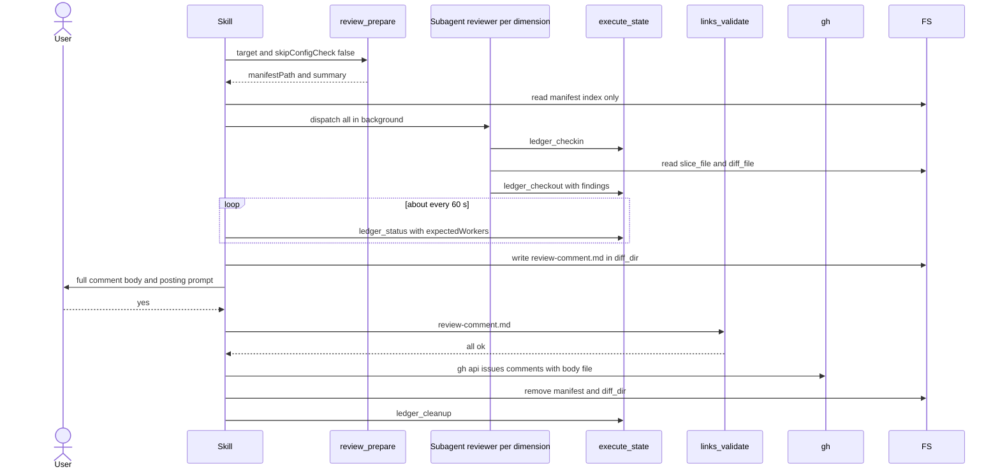

# skill-review Specification

## Purpose
The `review` skill reviews code changes across the project's review dimensions. It calls `review_prepare`, dispatches one background reviewer agent per dimension from the main session, collects findings through the `execute_state` ledger, and builds, shows, and optionally posts or saves one consolidated review comment.

## Requirements

### Requirement: Arguments
The skill SHALL accept only the flags `--base <branch>` and `--dry-run`.

| Flag | Effect |
|---|---|
| `--base <branch>` | Forwarded to `review_prepare` as `target`. |
| `--dry-run` | Prints the review plan and stops before any agent is dispatched. Not forwarded to the tool. |

- Review scope (`all`, `committed`, `staged`, `working`, `worktree`) comes from the `review.scope` config key, read by `review_prepare`.
- The skill does not support `--committed`, `--staged`, `--working`, `--worktree`, `--set-default`, or `--dimensions`.

#### Scenario: Base branch override
- **WHEN** the user runs `/review --base develop`
- **THEN** the skill calls `review_prepare` with `target: "develop"` and `skipConfigCheck: false`

#### Scenario: No base flag
- **WHEN** the user runs `/review`
- **THEN** the skill calls `review_prepare` with an empty `target`

### Requirement: Prepare step and error stop
The skill SHALL call `review_prepare` first and SHALL stop when that call fails.

- On a tool error the skill shows the error message to the user and stops.
- When the tool reported a `manifestPath` before failing, the skill deletes it with `rm -f` first.

#### Scenario: No changed files
- **WHEN** `review_prepare` fails with `No changed files found`
- **THEN** the skill shows that error and stops
- **AND** no reviewer agent is dispatched

### Requirement: Thin-index manifest handling
The skill SHALL read the manifest at `manifestPath` into the main session and SHALL NOT read the contents of any `slice_file` or `diff_file` listed in it.

- Each `dimensions[]` entry carries only `name`, `description`, `severity`, `model`, `status`, `requires_full_diff`, `truncated`, `matched_count`, `diff_file`, `slice_file`.
- The skill passes `slice_file` and `diff_file` paths to each reviewer agent; the agent reads them.

#### Scenario: Paths only
- **WHEN** the skill builds a reviewer prompt
- **THEN** the prompt contains the `slice_file` and `diff_file` paths
- **AND** the main session has not read either file

### Requirement: Dry run
When `--dry-run` is passed the skill SHALL print the review plan from the manifest, delete `manifestPath`, and stop without dispatching any agent.

The printed plan has this shape:

```text
Review Plan (dry run — no agents dispatched)

  Base branch:    {manifest.base_branch}
  Changed files:  {manifest.git.changed_files_count}
  Dimensions:     {manifest.summary.active_dimensions} active, {manifest.summary.skipped_dimensions} skipped

| Dimension | Files | Severity | Status |
|-----------|-------|----------|--------|
{one row per entry in manifest.dimensions}

Plan critique:
  - Uncovered files:       {plan_critique.uncovered_files or "none"}
  - Over-broad:            {plan_critique.over_broad_dimensions or "none"}
  - Suggested dimensions:  {plan_critique.uncovered_suggestions[].dimension or "none"}

To execute the full review, run /review (without --dry-run).
```

#### Scenario: Dry run stops early
- **WHEN** the user runs `/review --dry-run`
- **THEN** the skill prints `Review Plan (dry run — no agents dispatched)` and the dimension table
- **AND** runs `rm -f "<manifestPath>"` and stops

### Requirement: Run and worker identifiers
The skill SHALL derive one ledger `runId` per run and one `workerId` per dispatched dimension.

- `runId` is `review-` + the manifest `timestamp`, with every character outside `[A-Za-z0-9_-]` replaced by `-`.
- `workerId` is the dimension `name` lowercased, with every run of characters outside `[A-Za-z0-9_-]` collapsed to one `-`.
- Every `workerId` is added to an `expectedWorkers` list.

#### Scenario: Timestamp with colons
- **WHEN** the manifest `timestamp` is `2026-09-30T10:15:00Z`
- **THEN** `runId` is `review-2026-09-30T10-15-00Z`

### Requirement: Reviewer dispatch
The skill SHALL dispatch one background Agent per dimension with `status` `ACTIVE` or `TRUNCATED`, all in a single message, with `run_in_background: true`.

- Each agent's `model` is `dimension.model` when set, otherwise `manifest.subagent_model`, forwarded verbatim.
- The skill prefers the Workflow tool's native fan-out when it is available.
- `SKIPPED` and `QUEUED` dimensions get no agent.

Each reviewer agent prompt requires this order:

| Order | Agent action |
|---|---|
| 1 | `execute_state({action: "ledger_checkin", runId, workerId})` before reading its files |
| 2 | Read `slice_file` (JSON: `body`, `matched_files`, `file_context`, `warnings`) and `diff_file` |
| 3 | Review only `matched_files`, only for the dimension's concern; at most 20 findings |
| 4 | `execute_state({action: "ledger_checkout", runId, workerId, findings})` last |

- `findings` is a raw JSON array of `{severity, file, line, rationale}`, or `[]` when there are none.
- The default severity for findings is the dimension's `severity`.
- When `truncated` is `true`, the skill treats that dimension's `diff_file` as partial; findings outside it may exist.
- Every reviewer prompt carries the dimension's `truncated` value in a "Diff Completeness" section. When it is `true`, the prompt tells the agent its diff is partial, that a footer starting with `# --- Truncated` lists the omitted files, and that it must not call the omitted files clean.

Main review flow from prepare to cleanup.



#### Scenario: Per-dimension model override
- **WHEN** a dimension has `model: "opus"` and `manifest.subagent_model` is `sonnet`
- **THEN** that dimension's agent is dispatched with model `opus`

#### Scenario: Skipped dimension
- **WHEN** a dimension has `status: "SKIPPED"`
- **THEN** no agent is dispatched for it

#### Scenario: Truncated dimension prompt
- **WHEN** a dimension has `truncated: true`
- **THEN** its reviewer prompt contains `truncated: true`
- **AND** the prompt says the diff file is partial and names the `# --- Truncated` footer

### Requirement: Ledger polling
The skill SHALL poll `execute_state({action: "ledger_status", runId, expectedWorkers, timeoutSeconds: 1800})` about every 60 seconds until every dispatched `workerId` has `status: "done"`.

- The skill SHALL NOT consolidate on partial or zero results unless a worker was confirmed stalled or missing on two polls in a row.

#### Scenario: All workers done
- **WHEN** every expected `workerId` shows `status: "done"`
- **THEN** the skill stops polling and consolidates findings

### Requirement: Stalled and missing workers
The skill SHALL wait one more poll when a `workerId` first appears in `stalledWorkers` or `missingWorkers`, and SHALL stop waiting on it when it appears there again on the next poll.

- The skill then consolidates the results collected so far.
- The final `review-comment.md` names every skipped dimension.
- A stalled-twice dimension gets its own block with the note `Skipped — worker stalled twice; no findings collected`.
- For a missing worker, the skill also logs a warning.

#### Scenario: Worker stalled on two polls
- **WHEN** worker `security` is in `stalledWorkers` on two polls in a row
- **THEN** the skill consolidates without it
- **AND** the comment states that `security` was skipped and its findings are absent

#### Scenario: Worker stalled once
- **WHEN** a worker is in `stalledWorkers` on one poll and `done` on the next
- **THEN** its findings are included

### Requirement: Findings consolidation
The skill SHALL parse each worker's `findings` from the `ledger_status` response and SHALL deduplicate, flag contradictions, and recalibrate severities before building the comment.

| Case | Action |
|---|---|
| Same `file:line` from several dimensions | Keep the entry from the highest-severity dimension; add `Also flagged by: {other-dimension}` |
| Conflicting advice at the same `file:line` | Keep both; add `Note: conflicting recommendations — manual review required.` |
| Wrong severity (e.g. `info` for credential exposure) | Re-calibrate |
| Dimension with zero findings | Check whether its diff really has no issue for that concern |

- Findings are never written to `.sdlc-v2/runs/ledger/` files directly.

#### Scenario: Duplicate finding
- **WHEN** `security` (high) and `code-quality` (medium) both flag `api.go:42`
- **THEN** the comment keeps the `security` entry with `Also flagged by: code-quality`

### Requirement: Verdict
The skill SHALL compute the verdict from the consolidated findings with these rules, first match wins.

| Verdict | Condition |
|---|---|
| `CHANGES REQUESTED` | Any `critical` finding, or 3 or more `high` findings |
| `APPROVED WITH NOTES` | Any `high` finding, or 5 or more `medium` findings |
| `APPROVED` | All other cases |

#### Scenario: One critical finding
- **WHEN** the consolidated findings include one `critical`
- **THEN** the verdict is `CHANGES REQUESTED`

#### Scenario: Four medium findings
- **WHEN** the findings are 4 `medium` and nothing higher
- **THEN** the verdict is `APPROVED`

### Requirement: Consolidated comment file
The skill SHALL write the consolidated comment with the Write tool to `{manifest.diff_dir}/review-comment.md`.

- First line: `## Code Review — {N} dimension(s), {M} finding(s)`; `{N}` excludes dimensions skipped as stalled.
- Second block: `> Automated review by \`review\` v{plugin_version} · {date}`, with `{plugin_version}` from `manifest.plugin_version` and `{date}` as `YYYY-MM-DD`.
- A `### Summary` table with columns `Dimension | Findings | Critical | High | Medium | Low | Info` and a **Total** row.
- A `### Verdict: {verdict}` heading and a one-sentence assessment.
- One `### {dimension.name} — {N} finding(s)` block per dimension, with findings in a `<details>` element.
- Each finding: `#### [{SEVERITY}] {title}`, `**File:** \`{file}:{line}\``, description, `**Suggestion:**`.
- The body never includes an AI-tool attribution line.

#### Scenario: Comment persisted
- **WHEN** consolidation finishes
- **THEN** `{manifest.diff_dir}/review-comment.md` exists and starts with `## Code Review —`

### Requirement: Full comment display
The skill SHALL Read `{manifest.diff_dir}/review-comment.md` and SHALL show its full content verbatim in a fenced markdown block before any posting prompt.

- No summary, paraphrase, truncation, or placeholder such as "Additional finding (see PR comment for details)".
- The skill does not delete `manifestPath` or the ledger at this step.

#### Scenario: Twelve findings
- **WHEN** the comment has 12 findings
- **THEN** the user sees all 12 in the terminal before any prompt

### Requirement: Posting options
The skill SHALL choose the posting prompt from the manifest and SHALL wait for the user's answer.

| Situation | Options |
|---|---|
| `manifest.pr.exists` is `true` | `yes` (post to PR #n), `save`, `cancel` |
| No PR, `manifest.scope` is `all`, `committed`, or `worktree` | 1. Create a draft PR and attach the review; 2. Save; 3. Terminal only |
| No PR, `manifest.scope` is `staged` or `working` | 1. Save; 2. Terminal only |

- Post: `gh api repos/{owner}/{repo}/issues/{number}/comments -F body=@{manifest.diff_dir}/review-comment.md`.
- Create-draft-PR option: the skill invokes `pr` in draft mode, waits, then posts to the new PR.
- Save: the skill passes the comment text to `review_prepare({saveReview: true, content})`; the tool writes `.sdlc-v2/reviews/<branch>-<YYYY-MM-DD>.md`.
- Cancel or terminal only: no action.

#### Scenario: Local scope without PR
- **WHEN** there is no PR and `manifest.scope` is `staged`
- **THEN** the prompt offers only save and terminal-only

#### Scenario: Save chosen
- **WHEN** the user picks save
- **THEN** the skill calls `review_prepare` with `saveReview: true` and the content of `review-comment.md`

### Requirement: Link verification gate before posting
When the user answers `yes` to post to an existing PR, the skill SHALL first call `links_validate({file: "{manifest.diff_dir}/review-comment.md", offline: false})` and SHALL NOT post when any result has a status other than `ok`.

- On a violation the skill shows the violation list verbatim and stops.
- It does not retry, does not edit URLs without user input, and does not bypass the gate.
- `offline: true` skips network reachability checks and keeps context checks (for sandboxed CI).

#### Scenario: Broken link
- **WHEN** `links_validate` returns one result with `status` other than `ok`
- **THEN** the comment is not posted
- **AND** the user sees the violation list

### Requirement: Self-fix offer
When the verdict is `CHANGES REQUESTED` or `APPROVED WITH NOTES` the skill SHALL ask "The review found actionable items. Address them now?" and act on the answer.

| Answer | Action |
|---|---|
| `fix` | Invoke `received-review`; findings are in conversation context |
| `harden` | `Skill(harden)` with `--failure-text "Review verdict CHANGES REQUESTED — dimension blocker(s): <dimension-list>"`, `--skill review`, `--step "Step 8 — actionable findings"`, `--operation "self-fix offer"` |
| `no` | Done |

- `harden` is offered only when the verdict is `CHANGES REQUESTED` with at least one dimension blocker.
- No offer is made when the verdict is `APPROVED`.

#### Scenario: Approved
- **WHEN** the verdict is `APPROVED`
- **THEN** the skill makes no self-fix offer

#### Scenario: Notes only
- **WHEN** the verdict is `APPROVED WITH NOTES`
- **THEN** the offer lists `fix` and `no`
- **AND** does not list `harden`

### Requirement: Cleanup on every terminal path
The skill SHALL remove everything the run created on dry-run stop, error stop, and normal completion.

- `rm -f "<manifestPath>"`
- `rm -rf "{manifest.diff_dir}"`
- `execute_state({action: "ledger_cleanup", runId})`

#### Scenario: Normal completion
- **WHEN** the posting and self-fix steps finish
- **THEN** the manifest, the diff directory, and the run's ledger are removed

### Requirement: Error reporting scope
The skill SHALL NOT invoke `error-report` for user errors and SHALL use it only for tool-call crashes.

#### Scenario: User error
- **WHEN** `review_prepare` fails because no dimension files exist
- **THEN** the skill does not invoke `error-report`
