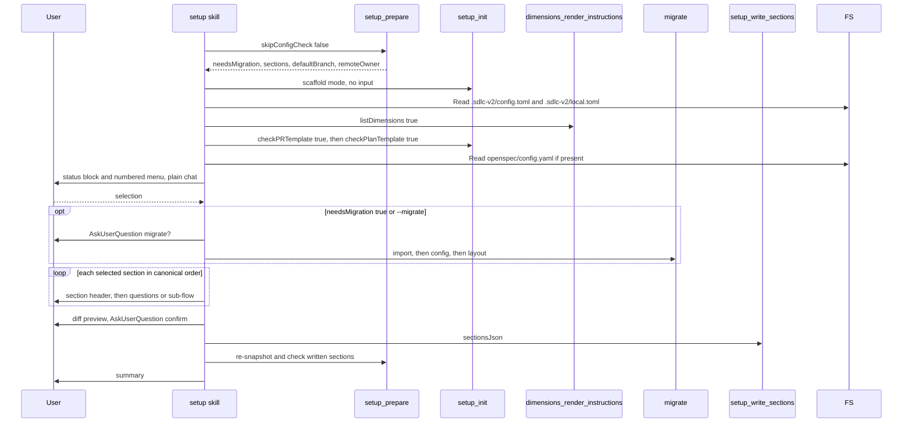

# skill-setup Specification

## Purpose
The `setup` skill (`/setup`) configures the sdlc plugin for a project: it scaffolds `.sdlc-v2/`, migrates legacy config, and walks the user through a selectable list of 18 config and content sections. Users run it directly, and other skills point to it when config is missing.

## Requirements

### Requirement: Plan mode refusal
The skill SHALL stop before any tool call when plan mode is active.

- Message: "This skill requires write operations. Exit plan mode first, then re-invoke `/setup`."

#### Scenario: Plan mode active
- **WHEN** the system context contains `Plan mode is active`
- **THEN** the skill prints the refusal message
- **AND** calls no MCP tool

### Requirement: Main flow and pre-flight order
The skill SHALL call `setup_prepare({ skipConfigCheck: false })` first, then `setup_init({})` once, then take a config snapshot, before it shows the menu or asks any question.

Main `/setup` flow without direct-entry flags:

Snapshot contents:

| Item | Source |
|---|---|
| `projectConfig` | Read `.sdlc-v2/config.toml` (absent = `{}`) |
| `localConfig` | Read `.sdlc-v2/local.toml` (absent = `{}`) |
| Installed dimension count and names | `dimensions_render_instructions({ listDimensions: true })` |
| PR template exists | `setup_init({ checkPRTemplate: true })` |
| Plan template exists | `setup_init({ checkPlanTemplate: true })` |
| Managed-block version | Line `# BEGIN MANAGED BY sdlc-v2 (v<N>)` in `openspec/config.yaml` — the same begin marker `openspec_enrich` writes |

Version detection for the `version` section:

- First existing file in this order sets `versionFile` and `fileType`: `package.json`, `Cargo.toml`, `pyproject.toml`, `pubspec.yaml`, `plugin.json`.
- `tagPrefix` is the common leading non-digit part of recent `git tag --list` tags; default `v` when there are no tags or no common prefix.

#### Scenario: Migration flag read before scaffold
- **WHEN** `.sdlc-v2/config.json` exists without `config.toml`
- **THEN** the skill receives `needsMigration: true` from `setup_prepare`
- **AND** only then calls `setup_init({})`

#### Scenario: No version file
- **WHEN** none of the five version files exist
- **AND** the repo has no tags
- **THEN** no `versionFile` is detected
- **AND** `tagPrefix` is `v`

### Requirement: Flags
The skill SHALL accept the flags below. A direct-entry flag SHALL be translated to `--only <id>` unless `--only` is also passed, and `--only` SHALL skip the menu. `--force` alone SHALL skip the menu and select all 18 ids; with `--only` or a direct-entry flag it SHALL be ignored.

| Flag | Effect |
|---|---|
| `--migrate` | Run the migration step even when `needsMigration` is `false`. |
| `--force` | Menu skipped; all 18 ids selected, including `set` sections. Ignored with `--only` or a direct-entry flag. |
| `--only <ids>` | Comma-separated section ids to configure; menu skipped. Accepts any of the 18 canonical ids. |
| `--dimensions` | Same as `--only review-dimensions`. |
| `--pr-template` | Same as `--only pr-template`. |
| `--guardrails` | Same as `--only plan-guardrails`. |
| `--execution-guardrails` | Same as `--only execution-guardrails`. |
| `--openspec-enrich` | Same as `--only openspec-block`. |
| `--plan-template` | Same as `--only plan-template`. |
| `--remove-openspec` | Passed to the OpenSpec sub-flow as `--remove`. |
| `--add` | Passed to `setup-dimensions`, `setup-guardrails`, `setup-execution-guardrails`. Not passed to `setup-pr-template`, which takes no arguments. |
| `--no-copilot` | Passed to `setup-dimensions`; skips GitHub Copilot instruction files. |

- Canonical ids: `version`, `ship`, `jira`, `review`, `received-review`, `commit`, `pr`, `github`, `pr-labels`, `review-dimensions`, `pr-template`, `plan-template`, `plan-style`, `plan-tasks`, `plan-guardrails`, `execution-guardrails`, `openspec-block`, `automation`.
- `workspace` and `hooks` are not valid ids.
- There is no `--skip` flag.

#### Scenario: Direct entry
- **WHEN** the user runs `/setup --guardrails`
- **THEN** the skill prints no menu
- **AND** configures only `plan-guardrails`

#### Scenario: Explicit id list
- **WHEN** the user runs `/setup --only jira,commit`
- **THEN** the skill prints no menu
- **AND** configures `jira` then `commit`

#### Scenario: Force reconfigures everything
- **WHEN** the user runs `/setup --force`
- **THEN** the skill prints no menu
- **AND** configures all 18 sections in canonical order, including sections already `set`

#### Scenario: Force with an id list
- **WHEN** the user runs `/setup --force --only jira`
- **THEN** the skill configures only `jira`

### Requirement: Menu is plain chat
Without `--only`, `--force`, or a direct-entry flag, the skill SHALL print a status block and a numbered menu as plain chat, then end its turn. It SHALL NOT use AskUserQuestion for the menu.

- Status rows: `[set]` or `[not set]`, the section id, and the row summary (or `—`).
- Menu line: `<N>. [<state>] <label> — <first sentence of purpose>`, `<state>` is `set` or `not-set`.
- 18 lines in canonical order, numbered from 1.
- Labels and purposes come from `setup_prepare`'s `sections`, never hard-coded.
- When `needsMigration` is `true`, one line is printed above the status block: `⚠ Legacy or outdated config detected — see Step 2 (migration) before configuring sections below.`
- The reply prompt lists `all`, `not-set`, `none`, `cancel` and says `Default: all`.

#### Scenario: Menu turn ends
- **WHEN** the skill prints the menu
- **THEN** its turn ends
- **AND** the user's next message is parsed as the reply

### Requirement: Row state
The skill SHALL compute each row's state itself from the snapshot; no tool returns it.

| Section kind | `set` when |
|---|---|
| `review-dimensions` | Installed dimension count > 0 |
| `pr-template`, `plan-template` | The template file exists |
| `openspec-block` | A managed-block line was found |
| `configFile` is `.sdlc-v2/config.toml` | `configPath` resolves in `projectConfig`; an array or a table must have at least one entry |
| `configFile` is `.sdlc-v2/local.toml` (`ship`, `review`, `received-review`, `plan-style`, `github`, `automation`) | `localConfig[configPath]` is non-null |

- Every other case is `not-set`.

#### Scenario: Empty guardrails table
- **WHEN** `plan.guardrails` resolves to a table with no named guardrail tables
- **THEN** the `plan-guardrails` row is `not-set`

#### Scenario: Guardrail count in the summary
- **WHEN** `config.toml` has `[plan.guardrails.test-coverage-required]` and `[plan.guardrails.no-ci-bypass]`
- **THEN** the `plan-guardrails` row is `set`
- **AND** its summary is `2 configured`

#### Scenario: Managed block written by openspec_enrich
- **WHEN** `openspec_enrich` has written its block into `openspec/config.yaml`
- **AND** the file holds the line `# BEGIN MANAGED BY sdlc-v2 (v2)`
- **THEN** the `openspec-block` row is `set`
- **AND** the snapshot's managed-block version is `2`

### Requirement: Menu reply parsing
The skill SHALL resolve the reply to a set of section ids as below, and SHALL allow at most 3 retries on invalid input.

| Reply | Selected ids |
|---|---|
| empty | all 18 |
| `all` | all 18 |
| `not-set` | rows with state `not-set` |
| `none` or `cancel` | none; prints `No sections selected — no changes made.` and goes to the summary |
| Numbers and `M-N` ranges, comma- or space-separated | union of the rows at those positions |

- Invalid token: print `Invalid input: "<token>" is not a number, range, or known keyword. Try again.`, then re-print the menu and prompt.
- After 3 failed retries: print `No valid input after 3 attempts — no changes made.` and exit.

#### Scenario: Range reply
- **WHEN** the user replies `1-3,7`
- **THEN** the selected ids are rows 1, 2, 3, and 7

#### Scenario: Out of range
- **WHEN** the user replies `42`
- **THEN** the skill prints `Invalid input: "42" is not a number, range, or known keyword. Try again.`
- **AND** re-prints the menu

### Requirement: Migration step
The skill SHALL run the migration step only when `needsMigration` is `true` or `--migrate` is passed, and SHALL ask before migrating.

- AskUserQuestion: `Legacy or outdated config files detected. Migrate to the current config format before proceeding?` Options `yes`, `no`.
- On `yes`: call `migrate` three times, in order, each with `dryRun: false`: `action: "import"`, then `action: "config"`, then `action: "layout"`.
- All three `result` values are shown to the user verbatim.
- The `import` action writes a legacy value when the destination key is missing or still holds the template default that `setup_init` wrote; a key the user changed is kept. The skill text says so and does not claim that legacy values are never imported.
- When the `import` result has `skippedKeys`, the skill shows each entry on its own line under `Legacy keys not imported:`.
- The `config` action only checks the schema version; its `result` is `up-to-date`. If it fails, the skill shows the error and stops.
- On `no`: skip migration; legacy files are left untouched.
- After migration, the skill re-calls `setup_prepare` and re-reads both TOML files.

#### Scenario: Current config
- **WHEN** `needsMigration` is `false`
- **AND** `--migrate` is not passed
- **THEN** the skill calls no `migrate` action

#### Scenario: User accepts migration
- **WHEN** the user answers `yes`
- **THEN** the skill calls `migrate` with `import`, `config`, `layout` in that order
- **AND** the skill does not offer to delete legacy files

#### Scenario: Import skipped keys shown
- **WHEN** the `import` action returns `skippedKeys: [".sdlc-v2/config.toml: workspace", ".sdlc-v2/config.toml: jira (already set)"]`
- **THEN** the skill shows both entries, one per line, under `Legacy keys not imported:`

### Requirement: Section dispatch loop
For each selected id, in canonical order, the skill SHALL print a section header and then run the dispatcher named by the section's `delegatedTo`.

- Header lines: `--- Configuring: <label> ----…`, `Purpose:`, `Files modified:`, `Consumed by:`, `Config file: <configFile> (path: <configPath or —>)`, `Current value: 
>`.
- When the section has fields, an `Options:` block lists each field's name, type, default, and description.

| `delegatedTo` | Dispatcher |
|---|---|
| (empty) | Generic field loop |
| `inline-commit-builder` | Commit pattern builder |
| `inline-pr-builder` | PR title pattern builder |
| `setup-dimensions`, `setup-pr-template` | Scan phase, then the sub-flow |
| `setup-pr-labels`, `setup-guardrails`, `setup-execution-guardrails`, `setup-plan-template` | The sub-flow |
| `setup-openspec` | OpenSpec enrichment sub-flow |

#### Scenario: Out-of-order selection
- **WHEN** the user selects rows for `automation` and `version`
- **THEN** the skill configures `version` first

### Requirement: Generic field loop
For sections with empty `delegatedTo`, the skill SHALL ask exactly one AskUserQuestion per field that survives gating, in manifest order, and SHALL NOT batch or reorder fields.

- Prompt `field.label`, helper text `field.description`, choices `field.options` (free text when empty), default `field.default`.
- `github.expectedAccount` defaults to `remoteOwner` from `setup_prepare`.
- A field with `whenStepInActiveSteps` is skipped unless that step is in the `ship.steps` answer.
- `version`: skip `versionFile` and `fileType` when `mode` is `tag`; skip `changelogFile` when `changelog` is `false`; omit an empty `preRelease`.
- When `confirmDetected` is `true` (only `version`), a first AskUserQuestion `Use detected settings, customize each field, or skip this section?` offers `yes`, `customize`, `skip`.
- `yes` writes the detected values without `preRelease`: `{ mode: 'file', versionFile, fileType, tagPrefix }`, or `{ mode: 'tag', tagPrefix }` when no file was detected.
- `skip` writes nothing for the section.

| Field type | Stored value |
|---|---|
| `enum` | Selected option |
| `multi-select` | Array of selected options |
| `boolean` | `yes` → `true`, `no` → `false`; `rebase` keeps `auto`/`skip`/`prompt` |
| `string` | Entered text; omitted when empty and optional |
| `number` | Integer; re-asked when outside `min`/`max` |
| `list` | Comma-split, trimmed array |
| `list` (`narrativeRules`, `instructions`) | One entry per line; empty lines dropped |

#### Scenario: Ship-step gated field
- **WHEN** a field has `whenStepInActiveSteps: "verify-pipeline"`
- **AND** the user's `ship.steps` answer does not include `verify-pipeline`
- **THEN** the skill does not ask that field
- **AND** does not write a value for it

#### Scenario: Detected version accepted
- **WHEN** `package.json` was detected
- **AND** the user answers `yes` to the detected-settings prompt
- **THEN** the `version` value has `mode: 'file'`
- **AND** has no `preRelease`

### Requirement: Pre-release compatibility check
After the `version` fields are collected with `mode` not `tag` and a non-empty `preRelease`, the skill SHALL look up the chosen `fileType` and act on its level. The check runs at most once per run.

| `fileType` | Level | Action |
|---|---|---|
| `package.json`, `cargo.toml`, `plugin.json` | compatible | Store as-is. |
| `pyproject.toml` | partial | Print message; AskUserQuestion `yes` (store) / `no` (omit `preRelease`). |
| `version-file` | unknown | Print message; AskUserQuestion `yes` (store) / `no` (omit `preRelease`). |
| `pubspec.yaml` | incompatible | Print message; AskUserQuestion `clear` (omit `preRelease`) / `proceed` (store). |

#### Scenario: pubspec pre-release
- **WHEN** `fileType` is `pubspec.yaml`
- **AND** `preRelease` is `rc`
- **THEN** the skill prints that pubspec.yaml does not support semver pre-release labels
- **AND** asks `clear` or `proceed`

### Requirement: Commit and PR pattern builders
The `commit` and `pr` sections SHALL be configured by AskUserQuestion builders, not by the generic field loop.

| Builder | First question | Options |
|---|---|---|
| `commit` | `Do you enforce commit message patterns in this project?` | `conventional`, `ticket-prefix`, `custom`, `skip` |
| `pr` | `Do you enforce PR title patterns?` | `same-as-commit` (only when `commit` was built this run), `conventional`, `ticket-prefix`, `custom`, `skip` |

- `conventional` asks one question each for: scope required, allowed types (default all of `feat, fix, refactor, chore, docs, test, ci`), allowed scopes, required trailers.
- The commit builder also asks which types require a body (`requiresBody`).
- `ticket-prefix` asks the ticket pattern (default `[A-Z]{2,10}-\\d+`) and whether to combine with conventional types.
- `custom` asks for the regex and the mismatch error message (`subjectPattern`/`subjectPatternError` or `titlePattern`/`titlePatternError`).
- `same-as-commit` copies the commit fields, renaming `subjectPattern` → `titlePattern` and `subjectPatternError` → `titlePatternError`.
- `skip` writes no section. Empty optional arrays are omitted.
- The `pr` builder does not collect `defaultBranch` or the GitHub account.

#### Scenario: Conventional commits with scope
- **WHEN** the user picks `conventional`
- **AND** answers `yes` to "Require scope?"
- **THEN** `subjectPattern` starts as `^(feat|fix|refactor|chore|docs|test|ci)(\\(.*\\)): .+$`

#### Scenario: PR same as commit
- **WHEN** `commit` was built this run
- **AND** the user picks `same-as-commit`
- **THEN** the `pr` value has `titlePattern` equal to the commit `subjectPattern`

### Requirement: Scan phase
Before the `setup-dimensions` or `setup-pr-template` sub-flow, the skill SHALL scan the project once per run and pass the result as "Scan Input".

- Signals: dependency manifests, framework configs, directory layout, CI config, database and test layout, `CLAUDE.md`/`AGENTS.md`, `.github/` PR templates, `git remote -v`, `gh repo view`, `gh pr list --limit 5 --json title,body`, `git log --oneline -20`, `git rev-parse --abbrev-ref HEAD`.
- File existence checks use the Glob tool, not shell `ls` globs.
- Dimension list and PR-template existence reuse the pre-flight snapshot.
- A second delegated section in the same run reuses the cached scan.

#### Scenario: Two content sections
- **WHEN** both `review-dimensions` and `pr-template` are selected
- **THEN** the scan runs once

### Requirement: Companion sub-flows run inline
The skill SHALL run each companion sub-flow by reading its sibling Markdown file and following it inline, and SHALL NOT dispatch it through the Agent tool.

| `delegatedTo` | Tools and commands | Writes | User gate | Flags |
|---|---|---|---|---|
| `setup-dimensions` | `dimensions_render_instructions` (list, write, Copilot render), `validate({ action: "dimensions" })` | `.sdlc-v2/review-dimensions/<name>.md`; `.github/instructions/<name>.instructions.md` | `Install which dimensions?` (`all`/`select`/`cancel`); `Fix these validation errors automatically?` (`yes`/`no`) when validation has findings; `Generate these Copilot instruction files?` | `--add`, `--no-copilot` |
| `setup-pr-template` | `setup_init({ writePRTemplate: true, content })`, `validate({ action: "pr_template" })` | `.sdlc-v2/pr-template.md` | `Accept this PR template?` loop until `accept` | none (the sub-flow takes no arguments) |
| `setup-pr-labels` | `gh label list --json name,description --limit 100`, `setup_write_sections` | `pr.labels` | `pr.labels is already configured. What do you want to do?` (`keep`/`replace`/`append`) when set; `How should /pr choose labels?` (`off`/`rules`/`llm`/`cancel`) | none |
| `setup-guardrails` | `setup_write_sections`, `validate({ action: "guardrails", section: "plan" })` | `plan.guardrails` or `plan.guardrails.<id>` | `Install which guardrails?`; `Add custom project-specific guardrails?` | `--add` |
| `setup-execution-guardrails` | `setup_write_sections`, `validate({ action: "guardrails", section: "execute" })` | `execute.guardrails` or `execute.guardrails.<id>` | `Install which execution guardrails?` | `--add` |
| `setup-plan-template` | `setup_init({ readPlanTemplate: true })`, `setup_init({ writePlanTemplate: true })` | `.sdlc-v2/plan-template.md` | `replace`/`cancel` when the file exists | none |

- `setup-dimensions` proposes a dimension only when its evidence row in `dimension-catalog.md` matches the scan.
- `setup-pr-labels` writes nothing when `gh label list` fails or the user picks `cancel`.
- `setup-plan-template` on `cancel` prints `No changes made — existing .sdlc-v2/plan-template.md kept.`

#### Scenario: gh not authenticated
- **WHEN** `pr-labels` is selected
- **AND** `gh label list` exits non-zero
- **THEN** the sub-flow prints a `gh auth login` hint
- **AND** `.sdlc-v2/config.toml` is not written

#### Scenario: Existing plan template kept
- **WHEN** `.sdlc-v2/plan-template.md` exists
- **AND** the user picks `cancel`
- **THEN** the skill does not call `setup_init({ writePlanTemplate: true })`

### Requirement: OpenSpec enrichment sub-flow
For the `openspec-block` section the skill SHALL call `openspec_enrich({ remove })`, with `remove: true` only when `--remove-openspec` was passed, and SHALL report the `action` as below.

| `action` | Reported message |
|---|---|
| `append` | `Managed block added to openspec/config.yaml.` |
| `update` | `Managed block updated to v{version} in openspec/config.yaml.` |
| `unchanged` | `openspec/config.yaml already at current version — no changes needed.` |
| `removed` | `Managed block removed from openspec/config.yaml.` |
| `missing` | `openspec/config.yaml not found. Initialize OpenSpec first (openspec init).` |
| `skipped-existing-context` | Explains that a top-level `context:` key exists and the block was not appended. |

- A `warning` in the result is shown to the user.

#### Scenario: Remove flag
- **WHEN** the user runs `/setup --openspec-enrich --remove-openspec`
- **THEN** the skill calls `openspec_enrich({ remove: true })`

### Requirement: Diff preview before writing
Before any write in the "Writing config files" step, the skill SHALL show a `path | before | after` table of changed config paths and SHALL ask for confirmation with AskUserQuestion.

- Only paths whose value changed are listed.
- No changed path: print `No changes — nothing to write.` and skip the write.
- Rejected: print `Write cancelled — no changes made.` and skip the write.

#### Scenario: Nothing changed
- **WHEN** every assembled value equals the snapshot value
- **THEN** the skill prints `No changes — nothing to write.`
- **AND** does not call `setup_write_sections`

### Requirement: Config writes go through setup_write_sections
The skill SHALL write config only through `setup_write_sections`, using each section's `configPath` as the key, and SHALL NOT use the Write or Edit tools on config files.

| Section | Write key |
|---|---|
| `version`, `ship`, `jira`, `review`, `commit`, `github`, `automation` | same as id |
| `received-review` | `receivedReview` |
| `plan-style` | `planStyle` |
| `plan-tasks` | `plan.tasks` |
| `pr` | `pr`, written wholesale |

- Keys for skipped or unselected sections are omitted.
- Before writing `pr`, the skill reads `.sdlc-v2/config.toml` and copies any existing `pr.labels` into the `pr` value unchanged.
- `pr.labels`, `plan.guardrails`, and `execute.guardrails` are written only by their sub-flows, as dotted keys.
- The skill shows `written` and any `errors` from the response.

#### Scenario: PR labels preserved
- **WHEN** `pr.labels` already exists
- **AND** the user rebuilds `pr`
- **THEN** the `pr` object sent to `setup_write_sections` contains the existing `labels`

#### Scenario: Plan tasks leaf
- **WHEN** `plan-tasks` is configured
- **THEN** the skill writes key `plan.tasks`, not `plan`

### Requirement: Post-write check
After writing, the skill SHALL re-call `setup_prepare`, re-read both TOML files, and confirm every written section now has state `set`. It SHALL NOT show the summary while a written section reads `not-set`.

#### Scenario: Write did not land
- **WHEN** a written section still reads `not-set`
- **THEN** the skill warns the user
- **AND** offers to retry that section's write

### Requirement: Summary and learning capture
The skill SHALL end with a `Setup complete` summary that lists only the config files, content, and migrations that were created, updated, or migrated, and SHALL log a learning with `learnings_log({ action: "append", entry })`.

- Learning entry heading: `## YYYY-MM-DD — setup: <brief summary>`.
- The summary SHALL also show a `CI scripts needing an update:` block built from `ciScriptDrift` of the latest `setup_prepare` call: one line per entry whose `action` is not `current`, as `<script> — <action> (installed v<installedVersion>, current v<currentVersion>)`, followed by the fix `scaffold_ci({ force: true })`. The block is omitted when `ciScriptDrift` is empty or every entry is `current`.

#### Scenario: Only jira configured
- **WHEN** only `jira` was written
- **THEN** the summary lists `.sdlc-v2/config.toml`
- **AND** omits the content and migration groups

#### Scenario: Outdated CI script shown
- **WHEN** the latest `setup_prepare` returns `ciScriptDrift` with one `outdated` entry and one `current` entry
- **THEN** the summary has a `CI scripts needing an update:` block with one line, for the `outdated` script
- **AND** the block names `scaffold_ci({ force: true })` as the fix

#### Scenario: All CI scripts current
- **WHEN** every `ciScriptDrift` entry has `action: "current"`
- **THEN** the summary has no `CI scripts needing an update:` block
