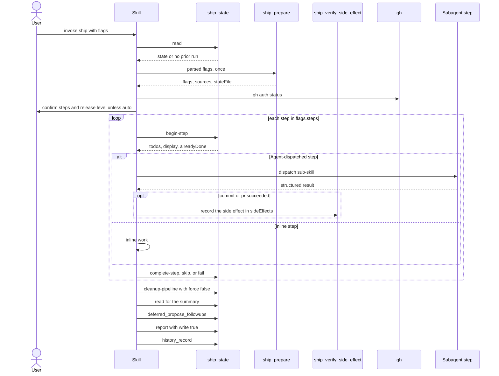

# skill-ship Specification

## Purpose
The `ship` skill runs the full ship pipeline for the current branch: execute a plan, commit, review, fix findings, open a PR, and optionally verify CI and wait for a remote reviewer. It is a thin loop over the `ship_prepare` and `ship_state` MCP tools; users start it with `/sdlc:ship`.

## Requirements

### Requirement: Arguments
The skill SHALL accept the flags below and map each one to a `ship_prepare` input or an entry mode.

| Flag | Listed in | Effect |
|---|---|---|
| `--auto` | `argument-hint` | `auto:true` on `ship_prepare`; skips the skill's own prompts except the manual-push pause; forwarded as `--auto` to the sub-skills that accept it. |
| `--steps <csv>` | `argument-hint` | `steps` on `ship_prepare`. |
| `--quick` | `argument-hint` | `quick:true` on `ship_prepare`. |
| `--quality full\|balanced\|minimal` | `argument-hint` | `quality` on `ship_prepare`; reaches `execute` through `flags.executeDispatchArgs`. |
| `--bump patch\|minor\|major\|<label>` | `argument-hint` (label in description only) | `bump` on `ship_prepare`. |
| `--draft` | `argument-hint` | `draft:true` on `ship_prepare`; `--draft` on the `pr` dispatch. |
| `--dry-run` | `argument-hint` | `dryRun:true` on `ship_prepare`, then the dry-run flow. |
| `--resume` | `argument-hint` | Resume entry mode. |
| `--plan <path>` | `argument-hint` | `planFile` on `ship_prepare`; plan path for the `execute` dispatch. |
| `--gc` | `argument-hint` | GC entry mode. |
| `--init-config` | `argument-hint` | Redirect entry mode. |
| `--openspec-change <name>` | description only | `openspecChange` on `ship_prepare`. |
| `--ttl-days <N>` | description only | `ttlDays` for `--gc`; `detail.ttlDays` on terminal `cleanup-pipeline`. |

- The skill announces `I'm using ship (sdlc v{sdlc_version}).` at start, omitting the version when unknown.
- Every `display` or `resumeBriefing.display` field from `ship_prepare`/`ship_state` is printed verbatim.

#### Scenario: Flags reach ship_prepare
- **WHEN** the user runs `/sdlc:ship --auto --draft --plan docs/plan.md`
- **THEN** `ship_prepare` receives `auto:true`, `draft:true`, `planFile:"docs/plan.md"`

### Requirement: Entry modes
The skill SHALL handle `--init-config`, `--gc`, and `--resume` before the normal flow.

| Flag | Behavior | Then |
|---|---|---|
| `--init-config` | Tells the user to run `/setup` instead. Writes no config. | Stop. |
| `--gc` | Calls `ship_prepare({gc:true, ttlDays?})`; prints each report bucket (`ship`, `execute`, `plan`, `commit`, `exploreTempdirs`) with its deleted and kept files, and any `errors`. | Stop. |
| `--resume` | Calls `ship_state({action:"read"})`; with a `resumeBriefing`, prints its `display` verbatim and continues from `resumeBriefing.next` using the state's `flags`, `steps`, `decisions`. | Continue from that step. |

- `--gc` never calls `ship_state({action:"gc"})` as a substitute.
- `--resume` with no `resumeBriefing` falls through to a fresh run.
- A resumed step that was `in_progress` is retried from its start.
- A resume skips branch setup, `ship_prepare`, `gh auth status`, and both confirmation gates.
- After a resume, a later `pr` step uses the stored `flags.bump` with `releaseSource:"config"`; an earlier user override of the level is lost.

#### Scenario: init-config redirect
- **WHEN** the user runs `/sdlc:ship --init-config`
- **THEN** the skill tells the user to run `/setup` and stops

#### Scenario: GC entry mode
- **WHEN** the user runs `/sdlc:ship --gc --ttl-days 3`
- **THEN** the skill calls `ship_prepare` with `gc:true` and `ttlDays:3`
- **AND** the pipeline does not run

### Requirement: Preflight stop gates
The skill SHALL stop when plan mode is active, and SHALL stop when `gh auth status` fails after `ship_prepare`.

| Gate | When | Message to user |
|---|---|---|
| Plan mode | Before anything else | Exit plan mode and re-invoke `/ship`. |
| `gh auth status` | After a clean `ship_prepare` | Run `gh auth login`. |

#### Scenario: Plan mode active
- **WHEN** the system context says plan mode is active
- **THEN** the skill asks the user to exit plan mode and stops

#### Scenario: gh not authenticated
- **WHEN** `gh auth status` fails
- **THEN** the skill tells the user to run `gh auth login` and stops

### Requirement: State read before ship_prepare
The skill SHALL call `ship_state({action:"read"})` before any other `ship_state` or `ship_prepare` call, and SHALL use its result, not the files under `.sdlc-v2/`, to decide between resume and a fresh run.

| `read` result | `--resume` | `--auto` | Action |
|---|---|---|---|
| Has `resumeBriefing` | given | any | Resume handler; no `ship_prepare`. |
| Has `resumeBriefing` | not given | not given | Resume handler; no `ship_prepare`. |
| Has `resumeBriefing` | not given | given | Fresh run; `ship_prepare` deletes the old same-branch file. |
| No `resumeBriefing` | any | any | Fresh run. |
| Error: `DataError` (no state file) or `InfraError` (unreadable state file) | any | any | Treated as no prior run; fresh run. |

#### Scenario: In-flight run found interactively
- **WHEN** `read` returns a `resumeBriefing` and the user passed neither `--resume` nor `--auto`
- **THEN** the skill resumes from `resumeBriefing.next`
- **AND** does not call `ship_prepare`

#### Scenario: No state file is not a failure
- **WHEN** `read` returns a `DataError` `no ship state found for branch "feat/x"`
- **THEN** the skill continues to a fresh run with `ship_prepare`
- **AND** does not call `fail` or stop

#### Scenario: Auto run ignores old briefing
- **WHEN** `read` returns a `resumeBriefing` and the user passed `--auto` without `--resume`
- **THEN** the skill starts a fresh run with `ship_prepare`

### Requirement: Feature branch setup
When the current branch is the default branch and `--plan <path>` was given, the skill SHALL create a feature branch with `git checkout -b` before calling `ship_prepare`.

- Under `--auto`: create the derived branch name with a log line, no prompt.
- Otherwise: `AskUserQuestion` with options **Create `{derivedName}`** or **Use a different name**, then `git checkout -b` with the chosen name.

#### Scenario: Interactive custom name
- **WHEN** the user is on the default branch, passed `--plan`, and picks **Use a different name**
- **THEN** the skill asks for the name and runs `git checkout -b <name>`

#### Scenario: Auto branch
- **WHEN** the user is on the default branch and passed `--plan` and `--auto`
- **THEN** the skill runs `git checkout -b <derivedName>` without a prompt

### Requirement: ship_prepare call
The skill SHALL call `ship_prepare` at most once per run, with `skipConfigCheck:false`, `resume:false`, `gc:false`, and the parsed flags.

- Non-empty `errors`: print each string verbatim and stop; no state exists.
- Non-empty `warnings`: print each string verbatim and continue.
- The skill never tells the user to edit `schemaVersion` by hand.
- A `DomainError` (for example `pr` on `main`/`master`) stops the run.

#### Scenario: Validation errors
- **WHEN** `ship_prepare` returns `errors:["--bump \"minor\" specified but pr step is skipped ..."]`
- **THEN** the skill prints that text verbatim and stops

#### Scenario: Warnings only
- **WHEN** `ship_prepare` returns only `warnings`
- **THEN** the skill prints them and continues

### Requirement: Dry run
With `--dry-run`, the skill SHALL render the pipeline table from `flags`/`sources`, mark every step skipped, stamp the run, and stop.

- For every step in `flags.steps`: `ship_state({action:"skip", step, detail:{reason:"dry-run"}})`.
- Then `ship_state({action:"cleanup-pipeline", detail:{force:false}})`.
- No sub-skill is dispatched.

#### Scenario: Dry run stamps the throwaway run
- **WHEN** the user runs `/sdlc:ship --dry-run`
- **THEN** every configured step is `skipped` with reason `dry-run`
- **AND** `cleanup-pipeline` runs with `force:false`

### Requirement: Confirmation gates before the loop
The skill SHALL confirm the step plan and the release level with `AskUserQuestion` unless `flags.auto` is `true`.

| Gate | Runs when | Options | Under `flags.auto` |
|---|---|---|---|
| Step plan | Always | Confirm the listed will-run and skip steps | Skipped |
| Release level | `pr` is in `flags.steps` | **Continue with {flags.bump}** → `releaseSource:"config"`; **Change level** → ask `major`/`minor`/`patch` (optional RC label) → `releaseSource:"user"` | Skipped; `releaseSource:"config"` |

- The confirmed step list is binding: the skill never skips a will-run step on its own judgment.
- The release prompt shows `flags.bump` and `sources.bump` from `ship_prepare`.

#### Scenario: User changes level
- **WHEN** the release prompt shows `patch` and the user picks **Change level** then `minor`
- **THEN** the `pr` step forwards `releaseLevel:"minor"` and `releaseSource:"user"`

#### Scenario: No pr step
- **WHEN** `pr` is not in `flags.steps`
- **THEN** no release-level prompt is shown

### Requirement: Step loop
The skill SHALL run each name in `flags.steps` in the order `execute, commit, review, harden, verify-openspec, archive-openspec, pr, verify-pipeline, await-remote-review, learnings-commit`, strictly one at a time, with a `ship_state` lifecycle call pair per step.

Main pipeline flow between the user, the skill, the MCP tools, and sub-skills:

- Per step: announce `→ <step>`; `begin-step`; `TodoWrite(todos)`; print `display`; do the work; `complete-step` with `detail:{outcome:"success", result}`.
- `alreadyDone:true` on `begin-step` skips the work and goes straight to `complete-step`.
- After the `commit` or `pr` sub-skill reports success, and before `complete-step`, the skill records the side effect: `commit` calls `ship_verify_side_effect({step:"commit", expected:<full HEAD sha>})`; `pr` calls `ship_verify_side_effect({step:"pr"})`. This is the only writer of the `sideEffects` journal that `alreadyDone` reads. `landed:false` is logged as one warning line and is not a step failure.
- A step legitimately bypassed at runtime gets `skip` with a `detail.reason` instead of work plus `complete-step`.
- A name absent from `flags.steps` gets no `ship_state` call at all.
- On failure: `fail` with `detail:{error:"<error summary>"}` (the only detail field `fail` reads), then stop and print `Step <N> (<name>) failed: 
`, `State saved to: <path>`, `To resume: /ship --resume`.
- The skill does not end its turn between steps.
- The skill never creates or pushes a git tag and never uses a worktree.

#### Scenario: Step already done on resume
- **WHEN** `begin-step` for `pr` returns `alreadyDone:true`
- **THEN** the skill does not dispatch the `pr` sub-skill
- **AND** calls `complete-step` for `pr`

#### Scenario: Side effect recorded after commit
- **WHEN** the `commit` sub-skill reports success
- **THEN** the skill calls `ship_verify_side_effect` with `step:"commit"` and the full HEAD sha as `expected`
- **AND** then calls `complete-step` for `commit`

#### Scenario: PR side effect not found
- **WHEN** the `pr` sub-skill reports success and `ship_verify_side_effect({step:"pr"})` returns `landed:false`
- **THEN** the skill logs one warning line
- **AND** still calls `complete-step` for `pr`

#### Scenario: Sub-skill failure
- **WHEN** the `review` dispatch fails
- **THEN** the skill calls `ship_state({action:"fail", step:"review", ...})`
- **AND** prints `To resume: /ship --resume` and stops

### Requirement: Sub-skill dispatch contract
The skill SHALL dispatch each sub-skill as the table says, always with a fixed `model`, never with an `isolation` value, and with a prompt whose first line is `/sdlc:<skill> <args>` followed only by the named payload.

| Step | Dispatch | Model | Args | Tracking |
|---|---|---|---|---|
| `execute` | Agent → `execute` | sonnet | `{flags.executeDispatchArgs} <plan-path>`; never `--branch`, never `--auto` | `begin-step` / `complete-step` |
| `commit` | Agent → `commit` | haiku | `--auto` (= `flags.auto`) | `begin-step` / `complete-step` |
| `review` | Agent → `review` | sonnet | none, or `--base <branch>`; never `--committed` | `begin-step` / `complete-step` |
| `received-review` | Agent → `received-review` | opus | `[--pr <N>] [--auto] [--no-harden]`; payload: collected findings | `decide` only |
| `commit-fixes` | Agent → `commit` | haiku | `--auto` | `decide` only |
| `harden` | `Skill` tool → `harden` (never Agent) | — | see the harden requirement | `begin-step` / `complete-step` or `skip` |
| `pr` | Agent → `pr` | sonnet | `[--draft] [--base <branch>] --skip-approval [--auto]` | `begin-step` / `complete-step` |
| `verify-pipeline` fix | Agent → `verify-pipeline` | sonnet | `--pr <N> --logs "<ext.checks_raw>" --auto` | inside `verify-pipeline` |
| `await-remote-review` fix | Agent → `received-review` | opus | `--pr <N> [--auto]` | inside `await-remote-review` |

- `--auto` comes from `flags.auto`, except `commit-fixes`, the harden commit, and the `verify-pipeline` fix dispatch, which always pass `--auto`.
- `--no-harden` is added when `harden` is in `flags.steps`.
- `--skip-approval` is always passed to `pr`; it does not imply `--auto`.
- The skill never calls a sub-skill's own MCP tools, for example `pr_apply`.

#### Scenario: pr dispatch under auto
- **WHEN** `flags.auto` is `true` and `flags.draft` is `true`
- **THEN** the `pr` Agent prompt starts with `/sdlc:pr --draft --skip-approval --auto`
- **AND** the Agent call has `model: sonnet` and no `isolation`

#### Scenario: received-review with harden configured
- **WHEN** `harden` is in `flags.steps` and findings were collected
- **THEN** the `received-review` prompt includes `--no-harden`

### Requirement: Staging before commit dispatches
The skill SHALL run `git add -A -- ':!.sdlc-v2/'` between `execute`'s `complete-step` and `commit`'s `begin-step`, and again right before the `commit-fixes` dispatch.

- A failed `git add` stops the pipeline.
- The harden commit stages only `dirtySurfaces` paths with `git add -- <path>`; never `git add -A`.

#### Scenario: New file from execute
- **WHEN** `execute` creates a new untracked test file
- **THEN** the skill stages it before dispatching `commit`

### Requirement: Per-finding review routing
After `review` completes, the skill SHALL route each `#### [<SEVERITY>] <title>` finding on its own severity against `flags.reviewThreshold`, and SHALL NOT route on the `Verdict:` line.

- First, record `ship_state({action:"healing_record", step:"review", detail:{kind:"review-total", total:<M>, dimensions:<N>}})` from the `## Code Review — {N} dimension(s), {M} finding(s)` header; skip it when `M` is unreadable.
- At or above the threshold: collect the finding for `received-review`.
- Below the threshold: `ship_state({action:"defer", step:"review", detail:{severity:<lowercase>, file, title, line, reason:"below-threshold"}})`, one call per finding.
- When the `defer` summary has `WARNING: could not persist this item`: call `deferred_add` once with the named `detail.id`, `description:"<file>:<line> [<severity>] <title> — reason: below-threshold"`, `source:"review-below-threshold"`, and `priority` high/medium/low from severity; never retry `defer`. If that fails too, name the finding UNACCOUNTED.
- Always record `ship_state({action:"decide", step:"review", detail:{text:"bypassed N finding(s): ..."}})`, even for zero.

| Parsed headings vs `M` | Action |
|---|---|
| `M` is 0 | Finding-free; record `bypassed 0 finding(s)`. |
| Parsed equals `M` | Route as above. |
| Parsed fewer than `M` | Put `parsed X of M heading(s)` in the `decide` text; ask the user whether to re-run `/review` first. |
| `M` unreadable | No `review-total` record; the summary prints `reviewLedgerNote`. |

#### Scenario: Medium finding under a high threshold
- **WHEN** `flags.reviewThreshold` is `high` and review reports `#### [MEDIUM] Extract helper`
- **THEN** the skill calls `defer` with `severity:"medium"` and `reason:"below-threshold"`

#### Scenario: Heading shortfall
- **WHEN** review's header says 14 findings and 9 headings parse
- **THEN** the `decide` text contains `parsed 9 of 14 heading(s)`
- **AND** the skill never records `bypassed 0`

### Requirement: received-review and commit-fixes
The skill SHALL dispatch `received-review` only when at least one finding was collected, SHALL dispatch `commit-fixes` only when `received-review` made changes, and SHALL record both with `decide` only.

- `received-review` and `commit-fixes` have no `steps[]` entry; the skill never calls `begin-step`, `complete-step`, `start`, `complete`, `skip`, or `fail` for them.
- They are not configurable: `ship_prepare` rejects either name in `ship.steps[]`, `ship.quick[]`, or `--steps` with an error, so neither is ever seeded into the state `steps[]`.
- The `received-review` payload is `Review findings to address (from /review, <K> of <M>):` followed by each collected finding's heading, `**File:**` line, and body verbatim.
- `received-review` pauses for the user unless `flags.auto`.
- `commit-fixes` is a separate commit, never squashed into the feature commit.
- With no collected finding, the skill goes straight to rebase.

#### Scenario: No collected findings
- **WHEN** every finding is below the threshold
- **THEN** neither `received-review` nor `commit-fixes` is dispatched

#### Scenario: Findings collected before a PR exists
- **WHEN** findings are collected and no PR exists yet
- **THEN** the `received-review` prompt has no `--pr` and carries every collected finding

### Requirement: Rebase
After `commit-fixes` and before the next configured step among `harden`, `verify-openspec`, `archive-openspec`, `pr`, the skill SHALL run `git fetch origin <default>` and skip the rebase when `git merge-base --is-ancestor origin/<default> HEAD` succeeds.

- Otherwise `flags.rebase` `"auto"` rebases and `"skip"` never rebases; any other value is informational.
- A conflict stops the pipeline; the user resolves it and runs `--resume`.
- The outcome is always recorded with `ship_state({action:"decide", step:"rebase", detail:{text}})`.

#### Scenario: Already up to date
- **WHEN** `origin/<default>` is already an ancestor of `HEAD`
- **THEN** no rebase runs and a `rebase` decision is recorded

#### Scenario: Conflict
- **WHEN** the rebase hits a conflict
- **THEN** the skill stops and tells the user to resolve it and `--resume`

### Requirement: harden step
When `harden` is in `flags.steps`, the skill SHALL turn review findings into clusters with `ship_state({action:"harden_clusters"})`, invoke the `harden` skill once per approved cluster with the `Skill` tool, and commit the edited surfaces as a separate commit.

- Input findings come from a fresh `read`: `reportData.healing.fixed` (`body:""`, `verdict:"agree-will-fix"`) and the top-level `deferredFindings` array (`body` from `description`), in stored order; never from review text in the conversation.
- Invocation: `Skill("harden", "--failure-text \"<failureText>\" --skill ship --step \"ship harden\" --operation \"review-feedback-driven hardening\" [--auto]")`; `failureText` is copied verbatim; `--auto` only from `flags.auto`.
- Consent: under `flags.auto`, every cluster with `alreadyHardened:false` runs; otherwise `AskUserQuestion` per cluster `dispatch | skip`, each skip recorded with `decide`.
- A failed invocation is recorded with `decide` (`cluster <key>: harden failed — <error>`) and the next cluster runs.
- After the clusters, `harden_clusters` runs again with the same input; empty `dirtySurfaces` → `complete-step` with `"harden made no changes"`; else stage those paths, dispatch `commit` (haiku, `--auto`), `complete-step` with `"<sha> <subject>"`.

| Condition (checked in this order) | Action |
|---|---|
| No review ran, or review's `M` is 0 | `skip` with reason `"no review findings"` |
| 0 clusters in total | `skip` with reason `"no qualifying clusters"` |
| `dirtySurfaces` non-empty, not resumed | `skip` with reason `"harden surfaces dirty before step"` |
| `dirtySurfaces` non-empty, resumed | Continue with the remaining clusters |
| `dirtySurfaces` empty, resumed, no cluster with `alreadyHardened:false` | `complete-step` with the last commit on the harden surfaces since the run start, or `"harden made no changes"` |
| `dirtySurfaces` empty, at least one cluster with `alreadyHardened:false` | Continue to consent |

- "Resumed" means `reportData.healing.hardened` is non-empty.
- `suppressed[]` and `loneDisagree[]` are listed in the final summary.

#### Scenario: Dirty surfaces before the step
- **WHEN** `.sdlc-v2/config.toml` has uncommitted edits and no harden record exists
- **THEN** the skill calls `skip` with reason `"harden surfaces dirty before step"`

#### Scenario: Auto hardening
- **WHEN** `flags.auto` is `true` and two clusters have `alreadyHardened:false`
- **THEN** the skill invokes `harden` twice with `--auto`, one at a time

### Requirement: OpenSpec steps
The skill SHALL run `verify-openspec` and `archive-openspec` only when an active OpenSpec change exists (`flags.openspecChange` or auto-detected), and SHALL `skip` them with reason `"no active OpenSpec change"` otherwise.

- `verify-openspec`: `openspec validate "$CHANGE" --strict`; a non-zero exit stops the pipeline.
- `archive-openspec`: when `openspec/changes/archive/$CHANGE` exists, `skip`; else count `- [ ]` and `- [x]` in `tasks.md`, ask consent (`AskUserQuestion`, skipped under `flags.auto`), mark remaining boxes `[x]` when archiving anyway, re-run `openspec validate --strict`, then `openspec archive "$CHANGE"`.
- A `decide` entry records the archive consent outcome.

#### Scenario: No active change
- **WHEN** `verify-openspec` is configured and no active change exists
- **THEN** the skill calls `skip` with reason `"no active OpenSpec change"`

#### Scenario: Validation fails
- **WHEN** `openspec validate "$CHANGE" --strict` exits non-zero
- **THEN** the pipeline stops

### Requirement: pr step release forwarding
The skill SHALL translate the resolved bump into release fields and instruct the `pr` Agent to pass them to its own `pr_apply` call.

| Resolved bump | `releaseLevel` | `releasePreRelease` |
|---|---|---|
| `major`, `minor`, `patch` | same value | not set |
| Other label matching `^[a-z][a-z0-9]*$` (e.g. `rc`) | `"patch"` | the label |

- The Agent also passes `releaseSource` (`"config"` or `"user"` from the release gate) and freshly drafted `releaseNotes`.
- The skill never forwards `skipReleaseCheck`.
- A `pr_apply` rejection surfaces as a normal `pr` step failure (`fail`).

#### Scenario: RC bump
- **WHEN** the resolved bump is `rc`
- **THEN** the `pr` Agent is told `releaseLevel:"patch"` and `releasePreRelease:"rc"`

### Requirement: Inline tail steps
The skill SHALL run `verify-pipeline`, `await-remote-review`, and `learnings-commit` inline when configured, recording each poll verdict with `decide`.

| Step | Work | `done` verdict handling |
|---|---|---|
| `verify-pipeline` | `poll_await({target:"pipeline", pr})` loop | `skipped`, `timeout`, `green` → proceed; `failed` → dispatch `verify-pipeline`: `fix-applied` → commit `--auto`, manual-push pause, fresh re-poll, up to `flags.verifyPipelineMaxIterations`; `proposal` → show it, stop the auto-fix loop; `abort` → record and proceed |
| `await-remote-review` | `poll_await({target:"remote_review"})` loop | `skipped`, `timeout`, `approved-clean` → proceed; `actionable` → dispatch `received-review`; a landed fix gets the manual-push pause |
| `learnings-commit` | `learnings_log({action:"append", entry})` | Never touches git or `commit_apply` |

- Poll `pending` → sleep `interval_seconds`, re-poll with `state_file`.
- Poll `error` with `ext.retryable: true` → treat as transient and re-probe with `state_file`.
- Poll `error` with `ext.retryable` not `true` → stop polling; record `decide` with text `poll stopped: <ext.error_class>: <error>`, then `fail` the step with `detail.error` set to `<ext.error_class>: <error>`, and stop with the resume instruction.
- `skipped` with `ext.reason: "no-ci"` (no checks and no CI config) proceeds like any other `skipped`.
- The manual-push pause is an `AskUserQuestion`.

#### Scenario: CI green
- **WHEN** the `verify-pipeline` poll returns `done` with `ext.verdict:"green"`
- **THEN** the skill completes the step and proceeds

#### Scenario: Retryable poll error
- **WHEN** the `verify-pipeline` poll returns `status:"error"` with `ext.error_class:"network"` and `ext.retryable:true`
- **THEN** the skill calls `poll_await` again with the returned `state_file`

#### Scenario: Non-retryable poll error stops the loop
- **WHEN** the `await-remote-review` poll returns `status:"error"` with `ext.error_class:"auth"` and `ext.retryable:false`
- **THEN** the skill does not call `poll_await` again
- **AND** calls `ship_state({action:"fail", step:"await-remote-review", detail:{error:"auth: <error>"}})` and prints `To resume: /ship --resume`

#### Scenario: Remote review actionable
- **WHEN** the `await-remote-review` poll returns `actionable`
- **THEN** the skill dispatches `received-review` with `--pr <N>`

### Requirement: Terminal cleanup and summary
After the loop, the skill SHALL call `ship_state({action:"cleanup-pipeline", detail:{force:false, ttlDays?}})`, then a final `read`, and print the run summary from that read.

- A `DataError` from cleanup means a contract violation: show the violating steps and stop; never retry with `force:true`.
- The summary prints step/status/result, `reportData.decisions`, `reportData.deferredFindings`, and the cleanup outcome.
- `issueSummary.display` is printed verbatim, then `issueSummary.hardenSuggestion` when present; nothing is printed when `issueSummary` is absent.
- When `review` ran, the ledger is printed from `reportData.reviewLedger`, never computed by hand:

| `reviewLedger` | Printed |
|---|---|
| `null` | `reviewLedgerNote` verbatim |
| `unaccounted` is 0 | `Review ledger: <total> = <fixed> fixed + <deferredFindings> deferred (<reason>: <n>, ...)` |
| `unaccounted` non-zero | The same line, then `UNACCOUNTED: <unaccounted> finding(s) have no fix or deferral record` |

- When `reportData.deferredFindings` is non-zero: `Run /sdlc:deferred to act on the <n> deferred finding(s).`

#### Scenario: Contract violation
- **WHEN** `cleanup-pipeline` returns a `DataError` for `harden=pending`
- **THEN** the skill shows the violation and stops without `force:true`

#### Scenario: Unaccounted findings
- **WHEN** `reviewLedger.unaccounted` is 2
- **THEN** the summary prints `UNACCOUNTED: 2 finding(s) have no fix or deferral record`

### Requirement: End-of-run records
After the summary, the skill SHALL call, in order, `deferred_propose_followups`, `report` with `detail.write:true`, and `history_record`.

| Call | Behavior |
|---|---|
| `ship_state({action:"deferred_propose_followups"})` | `openCount` 0 → print nothing. Else print `display`; under `--auto` stop there; otherwise run the `/sdlc:deferred` triage flow (file GitHub issues labeled `deferred-followup` then `deferred_resolve`, resolve without filing, or skip). |
| `ship_state({action:"report", detail:{write:true}})` | `skipped:true` → silent. Else print `display` when `format` is `md`, and print `path` as the last line. An error is one warning; the run continues. |
| `ship_state({action:"history_record", detail:{skill:"ship", branch, outcome, duration_ms, steps, version?, guardrail_hits?}})` | `outcome` is `success`, `failure`, or `partial`. `version` is the bump sent to `pr`, only when `pr` ran. `guardrail_hits` is the report's `guardrailHits`, only when non-empty. An error is one warning. |

- Every issue body is shown in full and approved in chat before `gh issue create`, with no AI attribution line.
- Execute-drift items already in the store are never re-added with `deferred_add`.
- The skill never renders or writes the report itself.

#### Scenario: No open deferred items
- **WHEN** `deferred_propose_followups` returns `openCount:0`
- **THEN** the skill prints nothing for it

#### Scenario: Report disabled
- **WHEN** `report` returns `skipped:true`
- **THEN** the skill prints nothing for it and calls `history_record`
