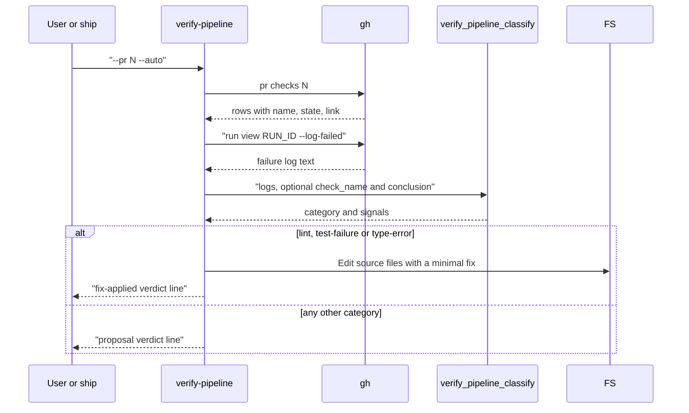

# skill-verify-pipeline Specification

## Purpose
The `verify-pipeline` skill analyzes a failed CI run on a PR, classifies the root cause with `verify_pipeline_classify`, and either applies a minimal fix or emits a proposal. It is dispatched by `ship`'s verify-pipeline step after a failed poll, or run by the user as `/verify-pipeline --pr <N>`.

## Requirements

### Requirement: Flags
The skill SHALL accept the flags below from its arguments (`argument-hint: [--pr <number>] [--logs <path-or-string>] [--auto]`).

| Flag | Value | Effect |
|---|---|---|
| `--pr <number>` | PR number | Resolve failure logs with `gh` when `--logs` is not given |
| `--logs <path-or-string>` | file path or inline text | Log text to classify; a value that is a file path is read, any other value is used as the text |
| `--auto` | none | Allow in-place fixes for actionable categories |

- The skill is user-invocable and runs on model `sonnet`.
- At start it announces `I'm using verify-pipeline (sdlc v{sdlc_version}).`, taking the version from the session-start `sdlc:` line, and drops the parenthetical when no version is known.

#### Scenario: Logs given as a file path
- **WHEN** the skill runs with `--logs /tmp/ci.log` and that file exists
- **THEN** the skill classifies the file's contents

#### Scenario: Logs given inline
- **WHEN** the skill runs with `--logs "lint\tfail\t30s\thttps://x"`
- **THEN** the skill classifies that text as-is

### Requirement: Required input
The skill SHALL stop with an `abort` verdict when neither `--pr` nor `--logs` is given.

#### Scenario: No PR and no logs
- **WHEN** the skill runs with no `--pr` and no `--logs`
- **THEN** it emits `{"status":"abort","reason":"--pr or --logs required"}` and stops

### Requirement: Log resolution from a PR
When `--logs` is absent and `--pr` is present, the skill SHALL find the first failing check with `gh` and use that run's failure log as the text to classify.

Main flow of one run with `--pr` and `--auto`:

- Failing row states: `fail`, `failure`, `cancelled`, `action_required`, `timed_out`.
- The run id comes from the `/actions/runs/<runId>` segment of that row's link.

| Condition | Verdict |
|---|---|
| No failing row, or its link has no `runs/<id>` segment | `{"status":"abort","reason":"no failed check found"}` |
| `gh` is not authenticated and logs cannot be resolved | `{"status":"abort","reason":"gh not authenticated"}` |

#### Scenario: First failing check is used
- **WHEN** `gh pr checks 12` lists `lint` as `fail` with link `.../actions/runs/987/job/1`
- **THEN** the skill runs `gh run view 987 --log-failed` and classifies its output

#### Scenario: No failing check
- **WHEN** every row of `gh pr checks 12` has state `pass`
- **THEN** the skill emits `{"status":"abort","reason":"no failed check found"}` and stops

#### Scenario: gh not authenticated
- **WHEN** `gh` is unauthenticated and the logs cannot be fetched
- **THEN** the skill emits `{"status":"abort","reason":"gh not authenticated"}` and stops

### Requirement: Classification call
The skill SHALL call `verify_pipeline_classify` with `logs` set to the resolved log text, and SHALL pass `check_name` and `conclusion` when it knows them.

- `check_name` and `conclusion` are passthrough only; they do not change the category.
- The category is one of `lint`, `test-failure`, `type-error`, `build-error`, `dependency`, `infra`, `unknown`.
- The skill makes at most one classification call per run; the tool has no `pending` status to loop on.

#### Scenario: Known failed check is passed through
- **WHEN** the caller knows the failed check `lint` with state `fail`
- **THEN** the call is `verify_pipeline_classify({logs: LOGS, check_name: "lint", conclusion: "fail"})`

### Requirement: Routing by category
The skill SHALL choose the verdict from the category and the `--auto` flag as below.

| Category | With `--auto` | Without `--auto` |
|---|---|---|
| `lint`, `test-failure`, `type-error` | Apply a minimal fix with the `Edit` tool, then `fix-applied` | `proposal`, no edits |
| `build-error`, `dependency`, `infra` | `proposal`, no edits | `proposal`, no edits |
| `unknown` | `proposal` with the raw log excerpt as `summary` | `proposal` with the raw log excerpt as `summary` |

- A minimal fix corrects the lint violation, the failing assertion, a missing import, or a type annotation.
- A fix SHALL NOT add abstractions or refactor code.

#### Scenario: Auto-fix for a lint failure
- **WHEN** the category is `lint` and `--auto` is set
- **THEN** the skill edits the offending source file with `Edit`
- **AND** emits a `fix-applied` verdict listing the changed files

#### Scenario: Dependency failure under auto
- **WHEN** the category is `dependency` and `--auto` is set
- **THEN** the skill emits a `proposal` verdict and edits no file

#### Scenario: No auto flag
- **WHEN** the category is `test-failure` and `--auto` is not set
- **THEN** the skill emits a `proposal` verdict and edits no file

#### Scenario: Unknown category
- **WHEN** the category is `unknown`
- **THEN** the skill emits a `proposal` verdict whose `summary` is the raw log excerpt

### Requirement: Verdict line
The skill SHALL write exactly one JSON verdict line to stdout, in one of the three shapes below, and SHALL send logs and progress to stderr.

| `status` | Shape |
|---|---|
| `fix-applied` | `{"status":"fix-applied","filesChanged":["path/a","path/b"],"summary":"<one-line summary>"}` |
| `proposal` | `{"status":"proposal","summary":"<diagnosis>","suggestedPatch":"<diff-or-prose>"}` |
| `abort` | `{"status":"abort","reason":"<reason>"}` |

- Any other stdout output breaks the caller's verdict parser.

#### Scenario: Only the verdict on stdout
- **WHEN** a run finishes with a proposal
- **THEN** stdout holds only the single `{"status":"proposal",...}` line

### Requirement: No commits and no outside writes
The skill SHALL NOT run `git commit`, `git push`, `git tag`, or any other state-changing git or `gh` command, and SHALL NOT modify files outside the project root.

- A fix edits source files only; the caller (ship, through the `commit` skill) commits and pushes.

#### Scenario: Fix is left uncommitted
- **WHEN** the skill applies a fix and emits `fix-applied`
- **THEN** no commit, push, or tag was created by the skill
- **AND** the edited files remain as uncommitted changes

### Requirement: One-shot, no polling
The skill SHALL NOT poll CI status and SHALL NOT call `poll_await`; it runs once on a failure that was already observed.

#### Scenario: Pending checks are not awaited
- **WHEN** the skill runs with `--pr` while some checks are still pending but one has failed
- **THEN** it classifies the failed check without waiting for the pending ones
