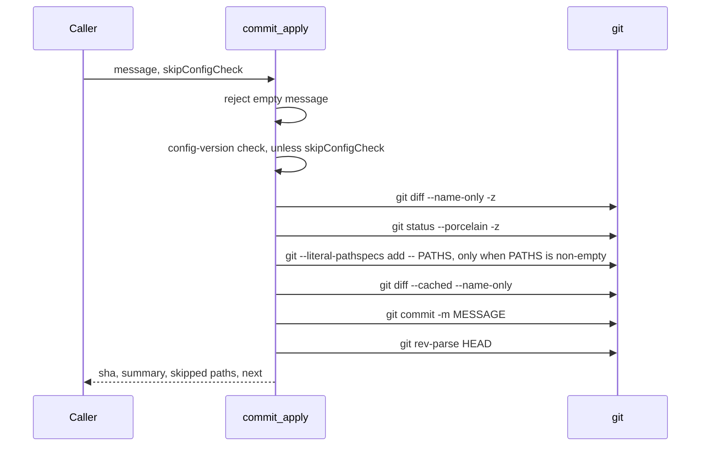

# tool-commit-apply Specification

## Purpose
`commit_apply` creates one git commit with a given message from the tracked working-tree changes plus anything already staged, and returns the new SHA. The `commit` skill calls it after user approval. Output follows docs/mcp-output-contract.md.

## Requirements

### Requirement: Input fields
The tool SHALL accept the input fields below and SHALL NOT read `sessionID`.

| Field | Type | Required | Encoding | Meaning |
|---|---|---|---|---|
| `message` | string | yes | plain text, e.g. `feat(auth): add PKCE flow` | Full commit message passed to `git commit -m`. Must not be empty or whitespace only. |
| `skipConfigCheck` | bool | no | boolean, e.g. `false` | Skip the config-version check. |
| `sessionID` | string | no | plain text, e.g. `""` | Reserved. Not read. |

#### Scenario: sessionID is ignored
- **WHEN** the caller passes any `sessionID` value
- **THEN** the result is the same as with `sessionID: ""`

### Requirement: Ordered commit sequence
The tool SHALL run its steps in the order below and SHALL stop at the first failing step.

The order of checks and git calls in one `commit_apply` run:

- The message check, config check and both scope queries run before the index is touched.
- A failure in any of those four leaves the repository unchanged.

#### Scenario: Scope query fails
- **WHEN** `git diff --name-only -z` fails in the active worktree root
- **THEN** the tool returns an `InfraError` whose message contains `git diff --name-only`
- **AND** the error carries a non-empty Suggestion

### Requirement: Empty message rejected
The tool SHALL return a `DataError` with message `commit message must not be empty` when `message` is empty after trimming whitespace.

#### Scenario: Empty message
- **WHEN** `message` is `""`
- **THEN** the tool returns a `DataError` containing `empty`
- **AND** `git status --porcelain` output is the same before and after the call

### Requirement: Config-version check
The tool SHALL run the config-version check unless `skipConfigCheck` is `true`, and SHALL return a `DataError` when it fails.

- The check fails when `.sdlc-v2/config.json` exists in the main worktree root without `config.toml`.
- Error message: `config check failed: <reason>`.
- Suggestion: run `/setup` to write the config, then retry; pass `skipConfigCheck` only when the mismatch is known and intentional.

#### Scenario: Stale config
- **WHEN** `.sdlc-v2/config.json` exists without `config.toml`
- **AND** `skipConfigCheck` is `false`
- **THEN** the tool returns a `DataError` whose message starts with `config check failed:`
- **AND** no git command that changes the index runs

### Requirement: Staging scope
The tool SHALL stage only tracked files whose working-tree state differs from the index (modified or deleted), excluding everything under `.sdlc-v2/`. It SHALL NOT stage or delete untracked files.

| Path kind | Staged by the tool | Reported in |
|---|---|---|
| Tracked, modified or deleted, outside `.sdlc-v2/` | Yes | — |
| Tracked, changed, under `.sdlc-v2/` (or `.sdlc-v2` itself) | No | `skippedTrackedPaths` |
| Untracked (`??` in `git status --porcelain -z`) | No | `skippedUntrackedPaths` |
| Already staged, with no later working-tree edit | Not re-added; committed as staged | — |

- Paths come from `git diff --name-only -z`, so names with spaces, quotes or non-ASCII bytes stay intact.
- Untracked paths come from `git status --porcelain -z`, so `skippedUntrackedPaths`, `summary` and `next` hold raw names, never git's C-quoted form.
- A wholly untracked directory is one entry with a trailing `/`.

#### Scenario: Untracked runtime file left alone
- **WHEN** `initial.txt` is modified and `.sdlc-v2/runs/x.json` is untracked
- **THEN** the commit holds only `initial.txt`
- **AND** `.sdlc-v2/runs/x.json` still exists and is still untracked
- **AND** `skippedUntrackedPaths` has one entry starting with `.sdlc-v2/`

#### Scenario: Tracked deletion committed
- **WHEN** the tracked file `initial.txt` is deleted from the working tree
- **THEN** the commit records status `D` for `initial.txt`
- **AND** `initial.txt` is no longer tracked

#### Scenario: Tracked .sdlc-v2 change not staged
- **WHEN** the tracked `.sdlc-v2/config.toml` and `initial.txt` are both modified
- **THEN** the commit holds only `initial.txt`
- **AND** `.sdlc-v2/config.toml` stays a pending modification
- **AND** `skippedTrackedPaths` is `[".sdlc-v2/config.toml"]`

#### Scenario: Staged rename plus unstaged edit
- **WHEN** `initial.txt` is renamed to `renamed.txt` with `git mv`
- **AND** the tracked `keep.txt` is edited but not staged
- **THEN** without rename detection, the commit records status `D` for `initial.txt`, `M` for `keep.txt` and `A` for `renamed.txt`

### Requirement: Literal pathspecs
The tool SHALL stage paths with `git --literal-pathspecs add -- <paths>`, so each path matches only the file with that exact name. It SHALL skip `git add` when the path list is empty.

#### Scenario: File name with glob characters
- **WHEN** the tracked file `[x] notes é.txt` is modified
- **AND** an untracked file `x notes é.txt` exists
- **THEN** the commit holds only `[x] notes é.txt`
- **AND** `skippedUntrackedPaths` is `["x notes é.txt"]`

#### Scenario: Untracked non-ASCII name
- **WHEN** `initial.txt` is modified and the untracked file `été notes.txt` exists
- **THEN** `skippedUntrackedPaths` is `["été notes.txt"]`
- **AND** `next` names `été notes.txt` as written on disk

### Requirement: Nothing to commit
The tool SHALL return a `DataError` and SHALL NOT create a commit when the index holds no staged change after staging.

- Message: `nothing to commit: pathspec <paths> produced no staged changes and nothing was staged before; untracked paths left out: <paths>; tracked paths under .sdlc-v2/ left out: <paths>`.
- Each `<paths>` is an inline path list (see Inline path lists).
- Suggestion: `git add` the wanted untracked or `.sdlc-v2/` paths and call again, or change files and call `commit_prepare` again first.

#### Scenario: Clean working tree
- **WHEN** the working tree has no changes
- **THEN** the tool returns an error containing `nothing to commit`

#### Scenario: Only an untracked file
- **WHEN** the only change is the untracked file `stray.txt`
- **THEN** the tool returns a `DataError` containing `nothing to commit`, `pathspec (none)` and `stray.txt`
- **AND** the Suggestion is non-empty
- **AND** `HEAD` does not move and `stray.txt` stays untracked

#### Scenario: Only a tracked .sdlc-v2 change
- **WHEN** the only change is to the tracked `.sdlc-v2/config.toml`
- **THEN** the error contains `tracked paths under .sdlc-v2/ left out` and `.sdlc-v2/config.toml`
- **AND** `HEAD` does not move

### Requirement: Git failure errors
The tool SHALL report each failing git step as an `InfraError` that names the git command and carries a Suggestion.

| Condition | Class | Message / Suggestion (short) |
|---|---|---|
| Main worktree root cannot be resolved | `InfraError` | `resolve main root: <err>` / run from inside a git repository or worktree |
| Active worktree root cannot be resolved | `InfraError` | `resolve active root: <err>` / change into the repository |
| `git diff --name-only -z` fails | `InfraError` | `git diff --name-only: <err>` / index may be locked or corrupt |
| `git status --porcelain -z` fails | `InfraError` | `git status: <err>` / index may be locked or corrupt |
| `git add` fails | `InfraError` | `git add: <err>` / merge conflict, lock file or permission problem |
| `git diff --cached --name-only` fails | `InfraError` | `git diff --cached: <err>` / index may be locked or corrupt |
| `git commit` fails | `InfraError` | `git commit: <err>` / failing commit hook or missing `user.name`/`user.email`; retry with the same message |
| `git rev-parse HEAD` fails | `InfraError` | `git rev-parse HEAD: <err>` / commit may have landed; run `git log -1` before retrying |

#### Scenario: git status fails after git diff succeeds
- **WHEN** `git status` rejects the repository config but `git diff --name-only` does not
- **THEN** the tool returns an `InfraError` whose message contains `git status`
- **AND** the Suggestion is non-empty

### Requirement: Result fields
The tool SHALL return the fields below after a successful commit. Both skipped lists SHALL be arrays, never `null`.

| Field | Meaning |
|---|---|
| `sha` | Full SHA of the new commit (`git rev-parse HEAD`) |
| `summary` | Plain-language outcome (see Summary text) |
| `skippedUntrackedPaths` | Untracked paths not staged or committed |
| `skippedTrackedPaths` | Tracked `.sdlc-v2/` paths not staged or committed |
| `next` | The follow-up step (see Next text) |

#### Scenario: Staged new file committed
- **WHEN** the new file `new.txt` is staged and `message` is `feat: add new file`
- **THEN** `sha` equals `git rev-parse HEAD`
- **AND** `skippedUntrackedPaths` is an empty array
- **AND** the working tree is clean

### Requirement: Summary text
The tool SHALL build `summary` from the parts below, in order, and SHALL NOT put a follow-up instruction in it.

| Part | When | Text |
|---|---|---|
| 1 | Always | `Committed <first 7 chars of sha> with <N> file(s).` (N = staged file count) |
| 2a | No untracked path skipped | ` No untracked paths were left out.` |
| 2b | Untracked paths skipped | ` <n> untracked path(s) were NOT committed and are still untracked: <paths>.` |
| 3 | Tracked `.sdlc-v2/` paths skipped | ` <n> tracked path(s) under .sdlc-v2/ were NOT committed and are still modified in the working tree: <paths>.` |

#### Scenario: Untracked file skipped
- **WHEN** `initial.txt` is modified and `stray.txt` is untracked
- **THEN** `skippedUntrackedPaths` is `["stray.txt"]`
- **AND** `summary` contains `stray.txt` and `NOT committed`
- **AND** `summary` does not contain `git add`

### Requirement: Next text
The tool SHALL set `next` to a fixed confirmation when nothing was skipped, and otherwise to a `git add` plus retry instruction for each skipped list.

| Case | `next` |
|---|---|
| Both lists empty | `Commit created and nothing was left out. Report the sha above as the committed change.` |
| Untracked skipped | `These untracked paths were left out and are still untracked: <paths>. Run git add on the ones that belong in this change, then call commit_apply again. Do not report them as committed.` |
| Tracked `.sdlc-v2/` skipped | `These tracked paths under .sdlc-v2/ were left out and are still uncommitted: <paths>. Run git add on the ones that belong in this change, then call commit_apply again. Do not report them as committed.` |

- When both lists are non-empty, the two instructions are joined with one space, untracked first.

#### Scenario: Nothing left out
- **WHEN** only `initial.txt` is modified
- **THEN** `next` is `Commit created and nothing was left out. Report the sha above as the committed change.`

#### Scenario: Untracked path left out
- **WHEN** `initial.txt` is modified and `stray.txt` is untracked
- **THEN** `next` contains `stray.txt`, `git add`, `call commit_apply again` and `Do not report them as committed`
- **AND** `next` does not contain `nothing was left out`

### Requirement: Inline path lists
The tool SHALL name at most 10 paths inline in `summary`, `next` and error messages. The full lists SHALL stay in `skippedUntrackedPaths` and `skippedTrackedPaths`.

| Paths | Inline text |
|---|---|
| 0 | `(none)` |
| 1–10 | Paths joined with `, ` |
| More than 10 | First 10 joined with `, `, then `, and <rest> more` |

#### Scenario: Fifteen paths
- **WHEN** a list holds 15 paths `a0`…`a14`
- **THEN** the inline text is `a0, a1, a2, a3, a4, a5, a6, a7, a8, a9, and 5 more`

### Requirement: Tool annotations
The tool SHALL declare the annotations below.

| Annotation | Value |
|---|---|
| Title | `Create a git commit` |
| ReadOnly | `false` |
| Destructive | `true` |
| Idempotent | `false` |
| OpenWorld | `false` |

#### Scenario: Listing tools
- **WHEN** an MCP client lists tools
- **THEN** `commit_apply` is marked destructive, not idempotent and not open-world
