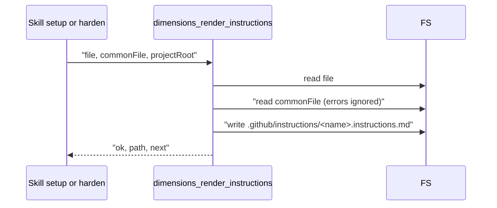

# tool-dimensions-render-instructions Specification

## Purpose
`dimensions_render_instructions` renders one review-dimension file to its GitHub Copilot instructions mirror, writes a dimension file, or lists installed dimensions. The `setup` skill (Step 0 snapshot and the setup-dimensions sub-flow) and the `harden` skill's Copilot-mirror step call it. Output follows docs/mcp-output-contract.md.

## Requirements

### Requirement: Mode selection
The tool SHALL run exactly one of three modes per call, chosen by `writeDimension` and `listDimensions`, and SHALL reject a call that sets both to `true`.

| Mode | Selected when | Required fields | Ignored fields | Writes |
|---|---|---|---|---|
| render | both flags false or absent | `file` | `name`, `content` | `.github/instructions/<name>.instructions.md` |
| write | `writeDimension: true` | `name`, `content` | `file`, `commonFile` | `.sdlc-v2/review-dimensions/<name>.md` |
| list | `listDimensions: true` | — | `file`, `commonFile`, `name`, `content` | nothing |

| Field | Type | Required | Encoding | Meaning |
|---|---|---|---|---|
| `file` | string | render mode | plain text path | Dimension file to render, e.g. `.sdlc-v2/review-dimensions/security.md` |
| `commonFile` | string | no | plain text path | Shared prompt file, normally `.sdlc-v2/review-dimensions/_common.md` |
| `projectRoot` | string | no | plain text path | Root for every path in every mode; default is the active worktree root |
| `writeDimension` | boolean | no | JSON boolean | Selects write mode |
| `name` | string | write mode | plain text file stem | Dimension file stem, e.g. `security` |
| `content` | string | write mode | Markdown (frontmatter + body) | Full dimension file content |
| `listDimensions` | boolean | no | JSON boolean | Selects list mode |

| Condition | Class | Message / Suggestion (short) |
|---|---|---|
| `writeDimension` and `listDimensions` both `true` | `DomainError` | `at most one of writeDimension, listDimensions may be true` / set exactly one mode field |

#### Scenario: Both mode flags set
- **WHEN** the call sets `writeDimension: true` and `listDimensions: true`
- **THEN** the tool returns `DomainError` `at most one of writeDimension, listDimensions may be true`

### Requirement: Registration and annotations
The tool SHALL be registered as `dimensions_render_instructions` with the annotations below.

| Annotation | Value |
|---|---|
| `Title` | `Render review dimension files` |
| `ReadOnly` | `false` |
| `Destructive` | `true` |
| `Idempotent` | `true` |
| `OpenWorld` | `false` |

#### Scenario: Client lists tools
- **WHEN** an MCP client lists the server's tools
- **THEN** `dimensions_render_instructions` reports `Title` `Render review dimension files`, `ReadOnly` `false`, `Destructive` `true`, `Idempotent` `true`, `OpenWorld` `false`

### Requirement: Root resolution
The tool SHALL resolve every path against `projectRoot` when it is set, and against the active worktree root otherwise; an absolute `file` or `commonFile` is used as given.

| Condition | Class | Message / Suggestion (short) |
|---|---|---|
| `projectRoot` empty and the active worktree root cannot be resolved | `InfraError` | `resolve project root: <cause>` / pass `projectRoot`, or run inside a git working tree |

#### Scenario: Linked worktree without projectRoot
- **WHEN** the tool runs inside a linked git worktree and `projectRoot` is empty
- **THEN** it reads and writes dimension files under that linked worktree's root, not the main worktree's root

#### Scenario: Explicit projectRoot
- **WHEN** `projectRoot` is `/repo` and `file` is `.sdlc-v2/review-dimensions/security.md`
- **THEN** the tool reads `/repo/.sdlc-v2/review-dimensions/security.md`

### Requirement: Result fields
The tool SHALL return the fields below in every mode, with `dimensions` always present as a list.

| Field | Meaning |
|---|---|
| `ok` | `true` on success |
| `path` | render: mirror file written; write: dimension file written; list: the scanned `review-dimensions` directory |
| `dimensions` | list: sorted dimension names; render and write: `[]` |
| `count` | list: number of names; render and write: `0` |
| `next` | Short instruction for the caller; set in every mode |

#### Scenario: Write mode returns an empty list
- **WHEN** write mode succeeds
- **THEN** `dimensions` is `[]`, not absent and not null
- **AND** `next` is not empty

### Requirement: Render mode output file
In render mode the tool SHALL read `file`, build the Copilot mirror from its frontmatter and body, create `.github/instructions/` under the root if needed, and overwrite `.github/instructions/<frontmatter name>.instructions.md` as a whole.

Render mode interaction:

- A missing or unreadable `commonFile` is not an error; the Common Review Instructions section is left out.
- `next` is `Rendered to <path>.`

#### Scenario: Render without common file
- **WHEN** `file` is a valid dimension named `security` and `commonFile` does not exist
- **THEN** the tool writes `.github/instructions/security.instructions.md`
- **AND** the file has no `## Common Review Instructions` section
- **AND** `path` is that file's path

#### Scenario: Existing mirror is replaced
- **WHEN** `.github/instructions/security.instructions.md` already exists with other content
- **THEN** render mode replaces the whole file with the new mirror

### Requirement: Render mode mirror content
The mirror file SHALL contain the parts below, in this order, and SHALL end with a newline.

| Order | Part | Source | When present |
|---|---|---|---|
| 1 | `---` / `applyTo: "<triggers joined by ,>"` / `---` | frontmatter `triggers` | always |
| 2 | `# <name> — Review Instructions` | frontmatter `name` (trimmed) | always |
| 3 | Description paragraph | frontmatter `description` (trimmed) | description not empty |
| 4 | `Default severity: <severity>` | frontmatter `severity`, default `medium` | always |
| 5 | `## Common Review Instructions` + trimmed common text | `commonFile` content | common text not blank |
| 6 | `## Checklist` + body section | body `## Checklist` section | section present and not blank |
| 7 | `## Severity Guide` + body section | body `## Severity Guide` section | section present and not blank |
| 8 | `## Note` + exclusion text | frontmatter `skip-when` | `skip-when` not empty |

- In the Checklist section, checkbox items (`- [ ] `, `- [x] `, `- [X] `) become plain `- ` items.
- A body section runs from its `## <heading>` line to the next `## ` heading or the end of the body.
- The Note text is `In Claude Code reviews, files matching these patterns are excluded: <patterns>.` (patterns joined by `, `), followed by `Copilot path-specific instructions do not support exclusion patterns — use judgment when findings apply to these files.`

#### Scenario: Output matches the JS reference
- **WHEN** the reference dimension `dependency-management.md` is rendered without common text
- **THEN** the mirror content equals the reference output of the former `dimension-to-instructions.js` for that file

#### Scenario: Common text injected
- **WHEN** a dimension file is rendered with a non-blank `commonFile`
- **THEN** the mirror contains `## Common Review Instructions` followed by the trimmed common text
- **AND** that section comes after the `Default severity:` line and before `## Checklist`

#### Scenario: Severity default
- **WHEN** the dimension frontmatter has no `severity`
- **THEN** the mirror contains `Default severity: medium`

### Requirement: Render mode errors
In render mode the tool SHALL fail without writing the mirror when `file` is missing, unreadable, has broken frontmatter, or lacks a `name` or a non-empty `triggers` list.

| Condition | Class | Message / Suggestion (short) |
|---|---|---|
| `file` empty | `DomainError` | `dimensions_render_instructions: file is required` / pass file, or pick another mode |
| `file` cannot be read | `DomainError` | `dimensions_render_instructions: cannot read <path>: <cause>` / check the path; relative paths resolve against the root |
| Frontmatter cannot be parsed | `DomainError` | `dimensions_render_instructions: <path>: <cause>` / fix the `---` frontmatter block, or run validate with action `dimensions` |
| No usable `name` or no string in `triggers` | `DomainError` | `dimensions_render_instructions: <path> lacks a usable name or a non-empty triggers list; cannot render` / add name and a trigger |
| `.github/instructions/` cannot be created | `InfraError` | `create <dir>: <cause>` / check write permission |
| Mirror file cannot be written | `InfraError` | `write <path>: <cause>` / check write permission and disk space |

#### Scenario: Missing file field
- **WHEN** render mode is called with an empty `file`
- **THEN** the tool returns `DomainError` `dimensions_render_instructions: file is required`

#### Scenario: Dimension without triggers
- **WHEN** the dimension frontmatter has a `name` but an empty `triggers` list
- **THEN** the tool returns `DomainError` ending with `lacks a usable name or a non-empty triggers list; cannot render`
- **AND** no mirror file is written

### Requirement: Write mode
In write mode the tool SHALL write `content` unchanged to `.sdlc-v2/review-dimensions/<name>.md` under the root, creating the directory if needed and replacing any existing file, without validating the content.

- `next` is `Written to <path>. Run validate({action:"dimensions"}) to check frontmatter/body validity.`

| Condition | Class | Message / Suggestion (short) |
|---|---|---|
| `name` empty | `DomainError` | `dimensions_render_instructions: name is required when writeDimension is true` |
| `content` empty | `DomainError` | `dimensions_render_instructions: content is required when writeDimension is true` |
| `name` contains `/`, `\`, or `..` | `DomainError` | `dimensions_render_instructions: invalid name "<name>": must not contain a path separator or ".."` / use a bare stem such as `security` |
| Directory cannot be created | `InfraError` | `create <dir>: <cause>` / create `.sdlc-v2/review-dimensions` or free disk space |
| File cannot be written | `InfraError` | `write <path>: <cause>` / check permission and disk space, retry with the same name and content |

#### Scenario: New dimension written
- **WHEN** write mode is called with `name` `security` and non-empty `content`
- **THEN** `.sdlc-v2/review-dimensions/security.md` holds exactly `content`
- **AND** `ok` is `true` and `path` is that file's path

#### Scenario: Path traversal name
- **WHEN** write mode is called with `name` `../escape`, `sub/dir`, `back\slash`, or `..`
- **THEN** the tool returns `DomainError`
- **AND** no file is created outside `.sdlc-v2/review-dimensions/`

#### Scenario: Empty content
- **WHEN** write mode is called with `name` `security` and empty `content`
- **THEN** the tool returns `DomainError` `dimensions_render_instructions: content is required when writeDimension is true`

### Requirement: List mode
In list mode the tool SHALL return the sorted file stems of every `*.md` file directly in `.sdlc-v2/review-dimensions/` under the root, excluding `_common.md`, and SHALL NOT validate those files.

| Result | `next` |
|---|---|
| One or more dimensions | `<n> review dimension(s) installed under .sdlc-v2/review-dimensions/.` |
| None, or the directory does not exist | `No review dimensions installed yet under .sdlc-v2/review-dimensions/.` |

- `path` is the scanned directory.
- Subdirectories and non-`.md` files are skipped.

#### Scenario: Mixed directory content
- **WHEN** `.sdlc-v2/review-dimensions/` holds `security.md`, `a11y.md`, `_common.md`, and `notes.txt`
- **THEN** `dimensions` is `["a11y", "security"]`
- **AND** `count` is 2

#### Scenario: Directory missing
- **WHEN** `.sdlc-v2/review-dimensions/` does not exist
- **THEN** `ok` is `true`, `dimensions` is `[]`, and `count` is 0
- **AND** `next` is `No review dimensions installed yet under .sdlc-v2/review-dimensions/.`
