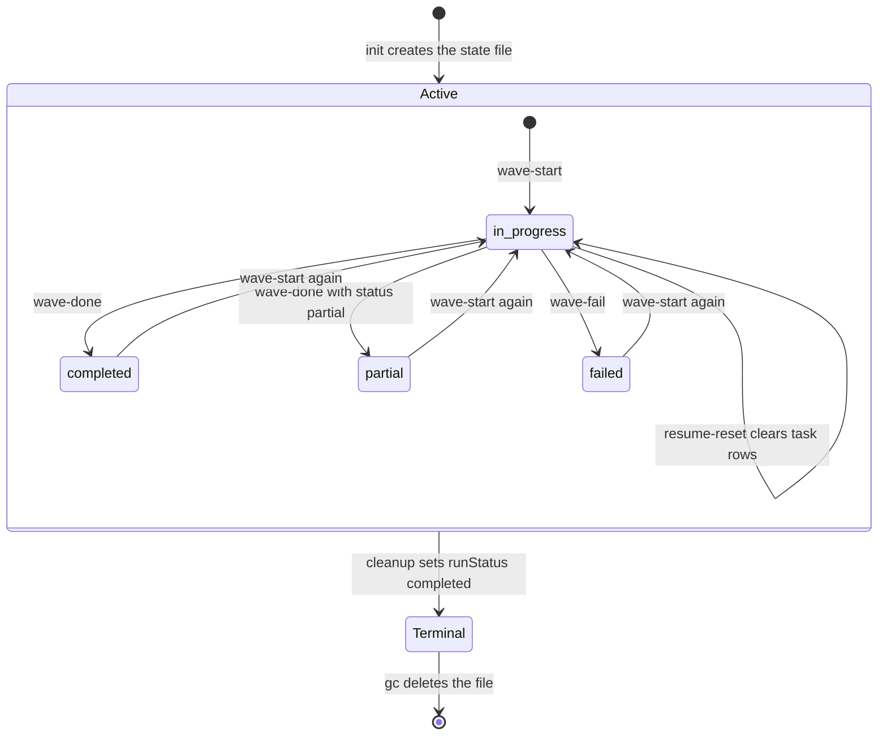
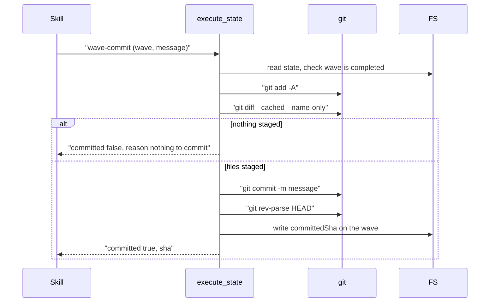
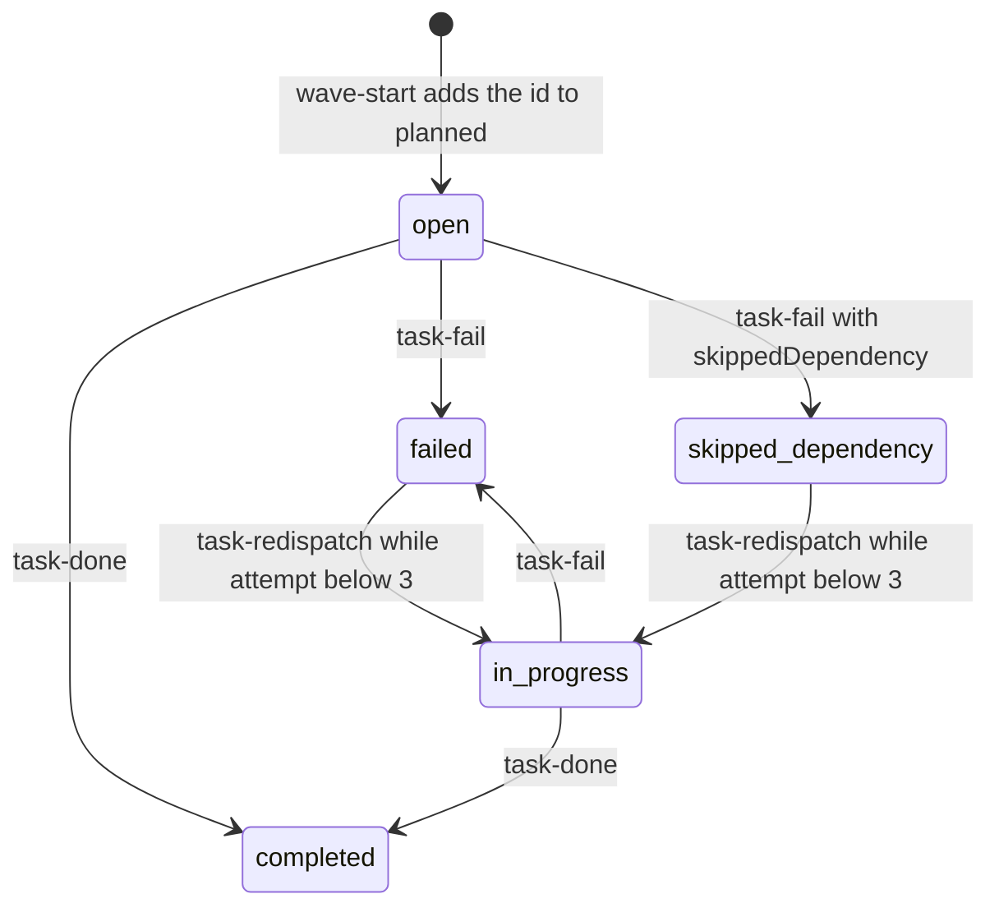
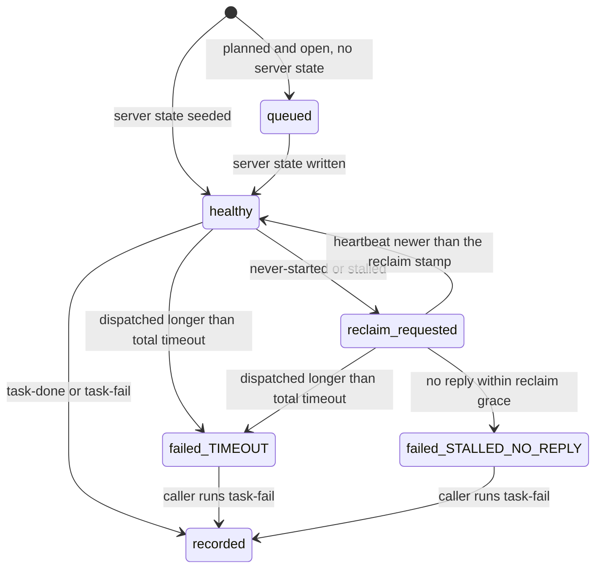

# tool-execute-state Specification

## Purpose
`execute_state` is the MCP tool that owns the persisted state of one wave-based execute run: waves, task rows, worker dispatch state, ledger, drift, and the end-of-run report. The execute and ship skills (and review/plan for the ledger) call it once per step. Output follows docs/mcp-output-contract.md.

## Requirements

### Requirement: Action selection
The tool SHALL run exactly one operation per call, selected by the `action` field, and SHALL ignore every input field the selected action does not read.

Actions, their fields, and what they touch:

| Action | Required | Optional | Execute state file | Other side effects |
|---|---|---|---|---|
| `wave-compute` | `planPath` | `extraDepsJson` | none | reads plan file |
| `resolve-config` | — | `branch`, `auto`, `quality`, `commitWaves` | none | may move keys from `.sdlc-v2/config.toml` to `.sdlc-v2/local.toml` |
| `init` | `branch`, `quality` | `totalTasks`, `plannedTaskIds`, `planPath`, `planHash`, `commitWaves`, `sessionId`, `waveTimeoutSeconds`, `waveIntervalSeconds` | creates | config migration; OpenSpec `tasks.md` ref stamps |
| `wave-start` | `wave` | `branch`, `tasksJson`, `runId`, `detail` | writes | fact sheets; server dispatch state |
| `wave-done` | `wave` | `branch`, `decisions`, `status`, `timedOut`, `detail` | writes | `.sdlc-v2/timings.json` |
| `wave-fail` | `wave` | `branch`, `timedOut`, `error`, `detail` | writes | — |
| `wave-committed` | `wave` | `branch`, `sha` | writes | — |
| `wave-commit` | `wave`, `message` | `branch`, `detail` | writes | `git add -A`, `git commit` |
| `task-done` | `wave`, `taskId` | `branch`, `taskName`, `complexity`, `risk`, `filesChanged`, `filesAdded`, `verifyToken`, `status`, `error` | writes | — |
| `task-fail` | `wave`, `taskId` | `branch`, `runId`, `taskName`, `complexity`, `risk`, `error`, `skippedDependency` | writes | reads worker progress |
| `task-redispatch` | `taskId` | `branch`, `runId`, `wave` | writes | server dispatch state reseeded |
| `task-context` | `taskId` | `branch`, `runId`, `wave` | reads | stamps `contextFetchedAt` |
| `context` | `data` | `branch` | writes | — |
| `read` | — | `branch` | reads | — |
| `cleanup` | — | `branch` | writes terminal stamp | removes run and ledger dirs |
| `gc` | — | `ttlDays`, `dryRun` | deletes stale files | removes stale run dirs |
| `summarize-prior-wave-context` | — | `branch`, `maxFiles`, `maxDecisions`, `maxInterfaces`, `maxTaskIds` | reads | — |
| `wave-split` | `dispatched` | `wave`, `missingIds`, `branch`, `splitDepth`, `maxSplitDepth`, `stateFile` | best-effort write | — |
| `verify-completeness` | — | `branch`, `stateFile` | reads | may write ship state |
| `wave-progress` | `runId` | `readProgress`, `taskId`, `phase`, `lastCompletedTask`, `acceptanceDone`, `filesTouched`, `blocker` | none | worker progress file |
| `wave-await` | `runId`, `wave` | `branch`, `stateFile` | reads | reclaim stamps; poll file |
| `resume-reset` | — | `branch`, `runId` | writes | server dispatch state reseeded |
| `ledger_checkin` | `runId`, `workerId` | `stepId` | none | ledger file |
| `ledger_checkout` | `runId`, `workerId` | `findings` | none | ledger file |
| `ledger_status` | `runId` | `timeoutSeconds`, `expectedWorkers` | none | — |
| `ledger_cleanup` | `runId` | — | none | removes ledger dir |
| `log-cli` | `cliCommand` | `cliExitCode`, `cliOutput`, `branch`, `wave` | none | CLI evidence log |
| `drift-log` | `driftSeverity`, `driftSummary` | `driftDetail`, `wave`, `taskId`, `branch` | writes | — |
| `issue-draft` | `issueDraftTitle`, `issueDraftBody` | `issueDraftLabels`, `taskId`, `branch` | writes | `.sdlc-v2/history/deferred.json` |
| `decide` | `decideType`, `decideId` | `decideDecision`, `decideReason`, `branch` | writes | — |
| `report` | — | `branch`, `write`, `format`, `body` | reads | report file when `write` is true |

- `payload` is reserved and no action reads it.
- Tool annotations: `Title` `Read or update execute run state`, `ReadOnly` false, `Destructive` true, `Idempotent` false, `OpenWorld` false.

#### Scenario: Unknown action
- **WHEN** `action` is not one of the 31 actions above
- **THEN** the tool fails with a DomainError whose message starts with `unknown action "<action>" (sdlc v<version>, commit <sha>)`
- **AND** the Suggestion says the action is not in the running binary and advises updating the sdlc plugin

#### Scenario: Unread fields are ignored
- **WHEN** a caller passes a field that the selected action does not list
- **THEN** the call behaves as if that field were absent

### Requirement: File locations
The tool SHALL anchor every `.sdlc-v2/` path at the main worktree root and SHALL run git commands in the active worktree.

| Path | Written by | Content |
|---|---|---|
| `.sdlc-v2/runs/execute-<branch-slug>-<YYYYMMDDTHHmmssZ>.json` | `init` and every state-writing action | execution state |
| `.sdlc-v2/runs/<runId>/task-<id>.md` | `wave-start` | per-task fact sheet |
| `.sdlc-v2/runs/<runId>/progress/<taskId>.json` | `wave-progress` | worker-owned progress |
| `.sdlc-v2/runs/<runId>/progress/<taskId>.server.json` | `wave-start`, `task-context`, `task-redispatch`, `resume-reset`, `wave-await` | server-owned dispatch state |
| `.sdlc-v2/runs/ledger/<runId>/<workerId>.json` | `ledger_checkin`, `ledger_checkout` | worker ledger entry |
| `.sdlc-v2/evidence/cli-executions.jsonl` | `log-cli` | CLI evidence lines |
| `.sdlc-v2/history/deferred.json` | `issue-draft` | durable deferred items |
| `.sdlc-v2/reports/<runId>-report.<json or md>` | `report` with `write` | end-of-run report |
| `.sdlc-v2/timings.json` | `wave-done` | wave duration history |
| `<OS temp dir>/wave-await-<12 hex>.json` | `wave-await` without `stateFile` | poll resume state |

- `runId`, when not passed, is derived from the state's `startedAt` by keeping only digits and `T` (e.g. `2026-09-30T10:00:00Z` → `20260930T100000`).
- With no `startedAt`, the derived `runId` is `wave-<n>`.
- A fact-sheet id drops a leading `T` or `t` that is followed by a digit (`T1` → `task-1.md`).

#### Scenario: Main root cannot be resolved
- **WHEN** the main worktree root cannot be resolved
- **THEN** the tool uses the process working directory as the root

#### Scenario: Run id derived from startedAt
- **WHEN** `wave-start` receives `tasksJson` without `runId` and the state has `startedAt` `2026-09-30T10:00:00Z`
- **THEN** fact sheets are written under `.sdlc-v2/runs/20260930T100000/`
- **AND** the response `runId` is `20260930T100000`

### Requirement: Branch and state file resolution
The tool SHALL locate the execute state file from `branch`, or from the current git branch when `branch` is omitted, and SHALL reject a call whose branch differs from the branch recorded by `init`.

Actions that do not need an existing execute state file: `wave-compute`, `resolve-config`, `init`, `gc`, `wave-progress`, all `ledger_*`, `log-cli`, `wave-split`, `cleanup`, `resume-reset`, `verify-completeness` with `stateFile`, and `report` when reporting is disabled.

| Condition | Class | Message / Suggestion (short) |
|---|---|---|
| `branch` omitted and HEAD unresolvable | DomainError | `could not determine branch: <err>` / pass `branch` |
| state file unreadable or bad JSON | InfraError | `find state: <err>` / check `.sdlc-v2/runs/execute-<branch-slug>-*.json` |
| no state file for branch | DataError | `no state file found for branch "<branch>"` / run `init` first |
| recorded branch differs | DomainError | `branch changed mid-session: init recorded "<a>", current is "<b>"` / switch back or start a new run |
| state write fails | InfraError | `write state: <err>` / check `.sdlc-v2/runs/` is writable |

- `wave-await` resolves an omitted `branch` from the main worktree root, not the active worktree.

#### Scenario: Branch falls back to the current branch
- **WHEN** a state-reading action is called without `branch`
- **THEN** the tool uses the current git branch to find the state file

#### Scenario: Missing state file
- **WHEN** `wave-start` is called for a branch with no execute state file
- **THEN** the tool fails with a DataError `no state file found for branch "<branch>"`

#### Scenario: Branch changed mid-session
- **WHEN** the resolved branch string finds a state file whose recorded `branch` is a different string
- **THEN** the tool fails with a DomainError starting `branch changed mid-session: init recorded`

#### Scenario: State without a recorded branch
- **WHEN** the state file has no `branch` value
- **THEN** no branch assertion is made and the action proceeds

### Requirement: Common wave and narration inputs
The tool SHALL treat `wave` as required for wave-scoped actions, accepting `0`, and SHALL accept `detail` only as `concise` or `full` (default `full`) on `wave-start`, `wave-done`, `wave-fail`, and `wave-commit`.

- Narrated actions return `summary`, `display`, `timing`, and `next` (`id`, `instruction`, `etaSeconds`, `etaBasis`).
- `detail: "concise"` leaves `display` empty.

#### Scenario: Wave missing
- **WHEN** `wave-start`, `wave-done`, `wave-fail`, `wave-committed`, `wave-commit`, `task-done`, or `task-fail` is called without `wave`
- **THEN** the tool fails with a DomainError `--wave is required`

#### Scenario: Wave zero
- **WHEN** `wave-start` then `wave-done` are called with `wave: 0`
- **THEN** both succeed and the state holds a wave with `number` 0 and `status` `completed`

#### Scenario: Invalid detail
- **WHEN** `detail` is `verbose`
- **THEN** the tool fails with a DomainError `detail must be "concise" or "full", got "verbose"`

### Requirement: JSON-encoded string inputs
The tool SHALL parse the following string fields as JSON and SHALL fail with a DomainError naming the field when the text is not valid JSON.

| Field | Type | Required | Encoding | Meaning |
|---|---|---|---|---|
| `tasksJson` | string | no (`wave-start`) | JSON array of task objects | tasks dispatched in the wave |
| `extraDepsJson` | string | no (`wave-compute`) | JSON array of `{task, dependsOn, reason}` | extra dependency edges |
| `decisions` | string | no (`wave-done`) | JSON array of strings, e.g. `["Chose sqlite"]` | wave decisions |
| `filesChanged` | string | no (`task-done`) | JSON array of paths | files the task changed |
| `filesAdded` | string | no (`task-done`) | JSON array of paths, subset of `filesChanged` | files the task created |
| `verifyToken` | string | no (`task-done`) | JSON string or JSON array of strings | verification evidence |
| `data` | string | yes (`context`) | JSON object | shared context keys |
| `dispatched` | string | yes (`wave-split`) | JSON array of id strings | dispatched task ids |
| `missingIds` | string | no (`wave-split`) | JSON array of id strings | ids missing from the wave |

#### Scenario: Plain prose where JSON is expected
- **WHEN** `wave-done` receives `decisions: "Chose sqlite over postgres"`
- **THEN** the tool fails with a DomainError starting `decisions is not valid JSON:`
- **AND** the error is returned before any state lookup

#### Scenario: Bare verify token
- **WHEN** `task-done` receives `verifyToken: "tests-pass"`
- **THEN** the tool fails with a DomainError starting `verifyToken is not valid JSON:`

### Requirement: Run and wave lifecycle
The tool SHALL move each recorded wave through the statuses `in_progress`, `completed`, `partial`, and `failed` as wave actions are called, and SHALL mark a run terminal only through `cleanup`.

Execution state lifecycle: the run file (outer) and one wave's `status` (inner), as driven by `execute_state` actions.

- A new wave entry is `{number, status: "in_progress", startedAt, tasks: []}`.
- `wave-done`, `wave-fail`, `task-done`, `task-fail`, and `wave-split` create the wave as `in_progress` first when its number is not recorded.
- `wave-commit` and `wave-committed` record `committedSha` on a `completed` wave; the status stays `completed`.
- Every state write deletes older execute state files for the same branch slug, so a second `init` supersedes the earlier run.

#### Scenario: Restarting an existing wave
- **WHEN** `wave-start` is called for a wave that is already recorded
- **THEN** its `status` becomes `in_progress`
- **AND** its original `startedAt` is kept

#### Scenario: Task recorded on an unrecorded wave
- **WHEN** `task-done` names a wave number that has no entry
- **THEN** the wave is created with `status` `in_progress` and the task row is added to it

### Requirement: wave-compute action
The `wave-compute` action SHALL parse the plan at `planPath` and return a wave schedule without reading or writing any execution state.

| Output field | Meaning |
|---|---|
| `route` | `direct` (no waves needed) or `waves` |
| `preWave` | Trivial tasks with no dependencies and at least one dependent, run before wave 1 |
| `waves[]` | `{number, tasks[], expectedFiles[], verificationHint?}` |
| `waves[].tasks[]` | `{id, name, complexity, risk, files[], verify}`; `id` is a string |
| `errors` | soft errors, e.g. `ExtraDep references unknown task <n>`; present only when non-empty |

- Tasks come from `### Task N: <title>` headings with `**Complexity:**`, `**Risk:**`, `**Depends on:**`, `**Verify:**`, and `**Files:**` fields.
- `route` is `direct` for 3 or fewer tasks that are all Trivial/Standard with no High risk.
- Empty lists serialize as `[]`, never `null`.

| Condition | Class | Message / Suggestion (short) |
|---|---|---|
| `planPath` empty | DomainError | `wave-compute: planPath is required` |
| `extraDepsJson` not JSON | DomainError | `wave-compute: extraDepsJson is not valid JSON: <err>` |
| plan file unreadable | InfraError | `wave-compute: read plan file "<path>": <err>` |
| no task headings | DomainError | `wave-compute: no tasks found in plan (expected "### Task N: <title>" headings)` |
| missing or invalid Complexity/Risk | DomainError | `wave-compute: plan task metadata invalid: <issues>` |
| dependency cycle or bad reference | DomainError | `wave-compute: <err>` / fix the Depends-on reference |

#### Scenario: Small simple plan
- **WHEN** the plan has two Trivial/Standard, Low-risk tasks
- **THEN** `route` is `direct` and `preWave` and `waves` are empty lists

#### Scenario: Extra dependencies merged
- **WHEN** `extraDepsJson` adds a dependency not in any `**Depends on:**` field
- **THEN** the schedule honors both the plan dependencies and the extra one

#### Scenario: Circular dependency
- **WHEN** Task 1 depends on Task 2 and Task 2 depends on Task 1
- **THEN** the tool fails with a DomainError

### Requirement: resolve-config action
The `resolve-config` action SHALL return the effective `auto`, `quality`, `commitWaves`, and `highRiskAutoApprove` values with per-key provenance, without reading or writing any run state file.

| Key | Resolution order | Default |
|---|---|---|
| `auto` | `auto` input (`cli`) > ship state `flags.auto` for `branch` (`pipeline`) > `executePrefs.auto` (`config`) | false (`default`) |
| `quality` | `quality` input (`cli`) > `executePrefs.quality` (`config`) > `balanced` when auto (`default`) | empty (`unset`) |
| `commitWaves` | `commitWaves` input `true`/`false` (`cli`) > config `execute.commitWaves` (`config`) | true (`default`) |
| `highRiskAutoApprove` | `executePrefs.highRiskAutoApprove` (`config`) | false (`default`) |

| Output field | Meaning |
|---|---|
| `auto` | effective auto mode |
| `quality` | `full`, `balanced`, `minimal`, or empty; empty means the skill must ask for a tier; never omitted |
| `commitWaves` | effective commit-per-wave setting |
| `highRiskAutoApprove` | effective high-risk auto-approval |
| `sources` | per key: `cli`, `pipeline`, `config`, `default`, or `unset` |
| `warnings` | non-fatal problems and the moved-keys notice |

- `executePrefs` lives in `.sdlc-v2/local.toml`; `execute.commitWaves` lives in `.sdlc-v2/config.toml`.
- Before reading, the action moves stale `auto`, `quality`, and `highRiskAutoApprove` keys from config.toml `[execute]` to local.toml `[executePrefs]`.
- The ship-state cross-read happens only when `branch` is passed.

#### Scenario: No inputs and no config
- **WHEN** nothing sets any key
- **THEN** `auto` is false, `quality` is empty with source `unset`, `commitWaves` is true, `highRiskAutoApprove` is false

#### Scenario: Pipeline auto
- **WHEN** `branch` is passed and that branch's ship state has `flags.auto: true`
- **THEN** `auto` is true with source `pipeline`
- **AND** `quality` defaults to `balanced` with source `default` when nothing else sets it

#### Scenario: Out-of-enum CLI quality
- **WHEN** `quality` is `C`
- **THEN** a warning names the value and resolution falls through to config, then the default
- **AND** the call does not fail

#### Scenario: Wrong-typed config value
- **WHEN** `executePrefs.highRiskAutoApprove` is not a bool
- **THEN** a warning names the wrong type and the built-in default is used

#### Scenario: Unreadable ship state or config
- **WHEN** the ship state or a config section cannot be read
- **THEN** a warning is added and resolution continues with defaults

#### Scenario: Stale keys moved
- **WHEN** config.toml `[execute]` holds `highRiskAutoApprove`
- **THEN** the key is moved to local.toml `[executePrefs]`
- **AND** `warnings` carries a notice starting `Moved personal settings from .sdlc-v2/config.toml to .sdlc-v2/local.toml`

#### Scenario: Unsafe move
- **WHEN** the move conflicts with a different value already in local.toml
- **THEN** the tool fails with a DataError starting `Cannot move personal settings from .sdlc-v2/config.toml to .sdlc-v2/local.toml automatically`

### Requirement: init action
The `init` action SHALL create a new execute state file for `branch`, after passing the config migration gate, and SHALL return its path.

| Persisted key | Value |
|---|---|
| `version`, `skill` | `1`, `execute` |
| `startedAt` | now, RFC 3339 UTC |
| `branch`, `worktree` | `branch` input; active worktree path |
| `planPath`, `planHash` | inputs, or `null` when empty |
| `quality` | `quality` input |
| `commitWaves` | `"true"` or `"false"`; any other value becomes `"true"` |
| `totalTasks`, `plannedTaskIds` | inputs; `plannedTaskIds` is `null` when not passed |
| `waves`, `context` | `[]`, `{}` |
| `pipelineAuto` | true when the branch's ship state has `flags.auto: true` |
| `waveTimeoutSeconds` | `waveTimeoutSeconds` input > ship `flags.executeWaveTimeout` > 1800 |
| `waveIntervalSeconds` | `waveIntervalSeconds` input > ship `flags.executeWaveInterval` > 60 |
| `sessionId` | `sessionId` input, or `null` |

| Output field | Meaning |
|---|---|
| `filePath` | path of the new state file |
| `pipelineAuto` | diagnostic copy of the persisted value |
| `warnings` | non-fatal problems (ship state unreadable, OpenSpec ref stamp skipped) |
| `migration` | `{changes[], backupPath}` when the config was migrated |

- When `planPath` is readable and its `**Source:**` line names `openspec/changes/<name>/`, init appends `<!-- ref:... -->` comments to the task lines of `openspec/changes/<name>/tasks.md` (in the active worktree) that have no ref comment yet.

| Condition | Class | Message / Suggestion (short) |
|---|---|---|
| `branch` empty | DomainError | `--branch is required for init` |
| `quality` empty | DomainError | `--quality is required for init` / call `resolve-config` first |
| config missing or too new | DataError | `config-version: <reason>` / run the migrate tool or `/setup` |
| state file cannot be created | InfraError | `init state: <err>` |

#### Scenario: Successful init
- **WHEN** `init` is called with `branch` and `quality`
- **THEN** a state file `.sdlc-v2/runs/execute-<branch-slug>-<timestamp>.json` holds the keys above
- **AND** the response carries `filePath` and `pipelineAuto`

#### Scenario: Missing config
- **WHEN** the project has no sdlc config
- **THEN** the tool fails with a DataError starting `config-version:`

#### Scenario: Wave timeouts from ship state
- **WHEN** `waveTimeoutSeconds` is not passed and the ship state has `flags.executeWaveTimeout: 900`
- **THEN** the state records `waveTimeoutSeconds: 900`

#### Scenario: Unreadable plan path
- **WHEN** `planPath` cannot be read
- **THEN** init still succeeds
- **AND** `warnings` contains `init: openspec ref stamp skipped: plan unreadable: <err>`

#### Scenario: OpenSpec plan
- **WHEN** the plan's `**Source:**` line is `openspec/changes/<name>/`
- **THEN** task lines in `openspec/changes/<name>/tasks.md` that have no ref comment yet gain ref comments

### Requirement: wave-start plan drift check
The `wave-start` action SHALL compare the sha256 of the plan file with the `planHash` recorded at init before it changes any wave, and SHALL halt the wave on a mismatch.

#### Scenario: Plan changed since init
- **WHEN** `planHash` is set and the sha256 of `planPath` differs from it
- **THEN** an issue `{severity: "error", category: "drift", summary: "plan content changed since init"}` is appended and saved
- **AND** the response is `{logged: true, halt: true, reason: "plan hash mismatch", driftCount}` with `next` telling the caller to re-run `init` or investigate
- **AND** the wave is not created or changed

#### Scenario: Plan unchanged
- **WHEN** the sha256 of `planPath` equals `planHash`
- **THEN** the wave starts normally

#### Scenario: No planHash
- **WHEN** the state has no `planHash`
- **THEN** no drift check runs

#### Scenario: planHash without planPath
- **WHEN** `planHash` is set but no `planPath` was recorded
- **THEN** the wave starts with warning `plan drift check skipped: no planPath recorded on this run`

#### Scenario: Plan file unreadable
- **WHEN** `planPath` cannot be read
- **THEN** the wave starts with a warning starting `plan drift check skipped: could not read planPath`

### Requirement: wave-start dispatch recording
The `wave-start` action SHALL mark the wave `in_progress` and, when `tasksJson` is given, SHALL write one fact sheet and seed server dispatch state for every valid task.

`tasksJson` entry fields:

| Field | Type | Required | Encoding | Meaning |
|---|---|---|---|---|
| `id` | string | yes | plain text, e.g. `"3"` | task id |
| `name` | string | yes | plain text | task name |
| `description` | string | yes | plain text | task description |
| `complexity` | string | no | `Trivial`, `Standard`, `Complex` | drives ETA bucket |
| `contract` | string | no | plain text | copied into the fact sheet |
| `acceptanceCriteria` | string[] | no | JSON array | copied into the fact sheet |
| `files` | string[] | no | JSON array | copied into the fact sheet and the planned list |
| `workerName` | string | no | plain text | dispatch identity; default `worker-<id>` |
| `batchId` | string | no | plain text | shared by every task of one batch dispatch |
| `batchIndex` | number | no | 0-based integer | position inside the batch |

| Output field | Meaning |
|---|---|
| `runId` | run id used for fact sheets and server state (with `tasksJson` only) |
| `factSheets` | written fact-sheet paths |
| `factSheetErrors` | `task <id>: <err>` per failed fact sheet |
| `warnings` | dropped entries, plan cross-check and seeding problems |
| `summary` | `Wave <n> started with <k> tasks.` |
| `next` | `Execute the <k> tasks in wave <n>, then call task-done/task-fail for each.` plus `etaSeconds`, `etaBasis` |

- Server state per task: `{dispatchedAt, workerName, batchId, batchIndex, attempt: 1}`.
- A task that already has server state is left untouched, so a repeated `wave-start` never resets `dispatchedAt`.
- The wave stores `planned: [{id, name, files}]` and `runId` for later `task-context` and `wave-await` calls.
- Fact sheets also carry prior-wave files, interfaces, and decisions when any exist.
- ETA comes from `.sdlc-v2/timings.json` history, else a static estimate by highest complexity: Trivial 120 s, Standard 300 s, Complex 480 s, unknown 300 s (`etaBasis` `static estimate`).

#### Scenario: Tasks dispatched
- **WHEN** `wave-start` receives two valid tasks
- **THEN** two fact sheets and two `.server.json` files exist under `.sdlc-v2/runs/<runId>/`
- **AND** `summary` is `Wave <n> started with 2 tasks.`

#### Scenario: Invalid entries dropped
- **WHEN** one `tasksJson` entry has a numeric `id` or lacks `name` or `description`
- **THEN** that entry is dropped with warning `wave-start: dropped 1 entries from tasksJson (not map or missing/non-string id, name, or description)`

#### Scenario: No valid entries
- **WHEN** every `tasksJson` entry is invalid
- **THEN** the tool fails with a DomainError `tasksJson contains no valid task entries`

#### Scenario: tasksJson not JSON
- **WHEN** `tasksJson` is not valid JSON
- **THEN** the tool fails with a DomainError starting `tasksJson is not valid JSON:`
- **AND** the state file is not written

#### Scenario: Name differs from plan heading
- **WHEN** task `2` is named differently from the plan's `### Task 2: <title>` heading
- **THEN** the wave starts with warning `task 2: name "<name>" does not match plan heading "<title>"`

#### Scenario: Seeding failure
- **WHEN** a task's server state cannot be written
- **THEN** the wave still starts and `warnings` names `wave-start: seed server state for task <id>`

#### Scenario: No tasksJson
- **WHEN** `wave-start` is called without `tasksJson`
- **THEN** the wave is marked `in_progress` with `summary` `Wave <n> started with 0 tasks.`
- **AND** no fact sheets or server state are written

### Requirement: wave-done action
The `wave-done` action SHALL close a wave as `completed` or `partial`, append its decisions to shared context, and record its duration.

| Output field | Meaning |
|---|---|
| `summary` | `Wave <n> done[ in <duration>]: <c>/<t> tasks succeeded, <f> failed.` |
| `timing` | `stepSeconds`, `pipelineSeconds`, `human`; only when a positive duration is known |
| `next` | `Call wave-commit, then wave-start for wave <n+1>.` plus ETA |
| `issueCount` | total entries in `issues[]` |
| `issueHighlights` | up to the 5 newest issues as `[<severity>] 
` |

- `status` defaults to `completed`; `timedOut: true` stamps `timedOut` on the wave.
- Decision strings are added to `context.decisionsFromPriorWaves` without duplicates.
- The duration is written to `.sdlc-v2/timings.json` only when `startedAt` exists and the duration is above zero.

#### Scenario: Wave completed
- **WHEN** `wave-done` is called for an in-progress wave
- **THEN** the wave has `status` `completed` and `completedAt`
- **AND** the duration is recorded in the timings history

#### Scenario: Unknown status
- **WHEN** `status` is `finished`
- **THEN** the tool fails with a DomainError `--status must be one of completed, partial`

#### Scenario: Issues present
- **WHEN** the state has recorded issues
- **THEN** the response carries `issueCount` and `issueHighlights`

### Requirement: wave-fail action
The `wave-fail` action SHALL mark a wave `failed`, set `failedWave`, and append an error issue.

- Issue: `{wave, severity: "error", category: "wave-fail", summary: "Wave <n> failed", detail}`.
- `detail` is `error`, or `timed out` when `timedOut` is true and `error` is empty.
- `summary`: `Wave <n> failed (<failure|timeout>): <c>/<t> succeeded, <f> failed.` followed by the detail.

#### Scenario: Wave fails with a cause
- **WHEN** `wave-fail` is called with `error: "build broke"`
- **THEN** the wave `status` is `failed` and `failedWave` is the wave number
- **AND** a `wave-fail` issue with detail `build broke` is appended

#### Scenario: Timeout without detail
- **WHEN** `wave-fail` is called with `timedOut: true` and no `error`
- **THEN** the issue detail is `timed out` and the summary says `(timeout)`

### Requirement: wave-committed action
The `wave-committed` action SHALL record `sha` as the `committedSha` of a `completed` wave and SHALL never overwrite a different recorded value.

| Condition | Class | Message / Suggestion (short) |
|---|---|---|
| wave not recorded | DomainError | `wave <n> not found in state` |
| wave not `completed` | DomainError | `wave <n> status is "<s>", expected "completed"` / call `wave-done` first |
| different sha already recorded | DomainError | `wave <n> already has committedSha "<old>" — refusing to overwrite with <new>` |

#### Scenario: First record
- **WHEN** `wave-committed` is called with a sha on a completed wave
- **THEN** the response is `{committedSha: <sha>, idempotent: false}`

#### Scenario: Same sha again
- **WHEN** the same sha is recorded a second time
- **THEN** the response is `{committedSha: <sha>, idempotent: true}` and nothing is written

#### Scenario: Empty sha
- **WHEN** `sha` is empty
- **THEN** `committedSha` is recorded as `null` (no diff)

### Requirement: wave-commit action
The `wave-commit` action SHALL stage and commit a `completed` wave's changes with `message` verbatim and record the new HEAD sha on the wave.

wave-commit interaction with git and the state file.

| Output field | Meaning |
|---|---|
| `committed` | a commit now exists for the wave |
| `sha` | full commit sha (narration uses the first 7 chars) |
| `idempotent` | true when an already recorded sha was reported |
| `reason` | `nothing to commit` or `execute.commitWaves is false` |
| `next` | `Call wave-start for wave <n+1>.` |

- The commit switch is the state's `commitWaves` string when set, else config `execute.commitWaves`, else true.

| Condition | Class | Message / Suggestion (short) |
|---|---|---|
| `message` empty or blank | DomainError | `message is required for wave-commit` |
| wave not recorded | DomainError | `wave <n> not found in state` |
| wave not `completed` | DomainError | `wave <n> status is "<s>", expected "completed"` |
| recorded sha not an ancestor of HEAD | DomainError | `wave <n> already has committedSha "<sha>" which is not an ancestor of HEAD — refusing to commit again automatically` |
| git merge-base / add / diff / commit / rev-parse fails | InfraError | `git add: <err>` etc. / inspect `git status` or commit hooks |

#### Scenario: Successful commit
- **WHEN** the working tree has changes for a completed wave
- **THEN** a commit with exactly `message` is created
- **AND** `summary` is `Wave <n> committed as <sha7> (<k> files).`

#### Scenario: Empty diff
- **WHEN** nothing is staged after `git add -A`
- **THEN** the response is `{committed: false, reason: "nothing to commit"}` and no commit is made

#### Scenario: Commits disabled
- **WHEN** the effective commit switch is false
- **THEN** no git command runs and `reason` is `execute.commitWaves is false`
- **AND** `next` has id `wave-<n>-manual-commit` and tells the caller to commit manually and call `wave-committed`

#### Scenario: Resume after a finished commit
- **WHEN** the wave already has a `committedSha` that is an ancestor of HEAD
- **THEN** the response is `{committed: true, sha, idempotent: true}` and no new commit is made

#### Scenario: Diverged history
- **WHEN** the recorded `committedSha` is not an ancestor of HEAD
- **THEN** the tool fails with a DomainError and suggests calling `wave-committed` with the correct sha

### Requirement: Task row lifecycle
The tool SHALL keep one row per task id in a wave's `tasks[]`, replacing the row on every `task-done`, `task-fail`, and `task-redispatch` for that id.

Task row status in a wave, as changed by the task actions.

- `open` means the id is in `planned` but has no row yet.
- Row statuses are `completed`, `failed`, `skipped-dependency`, and `in_progress`.

#### Scenario: Re-submitted task-done
- **WHEN** `task-done` is called twice for the same `taskId` in one wave
- **THEN** the wave keeps one row for that id holding the second call's values

### Requirement: task-done action
The `task-done` action SHALL record a `completed` task row and fold the task's files and evidence into shared context.

| Row field | Source |
|---|---|
| `id`, `name`, `complexity`, `risk` | `taskId`, `taskName`, `complexity`, `risk` |
| `status` | always `completed` |
| `filesChanged` | parsed `filesChanged` |
| `verifyTokens` | parsed `verifyToken` (a single string becomes a one-item list) |
| `completedAt` | now |

- Context updates: each `filesChanged` path goes to `context.filesAdded` when it is in `filesAdded`, else to `context.filesModified`.
- Each verify token is added to `context.interfacesCreated`; `taskId` is added to `context.completedTaskIds`; all without duplicates.
- `status: "DONE_WITH_CONCERNS"` appends a `{severity: "warning", category: "done-with-concerns", summary: "Task <id> completed with concerns", detail: <error>}` issue.
- `summary`: `Task <id> done (<c>/<t> reported).`

| Condition | Class | Message / Suggestion (short) |
|---|---|---|
| `taskId` empty | DomainError | `taskId is required` |
| `verifyToken` JSON but not string or array | DomainError | `verifyToken must be a JSON array or string` |
| a `filesAdded` path missing from `filesChanged` | DomainError | `filesAdded entry "
" is not present in filesChanged (filesAdded must be a subset of filesChanged)` |

#### Scenario: Completion recorded
- **WHEN** `task-done` is called with `filesChanged` `["a.go","b.go"]` and `filesAdded` `["a.go"]`
- **THEN** `a.go` is in `context.filesAdded`, `b.go` is in `context.filesModified`
- **AND** the task id is in `context.completedTaskIds`

#### Scenario: filesAdded not a subset
- **WHEN** `filesAdded` names a path that `filesChanged` does not list
- **THEN** the tool fails with a DomainError before any state lookup

#### Scenario: Done with concerns
- **WHEN** `status` is `DONE_WITH_CONCERNS` and `error` holds the concern
- **THEN** a `done-with-concerns` warning issue with that detail is appended

### Requirement: task-done phantom-success warnings
The `task-done` action SHALL still record the task but SHALL return `warnings` when the completion looks unproven.

| Warning | Trigger |
|---|---|
| `verifyToken duplicates task <sibling> — possible phantom success` | a token equals a token of another task in the same wave; one warning per sibling |
| `no files reported changed — verify task produced real output` | `filesChanged` is empty and `status` is not `FAILED` |
| `taskId "<id>" is not in plannedTaskIds — recorded anyway, but verify-completeness will not count it toward any planned task` | `plannedTaskIds` is non-empty and does not contain the id (ids compared without a leading `T`) |

#### Scenario: Duplicate verify token
- **WHEN** two tasks in one wave report the same verify token
- **THEN** the second `task-done` returns the duplicate-token warning naming the first task

#### Scenario: Re-submission does not match itself
- **WHEN** a task is re-submitted with its own earlier token
- **THEN** no duplicate-token warning is returned

#### Scenario: Unknown task id
- **WHEN** `taskId` is not in a non-empty `plannedTaskIds`
- **THEN** the row is recorded and `warnings` names the id

### Requirement: task-fail action
The `task-fail` action SHALL record a `failed` or `skipped-dependency` row at the task's current attempt, append an error issue, and keep any partial-work claim the worker reported.

| Row field | Value |
|---|---|
| `id`, `name`, `complexity`, `risk` | `taskId`, `taskName`, `complexity`, `risk` |
| `status` | `failed`, or `skipped-dependency` when `skippedDependency` is true |
| `filesChanged` | `[]` |
| `error` | `error` input |
| `attempt` | `attempt` from the task's server state, else 1 |
| `resumeFrom` | `{acceptanceDone, filesTouched, lastCompletedTask?, blocker?}` from the worker's progress file, when any of them is set |

- Issue: `{severity: "error", category: "task-fail", summary: "Task <id> failed"}`, or summary `Task <id> skipped (dependency failed)`.
- Only a non-skipped failure sets top-level `failedTask`.
- `summary`: `Task <id> failed (<done>/<t> reported, <f> failed).` or `Task <id> skipped (...)`.

#### Scenario: Real failure
- **WHEN** `task-fail` is called without `skippedDependency`
- **THEN** the row `status` is `failed` and `failedTask` is the task id

#### Scenario: Skipped dependency keeps the root failure
- **WHEN** task 1 failed and then task 2 is failed with `skippedDependency: true`
- **THEN** task 2's row `status` is `skipped-dependency`
- **AND** `failedTask` stays `1`

#### Scenario: Repeat at the same attempt
- **WHEN** `task-fail` is called again for a task already recorded with the same status and attempt
- **THEN** nothing is written and `summary` starts `Task <id> already failed at attempt <n> (no-op)`

#### Scenario: Partial work harvested
- **WHEN** the worker's progress file has `acceptanceDone` or `filesTouched`
- **THEN** the row carries `resumeFrom` with those values

#### Scenario: Corrupt server state
- **WHEN** the task's `.server.json` is not valid JSON
- **THEN** the tool fails with an InfraError starting `load server state for task <id>:`

### Requirement: task-redispatch action
The `task-redispatch` action SHALL reopen a failed task row and seed fresh, solo server dispatch state at the next attempt, up to 3 attempts in total.

| Output field | Meaning |
|---|---|
| `taskId`, `wave`, `runId` | the reopened task, its wave, the run id |
| `dispatchedAt`, `workerName` | new dispatch time; previous worker name or `worker-<id>` |
| `attempt` | previous attempt + 1 |
| `retriesLeft` | `3 - attempt`, not below 0 |
| `next` | dispatch the task again, then call `wave-await`; do not run the wave gates yet |

- The row becomes `in_progress` and loses `completedAt` and `error`.
- The new server state has no `contextFetchedAt`, `reclaimRequestedAt`, or `batchId`.
- Without `wave`, every wave is searched for the task's row.

| Condition | Class | Message / Suggestion (short) |
|---|---|---|
| `taskId` empty | DomainError | `taskId is required for task-redispatch` |
| no row for the task | DataError | `no task-fail record found for task "<id>"; task-redispatch requires a prior task-fail` |
| row is `completed` | DomainError | `task "<id>" is already completed; task-redispatch only applies to a failed task` |
| attempt already 3 | DomainError | `task "<id>" has exhausted its retries at attempt 3` / escalate to the user |
| server state unreadable or not writable | InfraError | `load server state for task <id>: <err>`, `clear server state ...`, or `seed server state ...` |

#### Scenario: First retry
- **WHEN** a task failed at attempt 1 and `task-redispatch` is called
- **THEN** the response has `attempt` 2 and `retriesLeft` 1
- **AND** a later `wave-await` treats the row as open

#### Scenario: Batched task retried solo
- **WHEN** the failed attempt belonged to a batch
- **THEN** the new server state has no `batchId`

#### Scenario: Retry ceiling
- **WHEN** the task's server state has `attempt` 3
- **THEN** the tool fails with a DomainError and no server state is written

### Requirement: task-context action
The `task-context` action SHALL return, in one call, everything a dispatched worker needs for one task, capped at 1 MiB.

| Output field | Meaning |
|---|---|
| `taskId`, `runId`, `wave` | the task, run id, and wave (`wave` input, else the highest `in_progress` wave, else the highest wave) |
| `quality` | the run's quality tier |
| `factSheet` | fact-sheet markdown; a "Resume from a reclaimed attempt" section follows the header when `resumeFrom` exists |
| `resumeFrom` | the task row's harvested claim; omitted when none |
| `siblings[]` | `{id, name, files}` of the other planned tasks in the wave |
| `siblingsUnknown` | true when the wave has no planned list |
| `priorWaves` | live text summary of prior-wave context, or `No prior-wave context recorded yet.` |
| `verify` | verify guidance, including a required `VERIFY: <symbol> in <file>` line |
| `reportBack` | heartbeat and completion-block instructions with the real `runId` |
| `executionRules` | `{fileScope, verifyMethod, heartbeatPhases, reportFormat}` |
| `truncated` | true when content was cut to fit the cap |

- `heartbeatPhases` is `started, reading, editing, verifying, reporting`.
- `verifyMethod` is `build-and-test + git-diff-scope + VERIFY canary`.
- The first call for a task stamps `contextFetchedAt` on its server state; later calls never change it.
- A missing server state is not an error.
- Over the cap, the larger of `factSheet` and `priorWaves` is cut and ends with `... [truncated to fit the 1 MiB task-context cap]`.

| Condition | Class | Message / Suggestion (short) |
|---|---|---|
| `taskId` empty | DomainError | `taskId is required for task-context` |
| no fact sheet, others exist | DomainError | `no fact sheet for task "<id>" under run "<runId>"; valid task IDs: <ids>` |
| run has no fact sheets | DomainError | `...; run has no fact sheets yet (call wave-start first)` |
| `runId` has characters outside `[A-Za-z0-9_-]` | DomainError | runId invalid / pass `runId` as returned by `wave-start` |
| server state unreadable | InfraError | `load server state for task <id>: <err>` |

#### Scenario: Happy path
- **WHEN** `task-context` is called for a task seeded by `wave-start`
- **THEN** the response carries its fact sheet, siblings without itself, and `executionRules.fileScope` from its planned files

#### Scenario: T-prefixed id
- **WHEN** `taskId` is `T1` and the fact sheet is `task-1.md`
- **THEN** the fact sheet is found

#### Scenario: contextFetchedAt stamped once
- **WHEN** `task-context` is called twice for the same task
- **THEN** `contextFetchedAt` keeps the first call's time

#### Scenario: Oversize payload
- **WHEN** the serialized result exceeds 1 MiB
- **THEN** the larger text field is cut and `truncated` is true

### Requirement: context action
The `context` action SHALL merge allowed keys from `data` into the state's `context` object.

- Allowed keys: `planSummary` (string), `completedTaskIds`, `filesAdded`, `filesModified`, `interfacesCreated`, `decisionsFromPriorWaves` (arrays of strings).
- Arrays are appended to existing arrays without dedupe; `planSummary` overwrites.
- The success result has no fields.

| Condition | Class | Message |
|---|---|---|
| `data` empty | DomainError | `--data is required` |
| `data` not JSON | DomainError | `data is not valid JSON: <err>` |
| `data` not an object | DomainError | `--data must be a JSON object` |
| unknown key | DomainError | `data contains unknown context keys: <keys>` |
| empty object | DomainError | `data is an empty object — nothing to merge` |
| `planSummary` not a string | DomainError | `data.planSummary must be a string` |
| list key not all strings | DomainError | `data.<key> must be an array of strings` |

#### Scenario: Merge
- **WHEN** `data` is `{"filesAdded":["x.go"]}` and context already lists `w.go`
- **THEN** `context.filesAdded` is `["w.go","x.go"]`

#### Scenario: Unknown key
- **WHEN** `data` holds `foo`
- **THEN** the tool fails with a DomainError `data contains unknown context keys: foo`

### Requirement: read action
The `read` action SHALL return the full execution state without changing it, and SHALL add a `resumeBriefing` when the run is in flight.

- In flight: at least one wave is recorded, and some wave is not `completed`, or `plannedTaskIds` has an id missing from `context.completedTaskIds`.
- The state blob is capped at 1 MiB.

| Condition | Class | Message / Suggestion (short) |
|---|---|---|
| serialized state over 1 MiB | DomainError | `state blob is <n> bytes, exceeds read cap of 1048576 bytes` / use a narrower action or `gc` |

#### Scenario: Finished run
- **WHEN** every wave is `completed` and every planned id is in `context.completedTaskIds`
- **THEN** the state is returned without `resumeBriefing`

#### Scenario: In-flight run
- **WHEN** a recorded wave is `in_progress`
- **THEN** the response adds `resumeBriefing` and the state file is not changed

### Requirement: Resume briefing
The tool SHALL describe an in-flight run in `resumeBriefing` on `read` and `resume-reset`, and SHALL report git problems as data, never as a failure.

| Field | Meaning |
|---|---|
| `resumable` | always true |
| `wavesDone`, `wavesRemaining` | recorded waves that are / are not `completed` |
| `gitCrossCheck` | `confirmed` or `mismatch`; omitted when no wave has a `committedSha` |
| `gitMismatches` | one line per `committedSha` not in HEAD history or not verifiable |
| `willRedo` | task ids a resume re-runs (sorted) |
| `willSkip` | ids in `context.completedTaskIds` outside `willRedo` (sorted) |
| `summary`, `display`, `next` | narration |

`next` follows the highest recorded wave:

| Last wave status | `next.instruction` |
|---|---|
| `in_progress` with rows or `completedAt`, on `read` | `Call resume-reset, then wave-start for wave <n>.` (id `resume-reset`) |
| `in_progress` otherwise | `Call wave-start for wave <n>.` |
| `failed` | `Wave <n> failed — investigate the recorded issue, then call resume-reset and wave-start for wave <n> to retry.` |
| `partial` | `Wave <n> completed with partial failures — review issues, then call wave-commit and wave-start for wave <n+1>.` |
| `completed` | `Call wave-commit, then wave-start for wave <n+1>.` |

#### Scenario: Recorded commit missing from history
- **WHEN** a wave's `committedSha` is not an ancestor of HEAD
- **THEN** `read` succeeds with `gitCrossCheck` `mismatch` and a `gitMismatches` line for that wave

#### Scenario: Recorded commits confirmed
- **WHEN** every recorded `committedSha` is an ancestor of HEAD
- **THEN** `gitCrossCheck` is `confirmed`

### Requirement: resume-reset action
The `resume-reset` action SHALL clear the task rows of every `in_progress` wave that has rows or a `completedAt`, and SHALL reseed server dispatch state at attempt 1 for every cleared task.

| Output field | Meaning |
|---|---|
| `resetWaves` | numbers of the cleared waves |
| `clearedTaskIds` | ids whose rows were cleared |
| `warnings` | seeding problems, e.g. `resume-reset: seed server state for task <id>: <err>` |
| `resumeBriefing` | present when the run is still in flight; its `willRedo` equals `clearedTaskIds` |

- A cleared wave keeps `status` `in_progress`, gets `tasks: []`, and loses `completedAt`.
- The reseeded server state keeps the previous worker name, else `worker-<id>`.
- Waves in any other status are not touched.

#### Scenario: Interrupted wave
- **WHEN** wave 2 is `in_progress` with rows for tasks 3 and 4
- **THEN** `resetWaves` is `[2]` and `clearedTaskIds` is `["3","4"]`
- **AND** tasks 3 and 4 have fresh server state with `attempt` 1

#### Scenario: No state file
- **WHEN** the branch has no execute state file
- **THEN** the call succeeds with empty `resetWaves` and `clearedTaskIds` and no `resumeBriefing`

### Requirement: cleanup action
The `cleanup` action SHALL stamp the run terminal instead of deleting the state file, and SHALL remove the run's working and ledger directories only when a run id can be derived.

| Output field | Meaning |
|---|---|
| `runStatus`, `runCompletedAt` | `completed` and the stamp time, also persisted |
| `runDirCleaned`, `ledgerDirCleaned` | whether `.sdlc-v2/runs/<runId>/` and `.sdlc-v2/runs/ledger/<runId>/` were removed |
| `runDirError`, `ledgerDirError` | removal errors, when any |
| `issueSummary` | `{total, byCategory, items, display, hardenSuggestion?}` when `issues[]` is non-empty |

- `hardenSuggestion` appears when at least one issue has severity `error`: `Run /harden --failure-text '<up to 3 error summaries joined by "; ">' to strengthen guardrails.`

#### Scenario: Run with startedAt
- **WHEN** `cleanup` runs on a state with `startedAt`
- **THEN** the state file remains with `runStatus` `completed`
- **AND** the run directory and ledger directory for the derived run id are removed

#### Scenario: Run without startedAt
- **WHEN** the state has no `startedAt`
- **THEN** the state is stamped terminal and no directory is removed

#### Scenario: No state file
- **WHEN** the branch has no execute state file
- **THEN** the call succeeds with an empty result

### Requirement: gc action
The `gc` action SHALL delete stale state files and stale per-run directories under `.sdlc-v2/runs/`, and SHALL only report without deleting when `dryRun` is true.

- TTL: `ttlDays` input (0 means immediate cutoff) > config `state.gc.ttlDays` > 7 days.
- A branch is live when `git branch --list` in the active worktree has a branch with the same slug. If that command fails, or lists no branch at all, every branch counts as live.
- Real run on state files (all prefixes): every file of a gone branch is deleted; for a live branch the newest file is kept and older TTL-expired files are deleted.
- Directories: a per-run directory is deleted when it is older than the TTL and no execute state file's `startedAt` maps to it; `ledger/` children are judged one by one and `ledger/` itself is never removed.

| Output field | Meaning |
|---|---|
| `ttlDays` | TTL used |
| `execute`, `plan` | `{deleted, kept}` for those two prefixes |
| `directories` | `{deleted, kept, ledger: {deleted, kept}}`, entries `{dir, reason}` |
| `dryRun` | true on a dry run |

- Directory reasons: `ttl-fresh`, `state-file-exists`, `stale+state-file-gone`, `rm-failed`.
- Dry-run state entries are `{file, branch, reason}` with reasons `ttl-fresh`, `branch-exists`, `stale+branch-gone`.
- A dry run keeps TTL-fresh files of a gone branch, so it can predict fewer deletions than a real run.
- A failure to read the runs directory is an InfraError: `gc failed: <err>` on a real run, `gc readdir: <err>` on a dry run.

#### Scenario: Zero TTL
- **WHEN** `ttlDays` is `0`
- **THEN** the TTL is taken literally as an immediate cutoff

#### Scenario: Dry run
- **WHEN** `dryRun` is true
- **THEN** nothing is deleted and the response has `dryRun: true`

#### Scenario: Branch list unavailable
- **WHEN** `git branch --list` fails in the active worktree
- **THEN** no state file is deleted for branch reasons

#### Scenario: Ledger kept as a unit
- **WHEN** `.sdlc-v2/runs/ledger/` is old but holds one live run's subdirectory
- **THEN** only stale ledger children are removed and the live one is kept

### Requirement: summarize-prior-wave-context action
The `summarize-prior-wave-context` action SHALL return the shared context with each list cut to its newest entries.

| Key | Cap source | Default |
|---|---|---|
| `completedTaskIds` | `maxTaskIds` > config `execute.priorWaveContextCaps.maxTaskIds` | 50 |
| `filesAdded`, `filesModified` | `maxFiles` > `execute.priorWaveContextCaps.maxFiles` | 20 each |
| `interfacesCreated` | `maxInterfaces` > `execute.priorWaveContextCaps.maxInterfaces` | 15 |
| `decisionsFromPriorWaves` | `maxDecisions` > `execute.priorWaveContextCaps.maxDecisions` | 10 |

- `planSummary` is returned as-is, or empty.

#### Scenario: Caps applied
- **WHEN** `context.filesAdded` has 30 entries and no cap is passed or configured
- **THEN** the response lists the last 20

### Requirement: wave-split action
The `wave-split` action SHALL split the `dispatched` ids into two halves for re-dispatch and SHALL refuse once the split depth limit is reached.

- Ids are sorted as strings; the first half gets `ceil(n/2)` ids.
- Output: `{halves: [{tasks, depth}, {tasks, depth}]}` with `depth` = `splitDepth` + 1.
- `maxSplitDepth` defaults to 3; the built-in limit of 3 also applies when `maxSplitDepth` is higher.
- Best effort: the split is saved as `splitTree` on the wave (state from `stateFile`, else from `branch`); a save error adds `writeWarning`.
- The save is skipped when the wave already records the same `splitDepth`, or when the branch assertion fails.

| Condition | Class | Message / Suggestion (short) |
|---|---|---|
| `dispatched` empty | DomainError | `--dispatched is required (JSON array of task ID strings)` |
| `splitDepth` ≥ `maxSplitDepth` | DomainError | `splitDepth <d> exceeds maxSplitDepth <m> — manual escalation required` / escalate `missingIds` |
| `splitDepth` ≥ 3 | DomainError | `MaxSplitDepthExceededError: splitDepth <d> exceeds maxSplitDepth 3. ...` |

#### Scenario: Four tasks split
- **WHEN** `dispatched` is `["T1","T2","T3","T4"]` and `splitDepth` is 0
- **THEN** two halves of two ids each are returned, each with `depth` 1

#### Scenario: Depth limit reached
- **WHEN** `splitDepth` is 2 and `maxSplitDepth` is 2
- **THEN** the tool fails with a DomainError that tells the caller to escalate instead of splitting again

### Requirement: verify-completeness action
The `verify-completeness` action SHALL confirm that every planned task id has a `completed`, `failed`, or `skipped-dependency` row, and on success SHALL clear a stale `block-cap-exhausted` mark on the branch's ship `execute` step.

- Planned ids: top-level `plannedTaskIds`, else `context.plannedTaskIds`; ids are compared without a leading `T`.
- Success output: `{ok: true, totalPlanned, totalAccounted, shipStepReconciled}`; `shipStepReconciled` is `execute` or `(none)`.
- Reconcile: a ship step named (or with id) `execute`, `status` `failed`, `failedReason` `block-cap-exhausted` becomes `status` `pending`, and its reason moves to `reconciledReason`.
- The reconcile branch is the state's recorded `branch`, else the resolved or passed `branch`; with none, reconcile is skipped.
- A ship state read or write failure adds `warnings` and `ok` stays true.

| Condition | Class | Message / Suggestion (short) |
|---|---|---|
| `stateFile` unreadable | DomainError | `cannot read state file "<path>": <err>` |
| no planned ids in state | DomainError | `verify-completeness cannot find plannedTaskIds in state — invariant check cannot run` |
| planned ids unaccounted | DataError | `incomplete: <m> of <n> planned tasks unaccounted (missingIds: <ids>)` / call task-done or task-fail for each |
| also unplanned ids recorded | DataError | same message plus `; unknown ids recorded: <ids>` |

#### Scenario: Complete run
- **WHEN** every planned id has an accounted row
- **THEN** the response is `ok: true` with matching `totalPlanned` and `totalAccounted`

#### Scenario: Stale block-cap mark cleared
- **WHEN** the run is complete and the ship `execute` step is `failed` with `failedReason` `block-cap-exhausted`
- **THEN** that step becomes `pending` with `reconciledReason` `block-cap-exhausted`
- **AND** `shipStepReconciled` is `execute`

#### Scenario: Other failures untouched
- **WHEN** a ship step failed for another reason, or a non-execute step has the block-cap mark
- **THEN** the ship state is left unchanged

#### Scenario: Incomplete run
- **WHEN** a planned id has no row
- **THEN** the tool fails with a DataError listing it in `missingIds`
- **AND** the ship state is not touched

### Requirement: wave-progress action
The `wave-progress` action SHALL write one task's heartbeat to its progress file, or return every task's progress when `readProgress` is true.

- Write: `phase` must be one of `started`, `reading`, `editing`, `verifying`, `reporting`.
- The record keeps `startedAt` from the first write and sets `updatedAt` to now.
- `lastCompletedTask`, `acceptanceDone`, `filesTouched`, and `blocker` replace the stored value only when passed.
- Write success returns an empty result.
- Read returns `{tasks: {<taskId>: {phase, updatedAt, startedAt, lastCompletedTask, acceptanceDone, filesTouched, blocker}}}`; corrupt files are skipped.

| Condition | Class | Message / Suggestion (short) |
|---|---|---|
| `runId` empty | DomainError | `runId is required` |
| write without `taskId` | DomainError | `taskId is required (write mode)` |
| bad `runId` or `phase` | DomainError | error text / use `[A-Za-z0-9_-]` and a listed phase |
| progress write fails | InfraError | `update progress: <err>` |

#### Scenario: Heartbeat written
- **WHEN** `wave-progress` is called with `runId`, `taskId`, `phase: "editing"`, and `filesTouched`
- **THEN** `.sdlc-v2/runs/<runId>/progress/<taskId>.json` holds that phase and those files

#### Scenario: Bad phase
- **WHEN** `phase` is `napping`
- **THEN** the tool fails with a DomainError

### Requirement: wave-await classification
The `wave-await` action SHALL, in one non-blocking call, classify every still-open planned task of a wave from its server dispatch state and worker heartbeats, and SHALL stamp or clear reclaim requests as it goes.

Per-subject classification and reclaim across `wave-await` calls.

- Open: a planned id with no row, or with a row in `in_progress`; every other planned id is recorded.
- A subject is one solo task, or all tasks sharing a `batchId`; its dispatch fields come from `batchIndex` 0, and its heartbeat is the newest across all members.
- Thresholds come from the run's `waveIntervalSeconds` and `waveTimeoutSeconds`, else 60 s and 1800 s.

| Ceiling | Value |
|---|---|
| heartbeat staleness | 10 × `waveIntervalSeconds` |
| reclaim grace | max(5 × `waveIntervalSeconds`, 300 s) |
| total timeout | `waveTimeoutSeconds` |

Order of checks per subject (first match wins):

| # | Condition | Result |
|---|---|---|
| 1 | dispatched longer than total timeout | `ext.failed` cause `TIMEOUT`; no reclaim |
| 2 | reclaim stamp exists and a heartbeat is newer | stamp cleared; tasks back in `open`; no failure, same attempt |
| 3 | reclaim stamp older than reclaim grace | `ext.failed` cause `STALLED_NO_REPLY`; stamp kept |
| 4 | reclaim stamp within grace | `stalled`; no new reclaim message |
| 5 | no `contextFetchedAt` and dispatched longer than heartbeat staleness, or last heartbeat older than it | `reclaimRequestedAt` stamped on every member; one `ext.reclaimRequests` entry |
| 6 | otherwise | `open` |

| Condition | Class | Message / Suggestion (short) |
|---|---|---|
| `runId` empty | DomainError | `wave-await requires runId` |
| `wave` missing | DomainError | `wave-await requires wave` |
| wave not recorded | DataError | `wave <n> not found for branch "<b>"` / call `wave-start` first |
| server state or progress unreadable | InfraError | `load server state for task <id>: <err>` / `read progress: <err>` |

#### Scenario: Healthy task
- **WHEN** an open task has a fresh heartbeat
- **THEN** it is in `progress.open` and `status` is `pending`

#### Scenario: Never started
- **WHEN** a task never called `task-context` and was dispatched longer ago than heartbeat staleness
- **THEN** its server state gets `reclaimRequestedAt`
- **AND** `ext.reclaimRequests` has `{taskIds, workerName, message}` asking the worker to call `wave-progress`

#### Scenario: Repeated calls do not restart grace
- **WHEN** `wave-await` is called again while a reclaim is pending and unanswered
- **THEN** the reclaim stamp is not rewritten and no second reclaim message is issued

#### Scenario: Worker answers the reclaim
- **WHEN** a heartbeat newer than the reclaim stamp exists
- **THEN** the stamp is cleared and the task is `open`, with no failure and no retry used

#### Scenario: No reply after grace
- **WHEN** the reclaim stamp is older than the reclaim grace with no newer heartbeat
- **THEN** `ext.failed` has the task with cause `STALLED_NO_REPLY`

#### Scenario: Timeout wins
- **WHEN** a task was dispatched longer ago than the total timeout, even with a reclaim pending
- **THEN** `ext.failed` has the task with cause `TIMEOUT`

#### Scenario: Batch judged as one
- **WHEN** batch member `B1` (batchIndex 0) is recorded and open member `B2` of the same `batchId` sent a fresh heartbeat
- **THEN** `B2` is in `progress.open`, `B1` is not reclassified, and no reclaim is issued

#### Scenario: Batch reclaim stamps every member
- **WHEN** a batch subject is reclaimed while its batchIndex 0 member is already recorded
- **THEN** `reclaimRequestedAt` is written to every member's server state, including the recorded one
- **AND** the `ext.reclaimRequests` entry names only the open members

#### Scenario: Queued task
- **WHEN** a planned open task has no server state file
- **THEN** it is in `progress.queued` and `next` tells the caller to dispatch it

### Requirement: wave-await result and next instruction
The `wave-await` action SHALL return `status` `done` only when nothing in the wave still blocks progress, never because of elapsed time, and SHALL always return an explicit `next` instruction.

| Output field | Meaning |
|---|---|
| `status` | `pending` or `done` |
| `step` | `wave-await` |
| `state_file` | poll resume file path |
| `progress` | `{iteration, waitedSeconds, timeoutSeconds, intervalSeconds, open[], queued[], stalled[], recorded[]}`; lists sorted, never `null` |
| `ext.failed[]` | `{taskId, workerName, cause, attempt, retriesLeft}`; `retriesLeft` 0 means escalate |
| `ext.reclaimRequests[]` | `{taskIds, workerName, message}` |
| `next` | ordered instruction text |

- Blocking: any open or queued task, any task awaiting a reclaim reply, or any failure with `retriesLeft` above 0.
- A failure with `retriesLeft` 0 does not block.
- The poll file stores `{runId, wave, startedAt, iteration}`; a file for another run or wave is replaced; `iteration` grows by 1 per call.
- Without `stateFile`, a new poll file `wave-await-<12 hex>.json` is created in the OS temp dir.

`next` parts, in this order:

| Part | Text (start) |
|---|---|
| each failure | `TaskStop <worker> and confirm it stopped (...). Then execute_state {action:"task-fail", wave:<n>, taskId:"<id>", error:"<CAUSE>"}.` |
| failure with retries | `... Then execute_state {action:"task-redispatch", runId:"<runId>", taskId:"<id>"} ... Do NOT run the wave gates yet.` |
| failure without retries | `Task <id> is out of retries — escalate to the user per recovering-from-failures.md.` |
| each reclaim | `SendMessage <worker> the message in ext.reclaimRequests for task(s) <ids> verbatim. Then call wave-await again after <interval>s.` |
| queued | `Dispatch task(s) <ids> — not yet dispatched. Then call wave-await again after <interval>s.` |
| done | `Every task in wave <n> is recorded. Run the wave gates (spec reviewer, guardrail gate) and call execute_state {action:"wave-done", wave:<n>}.` |
| pending | `Call execute_state {action:"wave-await", runId:"<runId>", wave:<n>, stateFile:"<path>"} again after <interval>s. Do not compute elapsed time yourself.` |

#### Scenario: All recorded
- **WHEN** every planned task of the wave has a closed row
- **THEN** `status` is `done` and `next` tells the caller to run the wave gates and call `wave-done`

#### Scenario: Retry left keeps the wave pending
- **WHEN** a task fails with `retriesLeft` 1
- **THEN** `status` is `pending`
- **AND** `next` orders TaskStop, then `task-fail`, then `task-redispatch`

#### Scenario: Terminal failure with nothing else open
- **WHEN** the only open task fails with `retriesLeft` 0
- **THEN** `status` is `done` and `next` includes the escalation text and the wave-gates text

#### Scenario: No wall-clock budget
- **WHEN** `wave-await` is called many times over a long period while tasks stay healthy
- **THEN** `status` stays `pending` and `progress.iteration` keeps growing

### Requirement: Ledger actions
The `ledger_checkin`, `ledger_checkout`, `ledger_status`, and `ledger_cleanup` actions SHALL keep one JSON file per worker under `.sdlc-v2/runs/ledger/<runId>/` and SHALL accept only `runId` and `workerId` values matching `[A-Za-z0-9_-]+`.

| Action | Writes | Returns |
|---|---|---|
| `ledger_checkin` | `{status: "active", checkinAt, stepId?}` (replaces the file) | `{runId, workerId, status: "active", checkinAt, stepId?}` |
| `ledger_checkout` | existing record + `status: "done"`, `checkoutAt`, `findings?` | `{runId, workerId, status: "done", checkoutAt, findings?}` |
| `ledger_status` | nothing | `{runId, workers[], stalledWorkers[], missingWorkers[]}` |
| `ledger_cleanup` | removes the run's ledger dir | `{ok: true, runId, removed, workers[]}` |

- `workers[]` entries: `{workerId, status, checkinAt, checkoutAt, stalled, stepId?, findings?}`.
- A worker is stalled when `status` is `active`, `timeoutSeconds` > 0, and `checkinAt` is older than `timeoutSeconds`.
- `missingWorkers` lists `expectedWorkers` ids with no ledger file, in input order.
- `ledger_cleanup` echoes the sorted worker ids that existed, never findings; `removed` is false when the directory was absent.

| Condition | Class | Message / Suggestion (short) |
|---|---|---|
| `runId` or `workerId` empty | DomainError | `runId is required` / `workerId is required` |
| unsafe id | DomainError | `<runId or workerId> contains invalid characters (expected only [A-Za-z0-9_-]): "<id>"` |
| `findings` over 64 KiB | DomainError | `findings is <n> bytes, exceeds cap of 65536 bytes` / persist to a file under `.sdlc-v2/` |
| existing checkout file corrupt | DomainError | `read existing ledger entry: <err>` |
| directory or file IO fails | InfraError | `mkdir ledger`, `write ledger`, `read ledger dir`, `stat ledger dir`, or `remove ledger dir` error |

#### Scenario: Round trip with findings
- **WHEN** a worker checks in, then checks out with `findings`
- **THEN** `ledger_status` lists it with `status` `done` and the same `findings`

#### Scenario: Path traversal blocked
- **WHEN** `runId` is `../x`
- **THEN** the tool fails with a DomainError and no file is written

#### Scenario: Stalled worker
- **WHEN** an active worker checked in longer ago than `timeoutSeconds`
- **THEN** it is in `stalledWorkers` and its entry has `stalled: true`

#### Scenario: Missing ledger directory
- **WHEN** `ledger_status` runs for a run with no ledger directory
- **THEN** `workers` and `stalledWorkers` are empty and `missingWorkers` equals `expectedWorkers`

### Requirement: log-cli action
The `log-cli` action SHALL append one CLI evidence line for the execute pipeline to `.sdlc-v2/evidence/cli-executions.jsonl` without needing an execute state file.

- Line: `{ts, pipeline: "execute", wave?, branch, command, exitCode, outputHead}` from `cliCommand`, `cliExitCode`, `cliOutput`, `wave`, and `branch` (or the current branch).
- When the file is 5 MiB or larger, it is first renamed to `cli-executions.jsonl.1`.
- Result: `{ok: true, action: "log-cli"}`.

| Condition | Class | Message |
|---|---|---|
| `cliCommand` empty | DomainError | `cliCommand is required for log-cli` |
| append fails | InfraError | `log-cli: <err>` |

#### Scenario: Evidence appended
- **WHEN** `log-cli` is called with `cliCommand: "go test ./..."` and `cliExitCode: 0`
- **THEN** one JSON line with that command and exit code is appended

### Requirement: drift-log action
The `drift-log` action SHALL append a drift issue and return `halt: true` when error-severity drift issues exceed the run's threshold.

- Issue: `{wave (default 0), step: "execute", taskId, severity, category: "drift", summary, detail, timestamp}`.
- Threshold = max(`automation.drift.minErrorFloor`, ceil(`automation.drift.maxErrorRate` × `totalTasks`)); defaults 2 and 0.15.
- Halt only when the error count is strictly greater than the threshold; warning and info never halt.
- Drift issues written by the `wave-start` plan-hash check count too.

| Output field | Meaning |
|---|---|
| `logged` | always true on success |
| `halt` | stop condition met |
| `reason` | `drift error count <n> exceeds threshold <t>` when halting |
| `driftCount` | `{error, warning, info}`, all keys always present |
| `threshold` | computed threshold |

| Condition | Class | Message |
|---|---|---|
| bad severity | DomainError | `driftSeverity must be one of error, warning, info; got "<s>"` |
| blank summary | DomainError | `driftSummary is required` |

#### Scenario: At the threshold
- **WHEN** the error drift count equals the threshold
- **THEN** `halt` is false

#### Scenario: Over the threshold
- **WHEN** the error drift count exceeds the threshold
- **THEN** `halt` is true and `reason` names the count and threshold

#### Scenario: Rate term dominates
- **WHEN** `totalTasks` is 20 with default config
- **THEN** `threshold` is 3 (ceil(0.15 × 20) beats the floor of 2)

### Requirement: issue-draft action
The `issue-draft` action SHALL append a GitHub issue draft to the state's `pendingIssueDrafts` and SHALL also record the title durably in `.sdlc-v2/history/deferred.json`.

- Draft: `{taskId?, title, body, labels?, timestamp}`; entries are only appended, never replaced.
- Deferred item: id `execute-drift-<timestamp>-<N>` (N = the draft's 1-based position), source `execute-drift`, priority medium, status open, description = title.

| Output field | Meaning |
|---|---|
| `added` | true |
| `totalDrafts` | number of drafts now on the state |
| `deferredId` | the id written to `deferred.json`; omitted when that write failed |
| `warnings` | set only when the `deferred.json` write failed |
| `next` | nothing more needed, or the exact `ship_state action=deferred_add` recovery call |

| Condition | Class | Message |
|---|---|---|
| blank title | DomainError | `issueDraftTitle is required` |
| blank body | DomainError | `issueDraftBody is required` |

#### Scenario: Draft recorded
- **WHEN** `issue-draft` is called twice
- **THEN** `pendingIssueDrafts` has two entries and `totalDrafts` is 2
- **AND** two distinct `execute-drift-...` ids are in `deferred.json`

#### Scenario: Durable write fails
- **WHEN** `deferred.json` cannot be written
- **THEN** the call still succeeds with `warnings` and without `deferredId`
- **AND** `next` names `ship_state action=deferred_add` and says not to retry `issue-draft`

### Requirement: decide action
The `decide` action SHALL append `{decideType, id, decision?, reason?}` to the state's `guardrailDecisions` list and never overwrite earlier entries.

- `decideType` is `guardrail`; `decideDecision` is one of `override`, `harden`, `cancel`, `fix` per the input schema.
- Result: `{ok: true, action: "decide", next}`.
- `next`: `Guardrail <id> recorded as <decision>. Continue wave execution.`, or `Guardrail <id> recorded. Continue wave execution.` without a decision.

| Condition | Class | Message |
|---|---|---|
| blank `decideType` | DomainError | `decideType is required` |
| blank `decideId` | DomainError | `decideId is required` |

#### Scenario: Decisions accumulate
- **WHEN** `decide` is called twice with different ids
- **THEN** `guardrailDecisions` holds both entries in call order

### Requirement: report action
The `report` action SHALL assemble the end-of-run execution report without writing anything unless `write` is true, and SHALL return `{skipped: true, written: false}` when config `automation.report.enabled` is false.

| Output field | Meaning |
|---|---|
| `branch`, `runId`, `planPath`, `startedAt`, `duration` | run metadata; `runId` derived from `startedAt`; `duration` from start to now |
| `format` | `format` input, else config `automation.report.format`, else `md` |
| `waves[]` | `{number, status, startedAt, completedAt, duration, tasks[], committedSha}` |
| `waves[].tasks[]` | `{id, name, status, complexity, risk, filesChanged}`; `filesChanged` comma-joined |
| `totalTasks`, `completedTasks`, `failedTasks`, `skippedTasks` | `totalTasks` from state; counts from row statuses |
| `drifts`, `errors`, `warnings`, `concerns` | issues bucketed as below |
| `pendingIssueDrafts` | the state's drafts, when any |
| `deferredFindings` | ship state `deferredFindings`, when any |
| `decisions` | `context.decisionsFromPriorWaves` |
| `cliEvidence` | this branch's evidence lines since the ship start (else the run start), at most 200 |
| `stepTimings` | ship state steps `{name, status, startedAt, duration, humanWait}` |
| `guardrailHits` | ids from `guardrailDecisions` with `decideType` `guardrail` |
| `linkedLearnings` | count of lines in `.sdlc-v2/learnings/log.md` containing `sdlc:run=<runId> ` |
| `path`, `written`, `next` | write results; `next` is empty on a read-only call |

- Buckets: category `drift` → `drifts`; category `done-with-concerns` → `concerns`; other severity `error` → `errors`; other severity `warning` → `warnings`; anything else is dropped.
- A failed evidence or learnings read adds a `{severity: "warning", category: "cross-read"}` item to `warnings` instead of failing.
- `cliEvidence`, `stepTimings`, and `guardrailHits` are empty lists, never `null`, when there is no data.

#### Scenario: Reporting disabled
- **WHEN** `automation.report.enabled` is false
- **THEN** the result is `{skipped: true, written: false}` before any state lookup, even when `write` is true

#### Scenario: Default read-only report
- **WHEN** `report` is called without `write`
- **THEN** the full report is returned with `written: false`
- **AND** no file and no state is written

#### Scenario: No ship state
- **WHEN** the run was not dispatched by ship
- **THEN** `stepTimings` is empty and `deferredFindings` is omitted

#### Scenario: Learnings prefix collision
- **WHEN** the log has lines tagged `sdlc:run=<runId>1`
- **THEN** those lines are not counted for `<runId>`

### Requirement: report write mode
The `report` action SHALL, when `write` is true, persist the report atomically to `<main worktree>/.sdlc-v2/reports/<runId>-report.<ext>` and return that path.

- `format: "json"`: the tool recomputes the full report and writes it as JSON; the response is the full report with `path`, `written: true`.
- `format: "md"`: the tool writes `body` verbatim; the response fills only `branch`, `runId`, `format`, `path`, `written: true`, `next` (other report fields stay empty).
- `next`: `Report persisted. Show the path to the user; do not write it yourself.`
- The execute state file is never changed.

| Condition | Class | Message |
|---|---|---|
| `format` not `json` or `md` | DomainError | `report: unknown format "<f>" (want json or md)` |
| `write` with `md` and blank `body` | DomainError | `report: write=true with format=md requires body (the rendered markdown text to persist)` |
| directory or file write fails | InfraError | `mkdir reports dir: <err>` or `write report: <err>` |

#### Scenario: JSON written from a linked worktree
- **WHEN** `report` runs with `write: true`, `format: "json"` in a linked worktree
- **THEN** the file lands under the main worktree's `.sdlc-v2/reports/`

#### Scenario: Markdown body persisted
- **WHEN** `report` runs with `write: true`, `format: "md"`, and a `body`
- **THEN** the file content equals `body` byte for byte

#### Scenario: Markdown without body
- **WHEN** `write` is true, `format` is `md`, and `body` is empty
- **THEN** the tool fails with a DomainError and no file is written
