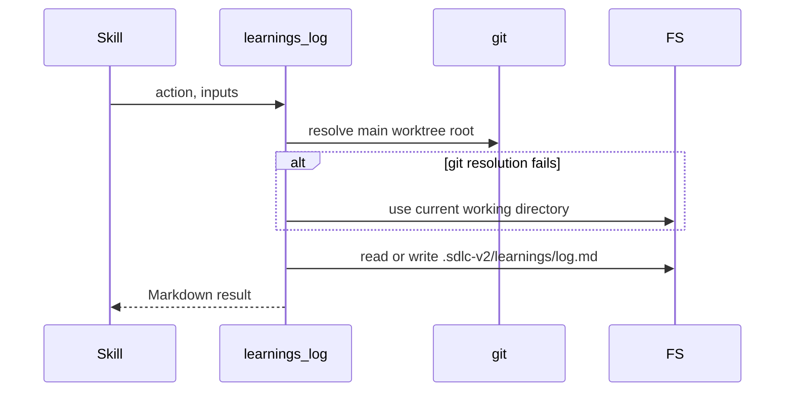

# tool-learnings-log Specification

## Purpose
The `learnings_log` MCP tool appends, reads, removes, and summarizes entries in the shared learnings log `.sdlc-v2/learnings/log.md` of the main git worktree. Skills such as `execute`, `harden`, `ship`, and `plan` call it instead of editing the file directly. Output follows docs/mcp-output-contract.md.

## Requirements

### Requirement: Actions and inputs
The tool SHALL select its operation from the `action` input and SHALL read only the inputs that action uses.

| Action | Required inputs | Optional inputs | Writes the log | Result |
|---|---|---|---|---|
| `append` | `entry` | `runId`, `branch` | yes | Adds one entry |
| `read` | none | `tailLines` | no | Returns log content |
| `remove` | `indices` | none | yes | Deletes entries, echoes them |
| `stats` | none | none | no | Returns aggregated counts in `stats` |

| Field | Type | Required | Encoding | Meaning |
|---|---|---|---|---|
| `action` | string (enum) | yes | plain text | `append`, `read`, `remove`, or `stats` |
| `entry` | string | for `append` | Markdown text | Entry block. No leading or trailing blank line. No blank line inside. |
| `tailLines` | integer | no | JSON number | For `read`: return only the last N lines. `0` returns the whole file. |
| `indices` | integer array | for `remove` | JSON array, e.g. `[1, 3]` | 1-indexed entry numbers. The header is not an entry. |
| `runId` | string | no | plain text | For `append`: execution run id used to tag the entry |
| `branch` | string | no | plain text | For `append`: branch name used in the tag. Ignored without `runId`. |

| Output field | Meaning |
|---|---|
| `ok` | `true` on success |
| `action` | Echo of the action run |
| `path` | Always `.sdlc-v2/learnings/log.md` (relative to the main worktree root) |
| `exists` | Whether the log file exists after the call |
| `changed` | `true` only for a successful `append` or `remove` |
| `content` | `read`: log text. `remove`: removed entries. Absent otherwise. |
| `next` | `append`: `Call action="read" to see the full log.` `remove`: `Call action="read" to verify the updated log contents.` Empty for `read` and `stats`. |
| `stats` | Only for `stats`: see "Stats counts" |

#### Scenario: Unknown action
- **WHEN** `action` is `"delete"`
- **THEN** the tool returns a `DomainError` whose message starts with `unknown learnings_log action "delete"`
- **AND** the message ends with `must be one of: append, read, remove, stats`

#### Scenario: Misspelled stats action
- **WHEN** `action` is `"stat"`
- **THEN** the tool returns a `DomainError` for an unknown action

### Requirement: Main worktree log location
The tool SHALL read and write the log at `<main-worktree-root>/.sdlc-v2/learnings/log.md`, even when called from a linked worktree.

Log location resolution on every call:

#### Scenario: Called from a feature worktree
- **WHEN** a skill calls the tool from a linked git worktree
- **THEN** the tool uses the log file under the main worktree root

#### Scenario: Root cannot be resolved
- **WHEN** main worktree resolution fails
- **AND** the current working directory cannot be read
- **THEN** the tool returns an `InfraError` with message starting `resolve project root:`

### Requirement: Append an entry
The `append` action SHALL add `entry`, trimmed of surrounding whitespace, as a new block separated from the previous content by exactly one blank line, followed by a newline.

- First use creates the parent directory and the file with header `# SDLC Execution Learnings`, then a blank line, then the entry.
- When the existing file does not end in a newline, the tool adds one before the blank line.
- Result: `ok: true`, `exists: true`, `changed: true`.

#### Scenario: First append creates the file
- **WHEN** `.sdlc-v2/learnings/log.md` does not exist
- **AND** `append` is called with `entry` `"## 2026-09-07 — setup: first entry"`
- **THEN** the file starts with `# SDLC Execution Learnings\n`
- **AND** the file contains the entry

#### Scenario: Second append
- **WHEN** `append` is called with `"## first"` and then with `"## second"`
- **THEN** the file contains `## first\n\n## second\n`

### Requirement: Run tag on appended entries
The `append` action SHALL prefix the entry with the line `<!-- sdlc:run=<runId> branch=<branch> -->` when `runId` is non-empty, and SHALL add no tag when `runId` is empty.

#### Scenario: Tagged entry
- **WHEN** `append` is called with `entry` `"## entry"`, `runId` `"20260912T100024"`, `branch` `"feat/ship-report-content-enrichment"`
- **THEN** the file contains `<!-- sdlc:run=20260912T100024 branch=feat/ship-report-content-enrichment -->\n## entry`

#### Scenario: Untagged entry
- **WHEN** `append` is called without `runId`
- **THEN** the file contains no `<!-- sdlc:run=` line for that entry

### Requirement: Append input validation
The `append` action SHALL reject an empty entry and an entry containing a blank line, without touching the file.

| Condition | Class | Message / Suggestion (short) |
|---|---|---|
| `entry` empty after trim | `DomainError` | `entry must not be empty` / provide a non-empty block |
| `entry` contains `\n\n` | `DomainError` | `entry must not contain a blank line ("\n\n"); blank lines delimit entries in the log` / use single newlines or split into separate appends |

#### Scenario: Whitespace-only entry
- **WHEN** `append` is called with `entry` `"   "`
- **THEN** the tool returns `DomainError` `entry must not be empty`

#### Scenario: Multi-paragraph entry
- **WHEN** `append` is called with `entry` `"## heading\n\nSecond paragraph"`
- **THEN** the tool returns a `DomainError` whose message contains `blank line`

### Requirement: Read the log
The `read` action SHALL return the log text in `content`, limited to the last `tailLines` lines when `tailLines` is greater than zero.

- `tailLines` > 0: the tool drops one trailing newline, keeps the last N lines, and joins them with newlines.
- `tailLines` 0 or absent: `content` is the whole file, unchanged.

#### Scenario: Log does not exist
- **WHEN** `read` is called and the log file does not exist
- **THEN** the tool returns `ok: true`, `exists: false`, empty `content`
- **AND** no error

#### Scenario: Tail of the log
- **WHEN** the log holds entries `"## one"` and `"## two"`
- **AND** `read` is called with `tailLines` 1
- **THEN** `content` contains `## two`
- **AND** `content` does not contain `## one`

### Requirement: Remove entries
The `remove` action SHALL delete the entries at `indices` and rewrite the file as the header block plus the kept entries, separated by blank lines.

- Entries are the blank-line-separated blocks after the first block; the first block is the header and is always kept.
- Index order does not matter: `[1, 3]` and `[3, 1]` remove the same entries.
- `content` returns the removed entries joined by one blank line.
- When every entry is removed, the file is the header line only: `# SDLC Execution Learnings\n`.
- Result: `ok: true`, `exists: true`, `changed: true`.

#### Scenario: Remove one entry
- **WHEN** the log holds `"## one"`, `"## two"`, `"## three"`
- **AND** `remove` is called with `indices` `[2]`
- **THEN** the file keeps the header, `## one`, and `## three`
- **AND** the file no longer contains `## two`

#### Scenario: Removed content is echoed
- **WHEN** `remove` is called with `indices` `[1, 3]` on `"## entry-alpha"`, `"## entry-beta"`, `"## entry-gamma"`
- **THEN** `content` contains `## entry-alpha` and `## entry-gamma`
- **AND** `content` does not contain `## entry-beta`

#### Scenario: Append after removing everything
- **WHEN** all entries were removed
- **AND** `append` is called with `"## after-remove"`
- **THEN** the file starts with `# SDLC Execution Learnings\n\n## after-remove\n`

### Requirement: Remove input validation
The `remove` action SHALL validate every index before writing, and SHALL leave the file unchanged when any check fails.

| Condition | Class | Message / Suggestion (short) |
|---|---|---|
| `indices` empty | `DomainError` | `indices must not be empty for action "remove"` / pass 1-indexed entry numbers |
| Log file missing | `DomainError` | `learnings log does not exist; nothing to remove` / call `read` first |
| Log has no entries (empty or header only) | `DomainError` | `learnings log has no entries to remove` / call `read` to verify |
| Index < 1 or > entry count | `DomainError` | `index <i> out of range; log has <n> entries` / retry with valid numbers |

#### Scenario: Zero index
- **WHEN** the log has 2 entries
- **AND** `remove` is called with `indices` `[0]`
- **THEN** the tool returns `DomainError` `index 0 out of range; log has 2 entries`

#### Scenario: Index beyond entry count
- **WHEN** the log has 2 entries
- **AND** `remove` is called with `indices` `[3]`
- **THEN** the tool returns a `DomainError` and the file is unchanged

#### Scenario: Empty log file
- **WHEN** the log file exists but is empty
- **AND** `remove` is called with `indices` `[1]`
- **THEN** the tool returns `DomainError` `learnings log has no entries to remove`

### Requirement: Stats counts
The `stats` action SHALL return a `stats` object that counts non-empty entries by inferred category and by inferred skill.

| `stats` field | Meaning |
|---|---|
| `totalEntries` | Number of non-empty entries (header excluded) |
| `byCategory` | Count per category. Category = run-tag branch text before the first `/` (whole branch when no `/`). No tag or empty branch = `uncategorized`. |
| `bySkill` | Count per skill. Skill = lowercased name from a `## <date> — <skill>: <title>` heading. No such heading = `unspecified`. |
| `topPatterns` | Recurring `Rule:` lessons; see "Stats top patterns" |
| `recentFailures` | Entries with category `fix` among the last 20 entries |
| `lastUpdated` | Log file modification time, UTC, RFC 3339 |

#### Scenario: Mixed entries
- **WHEN** the log holds `"## 2026-09-13 — execute: first lesson"` tagged with branch `fix/issue-1`, `"## 2026-09-14 — plan: second lesson"` tagged with branch `feat/new-thing`, and an untagged entry with no heading
- **THEN** `totalEntries` is 3
- **AND** `byCategory` is `fix: 1`, `feat: 1`, `uncategorized: 1`
- **AND** `bySkill` is `execute: 1`, `plan: 1`, `unspecified: 1`
- **AND** `lastUpdated` is set

#### Scenario: Log does not exist
- **WHEN** `stats` is called and the log file does not exist
- **THEN** the tool returns `ok: true`, `exists: false`
- **AND** `totalEntries` 0, empty `byCategory`, empty `bySkill`, empty `topPatterns`, `recentFailures` 0

### Requirement: Stats top patterns
The `stats` action SHALL mine a `Rule:` clause from the last line of each entry into `topPatterns`, merging patterns case-insensitively.

- Match is case-insensitive on `Rule:`; the pattern text is the rest of that line, trimmed.
- Pattern text longer than 240 characters is cut to 240 characters plus `...`.
- Each item: `pattern` (text of the first occurrence), `count`, `lastSeen` (latest first-ISO-date `YYYY-MM-DD` found in the matching entries).
- Sort: `count` descending, then `lastSeen` descending.
- At most 10 items.

#### Scenario: Same rule with different case
- **WHEN** entries dated `2026-09-10` and `2026-09-12` end with `Rule: always verify twice` and `Rule: Always verify twice`
- **AND** an entry dated `2026-09-11` ends with `Rule: check the plan file first`
- **THEN** `topPatterns` has 2 items
- **AND** the first item has `count` 2 and `lastSeen` `2026-09-12`
- **AND** the second item has `count` 1

### Requirement: Stats recent failures window
The `stats` action SHALL count `recentFailures` only over the 20 most recent entries.

#### Scenario: Old failure outside the window
- **WHEN** one entry tagged with branch `fix/old` is followed by 20 entries tagged `feat/filler`
- **THEN** `recentFailures` is 0

#### Scenario: New failure inside the window
- **WHEN** one more entry tagged with branch `fix/new` is appended
- **THEN** `recentFailures` is 1

### Requirement: File system errors
The tool SHALL return an `InfraError` when the log directory or file cannot be created, read, or written.

| Condition | Class | Message / Suggestion (short) |
|---|---|---|
| Directory create fails (`append`) | `InfraError` | `create learnings directory: <err>` / check write permission on `.sdlc-v2/learnings` |
| Read fails for a reason other than "not found" (any action) | `InfraError` | `read learnings log: <err>` / check read permission and that it is a regular file |
| Write fails (`append`, `remove`) | `InfraError` | `write learnings log: <err>` / check write permission and free disk space |

- Each suggestion ends by telling the caller to retry the same action.

#### Scenario: Log path is not readable
- **WHEN** reading `.sdlc-v2/learnings/log.md` fails with an error other than "not found"
- **THEN** the tool returns an `InfraError` with message starting `read learnings log:`
