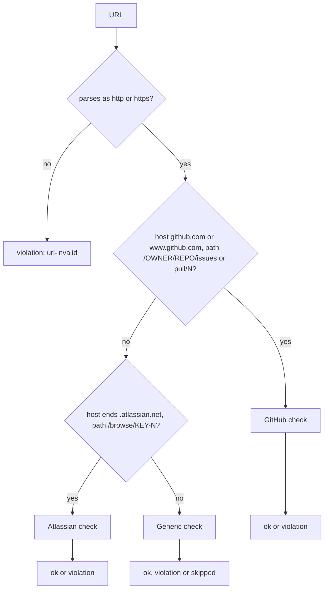

# tool-links-validate Specification

## Purpose
`links_validate` extracts every http(s) URL from one file and checks each one: GitHub issue/PR identity and existence, Atlassian Jira host match, and generic HTTP(S) reachability. Skills such as `commit` call it as a hard gate before publishing text that holds links. Output follows docs/mcp-output-contract.md.

## Requirements

### Requirement: Input fields
The tool SHALL accept the input fields below.

| Field | Type | Required | Encoding | Meaning |
|---|---|---|---|---|
| `file` | string | yes | plain text path, e.g. `/tmp/commit-msg.txt` | File to scan for URLs. |
| `offline` | bool | no | boolean, e.g. `false` | When `true`, skip network checks and run only offline checks. |

#### Scenario: file missing from input
- **WHEN** `file` is empty
- **THEN** the tool returns a `DomainError` with message `links_validate: file is required`

### Requirement: File resolution and errors
The tool SHALL resolve a relative `file` against the main worktree root and SHALL use an absolute `file` as given.

| Condition | Class | Message / Suggestion (short) |
|---|---|---|
| `file` is empty | `DomainError` | `links_validate: file is required` / pass the `file` field |
| File cannot be read | `DomainError` | `links_validate: file not found: <resolved path>` / check the path under the repository root |
| Main worktree root cannot be resolved | `InfraError` | `resolve project root: <err>` / run inside a git worktree with a valid `.sdlc-v2` project root |

#### Scenario: File does not exist
- **WHEN** `file` is `missing.md` and no such file exists under the main worktree root
- **THEN** the tool returns a `DomainError` whose message starts with `links_validate: file not found:`

### Requirement: URL extraction
The tool SHALL extract URLs line by line, clean them, and keep each distinct URL once with the 1-based line of its first occurrence, in order of first occurrence.

- Match pattern: `https?://` followed by characters other than whitespace, `)`, `]`, `>`, `"`, `'`.
- Trailing `.`, `,`, `;`, `:`, `!`, `?` are stripped.
- A URL never holds `)`: the match ends before the first `)`, even when the URL holds a `(`.
- A trailing `\r` on a line is ignored.

#### Scenario: Duplicates, punctuation and parentheses
- **WHEN** the file holds these lines, with `offline: true`:
  line 1 `See https://example.com/foo, and also https://example.com/foo again.`,
  line 2 `Also (https://example.com/bar) in parens.`,
  line 3 `Line3 https://example.com/baz.`
- **THEN** `results` holds exactly 3 entries, in this order
- **AND** they are `https://example.com/foo` at line `1`, `https://example.com/bar` at line `2`, `https://example.com/baz` at line `3`

#### Scenario: No URL in the file
- **WHEN** the file holds no `http://` or `https://` URL
- **THEN** `results` is empty

### Requirement: Result fields
The tool SHALL return one `results` entry per extracted URL with the fields below. It SHALL report link problems as `results` entries, never as tool errors.

| Field | Meaning |
|---|---|
| `results[].url` | The extracted URL |
| `results[].line` | 1-based line of the URL's first occurrence |
| `results[].status` | `ok`, `violation` or `skipped` |
| `results[].reason` | Reason code (see Reason codes); empty when none applies |
| `results[].detail` | Human-readable detail; may be empty |

#### Scenario: A violation is data
- **WHEN** the file holds a URL that fails its check
- **THEN** the tool returns without a tool error
- **AND** that URL's entry has `status` `violation`

### Requirement: URL classification
The tool SHALL classify each URL into exactly one class and SHALL run that class's check.

How one URL is classified and which status each check can produce:

| Class | Match rule |
|---|---|
| GitHub | Host `github.com` or `www.github.com` (case-insensitive); path `/<owner>/<repo>/issues/<n>` or `/<owner>/<repo>/pull/<n>` |
| Atlassian | Host ends with `.atlassian.net`; path `/browse/<KEY-N>` where KEY starts with `A`–`Z` then 1+ of `A`–`Z`, `0`–`9`, `_` |
| Generic | Any other `http`/`https` URL, including other GitHub and Atlassian paths |
| Invalid | Does not parse, or scheme is not `http`/`https` |

#### Scenario: GitHub file link is generic
- **WHEN** the URL is `https://github.com/acme/widgets/blob/main/README.md`
- **THEN** it gets the generic check

#### Scenario: Atlassian wiki link is generic
- **WHEN** the URL is `https://acme.atlassian.net/wiki/spaces`
- **THEN** it gets the generic check

### Requirement: GitHub issue and PR check
The tool SHALL compare a GitHub URL's owner and repo with the `origin` remote of the main worktree, and SHALL check existence with `gh` unless `offline` is `true`.

- Expected repo: from `git remote get-url origin`, resolved once per call.
- Owner and repo compare case-insensitively.
- Existence check: `gh issue view <n> -R <owner>/<repo> --json number` for `issues`, `gh pr view ...` for `pull`.
- When `origin` cannot be resolved, the identity check is skipped and only the existence check runs.

| Situation | `status` | `reason` | `detail` |
|---|---|---|---|
| Owner/repo differ from `origin` | `violation` | `github-context-mismatch` | `observed <owner>/<repo>, expected <owner>/<repo>` |
| Identity ok (or unknown), `offline: true` | `ok` | — | — |
| Identity ok (or unknown), `gh` view succeeds | `ok` | — | — |
| Identity ok (or unknown), `gh` view fails | `violation` | `github-not-found` | `gh` error text |

#### Scenario: Matching repo offline
- **WHEN** `origin` is `https://github.com/acme/widgets.git` and `offline` is `true`
- **AND** the URL is `https://github.com/acme/widgets/issues/1`
- **THEN** `status` is `ok`

#### Scenario: Other repo offline
- **WHEN** `origin` is `https://github.com/acme/widgets.git` and `offline` is `true`
- **AND** the URL is `https://github.com/other/repo/pull/5`
- **THEN** `status` is `violation` and `reason` is `github-context-mismatch`

### Requirement: Atlassian Jira check
The tool SHALL compare an Atlassian browse URL's host with the single Jira site cached under `~/.sdlc-cache/jira/`. This check SHALL run in both online and offline mode and needs no network.

- Cached site: the name of the only subdirectory of `~/.sdlc-cache/jira/`, with each `_` turned into `.` (e.g. `acme_atlassian_net` → `acme.atlassian.net`).
- Host compare is case-insensitive.

| Situation | `status` | `reason` | `detail` |
|---|---|---|---|
| More than one cached site directory | `violation` | `atlassian-site-ambiguous` | Multiple sites cached |
| No cache directory or no site directory | `violation` | `atlassian-site-mismatch` | `observed <host>, expected <none>` |
| Host differs from cached site | `violation` | `atlassian-site-mismatch` | `observed <host>, expected <site>` |
| Host equals cached site | `ok` | — | — |

#### Scenario: Matching site
- **WHEN** the only cached site is `acme.atlassian.net`
- **AND** the URL is `https://acme.atlassian.net/browse/PROJ-42`
- **THEN** `status` is `ok`

#### Scenario: Other site
- **WHEN** the only cached site is `acme.atlassian.net`
- **AND** the URL is `https://other.atlassian.net/browse/PROJ-42`
- **THEN** `status` is `violation` and `reason` is `atlassian-site-mismatch`

#### Scenario: Two cached sites
- **WHEN** `~/.sdlc-cache/jira/` holds `acme_atlassian_net` and `other_atlassian_net`
- **THEN** an Atlassian browse URL gets `reason` `atlassian-site-ambiguous`

### Requirement: Generic URL check
The tool SHALL skip skip-list hosts first, then skip all generic URLs when `offline` is `true`, and otherwise SHALL probe the URL over HTTP.

- Skip-list hosts: `linkedin.com`, `www.linkedin.com`, `x.com`, `www.x.com`, `twitter.com`, `www.twitter.com`, `medium.com`, `www.medium.com`.
- Probe: `HEAD` with header `User-Agent: sdlc-links-validator/1.0`, 5-second timeout, up to 10 redirects.
- On HTTP `405` or `501`, the probe retries once with `GET`.

| Situation | `status` | `reason` | `detail` |
|---|---|---|---|
| Host on skip-list (online or offline) | `skipped` | `skip-list` | — |
| `offline: true` | `skipped` | `offline` | — |
| Final HTTP status 200–399 | `ok` | — | — |
| Final HTTP status 400–499 | `violation` | `url-not-found` | `HTTP <code>` |
| Final HTTP status 500 or higher | `violation` | `url-server-error` | `HTTP <code>` |
| Request cannot be built or sent | `violation` | `url-unreachable` | Transport error text |

#### Scenario: Skip-list wins over offline
- **WHEN** `offline` is `true` and the URL is `https://linkedin.com/in/someone`
- **THEN** `status` is `skipped` and `reason` is `skip-list`

#### Scenario: Generic URL offline
- **WHEN** `offline` is `true` and the URL is `https://example.com/page`
- **THEN** `status` is `skipped` and `reason` is `offline`

#### Scenario: HEAD not allowed
- **WHEN** the server answers `HEAD` with `405` and `GET` with `200`
- **THEN** `status` is `ok`

#### Scenario: Not found
- **WHEN** the server answers `404`
- **THEN** `status` is `violation` and `reason` is `url-not-found`

#### Scenario: Connection refused
- **WHEN** the server port refuses the connection
- **THEN** `status` is `violation` and `reason` is `url-unreachable`

### Requirement: Reason codes
The tool SHALL use only the reason codes below.

| `reason` | `status` | Class |
|---|---|---|
| `url-invalid` | `violation` | Invalid |
| `github-context-mismatch` | `violation` | GitHub |
| `github-not-found` | `violation` | GitHub |
| `atlassian-site-ambiguous` | `violation` | Atlassian |
| `atlassian-site-mismatch` | `violation` | Atlassian |
| `skip-list` | `skipped` | Generic |
| `offline` | `skipped` | Generic |
| `url-not-found` | `violation` | Generic |
| `url-server-error` | `violation` | Generic |
| `url-unreachable` | `violation` | Generic |

#### Scenario: Mixed offline batch
- **WHEN** `offline` is `true` and the URLs are `https://linkedin.com/in/someone` then `https://example.com/page`
- **THEN** the first entry has `status` `skipped` with `reason` `skip-list`
- **AND** the second entry has `status` `skipped` with `reason` `offline`

### Requirement: Tool annotations
The tool SHALL declare the annotations below.

| Annotation | Value |
|---|---|
| Title | `Check documentation links` |
| ReadOnly | `true` |
| Idempotent | `true` |
| OpenWorld | `true` |

#### Scenario: Listing tools
- **WHEN** an MCP client lists tools
- **THEN** `links_validate` is marked read-only, idempotent and open-world
