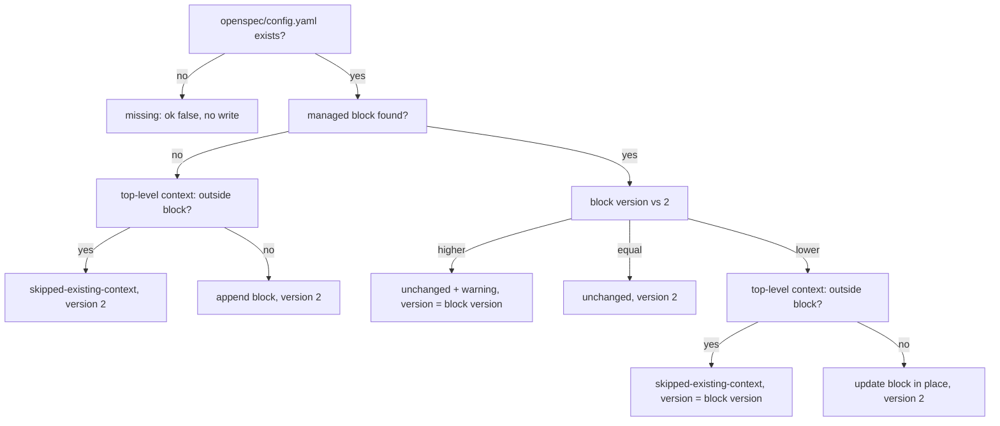

# tool-openspec-enrich Specification

## Purpose
`openspec_enrich` adds, updates, or removes an sdlc-managed `context:` block in `openspec/config.yaml` that points contributors to `/plan`, `/execute`, and `/ship`. The `setup` skill's `setup-openspec` sub-flow calls it. Output follows docs/mcp-output-contract.md.

## Requirements

### Requirement: Input fields
The tool SHALL accept the input fields below.

| Field | Type | Required | Encoding | Meaning |
|---|---|---|---|---|
| `change` | string | optional at call time; missing = `""` | plain text, e.g. `add-pr-labels` | OpenSpec change name to look up; its status is returned in `matchedChange`. |
| `remove` | bool | optional at call time; missing = `false` | boolean, e.g. `false` | Remove the managed block instead of adding or updating it. |

#### Scenario: Default call
- **WHEN** the caller passes `{}`
- **THEN** the tool runs in add/update mode

### Requirement: Output fields
The tool SHALL return the fields below.

| Field | Meaning |
|---|---|
| `ok` | `false` only when `openspec/config.yaml` is missing. |
| `action` | `append`, `update`, `unchanged`, `removed`, `missing`, or `skipped-existing-context`. |
| `version` | Managed-block version (see each action). The plugin ships version `2`. |
| `path` | Absolute path of `openspec/config.yaml`. |
| `changed` | `true` when the file was written. |
| `warning` | Set for `skipped-existing-context` and for a newer block; omitted otherwise. |
| `error` | `openspec/config.yaml not found` for `missing`; omitted otherwise. |
| `matchedChange` | `name`, `status`, `completedTasks`, `totalTasks` of the matched change; omitted when not found. |

#### Scenario: Output on append
- **WHEN** the block is appended
- **THEN** `ok` is `true`
- **AND** `action` is `append`
- **AND** `version` is `2`
- **AND** `changed` is `true`

### Requirement: Managed block format
The tool SHALL detect the managed block by a begin line matching `# BEGIN MANAGED BY sdlc-v2 (v<N>)` followed later by an end line matching `# END MANAGED BY sdlc-v2 (v<N>)`. It SHALL write this block:

```text
# BEGIN MANAGED BY sdlc-v2 (v2)
context: |
  SDLC workflow managed by sdlc-v2. Do not edit this block manually.
  To update: /setup --openspec-enrich. To remove: /setup --remove-openspec.

  Contributor workflow:
    1. /plan --from-openspec <change-name>  — create an implementation plan from the change
    2. /execute                              — execute the plan in waves
    3. /ship                                 — commit, review, version, and open a PR

  Do not invoke `openspec archive` directly — /ship handles archival
  as a conditional pipeline step after validation passes.
# END MANAGED BY sdlc-v2 (v2)
```

- A begin line with no end line after it counts as no block.

#### Scenario: Begin marker without end marker
- **WHEN** the file has `# BEGIN MANAGED BY sdlc-v2 (v1)` and no end marker
- **THEN** the tool treats the file as having no managed block

### Requirement: Add or update decision
In add/update mode the tool SHALL choose its action from the file state as shown below, and SHALL write the file only for `append` and `update`.

Decision path for one add/update call:



- `append` adds one newline separator (two when the file does not end in a newline), then the block and a trailing newline.
- `update` replaces the old block text in place; text before and after it is kept.
- Newer-block warning: `Managed block is at v<N>, plugin ships v2. Use --remove to downgrade.`

#### Scenario: Append to plain file
- **WHEN** `openspec/config.yaml` is `name: test-project\n`
- **THEN** `action` is `append`
- **AND** the file contains `BEGIN MANAGED BY sdlc-v2`

#### Scenario: Second call is a no-op
- **WHEN** the tool runs twice on the same file
- **THEN** the second call returns `action: "unchanged"` and `changed: false`

#### Scenario: Older block updated
- **WHEN** the file has a complete managed block at `v1` and no other top-level `context:` key
- **THEN** `action` is `update`
- **AND** the block now starts with `# BEGIN MANAGED BY sdlc-v2 (v2)`

#### Scenario: Newer block left alone
- **WHEN** the file has a complete managed block at `v3`
- **THEN** `action` is `unchanged`
- **AND** `version` is `3`
- **AND** `warning` is `Managed block is at v3, plugin ships v2. Use --remove to downgrade.`

### Requirement: Existing context key is never duplicated
The tool SHALL NOT append or update the block when the file has a line starting with `context` followed by optional spaces and `:` outside the managed block. It SHALL return `action: "skipped-existing-context"`, `changed: false`, and a warning.

- Warning when no block exists: `Top-level context: key already present in openspec/config.yaml. Refusing to inject a duplicate. Manually fold sdlc-utilities guidance into your existing context: value, then re-run --openspec-enrich.`
- Warning when an older block exists: `Top-level context: key already present outside the managed block in openspec/config.yaml. Refusing to update — a duplicate context: key would result. Manually fold sdlc-utilities guidance into your existing context: value, then re-run --openspec-enrich.`
- This repo's own `openspec/config.yaml` has a hand-written `context:` key, so the tool returns this action here.

#### Scenario: Hand-written context key
- **WHEN** `openspec/config.yaml` is `name: test-project\ncontext: existing stuff\n`
- **THEN** `action` is `skipped-existing-context`
- **AND** `warning` is non-empty
- **AND** the file is unchanged

### Requirement: Remove mode
With `remove: true` the tool SHALL delete the managed block when present and SHALL always return `action: "removed"`.

- Block found: text before the block keeps one trailing newline, leading newlines after the block are dropped, `changed: true`.
- Block not found: file unchanged, `changed: false`.
- Missing file still returns `action: "missing"`.

#### Scenario: Remove existing block
- **WHEN** a block was appended earlier
- **AND** the tool runs with `remove: true`
- **THEN** `action` is `removed`
- **AND** `changed` is `true`
- **AND** the file no longer contains `BEGIN MANAGED BY sdlc-v2`

#### Scenario: Remove with no block
- **WHEN** the file has no managed block
- **AND** the tool runs with `remove: true`
- **THEN** `action` is `removed`
- **AND** `changed` is `false`

### Requirement: Missing config file
The tool SHALL return a normal result, not a tool error, when `openspec/config.yaml` does not exist.

- `ok: false`, `action: "missing"`, `changed: false`, `error: "openspec/config.yaml not found"`, `version: 2`.

#### Scenario: No OpenSpec init
- **WHEN** `openspec/config.yaml` does not exist
- **THEN** `ok` is `false`
- **AND** `action` is `missing`

### Requirement: Change lookup
When `change` is non-empty, the tool SHALL look up active OpenSpec changes and SHALL set `matchedChange` to the first change whose name matches `change` case-insensitively. Lookup failure SHALL be silent.

- `matchedChange` is returned for every action, including `missing`.
- If the lookup fails or finds no match, `matchedChange` is omitted and the action is unaffected.

#### Scenario: Case-insensitive match
- **WHEN** `change` is `Add-PR-Labels` and an active change `add-pr-labels` exists
- **THEN** `matchedChange.name` is `add-pr-labels`

### Requirement: Errors and project root
The tool SHALL resolve the project root to the main worktree root with no fallback, and SHALL return an `InfraError` for filesystem failures.

| Condition | Class | Message / Suggestion (short) |
|---|---|---|
| Main worktree root cannot be resolved | `InfraError` | `resolve project root: <cause>` / run inside a git worktree, then retry |
| `openspec/config.yaml` cannot be read | `InfraError` | `read <path>: <cause>` / check read permission |
| Write fails on append, update, or remove | `InfraError` | `write <path>: <cause>` / check write permission, then retry |

- Annotations: `Title: "Write OpenSpec config block"`, `ReadOnly: false`, `Destructive: true`, `Idempotent: true`, `OpenWorld: false`.

#### Scenario: Outside a git worktree
- **WHEN** the tool runs outside any git worktree
- **THEN** it returns an `InfraError` starting `resolve project root:`
