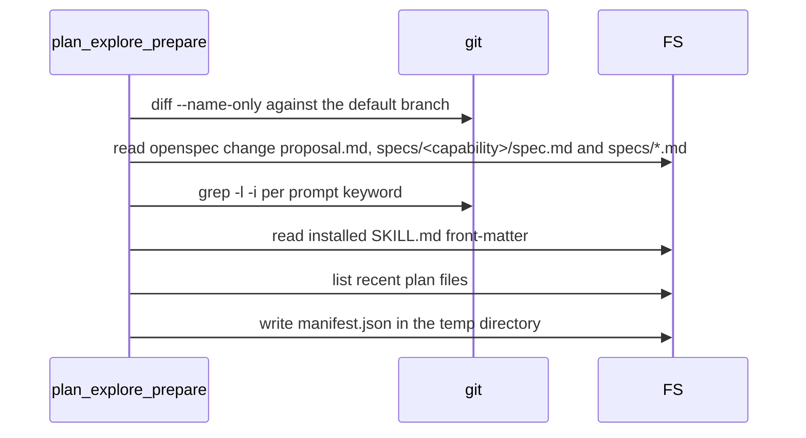

# tool-plan-explore-prepare Specification

## Purpose
`plan_explore_prepare` is an internal MCP tool that runs the plan skill's discovery pass and writes a `manifest.json` into a fresh temp directory. `plan_prepare` embeds the same discovery pass as its `explorePack` field; this tool runs it standalone. Output follows docs/mcp-output-contract.md.

## Requirements

### Requirement: Registration and annotations
The tool SHALL be registered as `plan_explore_prepare`, marked "INTERNAL — called by sdlc skills only", with annotations `ReadOnly: true`, `Idempotent: true`, `OpenWorld: false`.

| Annotation | Value |
|---|---|
| Title | `Prepare plan exploration pack` |
| ReadOnly | `true` |
| Idempotent | `true` |
| OpenWorld | `false` |

#### Scenario: Tool is listed with its annotations
- **WHEN** an MCP client lists the server's tools
- **THEN** `plan_explore_prepare` is listed with title `Prepare plan exploration pack`
- **AND** its annotations are `ReadOnly: true`, `Idempotent: true`, `OpenWorld: false`

### Requirement: Input fields
The tool SHALL accept two optional plain-text input fields and SHALL treat an empty value as "not given".

| Field | Type | Required | Encoding | Meaning |
|---|---|---|---|---|
| `fromOpenspec` | string | no | plain text | OpenSpec change name to scope discovery to. Empty when not planning from a change. |
| `userPrompt` | string | no | plain text | The user's planning request. Source for keyword grep and the web-research signal. |

#### Scenario: Call with no input
- **WHEN** `plan_explore_prepare` is called with `fromOpenspec` and `userPrompt` both empty
- **THEN** the manifest has `fromOpenspec: null` and `userPromptLength: 0`
- **AND** `webResearchSignal` is `false`

### Requirement: Output is the manifest path only
On success the tool SHALL return exactly one output field, `manifestPath`, naming a `manifest.json` file that exists on disk.

| Field | Meaning |
|---|---|
| `manifestPath` | Absolute path to `<outDir>/manifest.json` |

#### Scenario: Successful call
- **WHEN** `plan_explore_prepare` runs inside a git repository
- **THEN** the output has exactly one field, `manifestPath`
- **AND** the file at `manifestPath` exists and is valid JSON

### Requirement: Fresh temp directory per call
Each call SHALL create a new directory under the OS temp directory named `sdlc-explore-<branch-slug>-<random>` and SHALL write `manifest.json` inside it. The tool SHALL NOT delete this directory; the caller owns cleanup.

- `<branch-slug>` is the current branch with every character outside `[a-zA-Z0-9-]` replaced by `-`.
- `<branch-slug>` is `unknown` when the current branch cannot be read.

#### Scenario: Temp directory naming on branch main
- **WHEN** the tool runs on branch `main`
- **THEN** the manifest's parent directory basename matches `^sdlc-explore-main-[A-Za-z0-9]+$`
- **AND** `manifestPath` is inside `outDir`

### Requirement: Manifest content
The tool SHALL write `manifest.json` as indented JSON with the fields below.

| Field | Meaning |
|---|---|
| `version` | Always `1` |
| `timestamp` | UTC time of the call, RFC 3339 |
| `projectRoot` | Absolute path of the main worktree |
| `fromOpenspec` | The `fromOpenspec` input, or `null` when empty |
| `userPromptLength` | Length of `userPrompt` in bytes |
| `webResearchSignal` | `true` when the prompt suggests external research (see below) |
| `scopeHintCount` | Number of entries in `scopeHintFiles` |
| `scopeHintFiles` | Candidate files, max 30 (see below) |
| `skillRegistry` | Up to 12 `{skill, frontmatter}` samples of installed skills |
| `recentPlans` | Up to 20 recent plan file names |
| `outDir` | The temp directory holding the manifest |

#### Scenario: Prompt length is recorded
- **WHEN** the tool is called with `userPrompt: "fix the login bug"`
- **THEN** the manifest has `userPromptLength: 17`

#### Scenario: Project root is the main worktree
- **WHEN** the tool runs in a repository at `<repo>`
- **THEN** the manifest has `projectRoot: "<repo>"`

### Requirement: Scope-hint file discovery
The tool SHALL build `scopeHintFiles` by merging three sources in priority order, dropping duplicates and empty names, and stopping at 30 entries.

Discovery calls made for one manifest, in order:

| Order | Source | Rule |
|---|---|---|
| 1 | git scope | `git diff --name-only <default>...HEAD`. Default branch is `origin/HEAD`, else `main`, else `master`. No default branch or a failed diff gives no files. |
| 2 | OpenSpec paths | Backtick-quoted relative paths with a 1–10 letter extension in `openspec/changes/<fromOpenspec>/proposal.md`, in each `specs/<capability>/spec.md` (one directory level only), and in any top-level `specs/*.md`. Paths starting with `/` are skipped. |
| 3 | keyword grep | `git grep -l -i <token>` per token. Tokens are lowercase alphanumeric runs longer than 2 characters, not stopwords, unique, max 8. A non-zero `git grep` exit means "no matches". |

#### Scenario: Unsafe or missing change name
- **WHEN** `fromOpenspec` is an unsafe change name (for example `..`) or its change directory does not exist
- **THEN** the OpenSpec source contributes no files
- **AND** the call still succeeds

#### Scenario: Paths from a capability spec
- **WHEN** `fromOpenspec` is `add-widget` and `openspec/changes/add-widget/specs/widget/spec.md` mentions `` `internal/widget/render.go` ``
- **THEN** `scopeHintFiles` holds `internal/widget/render.go`
- **AND** a path mentioned only in `specs/deep/nested/spec.md` is not in `scopeHintFiles`

#### Scenario: Scope hints are capped
- **WHEN** the three sources together yield more than 30 distinct files
- **THEN** `scopeHintFiles` holds the first 30 in priority order
- **AND** `scopeHintCount` is `30`

### Requirement: Web-research signal
The tool SHALL set `webResearchSignal` to `true` when the non-empty `userPrompt` contains a research phrase or an external-technology token, and `false` otherwise.

| Trigger | Values |
|---|---|
| Phrase (case-insensitive) | `best practice`, `recommended`, `industry standard`, `state of the art`, `compare alternatives`, `alternatives to` |
| Token | `oauth`, `oauth2`, `openid`, `saml`, `jwt`, `kafka`, `redis`, `kubernetes`, `terraform`, `react`, `vue`, `angular`, `postgres`, `mongodb`, `graphql`, `grpc`, `websocket` |

#### Scenario: Technology token in prompt
- **WHEN** `userPrompt` is `"add OAuth2 login"`
- **THEN** `webResearchSignal` is `true`

#### Scenario: Internal refactor prompt
- **WHEN** `userPrompt` is `"investigate the widget rendering pipeline"`
- **THEN** `webResearchSignal` is `false`

### Requirement: Skill registry and recent plans samples
The tool SHALL sample context from the user's machine without failing the call when a source is missing.

- `skillRegistry`: front-matter blocks of `~/.claude/plugins/<plugin>/skills/<skill>/SKILL.md`, max 12.
- `recentPlans`: `.md` file names, newest modification time first, max 20.
- Plans directory order: project `.claude/settings.json` `plansDirectory`, then `~/.claude/settings.json` `plansDirectory`, then `~/.claude/plans`.
- The first plans directory that can be listed wins, even when it holds no `.md` files.

#### Scenario: No plugins and no plans directory
- **WHEN** `~/.claude/plugins` and every plans directory candidate are absent
- **THEN** `skillRegistry` is `[]` and `recentPlans` is `[]`
- **AND** the call succeeds

### Requirement: Error cases
The tool SHALL return an `InfraError` when it cannot resolve the repository roots or cannot produce the manifest.

| Condition | Class | Message / Suggestion (short) |
|---|---|---|
| Main worktree cannot be resolved | `InfraError` | `resolve main root: <cause>` / run from inside a git repository |
| Active worktree cannot be resolved | `InfraError` | `resolve active root: <cause>` / run from inside a git checkout |
| Temp directory or manifest write fails | `InfraError` | `plan-explore: <cause>` (or `plan-explore: failed to produce manifest`) / check the OS temp directory is writable |

#### Scenario: Called outside a git repository
- **WHEN** `plan_explore_prepare` runs where `git worktree list` fails
- **THEN** it returns an `InfraError` whose message starts with `resolve main root:`

#### Scenario: Temp directory not writable
- **WHEN** the OS temp directory cannot hold a new directory
- **THEN** it returns an `InfraError` whose message starts with `plan-explore:`
