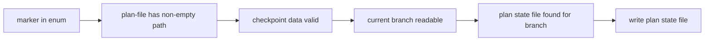

# tool-plan-mark Specification

## Purpose
`plan_mark` is an internal MCP tool the plan skill calls to record progress in the current branch's plan state file: integrity markers, structured results, and the step checkpoint used for resume. Output follows docs/mcp-output-contract.md.

## Requirements

### Requirement: Registration and annotations
The tool SHALL be registered as `plan_mark`, marked "INTERNAL — called by sdlc skills only", with annotations `ReadOnly: true`, `Idempotent: false`, `OpenWorld: false`.

| Annotation | Value |
|---|---|
| Title | `Record plan progress marker` |
| ReadOnly | `true` |
| Idempotent | `false` |
| OpenWorld | `false` |

#### Scenario: Tool is listed with its annotations
- **WHEN** an MCP client lists the server's tools
- **THEN** `plan_mark` is listed with title `Record plan progress marker`
- **AND** its `marker` input declares all 9 marker names as a JSON-schema enum

### Requirement: Input and output fields
The tool SHALL accept the input fields below and SHALL return the output fields below on success.

| Field | Type | Required | Encoding | Meaning |
|---|---|---|---|---|
| `marker` | string enum | yes | plain text | One of `plan-file`, `skillInvoked`, `guardrailsEvaluated`, `critiqueRan`, `done`, `guardrailResults`, `criticalDecisions`, `checkpoint`, `review-round` |
| `path` | string | only for `plan-file` | plain text | Plan document path to record |
| `data` | object | only for `checkpoint` and `review-round` | JSON | Payload for `guardrailResults`, `criticalDecisions`, `checkpoint` and `review-round`; ignored otherwise |

| Field | Meaning |
|---|---|
| `ok` | `true` on success |
| `marker` | The marker that was written |
| `path` | Path of the plan state file that was written |
| `next` | Set only for `checkpoint` |
| `warnings` | Set only for `done` when the history append failed |

#### Scenario: Successful timestamp marker
- **WHEN** `plan_mark({marker: "critiqueRan"})` succeeds
- **THEN** the output has `ok: true`, `marker: "critiqueRan"` and `path` set to the plan state file
- **AND** `next` is empty

### Requirement: Validation order
The tool SHALL validate in a fixed order and SHALL stop at the first failure without writing the plan state file.

Order of checks before any state write:

#### Scenario: Bad checkpoint data with no plan state file
- **WHEN** `plan_mark({marker: "checkpoint"})` is called with no `data` on a branch that has no plan state file
- **THEN** it returns the `DomainError` `checkpoint needs data {step, iteration, expectedWriters}`
- **AND** it does not report the missing plan state file

### Requirement: Plan state file lookup
The tool SHALL write to the newest `plan-<branch-slug>-<YYYYMMDDTHHmmssZ>.json` file in `<main-worktree>/.sdlc-v2/runs/`, chosen by the timestamp in the file name, where `<branch-slug>` matches the current branch exactly. Each write SHALL remove the branch's other `plan-<branch-slug>-*.json` files.

- The branch is read from the active worktree.
- The state file always lives under the main worktree.
- A file of another branch whose slug starts with this slug (for example `plan-feat-x-*` on branch `feat`) is never selected or changed.

#### Scenario: Exact slug match
- **WHEN** branch `feat` has `plan-feat-20260929T110000Z.json` and a newer `plan-feat-x-20260929T120000Z.json` exists
- **THEN** `plan_mark` writes `plan-feat-20260929T110000Z.json`
- **AND** `plan-feat-x-20260929T120000Z.json` stays byte-identical

#### Scenario: Repeated marks keep one file
- **WHEN** `plan_prepare` created the branch's state file and `plan_mark` is then called three times
- **THEN** exactly one `plan-<branch-slug>-*.json` file exists for the branch

#### Scenario: No plan state file
- **WHEN** `plan_mark` is called on a branch where `plan_prepare` never ran
- **THEN** it returns a `DomainError` `no plan state file found for branch "<branch>"; run plan_prepare first`

### Requirement: Timestamp markers
For `plan-file`, `skillInvoked`, `guardrailsEvaluated`, `critiqueRan` and `done`, the tool SHALL set `planIntegrity.<key>` to the current UTC time (RFC 3339) and SHALL ignore `data`.

| Marker | `planIntegrity` key | Extra effect |
|---|---|---|
| `plan-file` | `planFile` | sets top-level `planFilePath` to `path` |
| `skillInvoked` | `skillInvoked` | none |
| `guardrailsEvaluated` | `guardrailsEvaluated` | none |
| `critiqueRan` | `critiqueRan` | none |
| `done` | `done` | appends a history record (see below) |

#### Scenario: plan-file records the path
- **WHEN** `plan_mark({marker: "plan-file", path: "plans/my-plan.md"})` succeeds and that file does not exist
- **THEN** the state file has `planIntegrity.planFile` set to a timestamp
- **AND** `planFilePath` is `plans/my-plan.md`

#### Scenario: Data passed to a timestamp marker
- **WHEN** `plan_mark({marker: "guardrailsEvaluated", data: {results: [...]}})` is called
- **THEN** `planIntegrity.guardrailsEvaluated` is set to a timestamp
- **AND** no `guardrailResults` key is added

### Requirement: Append-only structured markers
For `guardrailResults` and `criticalDecisions`, the tool SHALL append the array in `data` to a top-level state key of the same name and SHALL NOT change `planIntegrity`.

| Marker | Array read from | Entry shape |
|---|---|---|
| `guardrailResults` | `data.results` | `{id, status, detail}` |
| `criticalDecisions` | `data.decisions` | `{key, choice, rejected, reason, at}` |

- A missing or non-array payload appends nothing; the call still succeeds.
- `rejected` is an array of `{option, why}`; a missing `rejected` is stored as `[]`.
- `at` is set by the tool to the call time, RFC 3339 UTC; a caller value is ignored.

#### Scenario: Two guardrailResults calls
- **WHEN** `plan_mark({marker: "guardrailResults", data: {results: [A]}})` is followed by the same call with `[B]`
- **THEN** the state key `guardrailResults` is `[A, B]`
- **AND** `planIntegrity` is unchanged

#### Scenario: Decision with rejected alternatives
- **WHEN** `plan_mark({marker:"criticalDecisions", data:{decisions:[{key:"k", choice:"merge", rejected:[{option:"rebase", why:"rewrites SHAs"}], reason:"r"}]}})` is called
- **THEN** the stored entry has `rejected` `[{option:"rebase", why:"rewrites SHAs"}]` and an `at` timestamp

#### Scenario: Decision without rejected
- **WHEN** a `criticalDecisions` entry has no `rejected`
- **THEN** the stored entry has `rejected: []`

### Requirement: Checkpoint marker replaces the progress checkpoint
For `checkpoint`, the tool SHALL store `{step, iteration, expectedWriters, updatedAt}` at the top-level `checkpoint` key, replacing any previous value.

| `data` key | Rule |
|---|---|
| `step` | Required. One of `0`, `1`, `2`, `3`, `4`, `5`, `6`, `6.5`, `6.6`, `7` (strings) |
| `iteration` | Optional whole number `>= 0`; default `0` |
| `expectedWriters` | Optional JSON array, max 32 entries, each matching `^[A-Za-z0-9][A-Za-z0-9._-]{0,63}$` |
| any other key | Rejected |

#### Scenario: Second checkpoint replaces the first
- **WHEN** a checkpoint with `step: "2"` is followed by one with `step: "3"`, `iteration: 1`, `expectedWriters: ["lane-static-structural-r1", "lane-content-coverage-r1"]`
- **THEN** `checkpoint` is a single object with `step: "3"` and those two writers
- **AND** `checkpoint.updatedAt` is a non-empty timestamp

### Requirement: Checkpoint data errors
The tool SHALL reject invalid checkpoint `data` with a `DomainError` that has a non-empty suggestion, and SHALL leave the plan state file byte-identical.

| Condition | Class | Message / Suggestion (short) |
|---|---|---|
| `data` missing or empty | `DomainError` | `checkpoint needs data {step, iteration, expectedWriters}` / `call plan_mark with data {step:"3", iteration:1}` |
| Unknown key | `DomainError` | `checkpoint data has unknown key "<k>"` / remove it |
| `step` missing or not in the list | `DomainError` | `checkpoint step "<s>" is not valid — valid steps: 0, 1, 2, 3, 4, 5, 6, 6.5, 6.6, 7` |
| `iteration` negative, fractional or not a number | `DomainError` | `checkpoint iteration must be an integer >= 0` |
| `expectedWriters` not an array | `DomainError` | `checkpoint expectedWriters must be a JSON array of writer IDs` |
| `expectedWriters` over 32 entries | `DomainError` | `checkpoint expectedWriters has <n> entries, max 32` / pass only the current fan-out |
| An entry fails the writer ID pattern | `DomainError` | `checkpoint expectedWriters[<i>] "<id>" is not a valid writer ID` |

#### Scenario: Step outside the list
- **WHEN** `plan_mark({marker: "checkpoint", data: {step: "9"}})` is called
- **THEN** it returns a `DomainError` containing `checkpoint step "9" is not valid`
- **AND** the plan state file is unchanged

#### Scenario: Too many writers
- **WHEN** `expectedWriters` has 33 entries
- **THEN** it returns a `DomainError` containing `checkpoint expectedWriters has 33 entries, max 32`

### Requirement: Checkpoint next text
Only the `checkpoint` marker SHALL return `next`. The tool SHALL read the `[planStyle]` config section fresh on every checkpoint call to build it.

| Condition | `next` text |
|---|---|
| Always | `Checkpoint saved at step <s>. Continue step <s>.` |
| `step` is `5` and `iteration` equals the review-loop limit (5) | append ` This is review round 5 of 5, the last round. If blocking issues remain after it, ask the user with AskUserQuestion; do not start round 6.` |
| `[planStyle].instructions` has entries | append a new line `Custom plan instructions (follow them in this step):`, then one line `<n>. <instruction>` per entry |
| `[planStyle]` cannot be read | append ` Warning: Failed to read planStyle config: <cause> — custom plan instructions could not be loaded; fix local.toml.` |

#### Scenario: Instructions added between calls
- **WHEN** `.sdlc-v2/local.toml` gains two `[planStyle].instructions` entries `A` and `B` after a first checkpoint call
- **THEN** the next checkpoint call's `next` ends with `Custom plan instructions (follow them in this step):\n1. A\n2. B`

#### Scenario: Last review round
- **WHEN** `plan_mark({marker: "checkpoint", data: {step: "5", iteration: 5}})` succeeds
- **THEN** `next` contains `This is review round 5 of 5, the last round.`

#### Scenario: Earlier review round
- **WHEN** `plan_mark({marker: "checkpoint", data: {step: "5", iteration: 4}})` succeeds
- **THEN** `next` does not contain `the last round`

#### Scenario: Non-checkpoint marker
- **WHEN** `plan_mark({marker: "critiqueRan"})` succeeds
- **THEN** `next` is empty

### Requirement: Plan timing refresh
On every successful write, the tool SHALL refresh the top-level `planTiming` object `{startedAt, lastModifiedAt, durationMs}` from `planIntegrity.skillInvoked` and the plan file's modification time.

- `lastModifiedAt` is the plan file's modification time, not the time of the call.
- A relative `planFilePath` is resolved against the active worktree root and stored as an absolute, cleaned path.
- When `skillInvoked` or `planFilePath` is missing, or the plan file cannot be stat'ed, `planTiming` and `planFilePath` keep their previous values.
- Timing problems never fail the call.

#### Scenario: Relative plan path is normalized
- **WHEN** `planFilePath` is `docs/plan.md` and that file exists in the active worktree
- **THEN** after any marker call `planFilePath` is the absolute path of that file
- **AND** `planTiming.lastModifiedAt` equals the file's modification time

#### Scenario: Plan file disappears
- **WHEN** the plan file cannot be stat'ed during a marker call
- **THEN** `planTiming` keeps its previous value
- **AND** the call returns `ok: true`

### Requirement: Done marker history record
For `done`, after the state write the tool SHALL append one JSON line to `<main-worktree>/.sdlc-v2/history/runs.jsonl` when `planFilePath` and `planTiming` are both set.

| Record field | Value |
|---|---|
| `ts` | Time of the call |
| `skill` | `plan` |
| `branch` | Current branch |
| `outcome` | `done` |
| `duration_ms` | `planTiming.durationMs` |
| `plan_file` | `planFilePath` |
| `started_at` / `last_modified_at` | From `planTiming` |

- No record is appended when `planFilePath` or `planTiming` is missing.
- Each `done` call appends a new record; earlier records are kept.

#### Scenario: History append fails
- **WHEN** the `done` marker is saved but writing `runs.jsonl` fails
- **THEN** the output has `ok: true`
- **AND** `warnings` holds `plan timing not saved to history: <cause>`

#### Scenario: Done called twice
- **WHEN** `done` is called twice for the same run
- **THEN** `runs.jsonl` has two `skill: "plan"` records, the second one newer

### Requirement: Error cases
The tool SHALL return these errors in addition to the checkpoint data errors.

| Condition | Class | Message / Suggestion (short) |
|---|---|---|
| Main worktree cannot be resolved | `InfraError` | `resolve main root: <cause>` / run inside a git repository |
| Active worktree cannot be resolved | `InfraError` | `resolve active root: <cause>` / run inside a git working tree |
| `marker` not in the enum | `DomainError` | `unknown marker "<m>"; must be one of: <sorted list>` / use the exact, case-sensitive name |
| `plan-file` with blank `path` | `DomainError` | `marker "plan-file" requires a non-empty path` |
| Current branch cannot be read (git fails in the active worktree) | `InfraError` | `could not determine current branch` / run from inside a git repository or worktree |
| State file lookup fails | `InfraError` | `find plan state file: <cause>` / check read permission |
| No state file for the branch | `DomainError` | `no plan state file found for branch "<branch>"; run plan_prepare first` / stay on the branch `plan_prepare` ran on |
| State file write fails | `InfraError` | `write plan state file: <cause>` / check write permission and disk space |

#### Scenario: Not a git repository
- **WHEN** `plan_mark({marker: "guardrailsEvaluated"})` runs in a directory that is not a git repository
- **THEN** it returns `InfraError` `could not determine current branch`
- **AND** the suggestion says to run from inside a git repository or worktree

#### Scenario: Detached HEAD
- **WHEN** `plan_mark` runs on a detached HEAD
- **THEN** the branch reads as `HEAD`, not as a branch error
- **AND** with no plan run for `HEAD` it returns the `no plan state file found for branch "HEAD"` error

#### Scenario: Unknown marker
- **WHEN** `plan_mark({marker: "not-a-real-marker"})` is called
- **THEN** it returns a `DomainError` starting with `unknown marker "not-a-real-marker"; must be one of:`

#### Scenario: plan-file without a path
- **WHEN** `plan_mark({marker: "plan-file", path: ""})` is called
- **THEN** it returns the `DomainError` `marker "plan-file" requires a non-empty path`

### Requirement: Plan run survives the done marker
After `planIntegrity.done` is set, the plan run state file and its `<runId>.evidence/` dir SHALL stay on disk until ship's `cleanup-pipeline` deletes them after the report, or until GC removes them by TTL. No Stop hook deletes them.

- A run with `planIntegrity.done` set is never selected as the active plan run.

#### Scenario: Stop after planning
- **WHEN** `plan_mark({marker:"done"})` is called and the session then stops
- **THEN** `.sdlc-v2/runs/plan-<slug>-<ts>.json` and `.sdlc-v2/runs/plan-<slug>-<ts>.evidence/` still exist

#### Scenario: Done run is not resumed
- **WHEN** the only plan run for the branch has `planIntegrity.done` set and `plan_prepare` runs
- **THEN** a new plan run is created

### Requirement: Review-round marker
The `review-round` marker SHALL store one row of `reviewRounds` in the plan state with `round`, `mergedStatus`, `found`, `fixed`, and `lenses`. A row with the same `round` SHALL be replaced. Rows SHALL stay sorted by `round`. The marker SHALL return no `next`.

#### Scenario: First call for a round
- **WHEN** `plan_mark({marker: "review-round", data: {round: 1, mergedStatus: "Approved", found: 0, fixed: 0, lenses: [{name: "all", verdict: "Approved"}]}})` succeeds
- **THEN** the plan state has one `reviewRounds` row with `round: 1`
- **AND** the output has no `next`

#### Scenario: Replayed round
- **WHEN** `reviewRounds` has a row with `round: 2, fixed: 0`
- **AND** a `review-round` call sends `round: 2, fixed: 2`
- **THEN** `reviewRounds` has one row with `round: 2` and `fixed: 2`

### Requirement: Review-round data errors
The tool SHALL reject an invalid `review-round` payload with a `DomainError` that has a `Suggestion`, and SHALL not change the plan state file.

#### Scenario: Bad status
- **WHEN** a `review-round` call sends `mergedStatus: "ok"`
- **THEN** the tool returns a `DomainError` whose Suggestion contains `Approved` and `Issues Found`
- **AND** the plan state file bytes do not change

#### Scenario: Unknown key
- **WHEN** a `review-round` call sends the key `at`
- **THEN** the `DomainError` names `at`
- **AND** its Suggestion lists `round, mergedStatus, found, fixed, lenses`

#### Scenario: Bad round number
- **WHEN** a `review-round` call sends `round: 0`
- **THEN** the tool returns a `DomainError`

#### Scenario: Bad counts
- **WHEN** a `review-round` call sends `found: -1`
- **THEN** the tool returns a `DomainError`

#### Scenario: Too many lenses
- **WHEN** a `review-round` call sends 33 lenses
- **THEN** the tool returns a `DomainError`

#### Scenario: Too many rounds
- **WHEN** the plan state has 20 rounds and a call sends `round: 21`
- **THEN** the tool returns a `DomainError`
