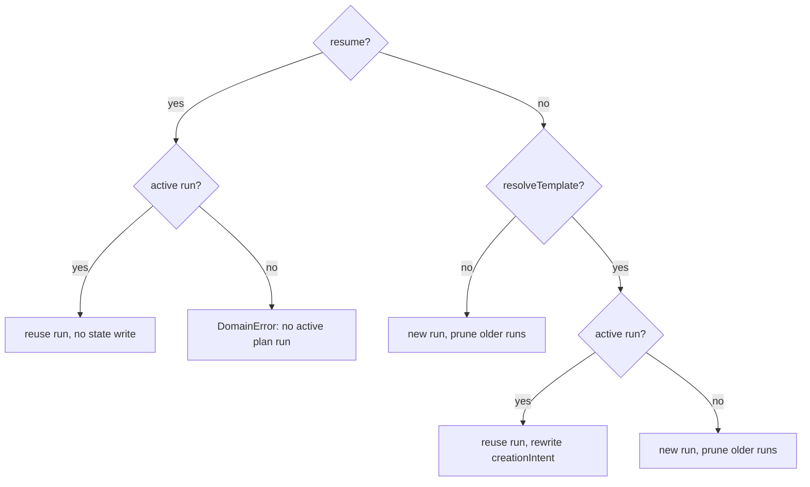

# tool-plan-prepare Specification

## Purpose
`plan_prepare` is the plan skill's mandatory state and config load: it starts or reuses a plan run and returns OpenSpec context, guardrails, style, dispatch metadata, and (on request) the resolved plan template. Output follows docs/mcp-output-contract.md.

## Requirements

### Requirement: Registration and annotations
The tool SHALL be registered as `plan_prepare` with annotations `ReadOnly: true`, `Idempotent: false`, `OpenWorld: false`. It SHALL have no `action` input.

| Annotation | Value |
|---|---|
| Title | `Prepare plan state and template` |
| ReadOnly | `true` |
| Idempotent | `false` |
| OpenWorld | `false` |

#### Scenario: Tool is listed with its annotations
- **WHEN** an MCP client lists the server's tools
- **THEN** `plan_prepare` is listed with title `Prepare plan state and template`
- **AND** its annotations are `ReadOnly: true`, `Idempotent: false`, `OpenWorld: false`

### Requirement: Input fields
The tool SHALL accept the input fields below. All fields are optional; a zero value means "not set".

| Field | Type | Required | Encoding | Meaning |
|---|---|---|---|---|
| `skipConfigCheck` | boolean | no | plain | Skip the config-version check |
| `fromOpenspec` | string | no | plain text | OpenSpec change name to validate and load, e.g. `add-widget` |
| `resolveTemplate` | boolean | no | plain | Resolve the active plan template and return `template` |
| `fromOpenspecDirect` | boolean | no | plain | Plan is built directly from an OpenSpec change |
| `openspecStage` | boolean | no | plain | Plan authors a new OpenSpec change and stages it, e.g. `true` |
| `lightweight` | boolean | no | plain | Request lightweight routing |
| `fileCount` | integer | no | plain | Expected number of files the change touches |
| `userPrompt` | string | no | plain text | The user's plan request; feeds discovery and is saved in the run |
| `resume` | boolean | no | plain | Post-compact recovery: reuse the active run, e.g. `true` |

- `openspecInlineGenerate` is removed from the input schema and is never read.

#### Scenario: Minimal call
- **WHEN** `plan_prepare({skipConfigCheck: true})` is called in a git repository with no OpenSpec, no config, and no plan template
- **THEN** `fromOpenspec` is null, `guardrails` is empty, `planTemplate.path` is null, `openspec.present` is `false`
- **AND** `errors` is empty

#### Scenario: Removed field
- **WHEN** the tool's input schema is listed
- **THEN** it has `openspecStage` and has no `openspecInlineGenerate`

### Requirement: Output fields
On success the tool SHALL return the top-level fields below. The tool SHALL NOT return a top-level `warnings` field.

| Field | Meaning |
|---|---|
| `next` | Next-step instruction (see "Next text") |
| `runId` | Plan run ID: the state file name without `.json`, e.g. `plan-main-20260509T140000Z` |
| `guardrailsFile` | Absolute path of `<runId>.evidence/guardrails.md` |
| `styleGuideFile` | Absolute path of `<runId>.evidence/style-guide.md`, which holds `style.writingGuide` |
| `openspec` | OpenSpec detection: `present`, `specsCount`, `activeChanges[]`, `branchMatch`, `authoritative` |
| `fromOpenspec` | Change validation result, or null when `fromOpenspec` input is empty |
| `openspecContext` | `tasks`, `tasksUpdated`, `requirements`, `requirementsError` |
| `guardrails` | Plan guardrails from config |
| `style` | `audience`, `writingStandard`, `tone`, `visualDensity`, `language`, `technicalTerms`, `narrativeRules`, `instructions`, `warnings`, `limits`, `writingGuide` |
| `tasks` | `requiredFields`, `contractShape` |
| `explorePack` | `manifestPath`, `outDir`, `scopeHintCount`, `webResearchSignal`, `error` |
| `planTemplate` | `path` of the project template override, or null |
| `githubHosting` | `detected`, `host` |
| `g17Dispatch` / `intakeAuditDispatch` | `subagentType`, `model`, `promptTemplatePath` |
| `lanes` | Five Step 3 lane dispatch entries |
| `lensReviewers` | Three Step 5 lens dispatch entries |
| `reviewLoop` | `maxRounds`: the Step 5 review-loop limit, `5` |
| `template` | Template resolution; present only when the template was resolved |
| `errors` | Soft error strings (see "Soft errors") |

#### Scenario: Top-level key set
- **WHEN** `plan_prepare({skipConfigCheck: true})` succeeds
- **THEN** the output has `openspec`, `fromOpenspec`, `openspecContext`, `guardrails`, `style`, `tasks`, `explorePack`, `planTemplate`, `githubHosting`, `g17Dispatch`, `intakeAuditDispatch`, `lanes`, `lensReviewers`, `reviewLoop`, `errors`
- **AND** it has no `warnings` field

#### Scenario: Style guide file
- **WHEN** `plan_prepare` succeeds with a run ID
- **THEN** the file at `styleGuideFile` has the same content as `style.writingGuide`

#### Scenario: Review loop limit
- **WHEN** `plan_prepare` succeeds, fresh or with `resume: true`
- **THEN** `reviewLoop.maxRounds` is 5

### Requirement: Config-version gate
When `skipConfigCheck` is false and the config-version check fails, the tool SHALL return a successful result whose only content is `errors` holding `config-version: <cause>`. It SHALL NOT create a run, detect OpenSpec, or build lanes.

#### Scenario: Stale config schema
- **WHEN** the project config has a stale `schemaVersion` and `skipConfigCheck` is `false`
- **THEN** the call returns no tool error
- **AND** `errors` has a `config-version: ...` entry, `openspec.present` is `false`, and `lanes` is empty

### Requirement: Run selection
The tool SHALL select or create the branch's plan run from the `resume` and `resolveTemplate` inputs. An active run is the newest `plan-<branch-slug>-<timestamp>.json` in `<main-worktree>/.sdlc-v2/runs/` with an exact slug match, `planIntegrity.skillInvoked` set, and `planIntegrity.done` absent.

How one call picks its run:



| Call | Active run | Result | `creationIntent` written |
|---|---|---|---|
| no `resume`, no `resolveTemplate` | any | new run | `{userPrompt, timestamp}` |
| `resolveTemplate` | yes | reuse | `{userPrompt, scope, routing, timestamp, flags}` |
| `resolveTemplate` | no | new run | `{userPrompt, scope, routing, timestamp, flags}` |
| `resume` | yes | reuse, no state write | none |
| `resume` | no | `DomainError` | none |

- A new run sets `planIntegrity.skillInvoked` to the current UTC time.
- A new run removes the branch's older `plan-<branch-slug>-*.json` files and `plan-<branch-slug>-*.evidence/` directories. The directory cleanup is best-effort.
- `flags` holds `fromOpenspec`, `fromOpenspecDirect`, `openspecInlineGenerate`, `lightweight`, `fileCount`.
- A run of another branch whose slug starts with this slug (for example `plan-feat-x-*` on branch `feat`) is never reused or changed.

#### Scenario: First call replaces an older run
- **WHEN** branch `main` has run `plan-main-20200101T000000Z` and `plan_prepare({skipConfigCheck: true})` is called
- **THEN** `runId` is a new ID
- **AND** only `<runId>.json` remains and the old `.evidence/` directory is gone

#### Scenario: Second call reuses the run
- **WHEN** a first call is followed by `plan_prepare({resolveTemplate: true, userPrompt: "fix the login bug", fileCount: 2})`
- **THEN** both calls return the same `runId` and one state file exists
- **AND** `creationIntent.scope` is `lightweight` and `creationIntent.flags.fileCount` is `2`

#### Scenario: Resume with no active run
- **WHEN** `plan_prepare({resume: true})` is called and the branch has no run, or its newest run has `planIntegrity.done`
- **THEN** it returns the `DomainError` `no active plan run on branch <branch>`
- **AND** the suggestion is `call plan_prepare without resume to start a new plan run`

### Requirement: Resume mode
When `resume` is true and an active run exists, the tool SHALL treat `resolveTemplate` as true, SHALL restore saved inputs from the run, and SHALL skip discovery.

- A non-empty saved `creationIntent.userPrompt` replaces the input `userPrompt`.
- Each saved `creationIntent.flags` value replaces the matching input.
- Inputs stay unchanged when the run has no `creationIntent`.
- `explorePack` is its zero value: `manifestPath` and `outDir` null, no temp directory created.
- The state file is byte-identical after the call.

#### Scenario: Saved routing wins over input
- **WHEN** the run was saved with `fileCount: 12` and `plan_prepare({resume: true, fileCount: 1, lightweight: true})` is called
- **THEN** `template.routing.fileCount` is `12` and `template.pipelineMode` is `full`
- **AND** `explorePack.manifestPath` is null

#### Scenario: Resume alone resolves the template
- **WHEN** `plan_prepare({resume: true})` and `plan_prepare({resume: true, resolveTemplate: true})` are called on the same active run
- **THEN** both return the same `template`

### Requirement: Guardrails file
Every call that has a run SHALL write `<main-worktree>/.sdlc-v2/runs/<runId>.evidence/guardrails.md` and return its path as `guardrailsFile`.

```text
# Active plan guardrails (<N>)

## <id> (<severity>)
> <description line 1>
> <description line 2>
```

- With zero guardrails the body after the heading is `No plan guardrails configured.`
- Line breaks in `id` and `severity` become spaces.
- Every description line gets a `> ` prefix, so a line starting with `#` is not a heading.

#### Scenario: No guardrails configured
- **WHEN** no plan guardrails are configured
- **THEN** `guardrails.md` is exactly `# Active plan guardrails (0)\n\nNo plan guardrails configured.\n`

### Requirement: No run when the branch is unknown
When the current branch cannot be read and `resume` is false, the tool SHALL return `runId` and `guardrailsFile` as empty strings and SHALL NOT create the runs directory.

- A detached HEAD reads as branch `HEAD`, so a run is still tracked.
- Outside a git repository the call fails earlier with `resolve main root:` (see "Error cases").

#### Scenario: Branch lookup fails
- **WHEN** the current branch cannot be read and `resolveTemplate` is `true`
- **THEN** `runId` and `guardrailsFile` are empty
- **AND** `<root>/.sdlc-v2/runs/` does not exist after the call

#### Scenario: Branch lookup fails on resume
- **WHEN** the current branch cannot be read and `resume` is `true`
- **THEN** it returns an `InfraError` `could not determine current branch for resume` carrying the git error

### Requirement: OpenSpec detection
The tool SHALL report OpenSpec state of the active worktree in `openspec`, taking the change list from `openspec list --json` and per-change artifacts from `openspec status --change <name> --json`, never from its own directory globs.

- `present` is `true` only when `openspec/config.yaml` exists; then `authoritative` is `{path: "openspec/config.yaml", specsCount}`, with `specsCount` from `openspec list --specs --json`.
- `activeChanges[]` lists each change the CLI reports that has `proposal.md`, with `name`, `stage`, `deltaSpecCount`, `hasProposal`, `hasDesign`, `hasTasks`, `tasksDone`, `tasksTotal`.
- `deltaSpecCount` counts every delta spec file the CLI lists for the change, at any depth under `specs/`.
- `stage` is `spec-in-progress` (no tasks), `ready-for-plan` (0 done), `implementation-in-progress`, or `tasks-complete`.
- `groupedChanges[]` lists each CLI warning with code `nested_change_directory` as `{name, nested[], message}`; grouped entries never appear in `activeChanges[]`.
- `branchMatch` is the change name that matches the branch name at a `/` or `-` boundary (case-insensitive, after removing a `feat/`, `fix/`, `chore/`, `refactor/` or `docs/` prefix). Otherwise, on a branch other than the default branch, it is the single change whose files the branch diff touches. Else it is null.
- When the `openspec` CLI is missing or fails, `present` still reflects `openspec/config.yaml`, `activeChanges` is empty, and `errors` gets `openspec CLI unavailable: <cause>`.

#### Scenario: One active change
- **WHEN** `openspec/config.yaml` exists and change `add-widget` has `proposal.md` and a `tasks.md` with 1 of 2 tasks done
- **THEN** `openspec.activeChanges[0].name` is `add-widget` and its `stage` is `implementation-in-progress`
- **AND** `openspec.authoritative.path` is `openspec/config.yaml`

#### Scenario: Nested delta specs counted
- **WHEN** change `add-widget` has `specs/a/spec.md` and `specs/identity/b/spec.md`
- **THEN** its `deltaSpecCount` is `2`

#### Scenario: Grouped change
- **WHEN** `openspec/changes/grp/demo/` exists
- **THEN** `openspec.groupedChanges[0]` is `{name:"grp", nested:["grp/demo"], message:<CLI message>}`
- **AND** no `activeChanges[]` entry is named `grp`

### Requirement: From-OpenSpec validation
When `fromOpenspec` is set, the tool SHALL validate the change through `openspec status --change <fromOpenspec> --json` and return `fromOpenspec` with `valid`, `changeName`, `hasProposal`, `deltaSpecCount`, `deltaSpecPaths`, `hasDesign`, `hasTasks`, `tasksDone`, `tasksTotal`, `stage`.

| Condition | `valid` | Added to `errors` |
|---|---|---|
| Name contains a path separator | `false` | `Invalid change name '<name>': grouped changes are not supported — rename to a flat name` |
| Change directory missing | `false` | `Change directory not found: openspec/changes/<name>/` |
| `proposal.md` missing | `false` | `Missing required file: openspec/changes/<name>/proposal.md` |
| No delta spec files | unchanged | nothing (warning only) |

- `deltaSpecPaths` lists every delta spec file at any depth, repo-relative.

#### Scenario: Unknown change
- **WHEN** `plan_prepare({fromOpenspec: "does-not-exist"})` is called
- **THEN** `fromOpenspec.valid` is `false`
- **AND** `errors` is not empty

#### Scenario: Grouped name
- **WHEN** `plan_prepare({fromOpenspec: "grp/demo"})` is called
- **THEN** `fromOpenspec.valid` is `false`
- **AND** `errors` contains `Invalid change name 'grp/demo': grouped changes are not supported — rename to a flat name`

### Requirement: OpenSpec tasks and requirement inventory
For a valid change, the tool SHALL fill `openspecContext` from the change's `tasks.md` and from `openspec show <name> --json --deltas-only`. It SHALL NOT write `tasks.md`.

- `tasks[]` holds one `{ref, line, title, indent, done}` per `- [ ]` / `- [x]` line.
- `ref` is the inline `<!-- ref:<ref> -->` value when present, else `<kebab-slug of title, max 40>-<first 6 hex of sha256(title)>`.
- `tasksUpdated` counts task lines that still lack a ref comment. It is a pending count; `execute_state` init writes the refs later.
- `requirements[]` holds `{reqId, capability, type, name, scenarioCount}` from the CLI output.
- On CLI failure `requirements` is null and `requirementsError` is set, e.g. `openspec CLI not found on PATH`, `JSON parse error: <cause>`, or `Unexpected JSON shape from openspec CLI`.

#### Scenario: Pending ref count, file untouched
- **WHEN** `tasks.md` is `- [ ] First task` and `- [x] Second task <!-- ref:existing-ref -->`
- **THEN** `openspecContext.tasksUpdated` is `1` and `openspecContext.tasks[1].ref` is `existing-ref`
- **AND** `tasks.md` on disk is unchanged

### Requirement: Config loading
The tool SHALL read guardrails, style, and task contract settings from the project config, and SHALL fall back to defaults when a section is absent.

| Output | Source | Default / rule |
|---|---|---|
| `guardrails` | `.sdlc-v2/config.toml` `[plan.guardrails.<id>]` or `[[plan.guardrails]]` | `[]`; each entry carries its `id` and raw keys. Named tables take `id` from the table key and are sorted by it; array entries keep their own `id` and file order |
| `style.audience` | `.sdlc-v2/local.toml` `[style]` (legacy: `[planStyle]`) | `functional`; values and fallback per capability `plan-writing-style` |
| `style.writingStandard` | `[style]` (legacy: `[planStyle]`) | `plain-language` |
| `style.tone` | `[style]` (legacy: `[planStyle]`) | `direct` |
| `style.visualDensity` | `[planStyle]` | `balanced` |
| `style.language` | `[style]` (legacy: `[planStyle]`) | `English`; trimmed |
| `style.technicalTerms` | `[style]` (legacy: `[planStyle]`) | empty; trimmed, lower-cased, non-strings and blanks dropped |
| `style.narrativeRules` | `[planStyle]` | empty; non-strings dropped |
| `style.instructions` | `[planStyle]` | empty; non-strings and blank entries dropped, the rest trimmed |
| `style.warnings` | derived | one string per invalid or legacy key; empty when none |
| `style.limits` | derived | numeric limits per capability `plan-writing-style` |
| `style.writingGuide` | derived | Markdown guide per capability `plan-writing-style` |
| `tasks.contractShape` | `[plan.tasks]` | `full` |
| `tasks.requiredFields` | `[plan.tasks]` | empty; `Complexity`, `Risk`, `Files`, `Verify`, `Depends on` are dropped |

#### Scenario: Guardrails as an array of tables
- **WHEN** `config.toml` holds two `[[plan.guardrails]]` entries with `id` `prefer-existing-helpers` then `no-new-deps`
- **THEN** `guardrails.md` lists `## prefer-existing-helpers (warning)` before `## no-new-deps (error)`

#### Scenario: Core task fields are deduplicated
- **WHEN** `[plan.tasks] requiredFields` is `["Complexity", "Risk", "Files", "Verify", "Depends on", "Owner", "Rollback"]`
- **THEN** `tasks.requiredFields` is `["Owner", "Rollback"]`

#### Scenario: Instructions are cleaned
- **WHEN** `[planStyle] instructions` is `["A", "  ", 3, " B "]`
- **THEN** `style.instructions` is `["A", "B"]`

#### Scenario: Invalid style value
- **WHEN** `[style] tone` is `friendly`
- **THEN** `style.tone` is `direct`
- **AND** `style.warnings` has one entry that names `style.tone`

### Requirement: Dispatch metadata
The tool SHALL return fixed dispatch metadata for the skill's sub-agents. Every entry uses `subagentType: general-purpose`.

| Entry | Model | Gate IDs / focus | Prompt template |
|---|---|---|---|
| `lanes[0]` `static-structural` | `haiku` | G1, G2, G3, G7, G12 | `lane-static-structural-prompt.md` |
| `lanes[1]` `content-coverage` | `sonnet` | G5, G6, G8, G9, G11, G13, G15, G16, G18, G19, G20, G21 | `lane-content-coverage-prompt.md` |
| `lanes[2]` `file-existence` | `haiku` | G4, G10 | `lane-file-existence-prompt.md` |
| `lanes[3]` `guardrail-compliance` | `sonnet` | G14 | `lane-guardrail-compliance-prompt.md` |
| `lanes[4]` `dimension-coverage` | same as `g17Dispatch` | G17 | `g17-dimension-coverage-prompt.md` |
| `lanes[5]` `style-compliance` | `sonnet` | G22 | `lane-style-compliance-prompt.md` |
| `lensReviewers[0]` `architecture` | `sonnet` | Buildability, Task descriptions, Decision documentation, Dependency accuracy | `lens-architecture-prompt.md` |
| `lensReviewers[1]` `requirements` | `sonnet` | Requirements coverage, Metadata completeness, Plan completeness, OpenSpec G16, Exploration provenance, Best-practice traceability | `lens-requirements-prompt.md` |
| `lensReviewers[2]` `risk` | `sonnet` | File paths, Verification strategy, Scope discipline, Guardrail compliance | `lens-risk-prompt.md` |
| `g17Dispatch` | `sonnet` | — | `g17-dimension-coverage-prompt.md` |
| `intakeAuditDispatch` | `sonnet` | — | `intake-verify-prompt.md` |

- `promptTemplatePath` is the file in `$CLAUDE_PLUGIN_ROOT/skills/plan/` when present.
- Otherwise it is the highest-versioned match under `~/.claude/plugins` inside a `/plan/` path.
- It is null when neither location has the file.

#### Scenario: Lane order and G17 mirror
- **WHEN** `plan_prepare` succeeds
- **THEN** `lanes` has 6 entries named `static-structural`, `content-coverage`, `file-existence`, `guardrail-compliance`, `dimension-coverage`, `style-compliance`
- **AND** `lanes[4]` has the same `subagentType` and `model` as `g17Dispatch` and `gateIds` `["G17"]`

#### Scenario: Style gate on the guardrail lane
- **WHEN** `plan_prepare` succeeds
- **THEN** `lanes[3].gateIds` is `["G14"]`, so the guardrail lane no longer holds the style gate
- **AND** `lanes[5].gateIds` is `["G22"]`

### Requirement: Discovery pack and environment signals
The tool SHALL return discovery and environment signals that never fail the call.

- `explorePack`: when `resume` is false, the same discovery pass as `plan_explore_prepare`, run with `fromOpenspec` and `userPrompt`. It creates a new `sdlc-explore-<branch-slug>-*` temp directory. A failure sets `explorePack.error` instead of failing.
- `planTemplate.path`: `<main-worktree>/.sdlc-v2/plan-template.md` when that file exists, else null.
- `githubHosting`: parsed from `git remote get-url origin`. `detected` is `true` only when the host is `github.com`. `host` is null when there is no parseable origin.

#### Scenario: User prompt reaches the manifest
- **WHEN** `plan_prepare({userPrompt: "fix the login bug"})` is called
- **THEN** the manifest at `explorePack.manifestPath` has `userPromptLength: 17`

#### Scenario: Project template override detected
- **WHEN** `.sdlc-v2/plan-template.md` exists in the main worktree
- **THEN** `planTemplate.path` is that file's path

### Requirement: Template resolution
When `resolveTemplate` or `resume` is true, the tool SHALL resolve the active plan template and return `template`.

| `template` field | Meaning |
|---|---|
| `activeTemplatePath` | Project override, else shipped `plan-template-default.md` |
| `sections[]` | `{name, narrative, condition}` from the `## Required Sections` bullets |
| `discoveryQuestions` | Bullets under `## Discovery Questions`, or `[]` |
| `verificationPatterns` | Bullets under `## Verification Patterns`, or `[]` |
| `headerMarkdown` | Plan header with `**Goal:**`, `**Architecture:**`, `**Source:**`, `**Verification:**` set to `[TBD]` |
| `skeletonMarkdown` | One `## <name>` block per section, in template order |
| `pipelineMode` / `routing` | Complexity routing (see below) |
| `summary`, `next`, `warnings` | Resolution summary, next hint, fallback warnings |

| Case | Result |
|---|---|
| Override unreadable or has no `## Required Sections` | Use shipped default; `warnings` gets `Project template unreadable — fell back to shipped default` |
| Shipped default not found | `template` absent; `errors` gets `Active plan template and shipped default both unresolvable — run error-report` |
| Shipped default unreadable | `template` absent; `errors` gets `Shipped default template unreadable: <cause> — run error-report` |
| Shipped default has no sections | `template` absent; `errors` gets `Shipped default template malformed (no Required Sections) — run error-report` |

#### Scenario: Project override is used
- **WHEN** `.sdlc-v2/plan-template.md` declares sections, discovery questions, and verification patterns
- **THEN** `template.activeTemplatePath` is that file
- **AND** `template.discoveryQuestions` and `template.verificationPatterns` equal its bullets verbatim

### Requirement: Complexity routing
The tool SHALL compute `template.routing` `{fileCount, pipelineMode, reason}` from `fileCount` and `lightweight`.

| `fileCount` | `lightweight` | `pipelineMode` |
|---|---|---|
| `<= 0` | any | `full` (count unknown) |
| `1` | `false` | `skip` |
| `1` | `true` | `lightweight` |
| `2`–`3` | any | `lightweight` |
| `>= 4` | any | `full` |

#### Scenario: Single file without lightweight
- **WHEN** `plan_prepare({resolveTemplate: true, fileCount: 1})` is called
- **THEN** `template.pipelineMode` is `skip`

#### Scenario: Four files
- **WHEN** `plan_prepare({resolveTemplate: true, fileCount: 4})` is called
- **THEN** `template.pipelineMode` is `full`

### Requirement: Skeleton section bodies
The tool SHALL fill each skeleton section body by the first matching rule below. OpenSpec is active when `fromOpenspecDirect` or `openspecStage` is true.

| Rule | Body |
|---|---|
| Condition starts with `source matches openspec/changes/` and OpenSpec is not active | `Not applicable — no OpenSpec change` |
| Condition that does not start with `source matches openspec/changes/` | `Not applicable — condition "<condition>" not recognized` |
| Section `Deviations & assumptions` | Table `\| Item \| asked \| does \| why \|` with one `[TBD]` row |
| Section `Verification Scorecard` and (`lightweight` or `pipelineMode` is not `full`) | `Not applicable — lightweight plan` |
| Otherwise | `[TBD]` |

#### Scenario: OpenSpec section with a direct change
- **WHEN** the template has an OpenSpec-conditional section and `fromOpenspecDirect` is `true`
- **THEN** that section's body is `[TBD]`

#### Scenario: OpenSpec section with a staged change
- **WHEN** the template has an OpenSpec-conditional section and `openspecStage` is `true`
- **THEN** that section's body is `[TBD]`

#### Scenario: Lightweight plan
- **WHEN** `lightweight` is `true`
- **THEN** the `Verification Scorecard` body is `Not applicable — lightweight plan`

### Requirement: Next text
The tool SHALL set `next` by call type.

| Call type | `next` |
|---|---|
| First call (no `resolveTemplate`, no `resume`) | `Print the context detection summary. Then run the gate check and complexity routing, and call plan_prepare again with resolveTemplate:true and the same userPrompt.` |
| `resolveTemplate` | `Write template.headerMarkdown + template.skeletonMarkdown to the plan file, then call plan_mark with marker "plan-file" and the plan path.` |
| `resume` | `Resume mode: run <runId> reused. Write template.headerMarkdown + template.skeletonMarkdown to the plan file only if the plan file is empty. Then call plan_support with action "evidence_digest" and runId "<runId>".` (also set as `template.next`) |

#### Scenario: First call next
- **WHEN** `plan_prepare({userPrompt: "p"})` succeeds on a branch
- **THEN** `next` starts with `Print the context detection summary.`

### Requirement: Soft errors
The tool SHALL report non-fatal problems as strings in `errors` and still return the rest of the payload.

| Condition | `errors` entry |
|---|---|
| `plan` config section unreadable | `Failed to read plan config: <cause>` |
| `planStyle` config section unreadable | `Failed to read planStyle config: <cause>` (style keeps its defaults) |
| From-OpenSpec validation failed | See "From-OpenSpec validation" |
| Template cannot be resolved | See "Template resolution" |

#### Scenario: Malformed local.toml
- **WHEN** `.sdlc-v2/local.toml` does not parse
- **THEN** `errors` has an entry starting with `Failed to read planStyle config: `
- **AND** `style.audience` is `technical`

### Requirement: Error cases
The tool SHALL return these tool errors and SHALL NOT return a partial payload with them.

| Condition | Class | Message / Suggestion (short) |
|---|---|---|
| Main worktree cannot be resolved | `InfraError` | `resolve main root: <cause>` / run inside a git repository |
| Active worktree cannot be resolved | `InfraError` | `resolve active root: <cause>` / run inside a git working tree |
| Branch unreadable on `resume` | `InfraError` | `could not determine current branch for resume` / run on a named branch |
| Plan state cannot be read (corrupt JSON, runs path not a directory) | `InfraError` | `plan state read failed: <path>` / delete the corrupt file or fix the directory |
| Plan state cannot be created or written | `InfraError` | `plan state write failed: <path>` / make `.sdlc-v2/runs/` writable |
| `guardrails.md` cannot be written | `InfraError` | `guardrails file write failed: <path>` / make `<runId>.evidence/` writable |
| `resume` with no active run | `DomainError` | `no active plan run on branch <branch>` / `call plan_prepare without resume to start a new plan run` |

#### Scenario: Runs path is a file on a first call
- **WHEN** `<main-worktree>/.sdlc-v2/runs` is a regular file and `plan_prepare` is called without `resolveTemplate`
- **THEN** it returns an `InfraError` starting with `plan state write failed: `

#### Scenario: Corrupt state file on a second call
- **WHEN** the branch's newest `plan-main-*.json` holds invalid JSON and `plan_prepare({resolveTemplate: true})` is called
- **THEN** it returns an `InfraError` `plan state read failed: <that file's path>`

### Requirement: Guardrail counts in plan state
The first `plan_prepare` call of a run SHALL store `guardrailCounts` `{total, error, warning}` in the plan state. A guardrail with no severity SHALL count as `error`. A resume call SHALL write nothing. A guardrail load error SHALL store no key.

#### Scenario: New run
- **WHEN** a new plan run loads 2 `error` guardrails and 1 `warning` guardrail
- **THEN** the plan state has `guardrailCounts` `{total:3, error:2, warning:1}`

#### Scenario: Resume
- **WHEN** `plan_prepare` runs with `resume: true`
- **THEN** the plan state file stays byte-identical

#### Scenario: No guardrails
- **WHEN** a new run loads 0 guardrails
- **THEN** the plan state has `guardrailCounts` `{total:0, error:0, warning:0}`
