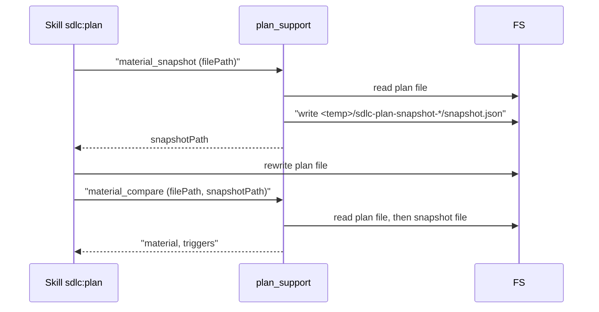
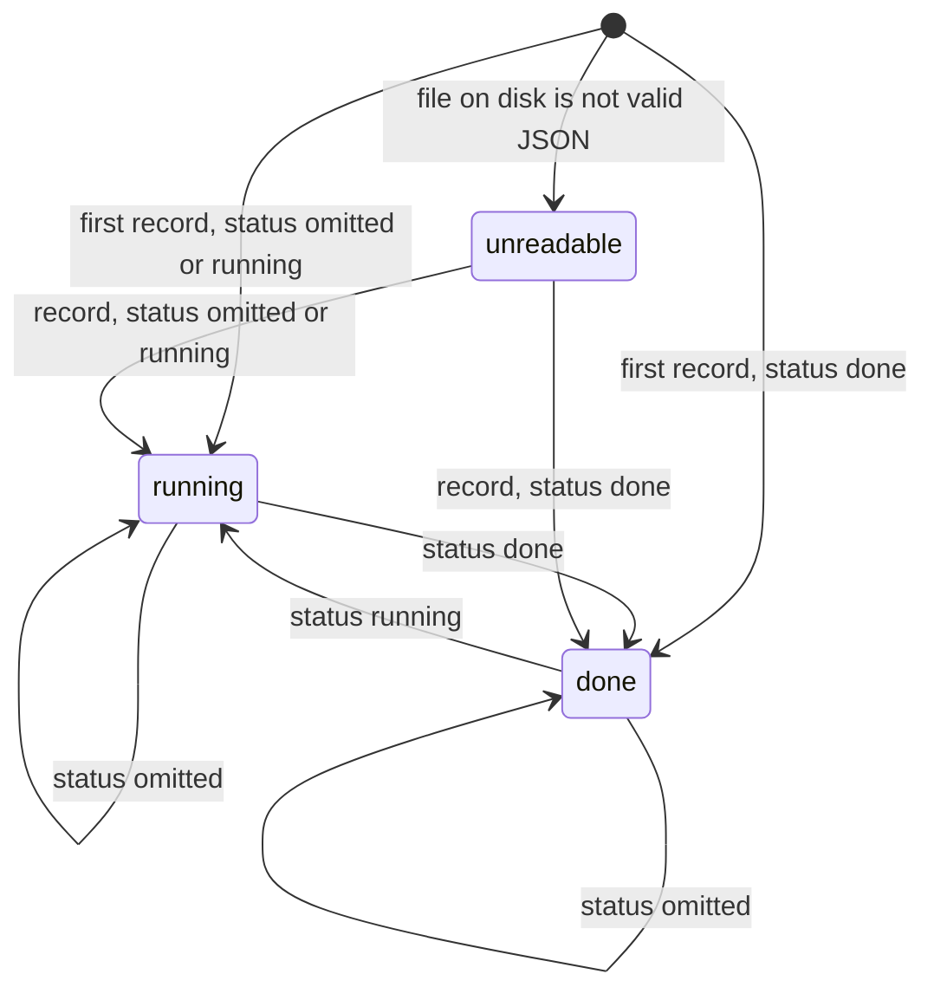

# tool-plan-support Specification

## Purpose
`plan_support` is an internal multi-action MCP tool that the `sdlc:plan` skill calls to merge review results, detect material plan changes, build an OpenSpec appendix, and keep a per-run evidence store for resume after context compaction. Output follows docs/mcp-output-contract.md.

## Requirements

### Requirement: Action dispatch
The tool SHALL run exactly one operation per call, selected by the `action` field, and SHALL ignore every input field that the selected action does not list.

| Action | Required fields | Optional fields | Result fields | Writes |
|---|---|---|---|---|
| `merge_results` | `laneResults` or `lensResults` (at least one) | `expectedGates`, `isRedispatch` | `allIssues`, `coverageGaps`, `laneFailures`, `mergedStatus`, `recommendations` | nothing |
| `material_snapshot` | `filePath` | — | `snapshotPath` | one temp snapshot file |
| `material_compare` | `filePath`, `snapshotPath` | — | `material`, `triggers` | nothing |
| `openspec_appendix` | `changeName` | `proposalPath`, `designPath`, `specPaths`, `planTasks` | `appendixMarkdown` | nothing |
| `openspec_instructions` | `changeName` | — | `schemaName`, `artifacts`, `guardrails` | one temp dir |
| `openspec_stage` | `changeName`, `files` | `planPath` | `stagingDir`, `files`, `valid`, `validateOutput` | `<active-worktree>/.sdlc-v2/openspec-staging/<changeName>/`, one temp validation dir |
| `evidence_record` | `runId`, `writerId` | `status`, `items`, `brief` | `record` | `<writerId>.json`, `brief.md` |
| `evidence_digest` | `runId` | `expectedWriters`, `timeoutSeconds`, `statusOnly` | `writers`, `digest` (not with `statusOnly`) | nothing |
| `evidence_get` | `runId`, plus `ids` or `writerIds` | — | `get` | nothing |
| `preplan_context` | `topic` | — | `guardrails`, `preplanFile`, `preplanCreated` | `<main-worktree>/.sdlc-v2/preplan/<slug>.md`, only when absent |

- Every action returns `summary` and `next`.
- `material` and `triggers` are always present in the result, also for actions that do not set them (`material: false`, `triggers: (none)`).

#### Scenario: Unknown action
- **WHEN** `action` is not one of the ten listed values
- **THEN** the tool returns a `DomainError` whose message starts with `unknown action "<value>"`
- **AND** the message lists `merge_results, material_snapshot, material_compare, openspec_appendix, openspec_instructions, openspec_stage, evidence_record, evidence_digest, evidence_get, preplan_context`

#### Scenario: Unused fields are ignored
- **WHEN** `action` is `merge_results` and the call also sets `filePath`
- **THEN** the tool merges the results and does not read `filePath`

### Requirement: Registration and annotations
The tool SHALL be registered as `plan_support`, described as `INTERNAL — called by sdlc skills only`, with the annotations below.

| Annotation | Value |
|---|---|
| `Title` | `Plan support and evidence store` |
| `ReadOnly` | `true` |
| `Idempotent` | `true` |
| `OpenWorld` | `false` |

#### Scenario: Client lists tools
- **WHEN** an MCP client lists the server's tools
- **THEN** `plan_support` reports `Title` `Plan support and evidence store`, `ReadOnly` `true`, `Idempotent` `true`, `OpenWorld` `false`

### Requirement: Root resolution
The tool SHALL anchor the evidence store at the main worktree root, and SHALL fall back to the process working directory when the main root cannot be resolved.

| Condition | Class | Message / Suggestion (short) |
|---|---|---|
| Main root and working directory both fail to resolve | `InfraError` | `resolve root: <cause>` / run plan_support from inside a git repository or worktree |

#### Scenario: Called from a linked worktree
- **WHEN** the tool runs inside a linked git worktree
- **THEN** evidence actions read and write under `<main worktree root>/.sdlc-v2/runs/`

#### Scenario: Main root not resolvable
- **WHEN** the main worktree root cannot be resolved but the working directory can
- **THEN** the tool uses the working directory as the root

### Requirement: merge_results inputs
The `merge_results` action SHALL require at least one non-empty list among `laneResults` and `lensResults`.

| Field | Type | Required | Encoding | Meaning |
|---|---|---|---|---|
| `laneResults` | array of lane result | one of the two | JSON array | Lane outcomes: `name`, `status` (`pass` or `fail`), `issues`, `passes`, `gateIds` |
| `lensResults` | array of lens result | one of the two | JSON array | Lens outcomes: `name`, `status` (as the lens wrote it, e.g. `Approved` or `Issues Found`), `issues`, `recommendations` |
| `expectedGates` | string array | no | JSON array | Gate IDs that lanes must cover |
| `isRedispatch` | boolean | no | JSON boolean | `true` when the results come from a re-run of lanes or lenses |

- Each issue has `gateId`, `severity` (`blocking` or `advisory`), `summary`, and `source`.
- Lane `status` and issue `severity` are compared exactly: a lane counts as failed only when `status` is `fail`, and an issue counts as blocking only when `severity` is `blocking`.
- The action SHALL reject any lane `status` other than `pass` or `fail`, and any lane or lens issue `severity` other than `blocking` or `advisory` (including an empty value), before it merges anything.
- Lens `status` is compared ignoring letter case and outer spaces: `Approved`, `approved`, and ` APPROVED ` all count as approved.

| Condition | Class | Message / Suggestion (short) |
|---|---|---|
| `laneResults` and `lensResults` both empty | `DomainError` | `merge_results requires at least one of laneResults or lensResults to be non-empty` / collect reviewer results first |
| A lane `status` or an issue `severity` outside its allowed values | `DomainError` | `merge_results: lane status must be "pass" or "fail" and issue severity must be "blocking" or "advisory"; got <items>`, one `; `-joined entry per bad value, e.g. `laneResults[0] ("static-structural"): status "ok"` or `lensResults[1].issues[0] ("<summary>"): severity "error"` / map each value, then call again |

#### Scenario: No results given
- **WHEN** `merge_results` is called with neither `laneResults` nor `lensResults`
- **THEN** the tool returns `DomainError` `merge_results requires at least one of laneResults or lensResults to be non-empty`

#### Scenario: Unknown lane status
- **WHEN** lane `static-structural` is sent with `status: ok`
- **THEN** the tool returns `DomainError` naming `laneResults[0] ("static-structural")` and `status "ok"`
- **AND** the message lists the allowed values `pass` and `fail`

#### Scenario: Unknown issue severity
- **WHEN** a lane or lens issue is sent with `severity: error` or with no `severity`
- **THEN** the tool returns `DomainError` naming that issue by its index and `summary`
- **AND** the message lists the allowed values `blocking` and `advisory`

### Requirement: merge_results issue collection
The `merge_results` action SHALL collect issues from lanes first, then lenses, set each issue's `source` to its lane or lens name, and keep only the first issue per (`gateId`, lower-cased trimmed `summary`) pair.

- Lens `recommendations` are merged into `recommendations`: trimmed, blanks dropped, duplicates dropped.
- `laneFailures` lists every lane with `status: fail`, except G17-only lanes (see G17 requirement). A failed lane with empty `gateIds` is always listed.

#### Scenario: Duplicate issues across lanes and lenses
- **WHEN** lane `lane-a`, lane `lane-b`, and lens `lens-a` each report gate `G5` with summary `Missing acceptance criteria for G5` in different letter case and spacing
- **THEN** `allIssues` holds exactly one issue
- **AND** its `source` is `lane-a`

#### Scenario: Failed lane is listed
- **WHEN** lane `static-structural` has `status: fail` and `gateIds: ["G1"]`
- **THEN** `laneFailures` is `["static-structural"]`

### Requirement: merge_results gate coverage
The `merge_results` action SHALL report every `expectedGates` entry that no lane lists in its `gateIds` as a coverage gap and as a blocking issue.

- The synthesized issue has `severity: blocking`, `source: coverage-check`, summary `Gate <id> was not covered by any lane`.
- Lens results never cover gates.

#### Scenario: One gate uncovered
- **WHEN** `expectedGates` includes `G14` and no lane lists `G14` in `gateIds`
- **THEN** `coverageGaps` is `["G14"]`
- **AND** `allIssues` contains a `blocking` issue for `G14` with `source` `coverage-check`

#### Scenario: All gates covered
- **WHEN** every `expectedGates` entry appears in some lane's `gateIds`
- **THEN** `coverageGaps` is empty

### Requirement: merge_results G17 advisory gate
The `merge_results` action SHALL treat gate `G17` as advisory: a failed lane whose `gateIds` is non-empty and holds only `G17` does not count as a lane failure, and with `isRedispatch: true` every lane issue for `G17` is downgraded to `advisory`.

- A G17-only failed lane adds an advisory issue: `Lane "<name>" failed but covers only G17 (advisory gate)`, `gateId: G17`, `source: <lane name>`.

#### Scenario: G17-only lane fails
- **WHEN** lane `g17-lane` has `status: fail` and `gateIds: ["G17"]`
- **THEN** `laneFailures` is empty
- **AND** `mergedStatus` is `Approved`

#### Scenario: Failed lane with no gates
- **WHEN** lane `broken-lane` has `status: fail` and empty `gateIds`
- **THEN** `laneFailures` is `["broken-lane"]`
- **AND** `allIssues` has no `covers only G17` advisory issue

#### Scenario: Redispatch downgrades G17 findings
- **WHEN** `isRedispatch` is `true` and a passing lane reports a `blocking` issue for `G17`
- **THEN** that issue appears in `allIssues` with `severity: advisory`
- **AND** `mergedStatus` is `Approved`

### Requirement: merge_results status and next step
The `merge_results` action SHALL set `mergedStatus` to `Issues Found` when any rule below matches, and to `Approved` otherwise.

| Rule | Applies when |
|---|---|
| Any issue in `allIssues` has `severity: blocking` | always |
| Any lens `status` is not `approved` (ignoring letter case and outer spaces) | `lensResults` given, with or without `laneResults` |
| `laneFailures` is not empty (a failed lane that is not G17-only, with or without issues) | `laneResults` given |

`next` is chosen by the first matching row:

| Condition | `next` |
|---|---|
| `coverageGaps` not empty | `Re-dispatch lanes for missing gates: <ids>.` |
| `mergedStatus` is `Issues Found` | `Address blocking issues and re-run the review.` |
| At least one advisory issue | `Review advisory findings before proceeding.` |
| Otherwise | `Proceed to the next step.` |

- `summary` is `Merged <n> lane(s) and <m> lens(es): <b> blocking issue(s), <a> advisory issue(s). Status: <mergedStatus>.`

#### Scenario: All lenses approved
- **WHEN** only `lensResults` is given and every lens has `status: approved`
- **THEN** `mergedStatus` is `Approved`

#### Scenario: One lens rejected
- **WHEN** only `lensResults` is given and one lens has `status: rejected`
- **THEN** `mergedStatus` is `Issues Found`

#### Scenario: Lens status as the lens prompt writes it
- **WHEN** only `lensResults` is given and the lenses have `status` values `Approved`, ` APPROVED `, and `approved`
- **THEN** `mergedStatus` is `Approved`

#### Scenario: One lens reports Issues Found
- **WHEN** only `lensResults` is given, one lens has `status: Approved`, and one has `status: Issues Found`
- **THEN** `mergedStatus` is `Issues Found`

#### Scenario: Rejected lens alongside lanes
- **WHEN** `laneResults` holds one passing lane that covers every `expectedGates` entry and `lensResults` holds one lens with `status: rejected` and no issues
- **THEN** `mergedStatus` is `Issues Found`

#### Scenario: Failed lane without issues
- **WHEN** lane `static-structural` has `status: fail`, `gateIds: ["G1"]`, and no issues
- **THEN** `mergedStatus` is `Issues Found`

#### Scenario: Redispatch with a failed G17-only lane
- **WHEN** `isRedispatch` is `true` and failed lane `g17-lane` has `gateIds: ["G17"]` and a `blocking` issue for `G17`
- **THEN** that issue appears in `allIssues` with `severity: advisory`
- **AND** `mergedStatus` is `Approved`

### Requirement: material_snapshot
The `material_snapshot` action SHALL read the plan file at `filePath`, extract seven structural dimensions, write them as JSON to a new file `<OS temp dir>/sdlc-plan-snapshot-*/snapshot.json`, and return that file's path as `snapshotPath`.

| Snapshot key | Extracted from the plan |
|---|---|
| `taskCount` | Number of `### Task N:` headings |
| `deviationsRows` | First cell of each table row under `## Deviations & assumptions` (header row dropped) |
| `filesSet` | Per task, the bullet lines under `**Files:**` |
| `contracts` | Per task, all text after `**Contract:**` up to the next `**<Field>:**` line, `### `, `## `, or `---` line |
| `dependsOn` | Per task, the value of `**Depends on:**` |
| `keyDecisions` | Under `## Key Decisions`: first table cell per row, or the leading phrase of each bullet |
| `openspecTaskMapping` | Per task, the `- ref:` value inside the `**openspec-task:**` block |

- Per-task keys are `Task <N>`.
- Content inside fenced code blocks is ignored.
- `summary` is `Snapshot captured: <t> tasks, <d> deviation rows, <k> key decisions.`

| Condition | Class | Message / Suggestion (short) |
|---|---|---|
| `filePath` empty | `DomainError` | `material_snapshot requires filePath — provide the path to the plan file to snapshot` |
| Plan file unreadable | `InfraError` | `read plan file "<path>": <cause>` / check the file, retry with the corrected filePath |
| Temp dir or snapshot file cannot be written | `InfraError` | `create snapshot temp dir: …` or `write snapshot file "<path>": …` / check temp dir space and permissions |

#### Scenario: Snapshot of a plan
- **WHEN** `material_snapshot` is called with the path of a plan that has 4 tasks
- **THEN** the file at the returned `snapshotPath` holds `taskCount` 4
- **AND** `next` tells the caller to call `material_compare` with the same `filePath` and this `snapshotPath`

#### Scenario: Snapshot write fails
- **WHEN** the snapshot file cannot be written
- **THEN** the tool returns `InfraError` with a message containing `write snapshot file`
- **AND** the temp directory it created is removed

### Requirement: material_compare
The `material_compare` action SHALL re-extract the seven dimensions from `filePath`, compare them with the snapshot at `snapshotPath`, and return `material: true` with one trigger per changed dimension, in the order below.

Snapshot-then-compare flow around a plan rewrite:



| Order | Trigger text |
|---|---|
| 1 | `Task count changed: <before> -> <after>` |
| 2 | `Deviations & assumptions table modified` |
| 3 | `Files changed in: <Task N, …>` |
| 4 | `Contract changed in: <Task N, …>` |
| 5 | `Depends on changed in: <Task N, …>` |
| 6 | `Key Decisions modified` |
| 7 | `OpenSpec task mapping changed in: <Task N, …>` |

| Result | `summary` | `next` |
|---|---|---|
| No trigger | `No material changes detected — wording/formatting only.` | `Proceed to the next step without re-validation.` |
| One or more triggers | `Material change detected: <n> trigger(s) fired.` | `Material change detected — re-run critique lanes and lenses before proceeding.` |

- A snapshot of a plan with zero tasks is valid input.

#### Scenario: Task added after snapshot
- **WHEN** a task with no `**Files:**`, `**Contract:**`, `**Depends on:**`, or `**openspec-task:**` field is appended to the 4-task plan at `filePath` after `material_snapshot` returned `snapshotPath`
- **THEN** `material` is `true`
- **AND** `triggers` is `["Task count changed: 4 -> 5"]`

#### Scenario: Wording-only edit
- **WHEN** only prose outside the seven dimensions changes (for example a task's notes)
- **THEN** `material` is `false`
- **AND** `triggers` is empty

#### Scenario: Field after the contract edited
- **WHEN** Task 1 has a `**Notes:**` field after its `**Contract:**` block and only the notes text changes
- **THEN** `material` is `false`
- **AND** the snapshot's `contracts` entry for `Task 1` holds only the contract text

#### Scenario: OpenSpec ref changed
- **WHEN** the `- ref:` value inside Task 1's `**openspec-task:**` block changes
- **THEN** `triggers` is `["OpenSpec task mapping changed in: Task 1"]`

### Requirement: material_compare errors
The `material_compare` action SHALL read the plan file before the snapshot file, and SHALL NOT tell the caller to re-snapshot an already edited plan in any error suggestion.

| Condition | Class | Message / Suggestion (short) |
|---|---|---|
| `filePath` empty | `DomainError` | `material_compare requires filePath — provide the path to the updated plan file` |
| `snapshotPath` empty | `DomainError` | `material_compare requires snapshotPath — call material_snapshot first and pass its returned snapshotPath` |
| Plan file unreadable | `InfraError` | `read plan file "<path>": <cause>` / retry with the corrected filePath |
| Snapshot file missing | `InfraError` | `snapshotPath "<path>" points to a file that is missing: it was deleted or never written` / re-snapshot only if the plan is unedited, else treat as material |
| Snapshot file unreadable (other cause) | `InfraError` | `read snapshot file "<path>": <cause>` / fix permissions, else treat as material |
| Snapshot not JSON | `DataError` | `snapshot file "<path>" is not valid JSON: <cause>` / baseline lost, do NOT re-snapshot an edited plan |
| Snapshot JSON has no `taskCount` key | `DataError` | `snapshot file "<path>" is not a plan snapshot (missing taskCount field)` / same as above |
| Snapshot JSON does not decode as a snapshot | `DataError` | `snapshot file "<path>" could not be decoded as a plan snapshot: <cause>` / same as above |

#### Scenario: Both paths bad
- **WHEN** neither `filePath` nor `snapshotPath` exists
- **THEN** the tool returns `InfraError` with a message containing `read plan file`
- **AND** the message does not mention the snapshot

#### Scenario: Snapshot is not a plan snapshot
- **WHEN** `snapshotPath` holds well-formed JSON without a `taskCount` key
- **THEN** the tool returns `DataError` `snapshot file "<path>" is not a plan snapshot (missing taskCount field)`

### Requirement: openspec_appendix
The `openspec_appendix` action SHALL return `appendixMarkdown` that starts with `## OpenSpec Appendix` and `**Change:** <changeName>`, followed by the sections below.

| Input | Present and usable | Present but unusable | Absent |
|---|---|---|---|
| `proposalPath` | `**Proposal summary:** <first paragraph>` (max 300 characters, cut with `...`) | `**Proposal:** _(file not found or unreadable)_`, or `**Proposal:** _(empty)_` | section omitted |
| `designPath` | ``**Design:** `<designPath>` `` | `**Design:** _(not provided)_` | section omitted |
| `specPaths` | `**Spec deltas:**` with one `` - `<path>` `` bullet each | — | `**Spec deltas:** _(none)_` |
| `planTasks` | `**Task mapping:**` with one `- <task>` bullet each | — | section omitted |

- An unreadable proposal or design file never fails the call.
- `next` is `Append this markdown to the plan file's OpenSpec Appendix section.`

| Condition | Class | Message / Suggestion (short) |
|---|---|---|
| `changeName` empty | `DomainError` | `openspec_appendix requires changeName — provide the openspec change name` / use the folder name under `openspec/changes/` |

#### Scenario: Full appendix
- **WHEN** `changeName` is `add-foo-feature`, the proposal's first paragraph is `This proposal adds the Foo feature to support bar workflows.`, and `specPaths` has two entries
- **THEN** `appendixMarkdown` contains `**Change:** add-foo-feature`
- **AND** it contains `**Proposal summary:** This proposal adds the Foo feature to support bar workflows.`
- **AND** it contains one `` - `<path>` `` bullet per spec path

#### Scenario: No spec paths
- **WHEN** `specPaths` is empty
- **THEN** `appendixMarkdown` contains `**Spec deltas:** _(none)_`

#### Scenario: Design file missing
- **WHEN** `designPath` points to a file that does not exist
- **THEN** `appendixMarkdown` contains `**Design:** _(not provided)_`

### Requirement: Evidence store location and run validation
The evidence actions SHALL store one run's evidence under `<main root>/.sdlc-v2/runs/<runId>.evidence/`, and SHALL accept only a `runId` that names an existing plan run state file `.sdlc-v2/runs/<runId>.json`.

```text
.sdlc-v2/runs/
├── <runId>.json              plan run state (written by plan_prepare / plan_mark)
└── <runId>.evidence/
    ├── <writerId>.json       one file per writer: writerId, status, updatedAt, items[]
    ├── brief.md              discovery brief (writerId main only)
    └── guardrails.md         guardrails snapshot (written by plan_prepare)
```

- A `runId` with a path separator or `..` is rejected before any file is read.
- Any `DomainError` from an evidence action leaves every file under `.sdlc-v2/runs/` unchanged.

| Condition | Class | Message / Suggestion (short) |
|---|---|---|
| `runId` empty | `DomainError` | `runId is required for <action>` / pass runId from plan_prepare's runId output |
| `runId` invalid or run state file absent | `DomainError` | `plan run <runId> not found` / call `plan_prepare({resume:true, resolveTemplate:true})` and use its runId |
| Run state file unreadable or not JSON | `InfraError` | `plan run <runId> state read failed` / fix or delete the state file, call plan_prepare again |
| OS read failure in the evidence directory | `InfraError` | `evidence read failed: <path>` / make sure `<runId>.evidence/` is a writable directory |
| OS write failure in the evidence directory | `InfraError` | `evidence write failed: <path>` / same as above |

#### Scenario: Path traversal runId
- **WHEN** an evidence action is called with `runId` `../x`
- **THEN** the tool returns `DomainError` `plan run ../x not found`
- **AND** no file under `.sdlc-v2/runs/` changes

#### Scenario: Evidence directory is a regular file
- **WHEN** `<runId>.evidence` exists as a regular file
- **THEN** each evidence action returns `InfraError` with a message starting `evidence read failed: `

### Requirement: evidence_record upsert
The `evidence_record` action SHALL upsert `items` into `<writerId>.json` by item `id`: an existing id is replaced in place as a whole item, and a new id is appended in input order.

| Field | Type | Required | Encoding | Meaning |
|---|---|---|---|---|
| `runId` | string | yes | plain text | Plan run ID from `plan_prepare`, e.g. `plan-main-20260929T114125Z` |
| `writerId` | string | yes | plain text, `[A-Za-z0-9][A-Za-z0-9._-]{0,63}` | Writer that owns the file, e.g. `lane-static-structural-r1`, `main` |
| `status` | string enum | no | `running` or `done` | New writer status; omit to keep the stored one |
| `items` | array | no | JSON array, max 200 | Items with `id`, `summary`, `ref`, `body` |
| `brief` | string | no | Markdown, max 65536 bytes | Discovery brief; `writerId` `main` only |

| Item field | Limit |
|---|---|
| `id` | `[A-Za-z0-9][A-Za-z0-9._-]{0,127}`, unique within its writer |
| `summary` | one line, max 200 characters |
| `ref` | one line, max 500 characters |
| `body` | no own limit; counts toward the 65536-byte file limit |

- The writer file's `updatedAt` is set to the current UTC time (RFC 3339) on every call.
- Result `record`: `writerId`, `status`, `itemCount` (items now in the file), `fileBytes` (file size), `briefPath` (empty unless this call stored a brief).
- `next` is `Stored <n> items for <writerId> (status <status>). Continue your step.`

#### Scenario: Replace and append
- **WHEN** writer `w1` holds items `F-x-1` and `F-x-0`, and `evidence_record` sends `F-x-1` (new summary, no body) and `F-x-2`
- **THEN** the file holds `F-x-1` (new content, no body), `F-x-0`, `F-x-2` in that order

#### Scenario: Record reports file size
- **WHEN** `evidence_record` stores two items for `explore-auth-flow` with `status: done`
- **THEN** `record.itemCount` is 2 and `record.status` is `done`
- **AND** `record.fileBytes` equals the size of `explore-auth-flow.json` on disk

### Requirement: evidence_record writer status
The `evidence_record` action SHALL set the writer status as shown below.

Writer status after each evidence_record call:



- `unreadable` is a writer file that exists but is not valid JSON; a record replaces it and drops its old content.
- On replacement, `summary` contains `Replaced the unreadable writer file <path>.`

#### Scenario: New writer without status
- **WHEN** `evidence_record` is called for a writer with no file and no `status`
- **THEN** the stored status is `running`

#### Scenario: Corrupt writer file replaced
- **WHEN** `w1.json` holds invalid JSON and `evidence_record` sends one item for `w1`
- **THEN** `w1.json` holds exactly that item with status `running`
- **AND** `summary` contains `Replaced the unreadable writer file <path>`

### Requirement: evidence_record validation and brief
The `evidence_record` action SHALL validate every input before writing, SHALL store `brief` as `brief.md` only for `writerId` `main`, and SHALL write the writer file before `brief.md`.

| Condition | Class | Message / Suggestion (short) |
|---|---|---|
| `status` not `running` or `done` | `DomainError` | `status "<value>" is not valid` |
| `writerId` fails the pattern | `DomainError` | `writerId "<value>" is invalid` |
| More than 200 items | `DomainError` | `items has <n> entries, max 200` |
| Item id fails the pattern | `DomainError` | `items[<i>].id "<value>" is invalid` |
| Summary too long or multi-line | `DomainError` | `items[<i>].summary must be one line of at most 200 characters (got <n>)` |
| Ref too long or multi-line | `DomainError` | `items[<i>].ref must be one line of at most 500 characters` |
| `brief` with `writerId` other than `main` | `DomainError` | `brief is accepted only for writerId main` |
| `brief` over 65536 bytes | `DomainError` | `brief is <n> bytes, limit 65536` |
| Resulting writer file over 65536 bytes | `DomainError` | `writer <writerId> evidence would be <n> bytes, limit 65536` / split items or shorten body |

#### Scenario: Brief stored for main
- **WHEN** `evidence_record` is called with `writerId` `main` and `brief` `# Discovery Brief`
- **THEN** `<runId>.evidence/brief.md` holds that text
- **AND** `record.briefPath` is that file's path

#### Scenario: Brief write fails after writer file
- **WHEN** `brief.md` cannot be written
- **THEN** the tool returns `InfraError` `evidence write failed: <brief.md path>`
- **AND** `main.json` already holds the new items, so a retry does not duplicate them

### Requirement: evidence_digest writers section
The `evidence_digest` action SHALL return a `writers` section with a table of every writer file and the lists `missingWriters`, `stalledWriters`, and `unreadableWriters`, judged against the expected writer set.

| Field | Type | Required | Encoding | Meaning |
|---|---|---|---|---|
| `runId` | string | yes | plain text | Plan run ID |
| `expectedWriters` | string array | no | JSON array, max 32 | Dispatched writers; default is the run checkpoint's `expectedWriters` |
| `timeoutSeconds` | integer | no | 60–86400; 0 or absent = 1800 | Age of `updatedAt` after which a running writer is stalled |
| `statusOnly` | boolean | no | JSON boolean | `true` returns only the writers section |

| Output | Meaning |
|---|---|
| `writers.table` | Columns `writer`, `status`, `items`, `updatedAt`, `stalled`; one row per writer file, in writer-name order; `(no writers recorded)` when empty |
| `writers.missingWriters` | Expected writers with no file |
| `writers.stalledWriters` | Expected writers that are `running` with `updatedAt` older than the timeout (or unparsable), or whose file is unreadable |
| `writers.unreadableWriters` | Every writer whose file is not valid JSON, expected or not; its table row shows status `unreadable` |

- With no `expectedWriters` input and no checkpoint, `missingWriters` and `stalledWriters` are empty.

| Condition | Class | Message / Suggestion (short) |
|---|---|---|
| An `expectedWriters` entry fails the writer pattern | `DomainError` | `expectedWriters[<i>] "<value>" is invalid` |
| More than 32 `expectedWriters` | `DomainError` | `expectedWriters has <n> entries, max 32` |
| `timeoutSeconds` outside 60–86400 | `DomainError` | `timeoutSeconds <n> is out of range 60-86400` / omit for the 1800-second default |
| Run checkpoint does not decode | `InfraError` | `plan run <runId> has a malformed checkpoint in <path>` / replace it with `plan_mark` marker `checkpoint` |

#### Scenario: Missing and stalled writers
- **WHEN** `expectedWriters` lists `lane-static-structural-r1` (no file) and `lane-content-coverage-r1` (running, updated 2000 seconds ago)
- **THEN** `missingWriters` is `["lane-static-structural-r1"]`
- **AND** `stalledWriters` is `["lane-content-coverage-r1"]`
- **AND** the table has no row for `lane-static-structural-r1`

#### Scenario: Unexpected running writer is never stalled
- **WHEN** writer `main` is running with `updatedAt` 5000 seconds old and `main` is not expected
- **THEN** the `main` row shows `stalled` `no`

#### Scenario: Expected writers from checkpoint
- **WHEN** `expectedWriters` is omitted and the run checkpoint lists `lane-static-structural-r1`, which has no file
- **THEN** `missingWriters` is `["lane-static-structural-r1"]`

#### Scenario: Wider timeout
- **WHEN** `timeoutSeconds` is 3000 and the only running expected writer was updated 2000 seconds ago
- **THEN** `stalledWriters` is empty

### Requirement: evidence_digest poll mode
With `statusOnly: true` the `evidence_digest` action SHALL return only the writers section (no `digest`), and SHALL choose `next` by the first matching row below.

| Condition | `next` |
|---|---|
| Any missing or stalled writer | `Missing: <list or (none)>. Stalled: <list or (none)>. Wait one more poll cycle; if a writer is still listed, force-progress past it (SKILL.md POLL step).` |
| No expected writers (none in the input and none in the run checkpoint) | `No expected writers: expectedWriters is empty and the run checkpoint lists none. Pass expectedWriters with the writer IDs you dispatched, then poll again.` |
| Every expected writer has a readable file with status `done` | `All expected writers are done. Fetch their results with evidence_get writerIds.` |
| Otherwise | `Poll again in about 60 seconds.` |

#### Scenario: All expected writers done
- **WHEN** `statusOnly` is `true` and the only expected writer `lane-a` has status `done`
- **THEN** `digest` is absent
- **AND** `next` is `All expected writers are done. Fetch their results with evidence_get writerIds.`

#### Scenario: No expected writers while polling
- **WHEN** `statusOnly` is `true`, `expectedWriters` is omitted, and the run checkpoint lists no expected writers
- **THEN** `next` is `No expected writers: expectedWriters is empty and the run checkpoint lists none. Pass expectedWriters with the writer IDs you dispatched, then poll again.`
- **AND** `next` does not say that all expected writers are done

#### Scenario: Stalled writer while polling
- **WHEN** `statusOnly` is `true` and expected writer `lane-b` is stalled
- **THEN** `next` is `Missing: (none). Stalled: lane-b. Wait one more poll cycle; if a writer is still listed, force-progress past it (SKILL.md POLL step).`
- **AND** `next` does not contain `re-dispatch`

### Requirement: evidence_digest run summary
Without `statusOnly` the `evidence_digest` action SHALL also return a `digest` section that never contains an item `body`.

| Output | Meaning |
|---|---|
| `digest.runId` | The run ID |
| `digest.planFilePath` | Plan file path stored in the run state |
| `digest.userPrompt` | The user prompt stored in the run state's creation intent |
| `digest.guardrailsFile` | Path of `<runId>.evidence/guardrails.md`, or empty when it does not exist |
| `digest.briefPath` | Path of `<runId>.evidence/brief.md`, or empty when it does not exist |
| `digest.instructions` | `planStyle.instructions` from `.sdlc-v2/local.toml`, read fresh on every call |
| `digest.checkpoint` | The run checkpoint: `step`, `iteration`, `expectedWriters`, `updatedAt` |
| `digest.index` | Columns `id`, `writer`, `ref`, `summary`; writers in name order, items in file order; max 200 item rows plus one overflow row; `(no items recorded)` when empty |

- The overflow row is `| … | — | — | <n> more; use evidence_get writerIds |`.
- Table cells escape `|` as `\|`, replace line breaks with spaces, and show `—` for an empty value.
- Items of unreadable writer files are left out of the index.
- `summary` is `<runId> — step <step>, iteration <i>; writers: <d> done, <r> running, <m> missing, <s> stalled[, <u> unreadable]; <n> items; <c> custom instructions.` Step defaults to `0` without a checkpoint.
- `next` starts with `If the sdlc:plan skill instructions are not in context, invoke the sdlc:plan skill first` and names `continue at step <step> (iteration <i>)`.
- When writers are missing or stalled, `next` ends with `Missing: <list>. Stalled: <list>. Wait one poll cycle (evidence_digest statusOnly); if a writer is still listed, re-dispatch it or force-progress past it.`

#### Scenario: Digest hides bodies
- **WHEN** a writer stored an item with body `BODY-SECRET-ONE` and `evidence_digest` is called
- **THEN** the rendered output does not contain `BODY-SECRET-ONE`
- **AND** `digest.index` contains `| F-auth-1 | explore-auth-flow | internal/auth.go:42 | token check skips expiry |`

#### Scenario: Resume point from checkpoint
- **WHEN** the run checkpoint has step `6.5` and iteration 2
- **THEN** `next` contains `continue at step 6.5 (iteration 2)`

#### Scenario: Index cap
- **WHEN** the run holds 201 items
- **THEN** `digest.index` has 200 item rows
- **AND** its last row is `| … | — | — | 1 more; use evidence_get writerIds |`

#### Scenario: Custom instructions added
- **WHEN** `.sdlc-v2/local.toml` gains `[planStyle] instructions = ["Cite file:line.", "Ask before adding a dependency."]` between two calls
- **THEN** the second call's `digest.instructions` holds both entries
- **AND** `summary` contains `; 2 custom instructions.`

### Requirement: evidence_get
The `evidence_get` action SHALL return the full content of items selected by `ids` and by `writerIds`, and SHALL list every id or writer it cannot find in `notFound`.

| Field | Type | Required | Encoding | Meaning |
|---|---|---|---|---|
| `runId` | string | yes | plain text | Plan run ID |
| `ids` | string array | one of the two | JSON array, max 200 | Item ids; each matches items in every writer |
| `writerIds` | string array | one of the two | JSON array, max 32 | Writers whose items are all returned |

- An id found in several writers returns one block per writer, in writer-name order.
- An item selected twice (by id and by writer) is returned once.
- Unreadable writer files are skipped.
- Each item renders as `### <id> — <writerId>`, `- ref: <ref or —>`, `- summary: <summary>`, a blank line, then the body (`(no body)` when blank).
- `get.evidence` is `(no items found)` when nothing matches.

| Result | `next` |
|---|---|
| Everything found | `Bodies returned for <n> items.` |
| Something not found | `Not found: <list>. Check the digest index for valid ids.` |

| Condition | Class | Message / Suggestion (short) |
|---|---|---|
| Neither `ids` nor `writerIds` | `DomainError` | `evidence_get needs ids or writerIds` |
| More than 200 `ids` | `DomainError` | `ids has <n> entries, max 200` |
| An `ids` entry fails the item pattern | `DomainError` | `ids[<i>] "<value>" is invalid` |
| More than 32 `writerIds` | `DomainError` | `writerIds has <n> entries, max 32` |
| A `writerIds` entry fails the writer pattern | `DomainError` | `writerIds[<i>] "<value>" is invalid` |

#### Scenario: Known and unknown selectors
- **WHEN** `ids` is `["F-1", "F-missing"]` and `writerIds` is `["w-missing"]`, and only `F-1` exists
- **THEN** `get.evidence` contains the body of `F-1`
- **AND** `get.notFound` is `["F-missing", "w-missing"]`
- **AND** `next` is `Not found: F-missing, w-missing. Check the digest index for valid ids.`

#### Scenario: Same id in two writers
- **WHEN** writers `zeta` and `alpha` both hold item `R1` and `ids` is `["R1"]`
- **THEN** `get.evidence` contains `### R1 — alpha` before `### R1 — zeta`

#### Scenario: All items of a writer
- **WHEN** `writerIds` is `["w1"]` and `w1` holds items `A` and `B`
- **THEN** `get.evidence` contains `### A — w1` and `### B — w1`
- **AND** `next` is `Bodies returned for 2 items.`

### Requirement: openspec_instructions
The `openspec_instructions` action SHALL copy `openspec/config.yaml` into a new temp directory, run
`openspec new change <changeName>`, `openspec status --change <changeName> --json`, and
`openspec instructions <artifact> --change <changeName> --json` for each artifact there, and SHALL
return `schemaName` and `artifacts[]` `{id, outputPath, requires, template, instruction, context, rules}`
in status order, plus `guardrails` — the same list `plan_prepare` returns. It writes nothing in the repository.

| Condition | Class | Message (short) |
|---|---|---|
| Active worktree cannot be resolved | `DomainError` | `openspec_instructions: active worktree not resolved` |

#### Scenario: New change
- **WHEN** `openspec_instructions` is called with `changeName:"add-widget"` and no such change exists
- **THEN** `artifacts` lists `proposal`, `specs`, `design`, `tasks` with their templates
- **AND** `git status --porcelain` prints nothing

### Requirement: openspec_stage
The `openspec_stage` action SHALL replace the staging dir for `changeName` with the given `files`, write `stage.json`, and validate a temp copy, as defined by the `openspec-staging` capability. It SHALL also check every staged `.md` file for hard-to-read Mermaid colors, as defined by "Diagram contrast" in the `plan-writing-style` capability.

| Input | Encoding | Example |
|---|---|---|
| `changeName` | plain text, bare kebab-case | `add-widget` |
| `files` | JSON array of `{path, content}`; `path` relative to the change dir | `[{"path":"proposal.md","content":"# Proposal\n..."}]` |
| `planPath` | plain text, absolute path | `/Users/me/.claude/plans/add-widget.md` |

| Output | Meaning |
|---|---|
| `stagingDir` | Repo-relative staging dir, e.g. `.sdlc-v2/openspec-staging/add-widget/` |
| `files` | `[{path, sha256}]` as written to `stage.json` |
| `valid` | `true` when `openspec validate <changeName> --strict` exits 0 in the temp copy and no staged file has a diagram contrast hit |
| `validateOutput` | CLI output of that validation, then one line `diagram contrast: <path>:<line>: <reason>: <text>` per hit |

- Each call replaces the whole staging dir, so a file dropped from `files` is removed.
- `next` is `Staged and valid. Add the **OpenSpec-Staging:** header to the plan.` when `valid`, else `Fix the artifacts using validateOutput and call openspec_stage again.`
- The tool keeps `ReadOnly: true`: it writes only gitignored paths and the OS temp dir, and no path comes from a caller field without the name and path checks.

| Condition | Class | Message (short) |
|---|---|---|
| `changeName` empty or not bare kebab-case | `DomainError` | `openspec_stage: invalid changeName "<name>"` |
| A `files[].path` fails the path check | `DomainError` | `openspec_stage: path "<path>" not allowed` |
| `openspec` CLI not on PATH | `InfraError` | `openspec CLI not found on PATH` |
| Active worktree cannot be resolved | `DomainError` | `openspec_stage: active worktree not resolved` |

#### Scenario: Stage and validate
- **WHEN** `openspec_stage` is called with `changeName:"add-widget"` and valid proposal, spec, design, and tasks files
- **THEN** `stagingDir` is `.sdlc-v2/openspec-staging/add-widget/`
- **AND** `valid` is `true`
- **AND** `git status --porcelain` prints nothing

#### Scenario: Restage drops a file
- **WHEN** a second call for `add-widget` omits `design.md`
- **THEN** `.sdlc-v2/openspec-staging/add-widget/design.md` no longer exists

#### Scenario: Pastel diagram in a staged artifact
- **WHEN** line 30 of the staged `proposal.md` is `classDef new fill:#d4f7d4,stroke:#2a7a2a` inside a mermaid block and the CLI validation passes
- **THEN** `valid` is `false`
- **AND** `validateOutput` contains `diagram contrast: proposal.md:30: no text color: classDef new fill:#d4f7d4,stroke:#2a7a2a`

### Requirement: merge_results blocking count
The `merge_results` action SHALL return `blockingCount`: the number of blocking issues after the merge, `0` too. The value SHALL equal the count in its summary text. Other actions SHALL not return `blockingCount`.

#### Scenario: Two blocking issues
- **WHEN** `merge_results` merges lens results with 2 blocking issues and 1 advisory issue
- **THEN** the output has `blockingCount: 2`

#### Scenario: No blocking issues
- **WHEN** `merge_results` merges lens results with no blocking issue
- **THEN** the output has `blockingCount: 0` and `mergedStatus: "Approved"`

#### Scenario: Other action
- **WHEN** the call uses `action: "material_snapshot"`
- **THEN** the output has no `blockingCount`

### Requirement: Stable finding IDs
`merge_results` SHALL give every issue in `allIssues` an `id`: `f-` plus the first 8 hex characters of the SHA-256 of its dedup key (gate ID and lower-case trimmed summary). It SHALL ignore an `id` in the input.

#### Scenario: Same finding twice
- **WHEN** two `merge_results` calls each hold gate `G14` with summary `Missing test`
- **THEN** both issues have the same `id`

#### Scenario: Case and spaces
- **WHEN** one summary is ` Missing Test ` and another is `missing test` on the same gate
- **THEN** both issues have the same `id`

#### Scenario: Input id
- **WHEN** an input issue has `id` `f-00000000`
- **THEN** the output `id` is the computed value

### Requirement: Preplan context
The `preplan_context` action SHALL return the plan guardrails and the topic file path, SHALL create the topic file with a fixed skeleton only when it is absent, and SHALL NOT start a plan run.

- The file name is the slug of the topic: lowercase ASCII letters, digits and `-`.
- A topic is 1-50 characters on one line, with at least one ASCII letter or digit.
- Skeleton sections, in order: `## Goal`, `## Users and effect`, `## Flows`, `## Decisions`, `## Open questions`, `## Guardrail check`.

#### Scenario: New topic
- **WHEN** `topic` is `auth flow` and `<main-worktree>/.sdlc-v2/preplan/auth-flow.md` does not exist
- **THEN** the file exists with the skeleton text
- **AND** `## Flows` comes right after `## Users and effect`
- **AND** `preplanCreated` is `true`

#### Scenario: Existing topic
- **WHEN** the topic file already exists
- **THEN** the file content does not change
- **AND** `preplanCreated` is `false`

#### Scenario: Bad topic
- **WHEN** `topic` is `!!!`
- **THEN** the tool returns a `DomainError` with a Suggestion
- **AND** no file is written

#### Scenario: No guardrails configured
- **WHEN** the config has no plan guardrails
- **THEN** the summary says `0 guardrail(s) loaded — none configured.`
- **AND** `next` is not empty

### Requirement: Stage error for a target spec
The `openspec_stage` action SHALL return an InfraError with a Suggestion when it cannot copy a current target spec into its validation copy.

#### Scenario: Target spec too large
- **WHEN** `openspec/specs/tool-validate/spec.md` is over 1 MiB and the change has a delta for `tool-validate`
- **THEN** the tool returns an InfraError that names the file
- **AND** the Suggestion is `Check read permission on the named spec under openspec/specs/, then call openspec_stage again.`
