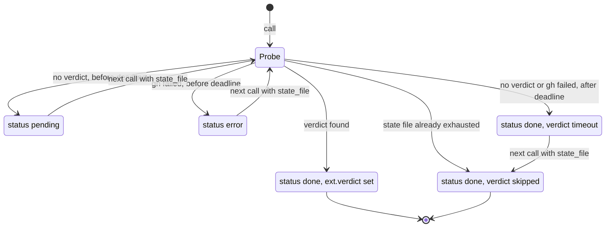

# tool-poll-await Specification

## Purpose
`poll_await` runs one non-blocking probe of a PR's remote review verdict or CI checks and returns a resumable stepper envelope. The `ship` skill calls it in a loop for its verify-pipeline and await-remote-review steps. Output follows docs/mcp-output-contract.md.

## Requirements

### Requirement: Input fields and targets
The tool SHALL accept the input fields below and run the probe selected by `target`.

| Field | Type | Required | Encoding | Meaning |
|---|---|---|---|---|
| `target` | string | yes | `remote_review` or `pipeline` | Which probe to run |
| `pr` | integer | yes | positive integer, e.g. `42` | Pull request number to poll |
| `timeout_seconds` | integer | no | seconds, e.g. `600` | Overall poll budget; zero or less uses the target default |
| `interval_seconds` | integer | no | seconds, e.g. `60` | Wait between probes; zero or less uses `60` |
| `reviewers` | string array | no | JSON array, e.g. `["copilot"]` | `remote_review` only: reviewer logins to wait for; ignored by `pipeline` |
| `state_file` | string | no | path from a prior envelope | Resume an existing poll |

| `target` | gh command | Default `timeout_seconds` | Default `reviewers` | State file name |
|---|---|---|---|---|
| `remote_review` | `gh pr view <pr> --json reviews` | `600` | `["copilot"]` | `await-remote-review-<12 hex>.json` |
| `pipeline` | `gh pr checks <pr>` | `1200` | n/a | `verify-pipeline-<12 hex>.json` |

#### Scenario: Remote review default timeout
- **WHEN** the tool is called with `target: "remote_review"`, `pr: 42`, no `timeout_seconds`, and no review exists yet
- **THEN** the envelope `status` is `pending`
- **AND** `progress.timeout_seconds` is `600`

#### Scenario: Pipeline default timeout
- **WHEN** the tool is called with `target: "pipeline"`, `pr: 5`, no `timeout_seconds`, and a check is still pending
- **THEN** the envelope `status` is `pending`
- **AND** `progress.timeout_seconds` is `1200`

### Requirement: Input errors
The tool SHALL reject an unknown `target`, a non-positive `pr`, or a `state_file` written by the other target with a `DomainError` and SHALL NOT run gh.

| Condition | Class | Message / Suggestion (short) |
|---|---|---|
| `target` is not `remote_review` or `pipeline` | `DomainError` | `target must be "remote_review" or "pipeline", got "<target>"` / pass one of the two targets |
| `pr` is zero or negative | `DomainError` | `pr must be a positive integer` / pass the PR number |
| `state_file` loads but its stored `skill` is not this target's name | `DomainError` | `state_file <path> belongs to a "<stored skill>" poll, not "<skill>"` / pass a state file from the same target, or omit it |

#### Scenario: Unknown target
- **WHEN** the tool is called with `target: "bogus"`
- **THEN** the result is a `DomainError`
- **AND** the message is `target must be "remote_review" or "pipeline", got "bogus"`

#### Scenario: Invalid PR number
- **WHEN** the tool is called with `target: "pipeline"` and `pr: -1`
- **THEN** the result is a `DomainError` with message `pr must be a positive integer`

### Requirement: One bounded probe per call
The tool SHALL run at most one gh probe per call, never sleep, and return a stepper envelope that the caller resumes with `state_file`.

Poll lifecycle across calls that pass back the same `state_file`:

| Envelope field | Meaning |
|---|---|
| `status` | `pending`, `error`, or `done` |
| `state_file` | Path of the resume file; set on every envelope this tool returns |
| `progress` | `pending` only: `iteration`, `waited_seconds`, `timeout_seconds`, `interval_seconds` |
| `ext` | Target-specific data; `ext.verdict` on every `done` envelope |
| `error` | `error` only: the gh failure message |

- Annotations: `Title: "Await CI or PR completion"`, `ReadOnly: false`, `Destructive: true`, `Idempotent: false`, `OpenWorld: true`.
- gh runs in the active worktree root; it falls back to the main worktree root when the active root cannot be resolved.

#### Scenario: Pending then resume
- **WHEN** the first call finds no verdict before the deadline
- **THEN** `status` is `pending` and `state_file` is a non-empty path
- **AND** a second call with that `state_file` probes gh again and can return `done`

#### Scenario: Pending increments the iteration
- **WHEN** a call returns `pending`
- **THEN** `progress.iteration` is one higher than in the stored state

### Requirement: Resume state file
The tool SHALL keep the poll budget in a JSON state file under the OS temp directory and resume from it when `state_file` loads.

- A new poll creates the path `<os temp dir>/<name>-<12 hex chars>.json` (name per target, see the target table).
- The file stores `skill`, `started_at`, `timeout_seconds`, `interval_seconds`, `iteration`, `exhausted`.
- A `state_file` that is empty, missing, or not valid JSON starts a new poll with a new path.
- A `state_file` that loads but whose stored `skill` is not the name for this call's `target` (`await-remote-review` for `remote_review`, `verify-pipeline` for `pipeline`) is rejected with a `DomainError`, not restarted. An empty stored `skill` is also a mismatch.
- On resume, the stored `timeout_seconds` and `interval_seconds` apply; the new call's values are not used.

#### Scenario: Unloadable state file starts fresh
- **WHEN** `state_file` points to a file that does not exist
- **THEN** the tool starts a new poll
- **AND** the envelope's `state_file` is a new path, not the one passed in

#### Scenario: State file from the other target
- **WHEN** a `state_file` written by a `remote_review` poll (stored `skill` is `await-remote-review`) is passed with `target: "pipeline"`
- **THEN** the result is a `DomainError` whose message names `await-remote-review`
- **AND** gh is not run

#### Scenario: Stored budget wins on resume
- **WHEN** a poll started with `timeout_seconds: 1` is resumed with `timeout_seconds: 600`
- **THEN** the deadline is still computed from the stored `1` second budget

### Requirement: Deadline is read before the probe
The tool SHALL read whether the deadline has passed, then probe gh, and only then decide. A verdict found by the final probe SHALL win over the timeout.

#### Scenario: Review lands during the last interval
- **WHEN** the state file's deadline has passed and gh now reports an `APPROVED` review by the configured reviewer
- **THEN** `status` is `done` and `ext.verdict` is `approved-clean`
- **AND** `ext` has no `waited_seconds`

#### Scenario: Pipeline turns green during the last interval
- **WHEN** the state file's deadline has passed and every check now passes
- **THEN** `status` is `done` and `ext.verdict` is `green`, not `timeout`

### Requirement: Timeout and exhausted state
The tool SHALL end the poll with `ext.verdict: timeout` when the deadline has passed and no verdict was found. It SHALL mark the state file `exhausted`, and a later call with that file SHALL return `ext.verdict: skipped` without running gh.

| Case | `ext` fields |
|---|---|
| Timeout, `remote_review` | `verdict: timeout`, `waited_seconds`, `pr_number`, `reviewers` |
| Timeout, `pipeline` | `verdict: timeout`, `waited_seconds`, `pr_number`, `pending_checks` |
| Timeout after a failed probe | `verdict: timeout`, `waited_seconds`, `pr_number`, `probe_error`, `probe_error_class` (plus `reviewers` for `remote_review`) |
| Exhausted state file | `verdict: skipped`, `reason: exhausted`, `pr_number` |

#### Scenario: Timeout with checks still pending
- **WHEN** the deadline has passed and `gh pr checks` still lists a `pending` check
- **THEN** `status` is `done`, `ext.verdict` is `timeout`, and `ext.pending_checks` is present
- **AND** the state file has `exhausted: true`

#### Scenario: Call after timeout is skipped
- **WHEN** the tool is called again with the exhausted `state_file`
- **THEN** `status` is `done` and `ext.verdict` is `skipped`
- **AND** gh is not run

### Requirement: gh failure before and after the deadline
The tool SHALL turn a failed gh probe into an envelope, not an error result. Before the deadline it SHALL return `status: error`; after the deadline it SHALL end the poll with `verdict: timeout`.

| When | Envelope | Fields | State file |
|---|---|---|---|
| Before deadline | `status: error` | `error` (message), `ext.error_class`, `ext.retryable` | saved, not exhausted, `iteration` unchanged |
| After deadline | `status: done`, `ext.verdict: timeout` | `ext.probe_error`, `ext.probe_error_class` | saved, `exhausted: true` |

#### Scenario: Probe error before the deadline stays retryable
- **WHEN** `target` is `remote_review` and gh exits `1` with no known error text before the deadline
- **THEN** `status` is `error`, `ext.retryable` is `true`, and `state_file` is set
- **AND** the state file is not exhausted, so the next call probes again

#### Scenario: Persistent probe error after the deadline ends the poll
- **WHEN** `target` is `remote_review`, the deadline has passed, and gh fails with `gh: Not Found (HTTP 404)`
- **THEN** `status` is `done`, `ext.verdict` is `timeout`, and `ext.probe_error_class` is `not-found`
- **AND** the next call with the same `state_file` returns `ext.verdict: skipped`

#### Scenario: Missing gh binary
- **WHEN** gh is not on `PATH` and the deadline has not passed
- **THEN** `status` is `error`, `ext.error_class` is `gh-missing`, and `ext.retryable` is `false`
- **AND** the `error` message starts with `infra: `

### Requirement: gh failure classes
The tool SHALL classify each gh failure into one class from the table below, matching gh's error text case-insensitively, first match wins in table order.

| Class | Retryable | Trigger |
|---|---|---|
| `gh-missing` | false | gh binary not found on `PATH`; message starts `infra: ` |
| `output-cap` | false | gh output over the size cap; message starts `infra: ` |
| `rate-limit` | true | text contains `rate limit` (checked before `http 403`) |
| `auth` | false | `http 401`, `bad credentials`, `requires authentication`, or `gh auth login` |
| `forbidden` | false | `http 403` |
| `not-found` | false | `http 404`, `could not resolve to a pullrequest`, or `no pull requests found` |
| `network` | true | `could not resolve host`, `no such host`, `connection refused`, `connection reset`, `network is unreachable`, `i/o timeout`, or `tls handshake timeout` |
| `unexpected-exit` | false | `pipeline` only: `gh pr checks` exit code other than `0`, `1`, `4`, `8` whose stderr matches no row above |
| `unknown` | true | any other failure |

- For `target: pipeline`, exit codes `0`, `1`, and `8` are read as check rows.
- For `target: pipeline`, an exit `1` or `8` with no failed and no pending row is gh's own error, not a check result. It is classified from gh's stderr.
- For `target: pipeline`, any other exit code is classified from gh's stderr first. When the stderr matches no row, exit `4` (gh's auth-required code) is `auth` and every other code is `unexpected-exit`; neither is `unknown`.
- For `target: pipeline`, a failed `gh pr checks` message is `gh pr checks: exit <N>: <stderr>`, or `gh pr checks: exit <N>` when stderr is empty.

#### Scenario: Rate limit is retryable
- **WHEN** gh fails with `API rate limit exceeded (HTTP 403)`
- **THEN** the class is `rate-limit` and retryable is `true`

#### Scenario: Expired credentials are permanent
- **WHEN** gh fails with `gh: Bad credentials (HTTP 401)`
- **THEN** the class is `auth` and retryable is `false`

#### Scenario: Unexpected pipeline exit code
- **WHEN** the deadline has passed and `gh pr checks` exits `2` with empty stderr
- **THEN** `ext.verdict` is `timeout` and `ext.probe_error_class` is `unexpected-exit`

#### Scenario: Pipeline gh not logged in
- **WHEN** `gh pr checks` writes `To get started with GitHub CLI, please run:  gh auth login` to stderr and exits `4`
- **AND** the deadline has not passed
- **THEN** `status` is `error`, `ext.error_class` is `auth`, and `ext.retryable` is `false`

#### Scenario: Pipeline not found on an unusual exit code
- **WHEN** `gh pr checks` writes `gh: Not Found (HTTP 404)` to stderr and exits `2`
- **AND** the deadline has not passed
- **THEN** `status` is `error`, `ext.error_class` is `not-found`, and `ext.retryable` is `false`

#### Scenario: Pipeline PR not found
- **WHEN** `gh pr checks` prints no rows, writes `GraphQL: Could not resolve to a PullRequest with the number of 9.` to stderr, and exits `1`
- **AND** the deadline has not passed
- **THEN** `status` is `error`, `ext.error_class` is `not-found`, and `ext.retryable` is `false`

#### Scenario: No checks reported yet
- **WHEN** `gh pr checks` prints no rows, writes `no checks reported on the 'feat' branch` to stderr, and exits `1`
- **AND** the deadline has not passed
- **THEN** `status` is `error`, `ext.error_class` is `unknown`, and `ext.retryable` is `true`
- **AND** `ext.verdict` is not `green`

### Requirement: Remote review verdict
For `target: remote_review` the tool SHALL read the PR's reviews and return a verdict for the first configured reviewer, in `reviewers` order, whose latest submitted review maps to a verdict.

| Latest review state | `ext.verdict` |
|---|---|
| `APPROVED` | `approved-clean` |
| `COMMENTED` or `CHANGES_REQUESTED` | `actionable` |
| `DISMISSED` or no review | none; keep polling |

- Login match is case-insensitive and exact (not a substring); a trailing `[bot]` is ignored; `copilot-pull-request-reviewer` matches `copilot`.
- Reviews by logins not in `reviewers` are ignored. `PENDING` (draft) reviews are ignored.
- "Latest" is by `submittedAt`; without timestamps, the later entry in gh's order wins.
- Blank `reviewers` entries are skipped.
- `done` ext: `verdict`, `reviewer` (the configured name as passed), `state` (gh's raw state), `pr_number`.
- `pending` ext: `pr_number`, `reviewers`.
- Empty gh output means no reviews (pending). Output that is not valid JSON is a probe failure.

#### Scenario: Copilot bot approval
- **WHEN** `reviewers` is omitted and gh reports login `copilot-pull-request-reviewer[bot]` with state `APPROVED`
- **THEN** `ext.verdict` is `approved-clean` and `ext.reviewer` is `copilot`

#### Scenario: Case-insensitive reviewer keeps the configured spelling
- **WHEN** `reviewers` is `["ALICE"]` and gh reports login `alice` with state `COMMENTED`
- **THEN** `ext.verdict` is `actionable` and `ext.reviewer` is `ALICE`

#### Scenario: Unconfigured reviewer is ignored
- **WHEN** only login `mallory` has approved and `reviewers` is the default
- **THEN** `status` is `pending`

#### Scenario: Dismissed latest review
- **WHEN** reviewer `alice` has a `COMMENTED` review followed by a later `DISMISSED` review
- **THEN** there is no verdict and the poll stays `pending`

#### Scenario: Malformed gh output
- **WHEN** gh prints `not json`
- **THEN** `status` is `error`

### Requirement: Pipeline verdict
For `target: pipeline` the tool SHALL read the tab-separated rows of `gh pr checks <pr>` and bucket each row by its second column (state, case-insensitive).

| Row state | Bucket |
|---|---|
| `fail`, `failure`, `cancelled`, `action_required`, `timed_out` | failed |
| `pending`, `in_progress`, `queued`, `requested`, `waiting` | pending |
| anything else (e.g. `pass`) | passed |

| Outcome | Envelope | `ext` fields |
|---|---|---|
| Any failed row | `done`, `verdict: failed` | `pr_number`, `failed_checks` (list of `name`, `state`), `checks_raw` (the raw gh text) |
| No failed and no pending row | `done`, `verdict: green` | `pr_number` |
| Pending rows, before deadline | `pending` | `pr_number`, `pending_checks` (list of `name`, `state`) |

- Exit codes `0`, `1`, and `8` are all normal when rows are printed; exit `8` (checks pending) is not an error.
- An exit `1` or `8` with no failed and no pending row is a probe failure, never `green` (see gh failure classes).
- Rows with fewer than two tab-separated columns are ignored.
- A failed row wins over pending rows.

#### Scenario: Failed check
- **WHEN** `gh pr checks` prints `lint\tfail\t30s\thttps://x` and exits `1`
- **THEN** `status` is `done`, `ext.verdict` is `failed`, and `ext.checks_raw` is present

#### Scenario: Exit code 8 is pending
- **WHEN** `gh pr checks` prints `build\tpending\t1m\thttps://x` and exits `8`
- **THEN** `status` is `pending`, not `error`

#### Scenario: All checks pass
- **WHEN** every row has state `pass`
- **THEN** `status` is `done` and `ext.verdict` is `green`

### Requirement: Infrastructure errors
The tool SHALL return an `InfraError` result, not an envelope, when it cannot resolve the project or cannot name or write the state file.

| Condition | Class | Message / Suggestion (short) |
|---|---|---|
| Project root cannot be resolved | `InfraError` | `resolve project root: <cause>` / run inside a git worktree with a valid `.sdlc-v2` root |
| New state file name cannot be generated | `InfraError` | `create resume state file: <cause>` / retry once, then escalate |
| State file cannot be written | `InfraError` | `persist resume state: <cause>` / check write permission on the state file, then retry `poll_await` |

#### Scenario: State file not writable
- **WHEN** the state file cannot be saved during a `pending` result
- **THEN** the result is an `InfraError` whose message starts with `persist resume state: `
