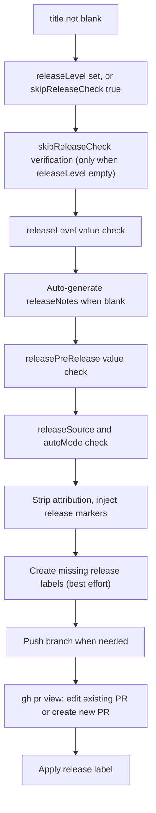
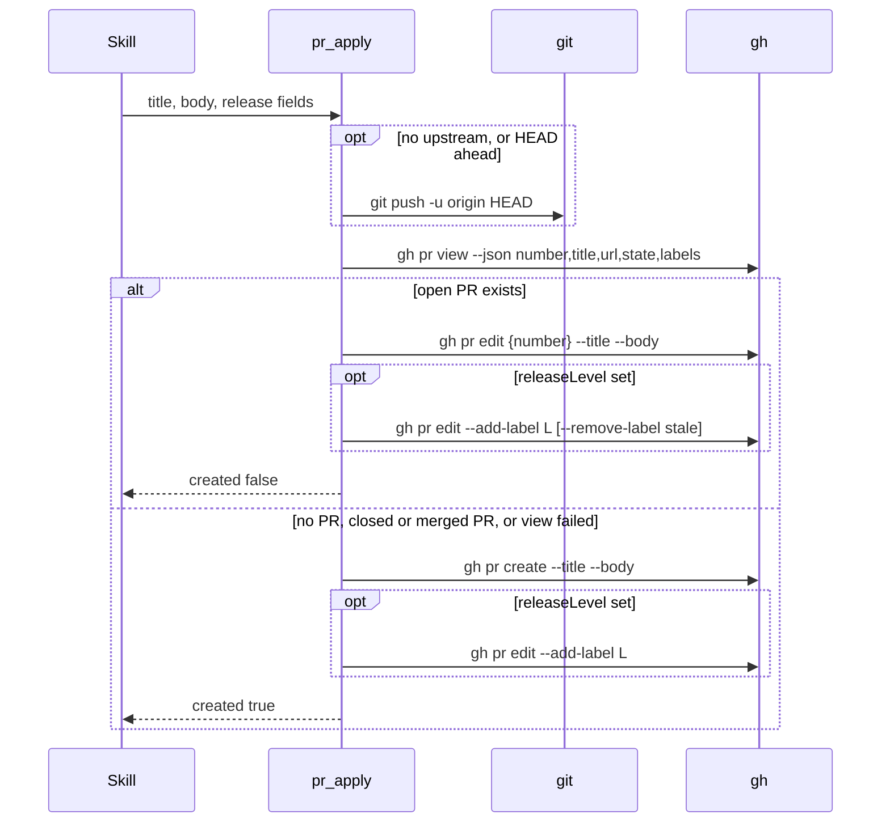

# tool-pr-apply Specification

## Purpose
MCP tool `pr_apply` pushes the current branch when needed and creates or updates its pull request with `gh`, recording release intent (label plus body markers) when a release level is given. The `pr` skill calls it after user approval. Output follows docs/mcp-output-contract.md.

## Requirements

### Requirement: Input fields
The tool SHALL accept the input fields below and check every value in the handler.

| Field | Type | Required | Encoding | Meaning |
|---|---|---|---|---|
| `title` | string | yes; blank is rejected | plain text, e.g. `feat: add login` | PR title |
| `body` | string | optional at call time; may be empty | Markdown text | PR body |
| `releaseLevel` | string, enum `major` / `minor` / `patch` | no | plain text, e.g. `patch` | Release bump level to record |
| `releasePreRelease` | string, enum `rc` | no | plain text, e.g. `rc` | Mark the release as a release candidate |
| `releaseNotes` | string | no | Markdown text | Notes placed in the body; auto-generated when blank |
| `releaseSource` | string, enum `user` / `config` | when `releaseLevel` is set | plain text, e.g. `config` | Who decided `releaseLevel` |
| `autoMode` | boolean | optional at call time; missing = `false` | JSON boolean | Unattended call; no human can confirm |
| `skipReleaseCheck` | boolean | no | JSON boolean | Acknowledge no release intent; ignored when `releaseLevel` is set |
| `skipReleaseReason` | string | see skip-check verification | plain text | Why release-worthy commits ship without a release |

- The advertised schema, including enums, is not enforced at call time; the handler checks the values.

#### Scenario: Minimal no-release call
- **WHEN** `pr_apply` is called with `title`, `body`, and `skipReleaseCheck: true`
- **AND** commits since the last release tag are all `other`
- **THEN** the PR is created or updated with no release label

### Requirement: Output fields and next hint
The tool SHALL return `url`, `created`, `releaseIntent` (only when `releaseLevel` is set), and `next`.

| Field | Meaning |
|---|---|
| `url` | PR URL |
| `created` | `true` when a new PR was created; `false` when an existing PR was edited |
| `releaseIntent.level` | The `releaseLevel` recorded |
| `releaseIntent.preRelease` | `rc` or absent |
| `releaseIntent.labelApplied` | `release:<level>` or `release:<level>-rc` |
| `releaseIntent.labelsRemoved` | Stale `release:*` labels removed; empty list, never null |
| `releaseIntent.notesInBody` | Release notes are in the body; always `true` when `releaseLevel` is set, because blank notes are auto-generated |

| Case | `next` |
|---|---|
| Created, no release | `PR created. If verify-pipeline is configured, call verify_pipeline_classify next.` |
| Updated, no release | `PR updated. If verify-pipeline is configured, call verify_pipeline_classify next.` |
| Release set | `<PR created.\|PR updated.> Release intent recorded as <labelApplied>; CI computes the concrete version at merge time from the tags present then, so do not report a version number for this PR. If verify-pipeline is configured, call verify_pipeline_classify next.` |

#### Scenario: Update with release
- **WHEN** an existing PR is updated with `releaseLevel` `patch`
- **THEN** `created` is `false`
- **AND** `next` is `PR updated. Release intent recorded as release:patch; CI computes the concrete version at merge time from the tags present then, so do not report a version number for this PR. If verify-pipeline is configured, call verify_pipeline_classify next.`

### Requirement: Processing order
The tool SHALL finish all input checks before it pushes or calls `gh pr create` / `gh pr edit`.

Order of steps; any failed check ends the call with an error:



- Steps E, I, and L, and the marker part of step H, run only when `releaseLevel` is set.

#### Scenario: Bad input never reaches the remote
- **WHEN** `releaseSource` is missing while `releaseLevel` is set
- **THEN** no push and no `gh pr` command runs

### Requirement: Title required
The tool SHALL reject a blank or whitespace-only `title`.

| Condition | Class | Message / Suggestion (short) |
|---|---|---|
| `title` blank | `DomainError` | `title is required` / `Pass a non-empty title: use the prTitle value from pr_prepare, or draft one from the branch's commits.` |

#### Scenario: Whitespace title
- **WHEN** `title` is `"  "`
- **THEN** the tool returns a `DomainError` with message `title is required`

### Requirement: Release intent is never skipped by omission
The tool SHALL reject a call where `releaseLevel` is empty and `skipReleaseCheck` is `false`.

| Condition | Class | Message / Suggestion (short) |
|---|---|---|
| No `releaseLevel`, no `skipReleaseCheck` | `DomainError` | `releaseLevel is empty and skipReleaseCheck is false` / set `releaseLevel`, or pass `skipReleaseCheck: true` |

#### Scenario: Neither field set
- **WHEN** `pr_apply` is called with only `title` and `body`
- **THEN** the tool returns a `DomainError` whose message contains `releaseLevel is empty`
- **AND** the suggestion mentions `skipReleaseCheck: true`

### Requirement: skipReleaseCheck verification
The tool SHALL verify `skipReleaseCheck` against commits since the last release tag when `releaseLevel` is empty.

- Commits: `git log --oneline <highest v?X.Y.Z tag>..HEAD`, or full history when no such tag exists.
- Each subject is classified like `pr_prepare`'s `conventionalSummary`: `breaking` (contains `breaking change` or `!:`), `feat`, `fix`, else `other`.

| Commits since tag | `autoMode` | `skipReleaseReason` | Result |
|---|---|---|---|
| Only `other` (or none) | any | any | Skip accepted |
| Any `feat` / `fix` / `breaking` | `true` | any | `DomainError` `skipReleaseCheck is not allowed unattended: commits since the last tag include feat/fix/breaking changes` |
| Any `feat` / `fix` / `breaking` | `false` | blank | `DomainError` `skipReleaseCheck requires skipReleaseReason: commits since the last tag include feat/fix/breaking changes` |
| Any `feat` / `fix` / `breaking` | `false` | set | Skip accepted |
| `git log` fails | any | any | `InfraError` `gitLogSinceTag: <error>` / check for a shallow clone (`git fetch --unshallow`) |

- Both `DomainError` suggestions name the suggested level: `Set releaseLevel (suggested: <level>) …`.

#### Scenario: Unattended skip with a feat commit
- **WHEN** `skipReleaseCheck` and `autoMode` are `true`
- **AND** a commit since the last tag is `feat: add widget`
- **THEN** the tool returns a `DomainError` containing `not allowed unattended`

#### Scenario: Interactive skip needs a reason
- **WHEN** `skipReleaseCheck` is `true`, `autoMode` is `false`, and `skipReleaseReason` is blank
- **AND** a commit since the last tag is `fix: correct bug`
- **THEN** the tool returns a `DomainError` containing `skipReleaseReason`

#### Scenario: Interactive skip with a reason
- **WHEN** `skipReleaseReason` is `docs-only follow-up, release tracked separately`
- **AND** a commit since the last tag is `feat: add widget`
- **THEN** the PR is created

#### Scenario: Only chores
- **WHEN** `skipReleaseCheck` is `true` and the only commit is `chore: tidy up`
- **THEN** the PR is created

### Requirement: Release field validation
The tool SHALL validate `releaseLevel`, `releasePreRelease`, and `releaseSource`, and SHALL reject `releaseSource: "user"` when `autoMode` is `true`.

| Condition | Class | Message / Suggestion (short) |
|---|---|---|
| `releaseLevel` not `major` / `minor` / `patch` | `DomainError` | `releaseLevel must be major, minor, or patch, got "<value>"` / `Set releaseLevel to exactly one of major, minor or patch, or omit it and set releaseSkipReason instead.` |
| `releasePreRelease` not empty and not `rc` (checked even without `releaseLevel`) | `DomainError` | `releasePreRelease must be "rc" or empty, got "<value>"` |
| `releaseLevel` set, `releaseSource` empty | `DomainError` | `releaseSource is required when releaseLevel is set (must be "user" or "config")` |
| `releaseLevel` set, `releaseSource` other value | `DomainError` | `releaseSource must be "user" or "config", got "<value>"` |
| `releaseLevel` set, `autoMode` `true`, `releaseSource` `user` | `DomainError` | `releaseLevel in auto mode must come from config, not LLM` / use `releaseSource: "config"` |

- `releaseSource` is not checked when `releaseLevel` is empty.

#### Scenario: Invalid source
- **WHEN** `releaseLevel` is `major` and `releaseSource` is `pipeline`
- **THEN** the tool returns an error mentioning `releaseSource`

#### Scenario: Auto mode with user source
- **WHEN** `autoMode` is `true`, `releaseLevel` is `patch`, and `releaseSource` is `user`
- **THEN** the tool returns an error mentioning `auto mode`

#### Scenario: Auto mode with config source
- **WHEN** `autoMode` is `true`, `releaseLevel` is `minor`, and `releaseSource` is `config`
- **THEN** `releaseIntent` is returned

#### Scenario: Interactive user source
- **WHEN** `autoMode` is `false`, `releaseLevel` is `patch`, and `releaseSource` is `user`
- **THEN** `releaseIntent` is returned

### Requirement: Release notes auto-generation
The tool SHALL generate `releaseNotes` from commits since the last release tag when `releaseLevel` is set and `releaseNotes` is blank or whitespace-only.

Generated notes layout (empty groups are left out):

```text
Release notes (<level>)

Breaking changes:
- <subject>

Features:
- <subject>

Fixes:
- <subject>

Other changes:
- <subject>
```

- Commits come from the same `git log` range as the skip-check verification; subjects drop the leading sha.
- No commits: `Release notes (<level>)` followed by `No commits found since the last release tag.`
- A `git log` failure returns `InfraError` `gitLogSinceTag: <error>` with a suggestion to pass `releaseNotes` explicitly.

#### Scenario: Blank notes
- **WHEN** `releaseLevel` is `patch` and `releaseNotes` is empty
- **AND** commits since the tag are `feat: add widget` and `fix: correct bug`
- **THEN** the PR body contains `add widget` and `correct bug`
- **AND** `releaseIntent.notesInBody` is `true`

#### Scenario: Whitespace notes
- **WHEN** `releaseNotes` is `"   \n\t"`
- **THEN** notes are auto-generated

### Requirement: Attribution stripping
The tool SHALL remove AI-tool attribution lines from `body` on every call, with or without a release.

- A line is removed when it matches any of: `Generated with [Claude Code]`, `🤖 Generated with`, `Created by Claude`, `Created with Claude`, `Co-Authored-By:` + `Claude`, `Co-Authored-By:` + `Anthropic`, `Generated by` + `Claude`, `Powered by` + `Claude`.
- Runs of blank lines left behind collapse to one blank line.
- The body ends with exactly one newline.

#### Scenario: Footer removed
- **WHEN** `body` ends with `🤖 Generated with [Claude Code](https://claude.com/claude-code)`
- **THEN** the body sent to `gh` has no such line

#### Scenario: Markers survive
- **WHEN** `body` already holds `<!-- release-level:patch -->` markers
- **THEN** attribution stripping leaves them unchanged

### Requirement: Release markers in the body
The tool SHALL append a release block to the body when `releaseLevel` is set, replacing any earlier release block.

```text
<PR body>

---
<!-- release-level:<level> -->
<!-- release-pre:rc -->
<!-- release-notes-start -->
## [Unreleased]

<release notes>
<!-- release-notes-end -->
```

- The `<!-- release-pre:rc -->` line appears only when `releasePreRelease` is `rc`.
- An earlier block is found at the last `\n---\n` followed by `<!-- release-level:` or `<!-- release-notes-start`; everything from there is replaced.
- The notes heading is always `## [Unreleased]`; no version number or RC number is written.

#### Scenario: Patch release body
- **WHEN** `releaseLevel` is `patch` and `releaseNotes` is `Fixed the bug in auth module.`
- **THEN** the body contains `<!-- release-level:patch -->`, `<!-- release-notes-start -->`, `## [Unreleased]`, and the notes

#### Scenario: RC marker
- **WHEN** `releaseLevel` is `minor` and `releasePreRelease` is `rc`
- **THEN** the body contains `<!-- release-level:minor -->` and `<!-- release-pre:rc -->`

#### Scenario: No version pinned
- **WHEN** tags `v1.4.9` and `v1.4.10-rc1` exist and `releaseLevel` is `patch` with `releasePreRelease` `rc`
- **THEN** the body contains neither `1.4.10` nor `-rc2`

### Requirement: Release label creation
The tool SHALL create any missing release labels in the repository, best effort, when `releaseLevel` is set.

| Label | Color | Description |
|---|---|---|
| `release:patch` | `0E8A16` | Patch release |
| `release:minor` | `1D76DB` | Minor release |
| `release:major` | `D93F0B` | Major release |
| `release:patch-rc` | `BFD4F2` | Patch release candidate |
| `release:minor-rc` | `C5DEF5` | Minor release candidate |
| `release:major-rc` | `FCD8D4` | Major release candidate |

- Lists labels with `gh label list --json name --limit 200`; creates each missing one with `gh label create <name> --color <color> --description <description>`.
- A list failure skips creation; a create failure does not stop the other creates; neither fails the call.

#### Scenario: Two labels exist
- **WHEN** only `release:patch` and `release:minor` exist
- **THEN** only the other four labels are created

#### Scenario: gh cannot list labels
- **WHEN** `gh label list` fails
- **THEN** no label is created and the call continues

### Requirement: Push before create or edit
The tool SHALL run `git push -u origin HEAD` when the branch has no upstream or is ahead of it, and SHALL skip the push when the upstream is caught up.

| Condition | Class | Message / Suggestion (short) |
|---|---|---|
| Upstream check fails | `InfraError` | `checking upstream: <error>` |
| Commits-ahead check fails | `InfraError` | `checking commits ahead of upstream: <error>` |
| Push fails | `InfraError` | `git push: <error>` / push manually with `git push -u origin HEAD`, retry `pr_apply` |

#### Scenario: No upstream
- **WHEN** the branch has no upstream
- **THEN** the tool pushes to `origin`

#### Scenario: Upstream behind
- **WHEN** HEAD is 2 commits ahead of the upstream
- **THEN** the tool pushes

#### Scenario: Caught up
- **WHEN** HEAD is 0 commits ahead of the upstream
- **THEN** no push runs

### Requirement: Create or update the PR
The tool SHALL edit the current branch's PR when `gh pr view` finds one with state `OPEN`, and create a new PR otherwise.

Remote interaction after input checks pass:



- Edit path: `url` is `gh pr edit` output, or the PR's known URL when that output is empty.
- Create path: `url` is `gh pr create` output.
- Any `gh pr view` failure is treated as "no PR", so the create path runs.
- A `CLOSED` or `MERGED` PR is also treated as "no PR". With no open PR, `gh pr view` returns the branch's newest closed or merged PR.
- `gh pr create` / `gh pr edit` failures return `InfraError` `gh pr create: <error>` / `gh pr edit: <error>` with suggestion `Run gh auth status to confirm gh is logged in, check network access to GitHub, then call pr_apply again with the same arguments.` (permission errors differ, see below).

#### Scenario: No existing PR
- **WHEN** no PR exists for the branch
- **THEN** `created` is `true` and `url` is the new PR URL
- **AND** `next` contains `PR created`

#### Scenario: Existing PR
- **WHEN** open PR 9 exists for the branch
- **THEN** `created` is `false`
- **AND** `next` contains `PR updated`

#### Scenario: Closed or merged PR on a reused branch
- **WHEN** `gh pr view` returns PR 9 with state `CLOSED` or `MERGED`
- **THEN** the tool runs `gh pr create`, not `gh pr edit`
- **AND** `created` is `true` and `url` is the new PR URL

#### Scenario: Network error
- **WHEN** `gh pr create` fails with `connection reset by peer`
- **THEN** the tool returns an `InfraError` whose message keeps `connection reset by peer`
- **AND** the suggestion is the generic retry text

### Requirement: Release label on the PR
The tool SHALL apply `releaseIntent.labelApplied` with `gh pr edit --add-label`, and on an existing PR SHALL remove every other release label in the same call.

- Stale labels: labels on the existing PR that are one of the six release labels and not `labelApplied`, sorted.
- With stale labels: `gh pr edit --add-label <label> --remove-label <a>,<b>`; without: `gh pr edit --add-label <label>`.
- The create path never sends `--remove-label`.
- Other labels, including unknown ones like `release:foo`, are never removed.
- Result: a PR carries at most one release label after the call.

| Condition | Class | Message / Suggestion (short) |
|---|---|---|
| Label call fails (not a permission error) | `InfraError` | `gh pr edit --add-label[ --remove-label]: <error>` / create the label if missing; the PR was already created or updated; fix by hand with the exact `gh pr edit --add-label … [--remove-label …]` command; retry `pr_apply` |

- On this error the PR already exists but `url` is not returned.

#### Scenario: Replace a stale label
- **WHEN** the existing PR has labels `release:patch-rc` and `bug`
- **AND** `releaseLevel` is `minor` with `releasePreRelease` `rc`
- **THEN** gh runs `pr edit --add-label release:minor-rc --remove-label release:patch-rc`
- **AND** `releaseIntent.labelsRemoved` is `release:patch-rc`

#### Scenario: Two stale labels
- **WHEN** the existing PR has `release:patch-rc` and `release:minor`, and `releaseLevel` is `major`
- **THEN** `--remove-label` is `release:minor,release:patch-rc`

#### Scenario: Same label again
- **WHEN** the existing PR already has `release:minor-rc` and the same intent is applied
- **THEN** no `--remove-label` is sent and `labelsRemoved` is empty

#### Scenario: Changed intent on re-run
- **WHEN** `pr_apply` runs with `patch` + `rc`, then again with `minor` + `rc`, on the same PR
- **THEN** the PR ends with exactly one release label, `release:minor-rc`

#### Scenario: Label error on create path
- **WHEN** the label call fails after `gh pr create` succeeds
- **THEN** the error message starts with `gh pr edit --add-label: `
- **AND** neither message nor suggestion mentions `--remove-label`

### Requirement: Permission error guidance
The tool SHALL turn a gh permission error from `gh pr create`, `gh pr edit`, or the label call into an `InfraError` with account-switch guidance.

- Permission error: error text contains `must be a collaborator`, `403`, or `Resource not accessible`.
- Message: `<command>: <gh error>`.
- Suggestion: `Active gh account: <active>`, `Cannot access: <owner>/<repo>`, one `Try: gh auth switch --user <login>` per local gh account (or `Run: gh auth login --hostname github.com`), then `After switching, call pr_apply again with the same arguments.`
- `<owner>/<repo>` comes from `git remote get-url origin`; when there is no parsable `origin`, the command's non-permission error is returned instead (the generic retry suggestion for `gh pr create` / `gh pr edit`, the label suggestion for the label call).

#### Scenario: Not a collaborator
- **WHEN** `gh pr create` fails with `HTTP 403: Must be a collaborator to create pull requests`
- **AND** `origin` is `https://github.com/acme/widgets.git` and `other-user` is logged in locally
- **THEN** the suggestion contains `gh auth switch --user other-user` and `acme/widgets`
- **AND** the suggestion contains `call pr_apply again with the same arguments`

#### Scenario: No origin remote
- **WHEN** `gh pr create` fails with a 403 and there is no `origin` remote
- **THEN** the suggestion is the generic retry text

### Requirement: Intent only, no version
The tool SHALL record release intent only and SHALL NOT compute or write a version number.

- The tool does not read the version config or version file.
- An existing tag for a would-be version does not block the call.
- A missing or broken version file does not block the call.
- CI computes the version at merge time.

#### Scenario: Existing tag does not block
- **WHEN** tag `rel-1.3.0` exists and `releaseLevel` is `minor`
- **THEN** the call succeeds

#### Scenario: Broken version file does not block
- **WHEN** the version file cannot be read and `releaseLevel` is `patch`
- **THEN** the call succeeds

### Requirement: Roots and annotations
The tool SHALL run all git and gh commands in the active worktree, falling back to the main worktree root.

| Condition | Class | Message / Suggestion (short) |
|---|---|---|
| Neither root nor working directory resolves | `InfraError` | `resolve project root: <error>` / check the working directory exists, retry `pr_apply` |

| Annotation | Value |
|---|---|
| Title | `Create or update pull request` |
| `ReadOnly` | `false` |
| `Destructive` | `true` |
| `Idempotent` | `false` |
| `OpenWorld` | `true` |

#### Scenario: Linked worktree
- **WHEN** `pr_apply` runs inside a linked git worktree
- **THEN** the push and `gh` commands target that worktree's branch
