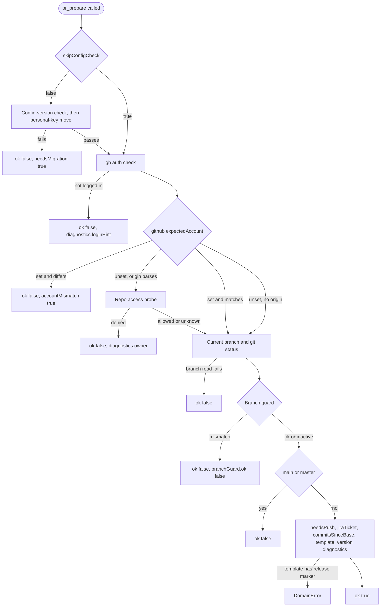

# tool-pr-prepare Specification

## Purpose
MCP tool `pr_prepare` runs the preflight checks for the `pr` skill and returns the context the skill needs to draft a pull request (auth state, branch state, commits, PR template, version diagnostics). Output follows docs/mcp-output-contract.md.

## Requirements

### Requirement: Input fields
The tool SHALL accept the input fields `skipConfigCheck` and `expectedBranch`.

| Field | Type | Required | Encoding | Meaning |
|---|---|---|---|---|
| `skipConfigCheck` | boolean | optional at call time; missing = `false` | JSON boolean, e.g. `false` | Skip the config-version check and the personal-key move |
| `expectedBranch` | string | no | plain text, e.g. `feat/add-login` | Branch the caller expects to be on; turns on the branch guard |

- The advertised schema is not enforced at call time; a missing field arrives as its zero value.

#### Scenario: Minimal call
- **WHEN** `pr_prepare` is called with no arguments
- **THEN** the config check runs and the branch guard is inactive

### Requirement: Preflight order and failure shape
The tool SHALL run its checks in a fixed order and report every preflight failure as a normal result with `ok` `false`, a non-empty `errors` list, and a `next` hint.

Order of checks and where each one stops:

- `ok` is `true` only when every check passed and `errors` is empty.
- Every exit after the config check, including the not-logged-in, account-mismatch, and repo-access-denied exits, returns the `warnings` collected before it.
- Only two conditions return a tool error instead of a result: a template with a release marker (`DomainError`) and an unresolvable project root (`InfraError`).

#### Scenario: Failure is a payload
- **WHEN** any preflight check fails
- **THEN** the tool returns a result, not a tool error
- **AND** `ok` is `false` and `errors` explains the failure

#### Scenario: Warnings kept on auth failure
- **WHEN** the personal-key move produced a warning
- **AND** the gh auth check, the expected-account check, or the repo access probe then fails
- **THEN** `warnings` still contains the `Moved personal settings` line

### Requirement: Config-version check and personal-key move
The tool SHALL check the project config version and move personal keys from `.sdlc-v2/config.toml` to `.sdlc-v2/local.toml` unless `skipConfigCheck` is `true`.

| Moved key in `config.toml` | New place in `local.toml` |
|---|---|
| `pr.expectedAccount` | `[github] expectedAccount` |
| `execute.auto` | `[executePrefs] auto` |
| `execute.quality` | `[executePrefs] quality` |
| `execute.highRiskAutoApprove` | `[executePrefs] highRiskAutoApprove` |

- The move writes `.sdlc-v2/local.toml` first, then `.sdlc-v2/config.toml`.
- A stale config, or an unsafe key move, sets only `errors`, `needsMigration`, and `next`; no other check runs.

| Condition | `errors` | Other fields |
|---|---|---|
| `.sdlc-v2` exists without `config.toml` | `config-version: <reason>` | `needsMigration: true` |
| Key move is not safe | `Cannot move personal settings from .sdlc-v2/config.toml to .sdlc-v2/local.toml automatically: <reason>` (plus one line per key), then `Move each listed key into .sdlc-v2/local.toml under the new section by hand, delete it from .sdlc-v2/config.toml, then run the command again.` | `needsMigration: true` |
| Keys moved | none | warning starting `Moved personal settings from .sdlc-v2/config.toml to .sdlc-v2/local.toml:` |

#### Scenario: Stale config short-circuits
- **WHEN** the config-version check fails
- **THEN** `ok` is `false` and `needsMigration` is `true`
- **AND** `next` is `Fix the errors above, then call pr_prepare again.`

#### Scenario: Unsafe key move
- **WHEN** `local.toml` already has a different value for `[github] expectedAccount`
- **THEN** `errors` has two entries: the error, then the suggestion starting `Move each listed key`
- **AND** `needsMigration` is `true`

#### Scenario: Keys moved
- **WHEN** `config.toml` holds `pr.expectedAccount` and the move succeeds
- **THEN** `warnings` contains a line with `Moved personal settings`
- **AND** the remaining checks run

#### Scenario: Check skipped
- **WHEN** `skipConfigCheck` is `true`
- **THEN** neither the config-version check nor the key move runs

### Requirement: GitHub CLI authentication
The tool SHALL probe the active gh account with `gh api user --jq .login --hostname github.com` and stop when it fails.

| Output field | Value on this path |
|---|---|
| `ghAuthenticated` | `false` |
| `errors` | the probe message, e.g. `Not logged in to github.com. Run: gh auth login --hostname github.com` |
| `diagnostics.candidates` | locally logged-in gh accounts (`login`, `active`) |
| `diagnostics.loginHint` | `gh auth login --hostname github.com` |
| `next` | `Fix the errors above, then call pr_prepare again.` |

- `tokenExpired` is always `false`; the tool cannot tell an expired token from no login.

#### Scenario: Not logged in
- **WHEN** `gh api user` fails
- **THEN** `ok` and `ghAuthenticated` are `false`
- **AND** `diagnostics.loginHint` is set

### Requirement: Expected account check
The tool SHALL compare the active gh account with `[github] expectedAccount` from `.sdlc-v2/local.toml`, ignoring case, and stop on a mismatch.

| Condition | Result |
|---|---|
| `expectedAccount` set, active account differs | `accountMismatch: true`; error `Expected gh account: <expected>` / `Active gh account:   <active>` / `Run: gh auth switch --user <expected>` |
| Mismatch diagnostics | `diagnostics.switchHint` `gh auth switch --user <expected>`; `diagnostics.matchedAccount` names a logged-in account that matches; `diagnostics.loginHint` only when none matches |
| `[github]` section missing | treated as not configured; no unreadable warning |
| `[github]` section unreadable | warning `local.toml [github] section unreadable: <error>; skipping expected-account check` |

- `expectedAccount` in the output echoes the trimmed configured value.

#### Scenario: Account mismatch
- **WHEN** the active account is `wronguser` and `expectedAccount` is `correctuser`
- **AND** `correctuser` is logged in locally
- **THEN** `accountMismatch` is `true` and `diagnostics.matchedAccount` is `correctuser`
- **AND** `next` is `Switch GitHub account, then call pr_prepare again.`

#### Scenario: Unreadable local.toml
- **WHEN** reading `[github]` fails with a TOML parse error
- **THEN** `warnings` contains `local.toml [github] section unreadable`

### Requirement: Repository access probe
The tool SHALL probe repository access only when no `expectedAccount` is configured and the `origin` remote URL parses to an owner and repo.

| Condition | Result |
|---|---|
| Probe runs | `gh api repos/<owner>/<repo> --hostname github.com -i --silent`; `repoAccessProbed: true`; `repoAccessible` set when known; `repoAccessStatus` set whenever an HTTP status was received |
| HTTP 200 | `repoAccessible: true`; the call continues |
| Access denied (HTTP 403 or 404, read from the stdout status line or from gh's `(HTTP <code>)` stderr error) | stop; `repoAccessible: false`; error lists `Active gh account: <a>`, `Cannot access: <owner>/<repo>`, then `Try: gh auth switch --user <login>` per account or `Run: gh auth login --hostname github.com`; `diagnostics.owner` set |
| Result unknown (no HTTP response, e.g. a network failure, or any other HTTP status) | `repoAccessible` unset; warning `Repo access probe failed (<reason>) — proceeding without access verification.`; `<reason>` is gh's first stderr line or `unexpected HTTP <code> from gh api`, and defaults to `network error` |
| No `expectedAccount` and no parsable `origin` | warning `Could not resolve expected gh account (no [github] expectedAccount in .sdlc-v2/local.toml, no origin remote). Skipping active-account check.`; no probe |

#### Scenario: Remote present
- **WHEN** `expectedAccount` is unset and `origin` is `git@github.com:acme/widgets.git`
- **THEN** `repoAccessProbed` is `true`

#### Scenario: Repository not visible to the active account
- **WHEN** `gh api repos/acme/widgets` answers HTTP 404 and exits 1
- **THEN** `ok` is `false`, `repoAccessible` is `false`, and `repoAccessStatus` is `404`
- **AND** `errors` contains `Cannot access: acme/widgets`

#### Scenario: Network failure during the probe
- **WHEN** `gh api repos/acme/widgets` fails with `error connecting to api.github.com` and no HTTP response
- **THEN** `repoAccessible` is unset and the remaining checks run
- **AND** `warnings` contains `Repo access probe failed (error connecting to api.github.com)`

#### Scenario: No remote
- **WHEN** `expectedAccount` is unset and there is no `origin` remote
- **THEN** `repoAccessProbed` is `false`
- **AND** `warnings` contains the `Could not resolve expected gh account` line

### Requirement: Branch state
The tool SHALL report the current branch and uncommitted files from `git status --porcelain`.

- `currentBranch`: the checked-out branch.
- `dirtyFiles`: only trailing whitespace is trimmed from the `git status --porcelain` output, so the first line keeps a leading status space (e.g. ` M a.go`); each non-empty line longer than 3 characters then adds the text after its first 3 characters; `uncommittedChanges` is `true` when the list is not empty.
- A failed `git status` leaves both fields empty and adds no warning.
- A failed current-branch read stops the call with the git error in `errors`.
- Uncommitted files add the warning `Uncommitted changes detected (<N> file(s)). They will NOT be included in the PR.` (only after the branch guard and protected-branch checks pass).

#### Scenario: Dirty tree
- **WHEN** two files are modified and not committed
- **THEN** `uncommittedChanges` is `true` and `dirtyFiles` has 2 entries
- **AND** `warnings` contains `Uncommitted changes detected (2 file(s)).`

#### Scenario: First entry is an unstaged change
- **WHEN** `git status --porcelain` prints ` M a.go` then ` M b.go`
- **THEN** `dirtyFiles` is `a.go`, `b.go`, with no path character lost from the first entry

### Requirement: Branch guard
The tool SHALL reject the call when `expectedBranch` is set and differs from the current branch, before the protected-branch check.

- `branchGuard` is always returned once the current branch is known: `ok`, `active`, `currentBranch`, `expectedBranch`, `message`.
- Empty `expectedBranch`: `branchGuard.active` is `false`, `branchGuard.ok` is `true`.
- Mismatch message: `Branch mismatch: expected '<expected>' but current is '<current>'. The pipeline is configured to operate on '<expected>'. Refusing to proceed to avoid orphaning commits on the wrong branch (issues #347, #348, #349).`
- On a detached HEAD, `currentBranch` is `HEAD`.

#### Scenario: Branch mismatch
- **WHEN** `expectedBranch` is `feat/expected-branch` and the current branch is `feat/actual-branch`
- **THEN** `ok` is `false` and `branchGuard.ok` is `false`
- **AND** `errors` contains `Branch mismatch`

#### Scenario: Guard inactive
- **WHEN** `expectedBranch` is empty
- **THEN** `branchGuard.active` is `false`

### Requirement: Protected branch rejection
The tool SHALL reject the call when the current branch is literally `main` or `master`.

- Error: `You are on the <branch> branch. Switch to a feature branch before creating a PR.`
- The check uses the names `main` and `master` only, not the repository's detected default branch.

#### Scenario: On main
- **WHEN** the current branch is `main`
- **THEN** `ok` is `false`
- **AND** `errors` contains `You are on the main branch.`

### Requirement: Push status
The tool SHALL report in `needsPush` whether `pr_apply` will need to push, and SHALL never push itself.

| Git state | `needsPush` | Warning |
|---|---|---|
| No upstream (`git rev-parse --abbrev-ref @{upstream}` exits 128) | `true` | none |
| Upstream set, `git rev-list --count @{upstream}..HEAD` > 0 | `true` | none |
| Upstream set, 0 commits ahead | `false` | none |
| Upstream check fails | `true` | `upstream check: <error>` |
| Commits-ahead check fails | `true` | `commits ahead: <error>` |

#### Scenario: No upstream
- **WHEN** the branch has no upstream
- **THEN** `needsPush` is `true`
- **AND** the commits-ahead check does not run

#### Scenario: Caught up
- **WHEN** the upstream exists and HEAD is 0 commits ahead
- **THEN** `needsPush` is `false`

### Requirement: Jira ticket detection
The tool SHALL set `jiraTicket` to the first Jira key found in the current branch name, or leave it empty.

- A key matches `[A-Z]{2,10}-<digits>` on word boundaries.
- Commit messages are not searched.

#### Scenario: Key in branch name
- **WHEN** the current branch is `feat/PROJ-123-add-thing`
- **THEN** `jiraTicket` is `PROJ-123`

### Requirement: Commits since base
The tool SHALL list this branch's commits since the default branch in `commitsSinceBase`, oldest first, whether or not a version config exists.

- Command: `git log --oneline --reverse <defaultBranch>..HEAD`.
- Each entry is one `--oneline` line: `<short sha> <subject>`.
- Default branch: `origin/HEAD` target, else local `main`, else local `master`.
- Skipped when the default branch equals the current branch.
- An undetectable default branch or a failed `git log` adds the warning `commitsSinceBase: <error>`.

#### Scenario: Three commits ahead
- **WHEN** the branch has commits `feat: first commit`, `fix: second commit`, `chore: third commit` in that order
- **THEN** `commitsSinceBase` is `aaa1111 feat: first commit`, `bbb2222 fix: second commit`, `ccc3333 chore: third commit`

### Requirement: PR template resolution
The tool SHALL load the project PR template from `.sdlc-v2/pr-template.md`, falling back to `.claude/pr-template.md`, both under the main worktree root.

| Output field | Meaning |
|---|---|
| `template.path` | Absolute path of the file used |
| `template.legacy` | `true` when the file came from `.claude/pr-template.md` |
| `template.headings` | Text of every line starting with `## `, in order, without the `## ` prefix |
| `template.content` | Full file content |

- No file at either path: `template` is absent.
- An empty file still counts as found.
- An unreadable file adds the warning `PR template resolution failed: <error>` and `template` is absent.

#### Scenario: Canonical template
- **WHEN** `.sdlc-v2/pr-template.md` has `## Summary` and `## Testing`
- **THEN** `template.headings` is `Summary`, `Testing`

### Requirement: Template release-marker conflict
The tool SHALL fail with a `DomainError` when the resolved template contains a release marker that `pr_apply` injects.

- Conflicting markers: `<!-- release-level:`, `<!-- release-pre:`, `<!-- release-notes-start`, `<!-- release-notes-end`.

| Condition | Class | Message / Suggestion (short) |
|---|---|---|
| Template contains a release marker | `DomainError` | `PR template <path> conflicts with the release markers pr_apply injects: custom PR template contains conflicting release marker "<marker>" …` / delete the conflicting release-marker line from the template |

#### Scenario: Template carries a marker
- **WHEN** `.sdlc-v2/pr-template.md` contains `<!-- release-level: minor -->`
- **THEN** the tool returns a `DomainError`
- **AND** the message names the template path and `release-level`

### Requirement: Version diagnostics gating
The tool SHALL add version diagnostics only when `.sdlc-v2/config.toml` reads cleanly and has a `version` section, and SHALL turn every diagnostic failure into a warning.

| Output field | Meaning |
|---|---|
| `versionConfig` | Resolved `version` section: `preRelease`, `preReleasePolicy`, `method`, `pushAuth`, `tag`, `versionFile`, `changelog` |
| `versionSource` | `path`, `type`, `version` of the current version |
| `tags` | `all`, `atHead`, `latest`, `tagPrefix` |
| `idempotency` | `alreadyBumped`, `tagAtHead` |
| `versionDivergence` | `fileVersion`, `tagVersion`, `message` |
| `bumpOptions` | One entry per level: `level`, `result`, `current`, `rcNext`, `suggestedPreRelease` |
| `existingRCs` | Map: bump result version → existing RC tags for it |
| `commitsSinceTag` | `git log --oneline` lines since the last release tag |
| `conventionalSummary` | `breaking`, `feat`, `fix`, `other`, `total`, `suggest` |
| `changelogExists` | Whether the changelog file exists |
| `defaultBranch` / `onDefaultBranch` | Detected default branch; whether the current branch equals it |

- No `version` section, or a config read error: every field above is absent (`changelogExists` and `onDefaultBranch` are `false`), with no warning.
- Warning prefixes: `defaultBranch:`, `version detection failed:`, `fetchTags:`, `tags:`, `allTags:`, `tagsAtHead:`, `bump <level>:`, `commitsSinceTag:`.
- A version-file read failure stops the diagnostics early: `bumpOptions`, `tags.all`, and `tags.atHead` are empty, and `ok` stays `true`.
- Side effect: `git fetch --tags --force` runs in the active worktree whenever diagnostics run, unless the version-file read fails first.

#### Scenario: No version config
- **WHEN** the config has no `version` section
- **THEN** `versionSource`, `bumpOptions`, `tags`, `commitsSinceTag`, `conventionalSummary`, and `versionConfig` are absent
- **AND** `defaultBranch` is empty

#### Scenario: Version file missing
- **WHEN** `version.versionFile.enabled` is `true` and the file cannot be read
- **THEN** `ok` is `true` and `errors` is empty
- **AND** `warnings` contains `version detection failed`

### Requirement: Version source, tags, and idempotency
The tool SHALL derive the current version, tag inventory, and already-bumped state from the version config and git tags.

| Item | Rule |
|---|---|
| Mode | Tag mode when `version.versionFile.enabled` is `false`; file mode otherwise |
| `versionSource` (file mode) | Read from `version.versionFile.path` / `fileType` under the main worktree root |
| `versionSource` (tag mode) | `type: "tag"`; `version` is the highest release tag without its prefix; `0.0.0` plus warning `no semver tags found; defaulting to 0.0.0 for initial release` when none |
| Release tag | Tag matching `v?X.Y.Z` with no pre-release suffix |
| `tags.all` | All `v?X.Y.Z[-pre]` tags, highest first; `tags.latest` is the first |
| `tags.atHead` | Release tags pointing at HEAD |
| `tags.tagPrefix` | `version.tag.prefix`; else `v` when more than half of `tags.all` start with `v`; else empty |
| `idempotency.alreadyBumped` | `true` when a release tag points at HEAD; `tagAtHead` names the highest |
| `versionDivergence` | Set only when `version.tag.enabled` and the highest release tag is greater than the file version; message `file version <f> is behind remote tag <t>; bump base uses tag version`, also added to `warnings` |
| Bump base | The tag version when diverged, else the current version |
| `commitsSinceTag` | `git log --oneline <highest release tag>..HEAD`; full `git log --oneline` when no release tag exists |
| `changelogExists` | `version.changelog.file`, default `CHANGELOG.md`, exists under the main worktree root |

#### Scenario: RC tag present
- **WHEN** tags are `v1.3.0-rc1` and `v1.2.0` and the version file says `1.2.0`
- **THEN** `tags.all` is non-empty and `versionSource.version` is `1.2.0`
- **AND** `existingRCs["1.3.0"]` lists the RC tag

#### Scenario: Release tag at HEAD
- **WHEN** release tag `v1.2.3` points at HEAD
- **THEN** `idempotency.alreadyBumped` is `true` and `idempotency.tagAtHead` is `v1.2.3`

### Requirement: Bump options and RC suggestion
The tool SHALL return one `bumpOptions` entry per level, in the order `major`, `minor`, `patch`, computed from the bump base; a level whose bump fails is left out with the warning `bump <level>: <error>`.

- `result`: the bump base raised by `level`.
- `current`: the bump base.
- `rcNext`: `<result>-rc<N>`, where `N` is one more than the highest existing `<tagPrefix><result>-rc<n>` tag, or 1.
- `existingRCs[<result>]`: every tag starting with `<tagPrefix><result>-rc`.
- `result` and `rcNext` are a preview only; CI computes the final version at merge time.

`suggestedPreRelease` by `version.preReleasePolicy` (empty policy means `continue-rc`):

| Policy | RC tags exist for `result` | `suggestedPreRelease` |
|---|---|---|
| `always-rc` | any | `rc` |
| `default-rc` | any | `rc` |
| `continue-rc` | yes | `rc` |
| `continue-rc` | no | empty |
| `never` | any | empty |
| unknown value | any | empty |

#### Scenario: Three options
- **WHEN** a version config exists and the version file reads `1.2.0`
- **THEN** `bumpOptions` has exactly 3 entries

#### Scenario: Continue an RC train
- **WHEN** `preReleasePolicy` is `continue-rc` and tag `v1.3.0-rc1` exists
- **AND** the bump base is `1.2.0`
- **THEN** the `minor` entry has `result` `1.3.0`, `rcNext` `1.3.0-rc2`, and `suggestedPreRelease` `rc`

### Requirement: Conventional commit summary
The tool SHALL classify each `commitsSinceTag` subject (the text after the first space) into exactly one bucket, first match wins, ignoring case.

| Bucket | Rule |
|---|---|
| `breaking` | Subject contains `breaking change` or `!:` |
| `feat` | Subject starts with `feat` followed by `(`, `:`, or `!` |
| `fix` | Subject starts with `fix` followed by `(`, `:`, or `!` |
| `other` | Anything else |

- `suggest`: `major` if any breaking, else `minor` if any feat, else `patch`.
- No commits: all counts are 0 and `suggest` is `patch`.

#### Scenario: One feat and one fix
- **WHEN** `commitsSinceTag` is `abc1234 feat: add feature X` and `def5678 fix: correct bug Y`
- **THEN** `conventionalSummary.feat` is 1 and `conventionalSummary.fix` is 1
- **AND** `conventionalSummary.suggest` is `minor`

### Requirement: Next guidance
The tool SHALL set `next` from the first matching row below.

| Condition (first match wins) | `next` |
|---|---|
| `accountMismatch` is `true` | `Switch GitHub account, then call pr_prepare again.` |
| `errors` not empty | `Fix the errors above, then call pr_prepare again.` |
| `idempotency.alreadyBumped` is `true` | `Call pr_apply with title, body, and release fields. Version already bumped at HEAD (tag <tagAtHead>); omit release fields.` |
| `versionConfig` present and `onDefaultBranch` is `false` | `Call pr_apply with title, body, and release fields. PR targets <defaultBranch> — release fields must be forwarded to ship for the release label to be applied on merge.` |
| `conventionalSummary.suggest` not empty | `Call pr_apply with title, body, and release fields. Suggested release level: <suggest>.` |
| otherwise | `Call pr_apply with title, body, and release fields.` |

#### Scenario: Plain success
- **WHEN** all checks pass and no version config exists
- **THEN** `next` is `Call pr_apply with title, body, and release fields.`

#### Scenario: Feature branch with version config
- **WHEN** a version config exists and the default branch is `main`
- **AND** the current branch is not `main`
- **THEN** `next` ends with `PR targets main — release fields must be forwarded to ship for the release label to be applied on merge.`

### Requirement: Roots, side effects, and annotations
The tool SHALL read config, template, version file, and changelog from the main worktree root, and SHALL run git and gh commands in the active worktree.

- The active worktree falls back to the main worktree root.
- The main worktree root falls back to the process working directory.
- Writes: `.sdlc-v2/local.toml` and `.sdlc-v2/config.toml` (key move only); local git tags (`git fetch --tags --force`, version config only).
- Never pushes, never creates or edits a PR.

| Condition | Class | Message / Suggestion (short) |
|---|---|---|
| Neither root nor working directory resolves | `InfraError` | `resolve project root: <error>` / check the working directory exists, retry `pr_prepare` |

| Annotation | Value |
|---|---|
| Title | `Prepare pull request context` |
| `ReadOnly` | `false` |
| `Destructive` | `true` |
| `Idempotent` | `true` |
| `OpenWorld` | `true` |

#### Scenario: Linked worktree
- **WHEN** `pr_prepare` runs inside a linked git worktree
- **THEN** `template` is read from the main worktree root
- **AND** `currentBranch` is the linked worktree's branch
