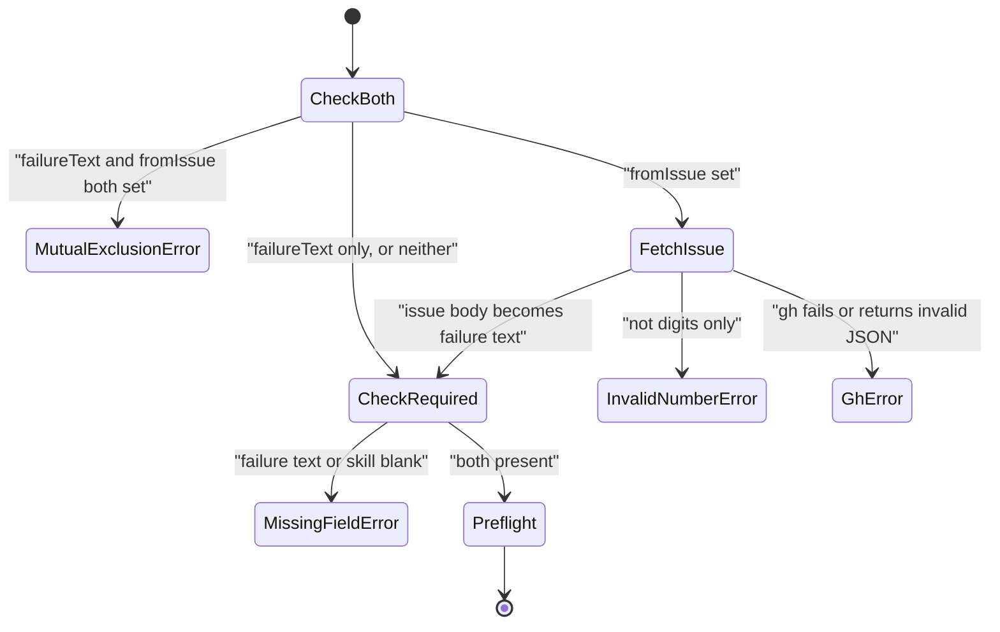

# tool-prepare-orchestrator Specification

## Purpose
`prepare_orchestrator` pre-computes the JSON manifest that the `harden-orchestrator` or `error-report-orchestrator` subagent reads, selected by `mode`. It is internal: the `harden` and `error-report` skills call it. Output follows docs/mcp-output-contract.md.

## Requirements

### Requirement: Mode selection
The tool SHALL run the `harden` pipeline when `mode` is `harden`, the `error_report` pipeline when `mode` is `error_report`, and reject any other value before it resolves any project root.

| `mode` | Pipeline | Manifest temp dir prefix |
|---|---|---|
| `harden` | Hardening context after an SDLC pipeline failure | `sdlc-harden-` |
| `error_report` | Tooling-error issue context | `sdlc-error-report-` |

#### Scenario: Unknown mode
- **WHEN** `prepare_orchestrator` is called with `mode: "bogus"`
- **THEN** it returns a DomainError with message `mode: invalid value "bogus" — must be "harden" or "error_report"`
- **AND** no manifest is written

#### Scenario: Missing mode
- **WHEN** `mode` is empty
- **THEN** it returns a DomainError

### Requirement: Input fields
The tool SHALL accept the fields below and SHALL ignore fields that belong to the other mode.

| Field | Type | Required | Encoding | Meaning |
|---|---|---|---|---|
| `mode` | string | yes | `harden` or `error_report` | Pipeline to run |
| `skill` | string | yes (both modes) | plain text, e.g. `ship` | Skill that was running at failure |
| `step` | string | yes in `error_report`, no in `harden` | plain text | Step that was running |
| `operation` | string | yes in `error_report`, no in `harden` | plain text | Operation being attempted |
| `errorType` | string | no | plain text, e.g. `CLI failure` | Error classification, if known |
| `userIntent` | string | no | plain text | What the user was trying to do |
| `argsString` | string | no | plain text, e.g. `--flag` | Raw invocation arguments |
| `failureText` | string | harden, unless `fromIssue` | plain text | Raw failure text to analyze |
| `exitCode` | string | no (harden) | plain text, e.g. `1` | Exit code at failure |
| `fromIssue` | string | no (harden) | digits only, e.g. `123` | GitHub issue whose body is the failure text |
| `skipConfigCheck` | bool | no (harden) | `true` / `false` | Skip the config-version gate |
| `historyPath` | string | no (harden) | path, e.g. `.sdlc-v2/history` | History store to read run and deferred records from |
| `errorText` | string | yes in `error_report` | plain text | Raw error text to report |
| `exitOrHttpCode` | string | no (error_report) | plain text, e.g. `500` | Exit code or HTTP status |
| `suggestedInvestigation` | string | no (error_report) | plain text | Investigation hints for the issue |

- `exitCode` (harden) and `exitOrHttpCode` (error_report) are two separate fields.

#### Scenario: Other-mode fields do not leak
- **WHEN** `mode` is `harden` and `errorText`, `exitOrHttpCode` and `suggestedInvestigation` are also set
- **THEN** the harden manifest contains none of those values

#### Scenario: Exit code fields stay separate
- **WHEN** `exitCode` is `1` and `exitOrHttpCode` is `500`
- **THEN** harden mode uses `1` and error_report mode uses `500`

### Requirement: Output and manifest file
The tool SHALL write the manifest to `manifest.json` in a new OS temp directory on every successful call and return its path; it SHALL NOT delete the file.

| Field | Meaning |
|---|---|
| `manifestPath` | Absolute path of the written `manifest.json` |
| `mode` | The mode that ran |

- The caller removes the manifest when done.

#### Scenario: Fresh manifest per call
- **WHEN** the tool is called twice with valid `error_report` input
- **THEN** each call returns a different `manifestPath`

### Requirement: Project roots
The tool SHALL resolve the main worktree root in both modes and, in `harden` mode, SHALL also resolve the active worktree root as the content root.

| Root | Used for |
|---|---|
| Main worktree root | error_report git context, config-version gate, pipeline state, CLI evidence, learnings, history |
| Active worktree root (falls back to the working directory, then to the main root) | Guardrails, review dimensions, Copilot instructions, pre-flight, branch and diff summary |

#### Scenario: Not inside a git repository
- **WHEN** the main worktree root cannot be resolved
- **THEN** the tool returns an InfraError with message starting `resolve project root:`

### Requirement: error_report required fields
In `error_report` mode the tool SHALL require non-blank `skill`, `step`, `operation` and `errorText`, and SHALL name every missing one in a single DomainError.

- Message format: one `Missing required field: <field>` per missing field, joined with `; `.

#### Scenario: All required fields missing
- **WHEN** `mode` is `error_report` and no other field is set
- **THEN** the DomainError message names `skill`, `step`, `operation` and `errorText`

#### Scenario: Some required fields missing
- **WHEN** only `skill` and `step` are set
- **THEN** the message names `operation` and `errorText`
- **AND** it does not contain `Missing required field: skill`

### Requirement: error_report manifest content
In `error_report` mode the tool SHALL write a manifest with the fields below.

| Field | Meaning |
|---|---|
| `skill`, `step`, `operation`, `errorType` | Input values, trimmed |
| `errorText`, `exitOrHttpCode`, `userIntent`, `argsString`, `suggestedInvestigation` | Input values, not trimmed; empty string when not given |
| `repository` | Output of `git remote get-url origin` in the main root |
| `currentBranch` | Current branch of the main root |
| `timestamp` | UTC time, RFC 3339 |
| `targetRepo` | Always `rnagrodzki/sdlc-plugin` |
| `labels` | `["tooling-error", "<trimmed skill>"]` |
| `template` | Full text of the shipped `skills/error-report/templates/ToolingError.md`, embedded in the binary |

- A failing git command does not fail the call.
- There is no config-version gate in this mode.

#### Scenario: Trim and raw fields
- **WHEN** `skill` is `"  ship  "` and `errorText` is `"  boom happened  "`
- **THEN** the manifest has `skill: "ship"` and `errorText: "  boom happened  "`
- **AND** `labels` is `["tooling-error", "ship"]`

#### Scenario: Optional fields default to empty
- **WHEN** only the four required fields are set
- **THEN** `exitOrHttpCode`, `errorType`, `userIntent`, `argsString` and `suggestedInvestigation` are empty strings in the manifest

#### Scenario: Template travels in the manifest
- **WHEN** the tool runs in `error_report` mode from a project that has no `skills/error-report/` directory
- **THEN** the manifest `template` field equals the shipped `ToolingError.md` text

### Requirement: harden config-version gate
In `harden` mode, unless `skipConfigCheck` is `true`, the tool SHALL fail with a DataError when the main root has a JSON-era `.sdlc-v2/config.json` but no `config.toml`.

- A project with no `.sdlc-v2` directory passes the gate.
- A `.sdlc-v2` directory that holds only tool data (no `config.toml`, no `config.json`) passes the gate.

#### Scenario: Stale config blocks the run
- **WHEN** `.sdlc-v2/config.json` exists without `config.toml` and `skipConfigCheck` is `false`
- **THEN** the tool returns a DataError with message starting `config-version:`
- **AND** the suggestion says to run the migrate tool or pass `skipConfigCheck: true`

#### Scenario: Gate skipped
- **WHEN** the same project is called with `skipConfigCheck: true`
- **THEN** the gate does not run

### Requirement: harden failure source
In `harden` mode the tool SHALL take the failure text from exactly one of `failureText` or `fromIssue`.

| Condition | Class | Message / Suggestion (short) |
|---|---|---|
| Both `failureText` and `fromIssue` set | DomainError | `--failure-text and --from-issue are mutually exclusive — provide one or the other, not both` |
| `fromIssue` is not digits only (after trim) | DomainError | `--from-issue: invalid issue number "<n>" — must be a positive integer` / pass only the digits |
| `gh issue view <n> --json body,labels,title` fails | InfraError | `--from-issue <n>: gh issue view failed: <err>` / check the issue exists and `gh auth status` |
| `gh` output is not valid JSON | InfraError | `--from-issue <n>: gh issue view returned invalid JSON: <err>` |
| Failure text or `skill` blank | DomainError | `Missing required field: failureText` and/or `Missing required field: skill`, joined with `; ` |

- `gh issue view` runs in the main root.
- When the fetched issue has the label `mcp-failure`, the manifest gets `classification_hint: "plugin-defect"`; otherwise it is `null`.
- The required-field check runs after the issue fetch, so an empty issue body reports `failureText` as missing.

#### Scenario: Mutually exclusive sources
- **WHEN** `failureText` is `boom` and `fromIssue` is `42`
- **THEN** the tool returns a DomainError naming both `--failure-text` and `--from-issue`

#### Scenario: Issue number with a hash
- **WHEN** `fromIssue` is `#42`
- **THEN** the tool returns a DomainError with message `--from-issue: invalid issue number "#42" — must be a positive integer`

#### Scenario: mcp-failure label sets the hint
- **WHEN** `fromIssue` names an issue labelled `mcp-failure`
- **THEN** the manifest `classification_hint` is `plugin-defect`

### Requirement: harden pre-flight validation
In `harden` mode the tool SHALL validate the existing plan guardrails, execute guardrails and review dimensions in the active worktree before building the manifest, and SHALL write no manifest when any check fails.

- Failure: DomainError `pre-flight validation failed: <errors joined with "; ">`.
- Error items look like `existing-plan-guardrails: <msg>`, `existing-execute-guardrails: <msg>` or `existing-review-dimension <file>: <msg>`.
- No guardrail config and no `review-dimensions` directory pass pre-flight.

#### Scenario: Invalid existing guardrail
- **WHEN** the active worktree `.sdlc-v2/config.toml` has an invalid plan guardrail
- **THEN** the tool returns a DomainError starting `pre-flight validation failed:`
- **AND** no `sdlc-harden-*` manifest is left behind

#### Scenario: Pre-flight reads the active worktree
- **WHEN** the main worktree has an invalid guardrail but the active worktree does not
- **THEN** pre-flight passes

### Requirement: harden manifest content
In `harden` mode the tool SHALL write a manifest with the top-level fields below.

| Field | Meaning |
|---|---|
| `failure` | `text` (raw), `skill`, `step`, `operation`, `errorType` (trimmed), `userIntent`, `argsString` (raw), `exitCode` (`null` when empty) |
| `classification_hint` | `plugin-defect` or `null` |
| `surfaces` | `planGuardrails`, `executeGuardrails`, `reviewDimensions`, `copilotInstructions`, `errorReportSkillPath`, `skillRecommendations` |
| `pipeline` | `shipState`, `executeState` (each `null` when absent), `issues` (omitted when none) |
| `repository` | `root` (main), `contentRoot` (active), `branch`, `recentDiffSummary` (`git diff --shortstat HEAD~1..HEAD` in the active worktree) |
| `cliEvidence` | CLI evidence entries (omitted when none) |
| `history` | `recentRuns`, `openDeferred` (omitted when both empty) |
| `pluginRepoUrl` | Always `https://github.com/rnagrodzki/sdlc-plugin` |
| `timestamp` | UTC time, RFC 3339 |
| `errors` | Surface load errors: `{surface, message}` |

#### Scenario: Empty exit code
- **WHEN** `exitCode` is not given
- **THEN** the manifest `failure.exitCode` is `null`

### Requirement: harden surface loading
In `harden` mode the tool SHALL load each surface from the source below and SHALL record a load failure in `errors[]` instead of failing the call.

| Surface id | Source | Notes |
|---|---|---|
| `plan-guardrails` | `plan` guardrails in the active worktree `.sdlc-v2/config.toml` | Empty when the section is missing |
| `execute-guardrails` | `execute` guardrails in the same file | Empty when the section is missing |
| `review-dimensions` | `<active>/.sdlc-v2/review-dimensions/*.md` | Metadata only: `name`, `severity`, `description`, `triggers`, `model`, `path` |
| `copilot-instructions` | `<active>/.github/instructions/*.instructions.md` | `applyTo`, `name`, `path`; a file without front matter is still listed |
| `error-report-skill` | `skills/error-report/REFERENCE.md` under the plugin root | Empty path plus one load error when the file is absent |
| `skill-recommendation` | Learnings log patterns seen 3 or more times | `priority`: `high` at 6+, `medium` at 4-5, `low` at 3 |

#### Scenario: Missing error-report reference
- **WHEN** the plugin root has no `skills/error-report/REFERENCE.md`
- **THEN** `surfaces.errorReportSkillPath` is empty
- **AND** `errors[]` has one entry with `surface: error-report-skill`

#### Scenario: Copilot instruction without front matter
- **WHEN** `.github/instructions/go.instructions.md` has no front matter
- **THEN** it appears in `surfaces.copilotInstructions` with `name: go` and empty `applyTo`

### Requirement: harden pipeline state and CLI evidence
In `harden` mode the tool SHALL read the newest ship and execute state files from the main root on any branch, and the last 20 CLI evidence entries filtered to the active branch.

- `pipeline.shipState`: `paused`, `currentStep`, `lastFailedStep`.
- `pipeline.executeState`: `failedTask`, `failedWave`.
- `pipeline.issues` merges the `issues` of both state files.
- CLI evidence comes from `<main>/.sdlc-v2/evidence/cli-executions.jsonl`; the tool takes the last 20 entries of the file, then drops entries from other branches (all kept when the branch is unknown).

#### Scenario: State from another branch
- **WHEN** the only ship state file belongs to a different branch
- **THEN** `pipeline.shipState` is populated from it

#### Scenario: No state files
- **WHEN** no ship or execute state file exists
- **THEN** `pipeline.shipState` and `pipeline.executeState` are `null`

#### Scenario: CLI evidence is branch-filtered
- **WHEN** the evidence file has entries for `main` and for another branch, and the active branch is `main`
- **THEN** `cliEvidence` holds only the `main` entries, in file order

### Requirement: harden history context
In `harden` mode the tool SHALL add a `history` section with the last 10 run records (`recentRuns`) and open deferred items (`openDeferred`) read from `historyPath`, or from `<main>/.sdlc-v2/history` when `historyPath` is empty.

- The section is omitted when both lists are empty.
- A failure to read history or patch the manifest is ignored; the call still succeeds.

#### Scenario: Open deferred items present
- **WHEN** `<main>/.sdlc-v2/history/deferred.json` has one open and one resolved item
- **THEN** `history.openDeferred` holds only the open item

### Requirement: Manifest write errors
The tool SHALL return an InfraError when the temp directory or manifest file cannot be written.

| Condition | Class | Message / Suggestion (short) |
|---|---|---|
| Temp directory cannot be created | InfraError | `create temp dir: <err>` / check OS temp dir permissions and space |
| `manifest.json` cannot be written | InfraError | `write manifest: <err>` / check permissions and disk space |

#### Scenario: Temp directory not writable
- **WHEN** the OS temp directory does not allow new directories
- **THEN** the tool returns an InfraError with message starting `create temp dir:`

### Requirement: Tool annotations
The tool SHALL register with title `Write orchestrator manifest` and annotations `ReadOnly: false`, `Destructive: true`, `Idempotent: false`, `OpenWorld: true`. `Idempotent` is `false` because every call writes the manifest into a new temp directory. `OpenWorld` is `true` because harden mode with `fromIssue` runs `gh issue view`.

- Its description marks it `INTERNAL — called by sdlc skills only.`

#### Scenario: Registered annotations
- **WHEN** a client lists the server tools
- **THEN** `prepare_orchestrator` reports `Destructive: true`, `Idempotent: false`, and `OpenWorld: true`
